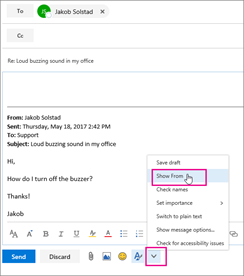
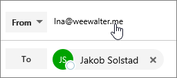
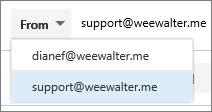

# Send email as a distribution list

In Microsoft 365, you can send email as a distribution list. When a person who is a member of the distribution list replies to a message sent to the distribution list, the email appears to be from the distribution list, not from the individual user. This topic shows you how to do this.
  
## Send email as a distribution list

Before you perform these steps, make sure you've been added to a Microsoft 365 distribution list and you've have been granted Send as permission on it.
  
 **Admins**: Make sure you've followed the steps in the [Add a Microsoft 365 user or contact to a list](../email/add-user-or-contact-to-distribution-list.md) and [Allow members to send email as a Microsoft 365 Group](../../solutions/allow-members-to-send-as-or-send-on-behalf-of-group.md#allow-members-to-send-email-as-a-group) topics, and added the correct people to the distribution list.
  
## Outlook on the web

1. Open Outlook on the web and go to your inbox. 
    
2. Open a message that was sent to the distribution list. 
    
3. Select **Reply**. 
    
4. At the bottom of the message, select **More** \> **Show from**.  
  
5. Right-click on the From address - such as `Ina@weewalter.me` - and choose **Remove**.  
  
6. Then type the distribution list address such as support@contoso.com, and send the message. The next time you reply from the distribution list, its address will appear as an option in the **From** list. 

## Outlook

1. Open Outlook desktop client.

2. Compose a New Email. Click the **From** field and select **Other email address**. If you do not see the From field, navigate to **Options** and select **From** in the Show fields section.

3. Select the **Distribution List** address from the Global Address List.

4. Send the email.
