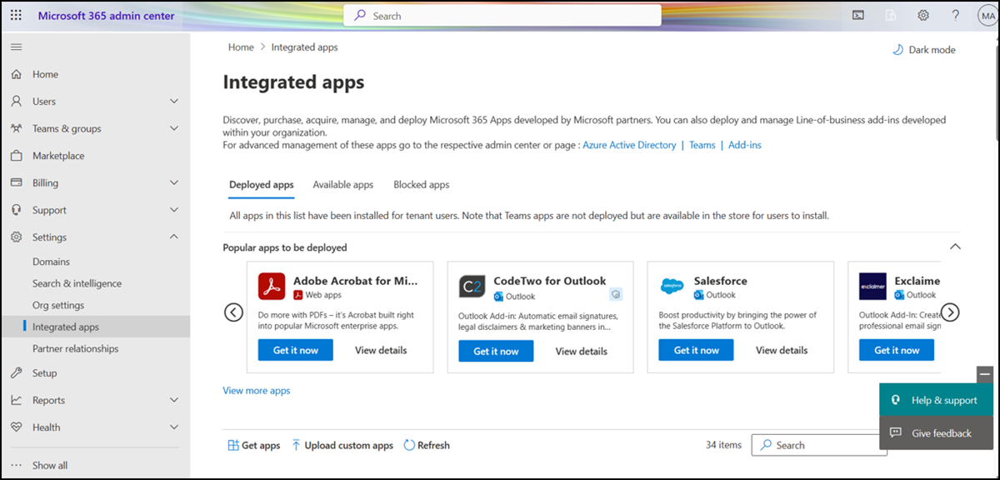

# Get started with Integrated apps

## What is Integrated Apps

Integrated Apps gives you the flexibility to deploy and manage single store apps, bundled apps, and a custom business line of apps from a single location. These apps can be built by Microsoft or by our 3P Microsoft 365 partners. The ability to find, test, and fully deploy purchased and licensed apps by Microsoft partners from the Integrated apps portal provides the convenience and benefits your organization requires to keep business services updated regularly and running efficiently.

The Integrated apps portal displays a list of apps that can be accessed by users in your organization. The following apps can be managed via Integrated Apps:

- Office Add-ins
- Teams apps that work on Outlook and the Microsoft 365 app (formerly known as Office.com). 
- Teams Apps that only work on Teams.
- SPFx apps
- Web apps: For web apps, you can see two kinds of apps.
    - SaaS apps that are available in appsource.microsoft.com and can be deployed by admins giving consent on behalf of the organization.
    - SAML gallery apps that are linked with Office add-ins.

## How to access Integrated Apps

Integrated Apps can be accessed via the Microsoft 365 Admin Center. Select **Settings**, and then choose **Integrated apps**.

## Who can access Integrated Apps

The Integrated apps portal is available to world-wide customers only and can be accessed by Global Admins, Global Readers, Exchange admins, and Azure Application Admins (made available in May 2023). This feature is not available in sovereign and government clouds.

To learn more about these roles, see [Azure AD built-in roles - Microsoft Entra|Microsoft Learn](/azure/active-directory/roles/permissions-reference#all-roles).

## User and group assignments

We currently support most groups supported by Azure Active Directory, including Microsoft 365 groups, distribution lists, and security groups. We support users in top-level groups or groups without parent groups, but not users in nested groups or groups that have parent groups. To know more, read the documentation on [Assign users and groups to application](/azure/active-directory/manage-apps/assign-user-or-group-access-portal?pivots=portal).

> [!NOTE]
> Non-mail enabled security groups are not currently supported.

In the following example, Sandra, Sheila, and the Sales Department group are assigned to an app or add-in. Because the West Coast Sales Department is a nested group, Bert and Fred aren't assigned to an app or add-in.

### Find out if a group contains nested groups

The easiest way to detect if a group contains nested groups is to view the group contact card within Outlook. If you enter the group name within the **To** field of an email and then select the group name when it resolves, it will show you if it contains users or nested groups. In the example below, the **Members** tab of the Outlook contact card for the Test Group shows no users and only two sub groups.

You can do the opposite query by resolving the group to see if it's a member of any group. In the example below, you can see under the **Membership** tab of the Outlook contact card that Sub Group 1 is a member of the Test Group.

Note that you can use the Azure Active Directory Graph API to run queries to find the list of groups within a group. For more information, see [Operations on groups | Graph API reference](/previous-versions/azure/ad/graph/api/groups-operations).

## What controls are available on the Integrated Apps portal?

As an admin, the following app/add-in types can be managed from the Integrated apps portal on the Microsoft 365 admin center.

|Type|Supported Host Products (any or all)|What can admins control on Integrated Apps portal?|Which admins can access the controls on Integrated Apps portal?|Other admin centers & related actions|
|---|---|---|---|---|
|Add-in|Outlook    Word, Excel, PowerPoint|[Deploy/Edit deployed users/Remove deployment](/microsoft-365/admin/manage/office-addins#deploy-your-office-add-ins)|Exchange Admin   Global Admin   Azure Application Admin| Exchange Admin Center for default role assignment policy.    Microsoft 365 Admin Center > Org Settings for Office Store setting|
|SPFx App|SharePoint|[Deploy/Remove deployment](/microsoft-365/admin/manage/office-addins#deploy-your-office-add-ins)|Global Admin|SharePoint Admin Center|
|Web App|N/A|[Deploy/Edit deployed users](/microsoft-365/admin/manage/office-addins#deploy-your-office-add-ins) |Global Admin  Azure Application Admin|Azure Active Directory portal|
|Teams app (manifest version less than 1.13)|Teams|[Block & Unblock](/microsoft-365/admin/manage/teams-apps-work-only-on-teams)|Global Admin|Go to Teams admin center for default tenant setting, deployment and managing availability|
|Teams app (manifest version equal to or greater than 1.13)|Outlook   Microsoft 365 App   Teams| [Deploy/Edit deployed users/Remove deployment](/microsoft-365/admin/manage/teams-apps-work-on-outlook-and-m365#deploy-a-teams-app-that-works-on-outlook-and-the-microsoft-365-app-via-the-integrated-apps-portal)   [Block & Unblock](/microsoft-365/admin/manage/teams-apps-work-on-outlook-and-m365#manage-how-users-can-install-teams-apps-on-outlook-and-the-microsoft-365-app)    [Manage availability>Edit users](/microsoft-365/admin/manage/teams-apps-work-on-outlook-and-m365#how-to-manage-the-availability-of-an-app-in-your-organization)   [Default setting for tenant](/microsoft-365/admin/manage/teams-apps-work-on-outlook-and-m365#customize-default-settings-for-teams-apps-that-work-on-outlook-and-the-microsoft-365-app)|Global Admin  Azure Application Admin|Go to Teams admin center to manage how this app shows up in Teams for users in your organization.|

## Other admin centers

You can continue to manage access to Office add-ins and Teams apps via the following settings:

- Org Settings for access to Word, Excel, and PowerPoint Add-ins
- Exchange admin center for Outlook Add-ins
- Teams admin center for Teams Apps

You can continue to deploy [Office Add-ins via Integrated Apps](/microsoft-365/admin/manage/test-and-deploy-microsoft-365-apps.md#deploy-an-office-add-in-using-the-admin-center) and [Teams Apps via Teams admin center](/microsoftteams/manage-apps).

## Frequently asked questions

### Which administrator role do I need to access Integrated apps?

Only Global Admins, Azure Application Admins and Exchange admins can access Integrated Apps.

- Global admins can edit all controls for all apps and add-ins in Integrated Apps
- Azure Application admins can edit controls for Teams apps that work on Outlook and the Microsoft 365 app and Office/Outlook add-ins
- Exchange Admins can edit any controls for Outlook add-ins.

Integrated apps won't show up in the left nav for other administrators.

### Why do I see Add-in in the left nav under Setting but not Integrated apps?

Integrated apps allow deployment of Web Apps, Excel, PowerPoint, Word, Outlook add-ins, SPFx apps and Teams apps that work on Outlook and the Microsoft 365 App. For add-ins, Integrated apps support deployment to Exchange online mailboxes and not on-premises Exchange mailboxes.

### Can administrators delete or remove apps?

Only the admin who deployed the app or add-in or a global admin can delete or remove it.

Select an app from the list view. On the Configuration tab, select which apps to remove.

### Is Integrated apps available in sovereign cloud?

No. Integrated apps aren't available to sovereign cloud customers at this time.

### Is Integrated apps available in government clouds?

No. Integrated apps aren't available to government cloud customers at this time.