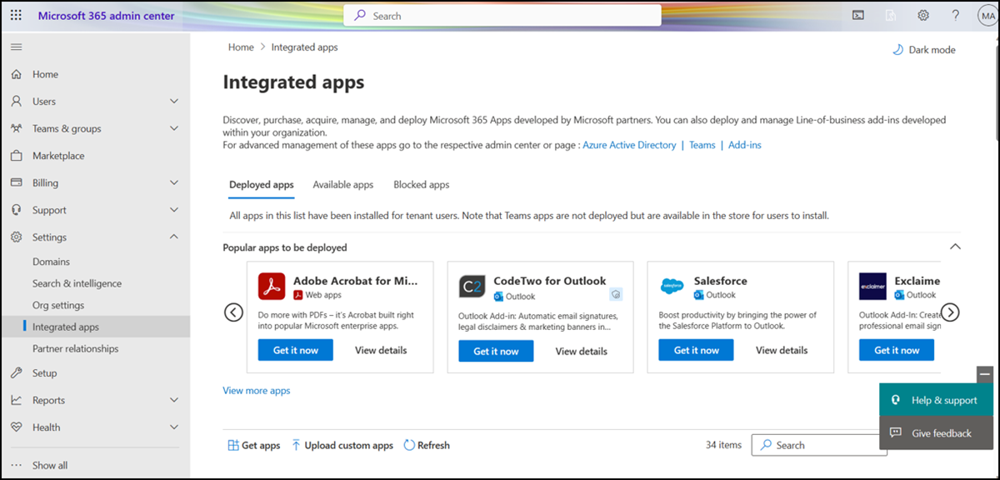
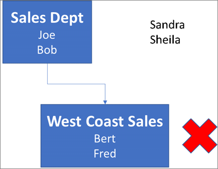
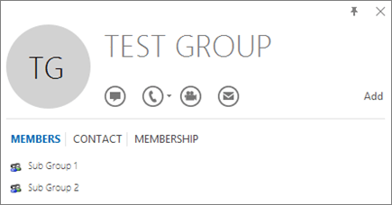
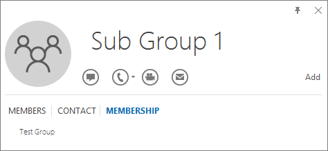

# Get started with the integrated apps portal

## What is the integrated apps portal?

The integrated apps portal in the Microsoft 365 admin center gives you the flexibility to deploy and manage apps, agents, and add-ins from a single portal, including both AppSource apps and custom line-of-business (LOB) apps from a single location. These apps can be built by Microsoft or by other companies. The ability to find, test, and fully deploy purchased and licensed apps from the integrated apps portal provides the convenience and benefits your organization requires to keep business services updated regularly and running efficiently.

The integrated apps portal displays a list of apps that can be accessed by users in your organization. The following apps can be managed via the integrated apps portal:

- Office Add-ins, including those that are registered as a web application in Microsoft Entra.
- Teams apps that work on Outlook and the Microsoft 365 app (formerly known as Office.com).
- Teams Apps that only work on Teams.
- SPFx apps
- SaaS apps that are available in [AppSource](https://appsource.microsoft.com) and can be deployed by admins giving consent on behalf of the organization.

## How to access the integrated apps portal

The portal can be accessed via the Microsoft 365 Admin Center. Select **Settings**, and then choose **Integrated apps**.

## Who can access the integrated apps portal

The integrated apps portal is available to world-wide customers only and can be accessed by the following roles:

- Global administrator
- Global reader
- AI administrator
- Exchange administrator
- Azure Application Admins

> [!NOTE]
> This feature is not available in sovereign and government clouds.

To learn more about these roles, see [Microsoft Entra built-in roles - Microsoft Entra|Microsoft Learn](/azure/active-directory/roles/permissions-reference#all-roles).

## User and group assignments

Apps, agents, and add-ins in the portal can be made be deployed for specific groups, including most groups supported by Microsoft Entra ID. These are Microsoft 365 groups, distribution lists, and security groups. Assignments must be made to top-level groups (that is, groups without parent groups) only. Apps cannot be deployed for specific nested groups (that is, groups that have parent groups). To know more, read the documentation on [Assign users and groups to application](/azure/active-directory/manage-apps/assign-user-or-group-access-portal?pivots=portal).

> [!NOTE]
> The following are currently not supported:
>
> - Non-mail-enabled security groups
> - Dynamic distribution groups

In the following example, an app, agent, or add-in is deployed for Sandra, Sheila, and the Sales Department group. Because the West Coast Sales Department is a nested group, the app is not deployed for Bert and Fred.

### Find out if a group contains nested groups

The easiest way to detect if a group contains nested groups is to view the group contact card within Outlook. If you enter the group name within the **To** field of an email and then select the group name when it resolves, it will show you if it contains users or nested groups. In the example below, the **Members** tab of the Outlook contact card for the Test Group shows no users and only two sub groups.

You can do the opposite query by resolving the group to see if it's a member of any group. In the example below, you can see under the **Membership** tab of the Outlook contact card that Sub Group 1 is a member of the Test Group.

Note that you can use the Microsoft Graph API to run queries to find the list of groups within a group. For more information, see [Operations on groups](/graph/api/resources/groups-overview).

## What controls are available in the integrated apps portal?

As an admin, the following app, agent, and add-in types can be managed from the integrated apps portal on the Microsoft 365 admin center.

|Type|Supported Host Products (any or all)|What can admins control on integrated apps portal?|Which admins can access the controls on integrated apps portal?|Other admin centers & related actions|
|---|---|---|---|---|
|Add-in|Outlook    Word, Excel, PowerPoint|[Deploy/Edit deployed users/Remove deployment](/microsoft-365/admin/manage/office-addins#deploy-your-office-add-ins)|Exchange Admin   Global Admin | Exchange Admin Center for default role assignment policy.    Microsoft 365 Admin Center > Org Settings for Office Store setting|
|SPFx app|SharePoint|[Deploy/Remove deployment](/microsoft-365/admin/manage/office-addins#deploy-your-office-add-ins)|Global Admin|SharePoint Admin Center|
|Web app|N/A|[Deploy/Edit deployed users](/microsoft-365/admin/manage/office-addins#deploy-your-office-add-ins) |Global Admin  Azure Application Admin|Microsoft Entra admin center|
|Teams app that uses the unified manifest for Microsoft 365 (formerly Teams manifest) version less than 1.13|Teams|[Block & Unblock](/microsoft-365/admin/manage/teams-apps-work-only-on-teams)|Global Admin|Go to Teams admin center for default tenant setting, deployment, and managing availability|
|Teams app that uses the unified manifest for Microsoft 365 (formerly Teams manifest) version equal to or greater than 1.13|Outlook   Microsoft 365 App   Teams| [Deploy/Edit deployed users/Remove deployment](/microsoft-365/admin/manage/teams-apps-work-on-outlook-and-m365#deploy-a-teams-app-that-works-on-outlook-and-the-microsoft-365-app-via-the-integrated-apps-portal)   [Block & Unblock](/microsoft-365/admin/manage/teams-apps-work-on-outlook-and-m365#manage-how-users-can-install-teams-apps-on-outlook-and-the-microsoft-365-app)    [Manage availability>Edit users](/microsoft-365/admin/manage/teams-apps-work-on-outlook-and-m365#how-to-manage-the-availability-of-an-app-in-your-organization)   [Default setting for tenant](/microsoft-365/admin/manage/teams-apps-work-on-outlook-and-m365#customize-default-settings-for-teams-apps-that-work-on-outlook-and-the-microsoft-365-app)|Azure Application Admin|Go to Teams admin center to manage how this app shows up in Teams for users in your organization.|

> [!NOTE]
> An Exchange admin can deploy an add-in if the Application Administrator role is added or if the App Registration property is set to true in the Microsoft Entra admin center. For more information, see [Admin Requirements](/admin/manage/centralized-deployment-of-add-ins#admin-requirements).

## Other admin centers

You can continue to manage access to Office add-ins and Teams apps via the following settings:

- Org Settings for access to Word, Excel, and PowerPoint Add-ins
- Exchange admin center for Outlook Add-ins
- Teams admin center for Teams Apps

You can continue to deploy [Deploy and manage Office Add-ins](/microsoft-365/admin/manage/office-addins) and [Teams Apps via Teams admin center](/microsoftteams/manage-apps).

## Find support information for apps, agents, and add-ins

In the integrated apps portal, when evaluating an app, you can review the Terms of Use and Privacy Policy of the application before you make it available to your users.

You can access this information in the following ways:

- For publicly available store apps, links to Terms of Use, Privacy Policy, and Support are available on [AppSource](https://appsource.microsoft.com). Search for an application and navigate to its **Details + Support** tab for the links.

   :::image type="content" source="../../media/app-support-legal-info.png" alt-text="Screenshot to show how to find app support information on AppSource website.":::

- For a custom app, contact the app developer who initiated the request to upload the custom app. For Copilot agents submitted via Microsoft Copilot Studio, Microsoft 365 Agents Toolkit, or any other source, requester's contact details are available in the app details pane in `Requested Apps` tab.

- You can view the same information of an app in the Teams admin center as well. For details, see [how to find support information for an app](/microsoftteams/manage-apps#support-information-for-apps).

## Frequently asked questions

### Which administrator role do I need to access the integrated apps portal?

Only Global Admins, AI admins, Azure Application Admins, and Exchange admins can access the portal.

- Global admins can edit all controls for all apps and add-ins in the portal
- Azure Application admins can edit controls for Teams apps that work on Outlook and the Microsoft 365 app, and fpr Office Add-ins
- Exchange Admins can edit any controls for Outlook add-ins deployed by them.

The **Integrated apps** page link won't show up in the left navigation page of the Microsoft 365 admin center for other administrators.

### Can administrators delete or remove apps?

Only the admin who deployed the app, agent, or add-in or a global admin can delete or remove it.

To remove an app, agent, or add-in, select it from the list view. On the **Configuration** tab, select which apps to remove.

### Is the integrated apps portal available in sovereign cloud?

No, the portal isn't available to sovereign cloud customers at this time.

### Is the integrated apps portal available in government clouds?

No, the portal isn't available to government cloud customers at this time.
