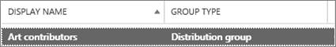
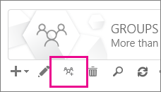

# Upgrade distribution lists to Microsoft 365 Groups in Outlook

You can upgrade distribution lists to Microsoft 365 Groups in Outlook. This is a great way to give your organization's distribution lists all the features and functionality of Microsoft 365 Groups. [Why you should upgrade your distribution lists to groups in Outlook](https://support.microsoft.com/office/7fb3d880-593b-4909-aafa-950dd50ce188)

You can upgrade DLs one at a time, or several at the same time.

## Upgrade one or many distribution list groups to Microsoft 365 Groups in Outlook

You must be a global admin or Exchange admin to upgrade a distribution list group. To upgrade to Microsoft 365 Groups, the distribution list group must have an owner with a mailbox.

### Use the new EAC to upgrade one or many distribution list groups to Microsoft 365 Groups in Outlook

1. Go to the new [Exchange admin center](https://admin.exchange.microsoft.com), and navigate to **Recipients** \> **Groups**.

2. Select the distribution list group (also called a **distribution group**) that you want to upgrade to Microsoft 365 group from the **Groups** page.

3. Select the **Upgrade distribution group** from the tool bar.

4. In the dialog box **Ready to upgrade?**, click **Upgrade**. The process begins immediately. Depending on the size and number of distribution list groups you're upgrading, the process can take minutes or hours.

> [!NOTE]
> A banner at the top indicates the upgrade, for example, *Distribution group(s) has been upgraded. It will take 5 minutes to reflect the changes. Filter by Microsoft 365 groups to see the upgraded distrubtion groups(s)*.

### Use the Classic EAC to upgrade one or many distribution list groups to Microsoft 365 Groups in Outlook

1. Go to the Classic <a href="https://go.microsoft.com/fwlink/p/?linkid=2059104" target="_blank">Exchange admin center</a>.

2. In the Classic Exchange admin center, go to **Recipients** \> **Groups**.<br/>You'll see a notice indicating you have distribution lists (also called **distribution groups**) that are eligible to be upgraded to Microsoft 365 Groups.<br/> 

3. Select one or more distribution lists (also called a **distribution group**) from the **groups** page.<br/>

4. Select the upgrade icon.<br/>

5. On the information dialog, select **Yes** to confirm the upgrade. The process begins immediately. Depending on the size and number of DLs you're upgrading, the process can take minutes or hours.<br/>If the distribution list can't be upgraded, a dialog appears saying so. See [Which distribution lists cannot be upgraded?](#which-distribution-lists-cant-be-upgraded).

6. If you're upgrading multiple distribution lists, use the drop-down list to filter which distribution lists have been upgraded. If the list isn't complete, wait a while longer and then select **Refresh** to see what's been successfully upgraded.<br/>There's no notice that tells you when the upgrade process has completed for all DLs you selected. You can figure this out by looking to see what's listed under **Available for upgrade** or **Upgraded DLs**.

7. If you selected a DL for upgrade, but it's still appeared on the page as Available to upgrade, then it failed to upgrade. See [What to do if the upgrade doesn't work](#what-to-do-if-the-upgrade-doesnt-work).

> [!NOTE]
> If you're getting the groups digest emails you may notice at the bottom that it will sometimes offer to let you upgrade any eligible distribution lists that you're the owner of. See [Have a group conversation in Outlook](https://support.microsoft.com/office/a0482e24-a769-4e39-a5ba-a7c56e828b22) for more information about digest emails.

## What to do if the upgrade doesn't work

Distribution lists that fail to upgrade remain unchanged.

If one or more **eligible** distribution lists fail to be upgraded, open a [Support ticket](../contact-support-for-business-products.md). The issue will need to be escalated to the Groups Engineering team for them to figure out the problem.

It's possible that the distribution list didn't get upgraded because of a service outage, but unlikely. If you want, wait a while and then try to upgrade the DL again.

## How to use PowerShell to upgrade several distribution lists at the same time

If you're experienced at using PowerShell, you might want to go this route instead of using the UI. We have a set of cmdlets that will help you upgrade distribution lists. See below.

### Upgrade a single DL

To upgrade a single DL, run the following command:

```PowerShell
Upgrade-DistributionGroup -DlIdentities \<Dl SMTP address\>`
```

For example, if you want to upgrade a DLs with SMTP address dl1@contoso.com, run the following command:

```PowerShell
Upgrade-DistributionGroup -DlIdentities dl1@contoso.com`
```

> [!NOTE]
> You can also upgrade a single distribution list to a Microsoft 365 group using the [New-UnifiedGroup](/powershell/module/exchange/new-unifiedgroup) PowerShell cmdlet

### Upgrade multiple DLs in a batch

You can also pass multiple DLs as a batch and upgrade them together:

```PowerShell
Upgrade-DistributionGroup -DlIdentities \<DL SMTP address1\>, \< DL SMTP address2\>,
\< DL SMTP address3\>, \< DL SMTP address 4\>
```

For example, if you want to upgrade five DLs with SMTP address `dl1@contoso.com` and `dl2@contoso.com`, `dl3@contoso.com`, `dl4@contoso.com` and `dl5@contoso.com`, run the following command:

`Upgrade-DistributionGroup -DlIdentities dl1@contoso.com, dl2@contoso.com, dl3@contoso.com, dl4@contoso.com, dl5@contoso.com`

### Upgrade all eligible DLs

There are two ways in which you can upgrade all the eligible DLs.

> [!NOTE]
> The Upgrade-DistributionGroup cmdlet doesn't receive data from the pipeline, for this reason it's required to use "foreach-object{}" operator to run successfully.

1. Get the eligible DLs in the tenant and upgrade them using the upgrade command:

```PowerShell
Get-EligibleDistributionGroupForMigration | Foreach-Object{
    Upgrade-DistributionGroup -DlIdentities $_.PrimarySMTPAddress
}
```

2. Get the list of all DLs and upgrade only the eligible DLs:

```PowerShell
Get-DistributionGroup| Foreach-Object{
    Upgrade-DistributionGroup -DlIdentities $_.PrimarySMTPAddress
}
```

## FAQ about upgrading distribution lists to Microsoft 365 Groups in Outlook

### Which distribution lists can't be upgraded?

You can only upgrade cloud-managed, simple, non-nested distribution lists. The table below lists distribution lists that **CANNOT** be upgraded.

|**Property**|**Eligible?**|
|:-----|:-----|
|On-premises managed distribution list.  <br/> |No  <br/> |
|Nested distribution lists. Distribution list either has child groups or is a member of another group.  <br/> |No  <br/> |
|Distribution lists with member **RecipientTypeDetails** other than **UserMailbox**, **SharedMailbox**, **TeamMailbox**, **MailUser**  <br/> |No  <br/> |
|Distribution list that has more than 100 owners  <br/> |No  <br/> |
|Distribution list that only has members but no owner  <br/> |No  <br/> |
|Distribution list that has alias containing special characters  <br/> |No  <br/> |
|If the distribution list is configured to be a forwarding address for Shared Mailbox  <br/> |No  <br/> |
|If the DL is part of **Sender Restriction** in another DL.  <br/> |No  <br/> |
|Security groups  <br/> |No  <br/> |
|Dynamic Distribution lists  <br/> |No  <br/> |
|Distribution lists that were converted to **RoomLists**  <br/> |No  <br/> |
|Distribution lists where **MemberJoinRestriction** and/or **MemberDepartRestriction** is **Closed**  <br/> |No  <br/> |

### Check which DLs are eligible for upgrade

If you want to check whether a DL is eligible or not, you can run the below command:

`Get-DistributionGroup \<DL SMTP address\> | Get-EligibleDistributionGroupForMigration`

If you want to check which DLs are eligible for upgrade just run the following command:

`Get-EligibleDistributionGroupForMigration`

### Who can run the upgrade scripts?

People with global admin or Exchange admin rights.

### Why is the contact card still showing a distribution list? What should I do to prevent an upgraded distribution list from showing up in my auto suggest list?

- For Outlook: When someone tries to send an email in Outlook by typing the Microsoft 365 group name after migration, the recipient will be resolved as the distribution list instead of the group. The contact card of the recipient will be the distribution lists contact card. This is because of the recipient cache or nick name cache in Outlook. The email will be sent successfully to the group, but might cause confusion to the sender.<br/>You can perform the steps in this article, [Information about the Outlook AutoComplete list](/outlook/troubleshoot/contacts/information-about-the-outlook-autocomplete-list) to reset the cache, which will fix this issue.

- For Outlook on the web: In case of Outlook on the web, the distribution list recipient will still remain in the cache. You can follow the steps in [Remove suggested name or email address from the Auto-Complete List](https://support.microsoft.com/office/9E1419D9-E88F-445B-B07F-F558B8A37C58) to refresh the cache to see the group contact card.

### Do new group members get a welcome email in their inbox?

No. The setting to enable welcome messages is set to false by default. This setting affects both existing and new group members who may join after the migration is complete. If the group owner later allows guest users, guest users won't receive a welcome email in their inbox. Guest members can continue working with the group.

### What if one or some of the DLs are not upgraded?

There are some cases in which though DL is eligible but could not be upgraded. The DL does not get upgraded and remains as a DL.

- Where admin has applied **Group Email Address Policy** for the groups in an organization and they try to upgrade DLs that doesn't fulfill the criteria, the DL does not get upgraded

- DLs with **MemberJoinRestriction** or **MemberDepartRestriction** set to **Closed**, could not be upgraded

### What happens to the DL if the upgrade from EAC fails?

The upgrade will happen only when the call is submitted to the server. If the upgrade fails, your DLs will be intact. They will work like they used to.
