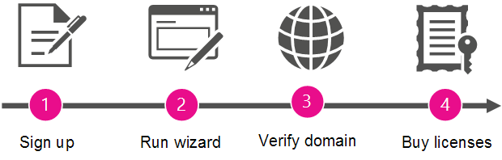

# Become the admin and purchase Office 365 for your organization

Microsoft makes it simple for people in your organization to sign up and use productivity tools and services without waiting for formal deployment by your IT department.
  
Your organization can let people continue to use these services "as is." But if people signed up for Skype Meetings as one of those services, you can assign an admin to upgrade and get a more complete meeting solution with Skype for Business and Office applications, file storage and sharing, and more.
  
## Why become the admin and buy Office 365 for your organization?

When an employee signs up for Skype Meetings with their work account, they can't manage the service. And they get only the most basic features: they can have unlimited meetings but only with 10 or fewer participants (after 60 days, the maximum participants is three people). 
  
When you set up an admin for the service and buy Office 365 for your users, they get more advanced features. And you get the ability to manage the services, so you can enforce policies and add new users.
  
As a bonus, you get 24/7 phone support.
  
## How to become the admin

To become the admin, you'll first prove that you own the domain that people signed up with (like contoso.com). Then you'll upgrade to Office 365 for everyone in the company who is already using Skype Meetings. A wizard walks you through the steps.
  
> [!NOTE]
> Becoming the admin and upgrading to Office 365 are part of the same process. You can't upgrade without first becoming the admin, and you can't manage the services as an admin unless you also upgrade to Office 365. 
  
 **Why do we ask you to prove that you own the domain?** Because everyone who signs up with an email address on the same domain (say, rob@contoso.com and sara@contoso.com) is grouped together by the domain name. We decide what group each person belongs to by the domain portion of their email addresses (like contoso.com), so people from the same organization can work together. Because they belong to the same group, they can collaborate with each other.
  
To become the admin for the group, you verify that you own the domain that everyone in your organization is grouped under. If you have the authority to prove domain ownership (by signing in where the domain is managed), it makes sense that you can manage Office 365 services for people using that domain.
  
After you become the admin, you can also add new users or enforce policies, if you like.
  
## Overview of the steps

  
A wizard guides you through the process, but here's a summary of each step.
  
|||
|:-----|:-----|
||**Sign up** Before you can become the admin, you must already be signed up for Skype Meetings with your work email address.    |
||**Run the wizard** After you've signed up, run the wizard by doing one of the following:     Run the **Become the admin** wizard that appears after selecting **Admin** in the app launcher .     OR     Choose to **Upgrade to Office 365** in Skype Meetings, and then select the Office 365 subscription you want to upgrade to.    |
||**Verify domain ownership** Next, you'll verify to Office 365 that you own or manage the domain name (like contoso.com) that's associated with your organization's email addresses. Only the owner of the domain name has the authority to do this.    |
||**Buy licenses** In the last step in the wizard, you'll buy Office 365 licenses for each person within your organization who's signed up for Skype Meetings with their work email.    For example, if two users have signed up for Skype Meetings with their work email, you'll need to buy two licenses—one for each of them.    > [!NOTE]> You can't manage Office 365 until after you've bought the licenses.           |

## Your Office 365 subscription

After you've verified the domain and bought licenses, your organization is upgraded to Office 365. This also transfers (to the paid subscription) the personal settings from the Skype Meetings subscription that individual users were using.
  
The Office 365 subscription that your organization is upgraded to depends on which wizard you used:
  
|||
|:-----|:-----|
|**How the wizard was launched**   |**Subscription options**   |
|By using the Admin tile in the app launcher    |Microsoft 365 Business Basic    |
|By choosing **Upgrade to Office 365** in Skype Meetings    |Microsoft 365 Business Basic or Microsoft 365 Business Standard    |
   
## What's next?

Now that you're the admin, you may want to do the following:
  
|****Task****|****Details****|
|:-----|:-----|
|Add or remove licenses    |You can [add more licenses](../../commerce/licenses/buy-licenses.md) for users who aren't using Office 365 yet, or [remove licenses from users](../manage/remove-licenses-from-users.md) that you don't want using your organization's Office 365 subscription.    |
|Contact others who already signed up    |Reach out to the other users and let them know that you're managing their Office 365 subscription and that they've been upgraded. [Follow these steps](../add-users/add-users.md) to see a list of **Active Users** and their email addresses.    |
|Start using Office 365    |Visit the [Office 365 Learning Center](https://support.office.com/learn/office365-for-business) and learn how to sign in, check email, share documents, and more. You and your users can use this site to get started with Office 365.    |
|Manage your Office 365 subscription    |Visit [Office 365 Admin help center](../admin-home.md) and learn common administrative tasks like adding and removing users, resetting passwords, and setting up mobile devices.    |

## Still need help?

[Call Microsoft support](../contact-support-for-business-products.md)
