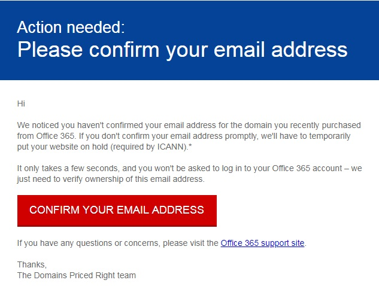

# ICANN Verification of Contact Information

When you purchase a domain or make changes to the contact information for a domain, the registrar is required to validate your contact information to comply with ICANN regulations.

For validation, an email is sent to the registrant's address.

 **To verify your contact information, select the link in the verification email.** If the domain owners don't verify the the email address, the domain will be suspended. Then, go to the [Domains page](https://admin.microsoft.com/adminportal/home?ref=Domains) in the admin center and check your domain status.

The email will look like this:

