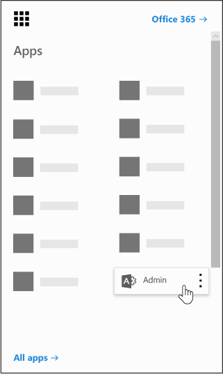

# Power BI in your organization

This page describes how users in your organization can use Power BI and how you can control how your organization acquires this service.

## What is Power BI?

Microsoft Power BI enables users to visualize data, share discoveries, and collaborate in intuitive new ways. To learn more, see the [Power BI Web site](https://powerbi.microsoft.com/en-us/).
  
## Does Power BI meet national, regional, and industry-specific compliance requirements?

To learn more about Power BI compliance, see the [Microsoft Trust Center](https://go.microsoft.com/fwlink/?LinkId=785324).
  
## How do users sign up for Power BI?

As an administrator, you can sign up for Power BI through the [Power BI web site](https://powerbi.microsoft.com/en-us/). You can also sign up through the purchase services page on the Microsoft 365 admin center. When an administrator signs up for Power BI, they can assign user subscription licenses to users who should have access.
  
Additionally, individual users in your organization may be able to sign up for Power BI through the [Power BI web site](https://powerbi.microsoft.com/en-us/). When a user in your organization signs up for Power BI, that user is assigned a Power BI license automatically.
  
## How do individual users in my organization sign up?

There are three scenarios that might apply to users in your organization:
  
### Scenario 1: Your organization already has an existing Microsoft 365 environment and the user signing up for Power BI already has a Microsoft 365 account.

In this scenario, if a user already has a work or school account in the tenant (for example, contoso.com) but does not yet have Power BI, Microsoft will simply activate the plan for that account, and the user will automatically be notified of how to use the Power BI service.
  
### Scenario 2: Your organization has an existing Microsoft 365 environment and the user signing up for Power BI doesn't have a Microsoft 365 account.

In this scenario, the user has an email address in your organization's domain (for example, contoso.com) but does not yet have a Microsoft 365 account. In this case, the user can sign up for Power BI and will automatically be given an account. This lets the user access the Power BI service. For example, if an employee named Nancy uses her work email address (for example, Nancy@contoso.com) to sign up, Microsoft will automatically add Nancy as a user in the Contoso Microsoft 365 environment and activate Power BI for that account.
  
### Scenario 3: Your organization does not have a Microsoft 365 environment connected to your email domain.

There are no administrative actions your organization needs to take advantage of Power BI.
  
> [!IMPORTANT]
> If your organization has multiple email domains and you prefer all email address extensions to be in the same tenant, before any users create your primary tenant, add all email address domains to that tenant before any users create your primary tenant. There is no automated mechanism to move users across tenants after they have been created. For more information on this process, see [If I have multiple domains, can I control the tenant that users are added to?](#if-i-have-multiple-domains-can-i-control-the-tenant-that-users-are-added-to) later in this article and [Add a domain to Office 365](../setup/add-domain.md) online.
  
## How will this change the way I manage identities for users in my organization today?

If your organization already has an existing Microsoft 365 environment and all users in your organization have Microsoft 365 accounts, identity management will not change.
  
If your organization already has an existing Microsoft 365 environment but not all users in your organization have Microsoft 365 accounts, we will create a user in the tenant and assign licenses based on the user's work or school email address. This means that the number of users you are managing at any particular time will grow as users in your organization sign up for the service.
  
If you are managing your directory on-premises, and use Active Directory Federation Services (AD FS), Microsoft will not add users to your tenant, and users attempting to join your tenant will receive a message to contact their organization's admin.
  
If your organization does not have a Microsoft 365 environment connected to your email domain, there will be no change in how you manage identity. Users will be added to a new, cloud-only user directory, and you will have the option to elect to take over as the tenant admin and manage them.
  
## What is the process to manage a tenant created by Microsoft for my users?

If a tenant was created by Microsoft, you can claim and manage that tenant by following these steps:
  
1. Join the tenant by [signing up for Power BI](https://go.microsoft.com/fwlink/?LinkId=522448) using an email address domain that matches the tenant domain you want to manage. For example, if Microsoft created the contoso.com tenant, you will need to join the tenant with an email address ending with @contoso.com.

1. Claim admin control by verifying domain ownership: once you are in the tenant, you can promote yourself to the admin role by verifying domain ownership. To do so, follow these steps:

::: moniker range="o365-worldwide"

3. Go to <a href="https://admin.microsoft.com" target="_blank">https://admin.microsoft.com</a>.

::: moniker-end

::: moniker range="o365-germany"

3. Go to <a href="https://portal.office.de" target="_blank">https://portal.office.de</a>

::: moniker-end

::: moniker range="o365-21vianet"

3. Go to <a href="https://portal.partner.microsoftonline.cn" target="_blank">https://portal.partner.microsoftonline.cn</a>.

::: moniker-end

4. Select the app launcher icon in the upper-left and choose **Admin**.

    
  
5. Read the instructions on the **Become the admin** page and then select **Yes, I want to be the admin**.

    > [!NOTE]
    >  If this option doesn't appear, there is already an administrator in place.
  
## If I have multiple domains, can I control the tenant that users are added to?

If you do nothing, a tenant will be created for each user email domain and subdomain.
  
If you want all users to be in the same tenant regardless of their email address extensions:
  
- Create a target tenant ahead of time or use an existing tenant, and add all the existing domains and subdomains that you want consolidated within that tenant. Then all the users with email addresses ending in those domains and subdomains will automatically join the target tenant when they sign up.

> [!IMPORTANT]
> There is no supported automated mechanism to move users across tenants once they have been created. To learn about adding domains to a single Microsoft 365 tenant, see [Add a domain to Office 365](../setup/add-domain.md).

> [!IMPORTANT]
> For more information and guidance on managing tenants, see [What is Power BI administration?](/power-bi/service-admin-administering-power-bi-in-your-organization).
  
## How can I prevent users from joining my existing tenant?

There are steps you can take as an admin to prevent users from joining your existing tenant. If you block users from joining the tenant, users' attempts to sign in will fail and they will be directed to contact their organization's admin. You do not need to repeat this process if you have already disabled automatic license distribution before (for example, Office 365 Education for Students, Faculty, and Staff).
  
These steps require the use of Windows PowerShell. To get started with Windows PowerShell, see the [PowerShell getting started guide](/powershell/scripting/overview).
  
To perform the following steps, you must install the latest 64-bit version of the [Azure Active Directory V2 PowerShell Module](https://www.powershellgallery.com/packages/AzureADPreview/2.0.2.5).
  
After you select the link, select **Run** to run the installer package.
  
**Disable automatic tenant join**: Use this Windows PowerShell command to prevent new users from joining a managed tenant:
  
To disable automatic tenant join for new users:  `Set-MsolCompanySettings -AllowEmailVerifiedUsers $false`
  
To enable automatic tenant join for new users:  `Set-MsolCompanySettings -AllowEmailVerifiedUsers $true`
  
> [!NOTE]
> This blocking prevents new users in your organization from signing up for Power BI. Users that sign up for Power BI prior to disabling new signups for your organization will still retain their licenses. See the [How do I remove Power BI for users that already signed up?](#how-do-i-remove-power-bi-for-users-that-already-signed-up) for instructions on how you can remove access to Power BI for users that had previously signed up for the service.
  
## How can I allow users to join my existing tenant?

To allow users to join your tenant, run the opposite command as described in the question above:  `Set-MsolCompanySettings -AllowEmailVerifiedUsers $true`
  
## How do I verify if I have the block on in the tenant?

Use the following PowerShell script:  `Get-MsolCompanyInformation | fl allow*`
  
## How can I prevent my existing users from starting to use Power BI?

**Disable automatic license distribution:** Use this Windows PowerShell script to disable automatic license distributions for existing users. You do not need to repeat this process if you have already disabled automatic license distribution before (for example, Office 365 Education for Students, Faculty, and Staff).
  
To disable automatic license distribution for existing users:  `Set-MsolCompanySettings -AllowAdHocSubscriptions $false`
  
To enable automatic license distribution for existing users:  `Set-MsolCompanySettings -AllowAdHocSubscriptions $true`
  
> [!NOTE]
> The *AllowAdHocSubscriptions* flag is used to control several user capabilities in your organization, including the ability for users to sign up for the Azure Rights Management Service. Changing this flag will affect all of these capabilities.
  
## How can I allow my existing users to sign up for Power BI?

To allow your existing users to sign up for Power BI, run the opposite command as described in the question above:  `Set-MsolCompanySettings -AllowAdHocSubscriptions $true`
  
## How do I remove Power BI for users that already signed up?

If a user signed up for Power BI, but you no longer want them to have access to Power BI, you can remove the Power BI license for that user.
  
::: moniker range="o365-worldwide"

1. In the admin center, go to the **Users** \> <a href="https://go.microsoft.com/fwlink/p/?linkid=834822" target="_blank">Active users</a> page.

::: moniker-end

::: moniker range="o365-germany"

 1. In the admin center, go to the **Users** \> <a href="https://go.microsoft.com/fwlink/p/?linkid=847686" target="_blank">Active users</a> page.

::: moniker-end

::: moniker range="o365-21vianet"

 1. In the admin center, go to the **Users** \> <a href="https://go.microsoft.com/fwlink/p/?linkid=850628" target="_blank">Active users</a> page.

::: moniker-end

2. Find the user you want to remove the license for, then select their name.

3. On the **Licenses and Apps** tab, clear the **Microsoft Power BI** check box.

4. Select **Save changes**.

## How do I know when new users have joined my tenant?

Users who have joined your tenant as part of this program are assigned a unique license that you can filter on within your active user pane in the admin dashboard.
  
To create this new view, in the admin center, follow the steps to in [Create a custom user view](../add-users/create-edit-or-delete-a-custom-user-view.md#create-a-custom-user-view). Under **Assigned product license**, select **Microsoft Power BI**. After the new view has been created, you will be able to see all the users in your tenant who have enrolled in this program.
  
## Are there any additional things I should be prepared for?

You might experience an increase in password reset requests. For information about this process, see [Reset a user's password](../add-users/reset-passwords.md).
  
You can remove a user from your tenant via the standard process in the admin center. However, if the user still has an active email address from your organization, they will be able to rejoin unless you block all users from joining.
  
## Why did 1 million licenses for Microsoft Power BI show up in my tenant?

As a qualifying organization, users in your organization are eligible to use the Microsoft Power BI service and these licenses represent the available capacity for new Power BI users in your tenant. There is no charge for these licenses. If you've chosen to allow users to sign up for Power BI themselves, they will be assigned one of these available free licenses when they complete the sign up process. You can also choose to assign these licenses to users yourself through the admin center.
  
## Is this free? Will I be charged for these licenses?

These licenses are for the free version of Power BI. If you're interested in additional capabilities, take a look at the Power BI Pro version.
  
## Why 1 million licenses?

We chose a number that was large enough that the majority of organizations would have ample licenses to provide this benefit without delay to their users.
  
## What if I need more than 1 million licenses?

Contact your Microsoft account representative for more information if you will need to acquire additional licenses.