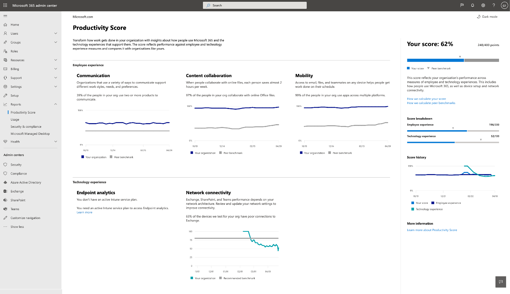
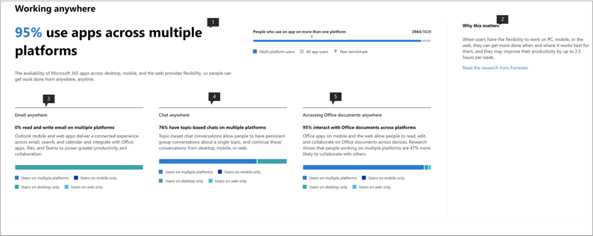
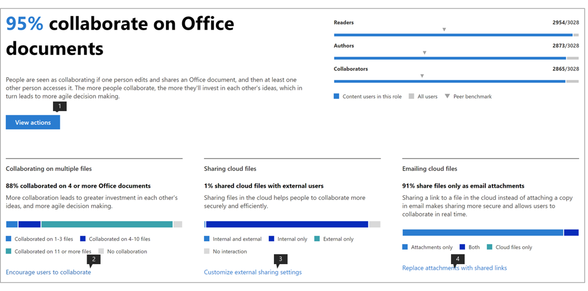
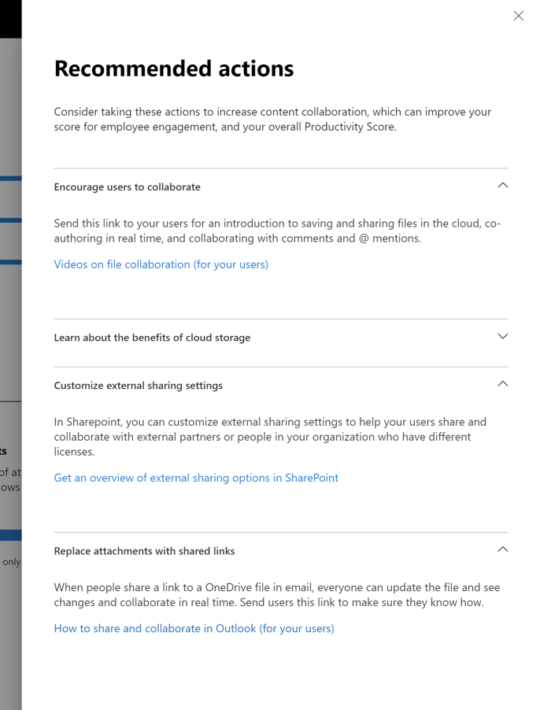

# Microsoft Productivity score (Preview)

Microsoft 365 offers productivity solutions that enables your organization to meet its business goals. Productivity Score provides insights to use these solutions that you can transform to how work gets done. It contains: 

- **Visibility** by helping them understand how people work in the form of their current score with breakdown across categories of Employee experience and Technology experience (coming soon). 
- **Insights** to identify opportunities to enable improved experiences. 
- **Actions** to update skills and systems so everyone can do their best work. 

The score and the insights are present across two categories –  

- **Employee experience:** shows how Microsoft 365 is helping to create a productive and engaged workforce by quantifying how people collaborate on content, work anywhere, by understanding communication styles (coming soon), and by developing a meeting culture (coming soon) 

- **Technology experience** (coming soon): Assists you to optimize your device experiences such as proactively fixing common helpdesk issues,  and improving PC startup times and your network to ensure your apps work well.  

## How it works

### Areas of scoring 

Within each score category, Productivity Score provides insights on your work transformation across areas. The areas covered within Employee experience are:

- Collaborating on content  
- Working anywhere 
- Understanding communication styles (coming soon) 
- Developing a meeting culture (coming soon) 

### Scoring user actions 

Within each area, we measure the research-based key actions which represent the ways of working that enable organizations to transform into highly productive organization. For each area we compute the % of users who perform these actions within the last 28 days. 

The Employee experience score is curated as an average score across all areas. Note that we will keep adding more areas to Employee experience and Technology experience over time. 

### Products included in the Productivity Score 

Productivity Score currently includes signals from the key Microsoft 365 workloads OneDrive, SharePoint, Word, Excel, PowerPoint, OneNote, Outlook, Yammer, Teams, Skype. 

Your score is updated daily and reflects user actions completed in the last 28 days (including the current day).

## Access and required permissions 

For the employee experience, you must have a subscription to a Microsoft 365 for business plan with multiple users. 

To have permission to access Microsoft Productivity Score, you must have of the following roles: 

- Global admin 
- Exchange admins 
- SharePoint admins 
- Skype for Business admins 
- Teams admin 
- Global Reader 
- Reports Reader 

You can access the experience from Microsoft 365 Admin home by choosing **Reports** > **Productivity Score** in the left navigation.

## Interpreting Productivity Score 

### Learn how your organization works 

he Productivity Score home page provides the current score and history on a percentage basis, primary insights for areas within each score category supplemented by benchmarks. 

1.**Productivity Score** is listed on a percentage basis as well as in the <numerator>/<denominator> format so you can also see your absolute points (numerator) and maximum possible points  
1. This pivot allows you to select the score category you want to focus on. In the preview, you can only view **Employee experience**, but the selection will soon expand to include **Technology experience**. 
1. **Peer benchmark** allows you to compare your current score with organizations like you. The benchmark measure is calculated as the average of measures within a set of similar organizations. The set is composed of organizations who have similar number of enabled users, region, the types of licenses you own, industry, and tenure within Microsoft 365 or Office 365. 
1. The **Score categories** section provides a breakdown of your Productivity Score with benchmarks per category.
1. **Score history** displays how your score in each category has moved in the past 6 months.
1. The primary insight for **Collaborating on content** shows the relevant measures with benchmarks from this area that contribute to the score. Select **View Details** to see the area detail page.
1. The primary insight for **Working anywhere** shows the relevant measures with benchmarks from this area that contribute to the score. Select **View Details** to see the area detail page.  

### Insights to identify opportunities to improve experiences 

For each area, select **View Details** in the primary insight to view the area detail page that displays additional insights, related research and actions to improve your score. .

All area detail pages follow the following structure: 

- Top left: Primary insight retained from the home page.
- Bottom left: Supporting insights with contextual actions.  
- Right: Academic research demonstrating the relationship between the area and productivity.

Additionally, all insights contain the following elements: 

- Header: Key takeaway or outcome tracked for each insight;
- Summary: Further explanation of why the measures in the insight are important for your organization's productivity. 
- Data visualization: Visually quantifies your organization's position with regard to the measures in the insight with benchmarks as applicable.
- Actions: Contextual action that can help drive more of the desired outcome per the insight and thus improve your score.

### Area detail page – Collaborating on content 

Collaborating on content page contains the primary insight from the Productivity Score home page. It has the following components:

1. Header: Quantifies what percentage of users are collaborating on content (key outcome).
1. Body: More detail on how increased collaboration leads to higher productivity.
1. Visualization: This visually quantifies each element that contributes to the score for this area with benchmarks:

    - **Readers**: Quantifies users accessing or downloading files on the cloud (OneDrive and SharePoint) within a base of OneDrive and SharePoint enabled users.
    - **Authors**:  Quantifies users modifying, uploading, syncing, checking in, copying or moving files on the cloud (OneDrive and SharePoint) within a base of OneDrive and SharePoint enabled users.
    - **Collaborators**: Quantifies users collaborating on files on the cloud (OneDrive and SharePoint) within a base of OneDrive and SharePoint enabled users. Two users are Collaborators if one of them read or edited a Word, Excel, PowerPoint, OneNote or PDF cloud document after the other created or modified it within a 28-day window.

1. **Why it matters** provides a summary of research linking collaboration on cloud files with productivity. **Read the research from Forrester** goes to a research article that provides more context on how collaboration is conducive to increased productivity.
1. Supporting insight on **Collaborating on multiple files** quantifies how users in your organization are collaborating across different files. 
1. Supporting insight on **Sharing cloud files** quantifies if users are sharing content on the cloud while drawing distinction between internal and external sharing.
1. Supporting insight on **Emailing cloud files** quantifies if users sharing files via email are using attachments versus links to cloud files.

The file types considered for collaboration are Word/Excel/PowerPoint/OneNote/PDF.

### Area detail page – Working anywhere 

The Working anywhere page quantifies the users (as a percentage and absolute value) who used at least one productivity app across two or more platforms, which are desktop, mobile and web. Users get scored higher for using more apps and platforms. The apps being considered are Outlook, Teams, Word, Excel, PowerPoint, OneNote, Yammer, Skype. The base of the insight are users enabled for Microsoft 365 Apps for enterprise, Exchange, Yammer, Skype or Teams.

1. **Why it matters** provides a summary from research linking usage of multiple platforms to higher productivity. **Read the research from Forrester** goes to a research article that provides more context on how working across is conducive to increased productivity.
1. Supporting insight on **Email anywhere** quantifies number of users in your organization using Outlook across platforms within base of users active on Outlook.
1. Supporting insight on **Chat anywhere** quantifies how users in your organization are using Teams across platforms within base of users active on Teams.
1. Supporting insight on **Accessing Office documents anywhere** quantifies how users in your organization are using Word, Excel, PowerPoint and OneNote across platforms within base of users active on Word, Excel, PowerPoint or OneNote.

### Actions for update skills and systems 

In order to promote actionability, each supporting insight comes with inline actions that can help transform your employee experience some of which can be configuration changes or awareness campaigns. Clicking on these calls-to-action opens in the recommended actions panel options that you might consider. Currently the actions in the **Collaborating on content** are enabled.

1. The **View Actions** goes to a pane listing all actions related to Collaborating on content.
1. **Encourage users to collaborate** goes to a list of instructional videos on collaboration with topics such as co-authoring and @mentions. 
1. **Customize external sharing** settings goes to a page with an overview on external sharing describing what happens when users share, depending on what they're sharing and with whom.  
1. **Replace attachments with shared links** goes to a page explaining how to share OneDrive links instead of attachments over email for better collaboration.

Selecting any of the action buttons opens the **Recommended actions** pane on the right that has a summary of each action and a link to the documentation pages.

## We want to hear from you 

We want to utilize the private preview program to glean feedback and use the learnings to co-create the product with you going forward. You can use the **Feedback** sections within the product and/or reach out to the Productivity Score team at ProductivityScorePreview@service.microsoft.com.

To request access to the private preview please fill out the form at https://aka.ms/productivityscorepreview.  
