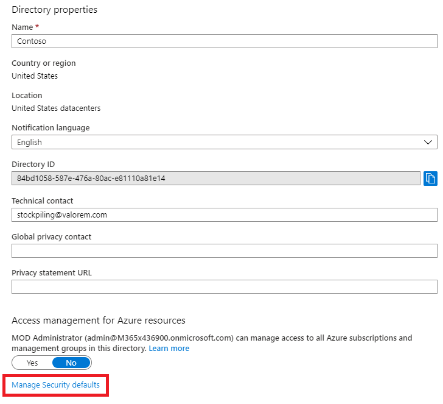
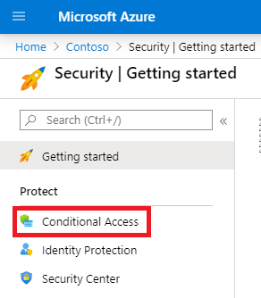
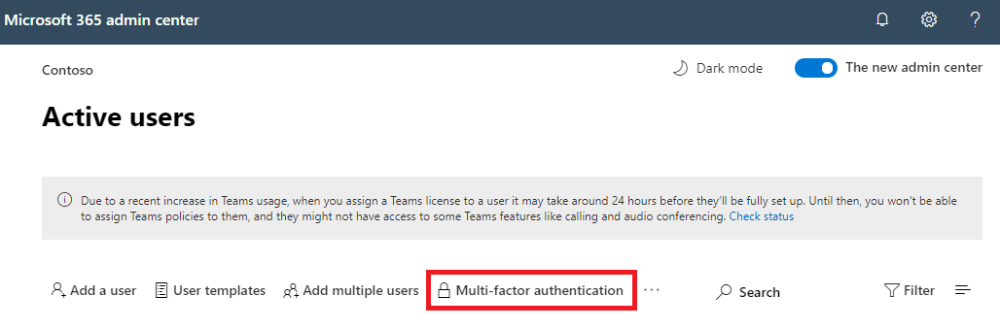

# Multifactor authentication for Microsoft 365

Passwords are the most common method of authenticating a sign-in to a computer or online service, but they're also the most vulnerable. People can choose easy passwords and use the same passwords for multiple sign-ins to different computers and services.

To provide an extra level of security for sign-ins, you must use multifactor authentication (MFA), which uses both a password, which should be strong, and an additional verification method based on:

- Something you have with you that isn't easily duplicated, such as a smart phone.
- Something you uniquely and biologically have, such as your fingerprints, face, or other biometric attribute.

The additional verification method isn't employed until after the user's password has been verified. With MFA, even if a strong user password is compromised, the attacker doesn't have your smart phone or your fingerprint to complete the sign-in.

## MFA support in Microsoft 365

By default, both Microsoft 365 and Office 365 support MFA for user accounts using:

- A text message sent to a phone that requires the user to type a verification code.
- A phone call.
- The Microsoft Authenticator smart phone app.

In both cases, the MFA sign-in is using the "something you have with you that isn't easily duplicated" method for the additional verification. There are multiple ways in which you can enable MFA for Microsoft 365 and Office 365:

- With security defaults
- With Conditional Access policies
- For each individual user account (not recommended)

These ways are based on your Microsoft 365 plan.

|Plan|Recommendation|Type of customer|
|---|---|---|
|All Microsoft 365 plans|Use security defaults, which require MFA for all user accounts. 
 You can also configure per-user MFA on individual user accounts, but this isn't recommended.|Small business|
|Microsoft 365 Business Premium 
 Microsoft 365 E3 
 Microsoft Entra ID P1 licenses|Use [security defaults or Conditional Access policies](/microsoft-365/business-premium/m365bp-turn-on-mfa) to require MFA for user accounts based on group membership, apps, or other criteria.|Small business to enterprise|
|Microsoft 365 E5 
 Microsoft Entra ID P2 licenses|Use Microsoft Entra ID Protection to require MFA based on sign-in risk criteria.|Enterprise|
||||

### Security defaults

Security defaults is a new feature for Microsoft 365 and Office 365 paid or trial subscriptions created after October 21, 2019. These subscriptions have security defaults turned on, which:

- Requires all of your users to use MFA with the Microsoft Authenticator app.
- Blocks legacy authentication.

Users have 14 days to register for MFA with the Microsoft Authenticator app from their smart phones, which begins from the first time they sign in after security defaults has been enabled. After 14 days have passed, the user won't be able to sign in until MFA registration is completed.

Security defaults ensure that all organizations have a basic level of security for user sign-in that is enabled by default. You can disable security defaults in favor of MFA with Conditional Access policies.

You enable or disable security defaults from the **Properties** pane for Microsoft Entra ID in the Azure portal.

You can use security defaults with any Microsoft 365 plan.

For more information, see this [overview of security defaults](/azure/active-directory/fundamentals/concept-fundamentals-security-defaults).

### Conditional Access policies

Conditional Access policies are a set of rules that specify the conditions under which sign-ins are evaluated and allowed. For example, you can create a Conditional Access policy that states:

- If the user account name is a member of a group for users that are assigned the Exchange, user, password, security, SharePoint, or global administrator roles, require MFA before allowing access.

This policy allows you to require MFA based on group membership, rather than trying to configure individual user accounts for MFA when they're assigned or unassigned from these administrator roles.

You can also use Conditional Access policies for more advanced capabilities, such as requiring MFA for specific apps or that the sign-in is done from a compliant device, such as your laptop running Windows 10.

You configure Conditional Access policies from the **Security** pane for Microsoft Entra ID in the Azure portal.

You can use Conditional Access policies with:

- Microsoft 365 Business Premium
- Microsoft 365 E3 and E5
- Microsoft Entra ID P1 and Microsoft Entra ID P2 licenses

For small businesses with Microsoft 365 Business Premium, you can easily use Conditional Access policies with the following steps:

1. Create a group to contain the user accounts that require MFA.
2. Enable the **Require MFA for global admins** policy.
3. Create a group-based Conditional Access policy with these settings:
    - Assignments > Users and groups: The name of your group from Step 1 above.
    - Assignments > Cloud apps or actions: All cloud apps.
    - Access controls > Grant > Grant access > Require multi-factor authentication.
4. Enable the policy.
5. Add a user account to the group created in Step 1 above and test.
6. To require MFA for additional user accounts, add them to the group created in Step 1.

This Conditional Access policy allows you to roll out the MFA requirement to your users at your own pace.

Enterprises should use [Common Conditional Access policies](/azure/active-directory/conditional-access/concept-conditional-access-policy-common) to configure the following policies:

- [Require MFA for administrators](/azure/active-directory/conditional-access/howto-conditional-access-policy-admin-mfa)
- [Require MFA for all users](/azure/active-directory/conditional-access/howto-conditional-access-policy-all-users-mfa)
- [Block legacy authentication](/azure/active-directory/conditional-access/howto-conditional-access-policy-block-legacy)

For more information, see this [overview of Conditional Access](/azure/active-directory/conditional-access/overview).

### Microsoft Entra ID Protection

With Microsoft Entra ID Protection, you can create an additional Conditional Access policy to [require MFA when sign-in risk is medium or high](../../security/office-365-security/zero-trust-identity-device-access-policies-common.md#require-mfa-based-on-sign-in-risk).

You can use Microsoft Entra ID Protection and risk-based Conditional Access policies with:

- Microsoft 365 E5
- Microsoft Entra ID P2 licenses

For more information, see this [overview of Microsoft Entra ID Protection](/azure/active-directory/identity-protection/overview-identity-protection).

### Legacy per-user MFA (not recommended)

You should be using either security defaults or Conditional Access policies to require MFA for your user account sign-ins. However, if either of these can’t be used, Microsoft strongly recommends MFA for user accounts that have administrator roles, especially the global administrator role, for any size subscription.

You enable MFA for individual user accounts from the <a href="https://go.microsoft.com/fwlink/p/?linkid=834822" target="_blank">**Active users**</a> pane of the Microsoft 365 admin center.

After being enabled, the next time the user signs in, they'll be prompted to register for MFA and to choose and test the additional verification method.

### Using these methods together

This table shows the results of enabling MFA with security defaults, Conditional Access policies, and per-user account settings.

|*Item*|Enabled|Disabled|Secondary authentication method|
|---|---|---|---|
|**Security defaults**|Can't use Conditional Access policies|Can use Conditional Access policies|Microsoft Authenticator app|
|**Conditional Access policies**|If any are enabled, you can't enable security defaults|If all are disabled, you can enable security defaults|User-specified during MFA registration|
|**Legacy per-user MFA (not recommended)**|Overrides security defaults and Conditional Access policies requiring MFA at each sign-in|Overridden by security defaults and Conditional Access policies|User-specified during MFA registration|
||||

If security defaults are enabled, all new users are prompted for MFA registration and the use of the Microsoft Authenticator app at their next sign-in.

## Ways to manage MFA settings

There are two ways to manage MFA settings.

In the Azure portal, you can:

- Enable and disable security defaults
- Configure Conditional Access policies

In the Microsoft 365 admin center, you can configure per-user and service <a href="https://go.microsoft.com/fwlink/?LinkId=279980" target="_blank">MFA settings</a>.

## Next steps

[Set up MFA for Microsoft 365](set-up-multi-factor-authentication.md)

## Related content

[Turn on multifactor authentication](set-up-multi-factor-authentication.md) (video)\
[Turn on multifactor authentication for your phone](https://support.microsoft.com/office/ace1d096-61e5-449b-a875-58eb3d74de14) (video)
