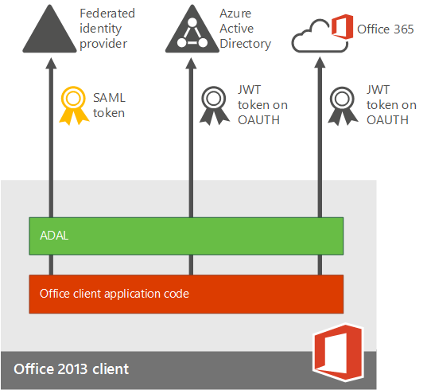
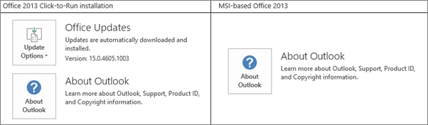

# Plan for multi-factor authentication for Microsoft 365 Deployments

Multi-factor authentication (MFA) is a method of authentication that requires the use of more than one verification method and adds a second layer of security to user sign-ins and transactions. It works by requiring any two or more of the following verification methods:
  
- A randomly generated pass code
    
- A phone call
    
- A smart card (virtual or physical) 
    
- A biometric device 
    
## Multi-factor authentication in Microsoft 365

Microsoft 365 uses multi-factor authentication to help provide the extra security and is managed from the Microsoft 365 admin center. Microsoft 365 offers the following subset of Azure multi-factor authentication capabilities as a part of the subscription: 
  
- The ability to enable and enforce multi-factor authentication for end users
    
- The use of a mobile app (online and one-time password [OTP]) as a second authentication factor
    
- The use of a phone call as a second authentication factor
    
- The use of a Short Message Service (SMS) message as a second authentication factor
    
- Application passwords for non browser clients (for example, the Microsoft Lync 2013 communications software)
    
- Default Microsoft greetings during authentication phone calls
    
For the full list of added features, see [the comparison of Azure Multi-Factor Authentication version](https://go.microsoft.com/fwlink/?LinkId=506927). You can always get the full functionality by purchasing the Azure Multi-Factor Authentication service. 
  
You get a different subset of capabilities depending on whether you have a cloud-only deployment for Microsoft 365 or a hybrid set up with single sign-on and Active Directory Federation Services (AD FS). 
  
|**Where do you manage your Office 365 tenant?**|**MFA second factor options**|
|:-----|:-----|
|Cloud only    |Azure Active Directory MFA (text or phone call)    |
|Hybrid setup, managed on-premises    | If you manage user identity on-premises, you have the following choices:     Physical or virtual smart card (AD FS)    [Azure MFA](https://go.microsoft.com/fwlink/p/?LinkId=526677) (module for AD FS)     Azure AD MFA    |
   
  
The following figure shows how the updated Office 2013 device apps (on Windows) enable users to sign in with MFA. TheOffice 2013 device apps support multi-factor authentication through the use of the [Active Directory Authentication Library (ADAL)](https://go.microsoft.com/fwlink/p/?LinkId=526684). Azure AD hosts a webpage where users can sign in. The identity provider can be Azure AD or a federated identity provider like AD FS. The authentication for federated users follows these steps:
  
1. Azure AD redirects the user to the sign-in web page hosted by the identity provider of record for the Office 365 tenant. The identity provider is determined by the domain specified in the user's sign in name.
    
2. The user signs in on the sign in web page on his or her device. 
    
3. The identity provider returns a token to Azure AD when the user is successfully signed in.
    
4. Azure AD returns a JSON Web Token (JWT) to the Office device app, and the device app is authenticated by using a JWT with Office 365. 
    
This is detailed in the following figure:
  

  
## Software requirements

To enable MFA for Office 2013 client apps, you must have the following software installed (the version listed below, or a later version) based on whether you have a [Click-to-run based installations](#click-to-run-based-installations) or an [MSI-based installations](#msi-based-installations).
  
To determine whether your Office installation is Click-to-run or MSI-base:
  
1. Start Outlook 2013.
    
2. On the **File** menu, choose **Office Account**.
    
3. For Outlook 2013 Click-to-Run installations, an **Update Options** item is displayed. For MSI-based installations, the **Update Options** item is not displayed. 
    
    
  
### Click-to-run based installations

For Click-to-run based installations, you must have the following software installed, at file version listed below or a later file version. If your file version is not equal to or greater than the file version listed, update it using the steps below.
  
|**File name**|**Install path on your computer**|**File version**|
|:-----|:-----|:-----|
|MSO.DLL    |C:\Program Files\Microsoft Office 15\root\vfs\ProgramFilesCommonx86\Microsoft Shared\OFFICE15\MSO.DLL    |15.0.4753.1001    |
|CSI.DLL    |CSI.DLL C:\Program Files\Microsoft Office 15\root\office15\csi.dll    |15.0.4753.1000    |
|Groove.EXE    |C:\Program Files\Microsoft Office 15\root\office15\GROOVE.exe    |15.0.4763.1000    |
|Outlook.exe    |C:\Program Files\Microsoft Office 15\root\office15\OUTLOOK.exe    |15.0.4753.1002    |
|ADAL.DLL    |C:\Program Files\Microsoft Office 15\root\vfs\ProgramFilesCommonx86\Microsoft Shared\OFFICE15\ADAL.DLL    |1.0.2016.624    |
|Iexplore.exe    |C:\Program Files\Internet Explorer    |varies    |
   
### MSI-based installations

For MSI-based installations, you must have the following software installed, at file version listed below or a later file version. If your file version is not equal to or greater than the file version listed, update it using the link in the Update KB Article column.
  
|**File name**|**Install path on your computer**|**Where to get the update**|**Version**|
|:-----|:-----|:-----|:-----|
|MSO.DLL    |C:\Program Files\Common Files\Microsoft Shared\OFFICE15\MSO.DLL    |[KB3085480](https://support.microsoft.com/kb/3085480)   |15.0.4753.1001    |
|CSI.DLL    |C:\Program Files\Common Files\Microsoft Shared\OFFICE15\Csi.dll    |[KB3085504](https://support.microsoft.com/kb/3085504)   |15.0.4753.1000    |
|Groove.exe    |C:\Program Files\Microsoft Office\Office15\GROOVE.EXE    |[KB3085509](https://support.microsoft.com/kb/3085509)   |15.0.4763.1000    |
|Outlook.exe    |C:\Program Files\Microsoft Office\Office15\OUTLOOK.EXE    |[KB3085495](https://support.microsoft.com/kb/3085495)   |15.0.4753.1002    |
|ADAL.DLL    |C:\Program Files\Common Files\Microsoft Shared\OFFICE15\ADAL.DLL    |[KB3055000](https://support.microsoft.com/kb/3055000)   |1.0.2016.624    |
|Iexplore.exe    |C:\Program Files\Internet Explorer    |[MS14-052](https://support.microsoft.com/kb/2977629)   |Not applicable    |
   
## Enable MFA

To enable MFA, you have to complete the following:
  
1. Enable clients for modern authentication:
    
  - [Enable Modern Authentication for Office 2013 on Windows devices](enable-modern-authentication.md) . 
    
  - Set up Azure MFA with third-party directory services.
    
    See the [Advanced scenarios with Azure Multi-Factor Authentication and third-party VPN solutions](https://docs.microsoft.com/azure/active-directory/authentication/howto-mfaserver-nps-vpn) for information on specific identity providers accepted to this program. 
    
2. [Set up multi-factor authentication for Office 365](set-up-multi-factor-authentication.md)
    
3. Tell individual users how to sign in by MFA: [Sign in to Office 365 with 2-step verification](https://support.office.com/article/2b856342-170a-438e-9a4f-3c092394d3cb.aspx).
    
> [!IMPORTANT]
> If you have enabled your users for Azure AD MFA and they have any devices running Office 2013 that are not enabled for Modern Authentication, they will need to use AppPasswords on those devices. More information on AppPasswords and when/where/how they should be used can be found here: [App Passwords with Azure Multi_Factor Authentication](https://go.microsoft.com/fwlink/p/?LinkId=528178). 
  
## FAQ

[FAQ about Modern Authentication wiki article](https://go.microsoft.com/fwlink/p/?LinkId=530064)
  
 **Known issues:**
  
[Office 2013 and Microsoft 365 Apps for enterprise modern authentication : Things to know before onboarding](https://social.technet.microsoft.com/wiki/contents/articles/30214.office-2013-and-office-365-proplus-modern-authentication-things-to-know-before-onboarding.aspx)
  
 **Troubleshooting Azure Multi-Factor Authentication:**
  
See [Troubleshoot Azure MFA](https://support.microsoft.com/help/2937344/troubleshooting-azure-multi-factor-authentication-issues).
  
[How to troubleshoot sign-in issues with Office 2013 modern authentication when you use AD FS](https://support.microsoft.com/kb/3052203/)
  
 **When alternate IDs don't work:**
  
[How to use PowerShell to fix duplicate UPN](https://go.microsoft.com/fwlink/p/?LinkId=396730)
  
[Script to fix duplicate user principal names](https://go.microsoft.com/fwlink/p/?LinkId=396725)
  
 **Client access filtering:**
  
[Office 2013 and Microsoft 365 Apps for enterprise modern authentication and client access filtering policies : Things to know before onboarding](https://social.technet.microsoft.com/wiki/contents/articles/30214.office-2013-and-office-365-proplus-modern-authentication-things-to-know-before-onboarding.aspx)
  
 **Which apps support MFA?**
  
|**Windows**|**Mac**|**iOS**|**Android phone**|**Android tablet**|
|:-----|:-----|:-----|:-----|:-----|
|Modern authentication for Word 2013, Word 2016, Excel 2013, Excel 2016, PowerPoint 2013, PowerPoint 2016, OneNote 2013, OneNote 2016, Project 2013, Project 2016, Visio 2013, Visio 2016, Lync 2013, and Skype for Business is supported with this release.    |Modern authentication for Word 2016 for Mac, Excel 2016 for Mac, and PowerPoint 2016 for Mac is supported with this release.    |Modern authentication for Word for iPad, Excel for iPad, and PowerPoint for iPad is supported with this release.    |Modern authentication for Word for Android, Excel for Android, and PowerPoint for Android is supported with this release.    |Modern authentication for Word for Android, Excel for Android, and PowerPoint for Android is supported with this release.    |
|Modern authentication for Outlook 2013 and Outlook 2016 is supported with this release.    |Modern authentication for Outlook 2016 for Mac is supported with this release.    |Modern authentication for Outlook for iPad is supported with this release.    |||
   

