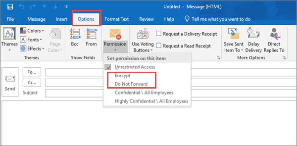
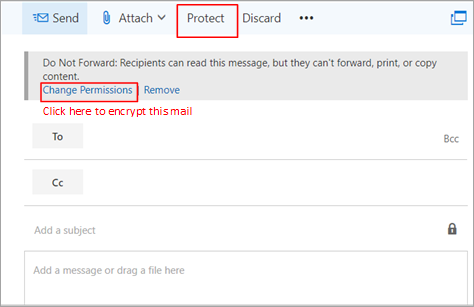
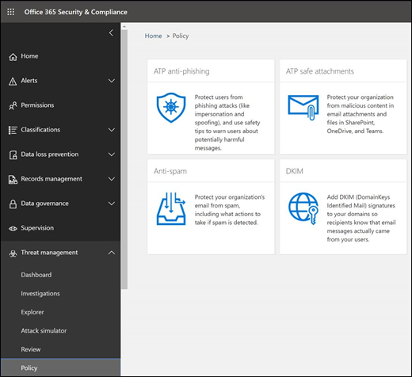

# Top 10 ways to secure Office 365 and Microsoft 365 Business plans

If you are a small or medium-size organization using one of Microsoft's business plans and your type of organization is targeted by cyber criminals and hackers, use the guidance in this article to increase the security of your organization. This guidance helps your organization achieve the goals described in the Harvard Kennedy School [Cybersecurity Campaign Handbook](https://go.microsoft.com/fwlink/?linkid=2015598&amp;clcid=0x409).
  
Microsoft recommends that you complete the tasks listed in the following table that apply to your service plan. 
  
||**Task**|**Office 365 Business Premium**|**Microsoft 365 Business**|
|:-----|:-----|:-----|:-----|
|1    |[Set up multi-factor authentication](secure-your-business-data.md#setup)   |             |             |
|2    |[Train your users](secure-your-business-data.md#train)   |             |             |
|3    |[Use dedicated admin accounts](secure-your-business-data.md#admin)   |             |             |
|4    |[Raise the level of protection against malware in mail](secure-your-business-data.md#malware)   |             |             |
|5    |[Protect against ransomware](secure-your-business-data.md#ransomware)   |             |             |
|6    |[Stop auto-forwarding for email](secure-your-business-data.md#forwarding)   |             |             |
|7    |[Use Office Message Encryption](secure-your-business-data.md#encryption)   ||             |
|8    |[Protect your email from phishing attacks](secure-your-business-data.md#phishing)   ||             |
|9    |[Protect against malicious attachments and files with ATP Safe Attachments](secure-your-business-data.md#atp)   ||             |
|10    |[Protect against phishing attacks with ATP Safe Links](secure-your-business-data.md#phishingatp)   ||             |
   
Before you begin, check your [Microsoft 365 Secure Score](https://docs.microsoft.com/microsoft-365/security/mtp/microsoft-secure-score) in the Microsoft 365 security center. From a centralized dashboard, you can monitor and improve the security for your Microsoft 365 identities, data, apps, devices, and infrastructure. You are given points for configuring recommended security features, performing security-related tasks (such as viewing reports), or addressing recommendations with a third-party application or software. With additional insights and more visibility into a broader set of Microsoft products and services, you can feel confident reporting about your organization's security health.
  

  
## 1: Set up multi-factor authentication

Using multi-factor authentication is one of the easiest and most effective ways to increase the security of your organization. It's easier than it sounds - when you log in, multi-factor authentication means you'll type a code from your phone to get access to Microsoft 365. This can prevent hackers from taking over if they know your password. Multi-factor authentication is also called 2-step verification. Individuals can add 2-step verification to most accounts easily, for example, to their Google or Microsoft accounts. Here's how to [add two-step verification to your personal Microsoft account](https://go.microsoft.com/fwlink/?linkid=2016403&amp;clcid=0x409).
  
For businesses using Office 365 and Microsoft 365, add a setting that requires your users to log in using multi-factor authentication. When you make this change, users will be prompted to set up their phone for two-factor authentication next time they log in.
To see a training video for how to set up MFA and how users complete the set up, see [set up MFA](https://support.office.com/article/e12187b8-216a-4490-9e3b-df34a06fb787) and [user set up](https://support.office.com/article/a32541df-079c-420d-9395-9d59354f7225).
  
To set up multi-factor authentication:

1. In the [admin center](https://go.microsoft.com/fwlink/p/?linkid=834822), select **Users** > **Active Users**.

2. In the **Active Users** section, select  **Multi-Factor Authentication**.

3. On the **Multi-Factor Authentication** page, select **User** if you are enabling this for one user Or you can perform a **Bulk Update**.

4. Select **Enable** under **Quick Steps**.

5. In the pop-up window, choose **Enable Multi-Factor Authentication**.

After you set up multi-factor authentication for your organization, your users will be required to set up two-step verification on their devices. For more information, see [Set up 2-step verification for Office 365](https://support.office.com/article/ace1d096-61e5-449b-a875-58eb3d74de14).
  
For full details and complete recommendations, see [Set up multi-factor authentication for Office 365 users](set-up-multi-factor-authentication.md).
  
## 2: Train your users

The Harvard Kennedy School [Cybersecurity Campaign Handbook](https://go.microsoft.com/fwlink/?linkid=2015598&amp;clcid=0x409) provides excellent guidance on establishing a strong culture of security awareness within your organization, including training users to identify phishing attacks. 
  
In addition to this guidance, Microsoft recommends that your users take the actions described in this article: [Protect your account and devices from hackers and malware](https://support.office.com/article/066d6216-a56b-4f90-9af3-b3a1e9a327d6.aspx). These actions include:
  
- Using strong passwords
    
- Protecting devices
    
- Enabling security features on Windows 10 and Mac PCs
    
Microsoft also recommends that users protect their personal email accounts by taking the actions recommended in the following articles:
  
- [Help protect your Outlook.com email account](https://support.office.com/article/a4f20fc5-4307-4ece-8231-6d4d4bd8a9ba.aspx)
    
- [Protect your Gmail account with 2-step verification](https://go.microsoft.com/fwlink/?linkid=2015688&amp;clcid=0x409)
    
## 3: Use dedicated admin accounts

The administrative accounts you use to administer your Office 365 or Microsoft 365 environment include elevated privileges. These are valuable targets for hackers and cyber criminals. Use admin accounts only for administration. Admins should have a separate user account for regular, non-administrative use and only use their administrative account when necessary to complete a task associated with their job function. Additional recommendations:
  
- Be sure admin accounts are also set up for multi-factor authentication. 
    
- Before using admin accounts, close out all unrelated browser sessions and apps, including personal email accounts.
    
- After completing admin tasks, be sure to log out of the browser session.
    
## 4: Raise the level of protection against malware in mail

Your Office 365 or Microsoft 365 environment includes protection against malware, but you can increase this protection by blocking attachments with file types that are commonly used for malware. To bump up malware protection in email, view a [short training video](https://support.office.com/article/02b5783a-eea0-42e8-8856-62440718c3f0), or complete the following steps:
  
1. Go to [https://protection.office.com](https://protection.office.com) and sign in with your admin account credentials. 
    
2. In the Office 365 Security &amp; Compliance Center, in the left navigation pane, under **Threat management**, choose **Policy** \> **Anti-Malware**.
    
3. Double-click the default policy to edit this company-wide policy.
    
4. Select **Settings**.
    
5. Under **Common Attachment Types Filter**, select **On**. The file types that are blocked are listed in the window directly below this control. You can add or delete file types later, if needed.
    
6. Select **Save.**
    
For more information, see [Anti-malware protection](https://go.microsoft.com/fwlink/?linkid=2015692&amp;clcid=0x409).
  
## 5: Protect against ransomware

Ransomware restricts access to data by encrypting files or locking computer screens. It then attempts to extort money from victims by asking for "ransom," usually in form of cryptocurrencies like Bitcoin, in exchange for access to data. 
  
You can protect against ransomware by creating one or more mail flow rules to block file extensions that are commonly used for ransomware, or to warn users who receive these attachments in email. A good starting point is to create two rules:
  
- Warn users before opening Office file attachments that include macros. Ransomware can be hidden inside macros, so we'll warn users to not open these files from people they do not know. 
    
- Block file types that could contain ransomware or other malicious code. We'll start with a common list of executables (listed in the table below). If your organization uses any of these executable types and you expect these to be sent in email, add these to the previous rule (warn users).
    
To create a mail transport rule, view a [short training video](https://support.office.com/article/a9ecca03-42a6-4867-b9fd-38e3f6bb06ad), or complete the following steps:
  
1. Go to the <a href="https://go.microsoft.com/fwlink/p/?linkid=2059104" target="_blank">Exchange admin center</a>.

2. In the **mail flow** category, select **rules**.
    
3. Select **+**, and then **Create a new rule**.
    
4. Select **** at the bottom of the dialog box to see the full set of options. 
    
5. Apply the settings in the following table for each rule. Leave the rest of the settings at the default, unless you want to change these.
    
6. Select **Save**.
    
|**Setting**|**Warn users before opening attachments of Office files**|**Block file types that could contain ransomware or other malicious code**|
|:-----|:-----|:-----|
|Name    |Anti-ransomware rule: warn users    |Anti-ransomware rule: block file types    |
|Apply this rule if . . .    |Any attachment . . . file extension matches . . .    |Any attachment . . . file extension matches . . .    |
|Specify words or phrases    |Add these file types:    dotm, docm, xlsm, sltm, xla, xlam, xll, pptm, potm, ppam, ppsm, sldm    |Add these file types:    ade, adp, ani, bas, bat, chm, cmd, com, cpl, crt, hlp, ht, hta, inf, ins, isp, job, js, jse, lnk, mda, mdb, mde, mdz, msc, msi, msp, mst, pcd, reg, scr, sct, shs, url, vb, vbe, vbs, wsc, wsf, wsh, exe, pif    |
|Do the following . . .    |Notify the recipient with a message    |Block the message . . . reject the message and include an explanation    |
|Provide message text    |Do not open these types of files—unless you were expecting them—because the files may contain malicious code and knowing the sender isn't a guarantee of safety.   |
|
   
> [!TIP]
> You can also add the files you want to block to the Anti-malware list in [step 4](#4-raise-the-level-of-protection-against-malware-in-mail).

For more information, see:
  
- [How to deal with ransomware](https://go.microsoft.com/fwlink/?linkid=2016501&amp;clcid=0x409)
    
- [Restore your OneDrive](https://support.office.com/article/fa231298-759d-41cf-bcd0-25ac53eb8a15.aspx)
    
## 6: Stop auto-forwarding for email

Hackers who gain access to a user's mailbox can exfiltrate mail by configuring the mailbox to automatically forward email. This can happen even without the user's awareness. You can prevent this from happening by configuring a mail flow rule. 
  
To create a mail transport rule:
  
1. Go to the <a href="https://go.microsoft.com/fwlink/p/?linkid=2059104" target="_blank">Exchange admin center</a>.

2. In the **mail flow** category, select **rules**.
    
3. Select **+**, and then **Create a new rule**.
    
4. Select **More options** at the bottom of the dialog box to see the full set of options. 
    
5. Apply the settings in the following table. Leave the rest of the settings at the default, unless you want to change these.
    
6. Select **Save**.
    
|**Setting**|**Warn users before opening attachments of Office files**|
|:-----|:-----|
|Name    |Prevent auto forwarding of email to external domains    |
|Apply this rule if ...    |The sender . . . is external/internal . . . Inside the organization    |
|Add condition    |The message properties . . . include the message type . . . Auto-forward    |
|Do the following ...    |Block the message . . . reject the message and include an explanation.    |
|Provide message text    |Auto-forwarding email outside this organization is prevented for security reasons.    |
   
## 7: Use Office Message Encryption

Office Message Encryption is included with Microsoft 365. It's already set up. With Office Message Encryption, your organization can send and receive encrypted email messages between people inside and outside your organization. Office 365 Message Encryption works with Outlook.com, Yahoo!, Gmail, and other email services. Email message encryption helps ensure that only intended recipients can view message content.
  
Office Message Encryption provides two protection options when sending mail:
  
- Do not forward
    
- Encrypt
    
Your organization might have configured additional options that apply a label to email, such as Confidential.
  
### To send protected email

In Outlook for PC, select **Options** in the email, and then choose **Permissions**. 
  

  
In Outlook.com, select **Protect** in the email. The default protection is **Do not forward**. To change this to encrypt, select **Change Permissions** \> **Encrypt**. 
  

  
### To receive encrypted email

If the recipient has Outlook 2013 or Outlook 2016 and an Office 365 email account, they'll see an alert about the item's restricted permissions in the Reading pane. After opening the message, the recipient can view the message just like any other.
  
If the recipient is using another email client or email account, such as Gmail or Yahoo, they'll see a link that lets them either sign in to read the email message or request a one-time passcode to view the message in a web browser. If users aren't receiving the email, have them check their Spam or Junk folder. 
  
For more information, see [Send, view, and reply to encrypted messages in Outlook for PC](https://support.office.com/article/eaa43495-9bbb-4fca-922a-df90dee51980.aspx).
  
## 8. Protect your email from phishing attacks

If you've configured one or more custom domains for your Office 365 or Microsoft 365 environment, you can configure targeted anti-phishing protection. ATP anti-phishing protection, part of Office 365 Advanced Threat Protection, can help protect your organization from malicious impersonation-based phishing attacks and other phishing attacks. If you haven't configured a custom domain, you do not need to do this.
  
We recommend that you get started with this protection by creating a policy to protect your most important users and your custom domain. 
  

  
To create an ATP anti-phishing policy, view a [short training video](https://support.office.com/article/86c425e1-1686-430a-9151-f7176cce4f2c), or complete the following steps:
  
1. Go to [https://protection.office.com](https://protection.office.com). 
    
2. In the Office 365 Security &amp; Compliance Center, in the left navigation pane, under **Threat management**, select **Policy**.
    
3. On the Policy page, select **ATP anti-phishing**.
    
4. On the Anti-phishing page, select **+ Create**. A wizard launches that steps you through defining your anti-phishing policy.
    
5. Specify the name, description, and settings for your policy as recommended in the chart below. See [Learn about ATP anti-phishing policy options](https://go.microsoft.com/fwlink/?linkid=2016505&amp;clcid=0x409) for more details. 
    
6. After you have reviewed your settings, select **Create this policy** or **Save**, as appropriate.
    
|**Setting or option**|**Recommended setting**  |
| :-------| :-----|
|Name    |Domain and most valuable campaign staff    |
|Description    |Ensure most important staff and our domain are not being impersonated.    |
|Add users to protect    |Select **+ Add a condition, The recipient is**. Type user names or enter the email address of the candidate, campaign manager, and other important staff members. You can add up to 20 internal and external addresses that you want to protect from impersonation.    |
|Add domains to protect    |Select **+ Add a condition, The recipient domain is**. Enter the custom domain associated with your Microsoft 365 subscription, if you defined one. You can enter more than one domain.    |
|Choose actions    |If email is sent by an impersonated user: select **Redirect message to another email address**, and then type the email address of the security administrator; for example, securityadmin@contoso.com.          If email is sent by an impersonated domain: select **Quarantine message**.    |
|Mailbox intelligence    |By default, mailbox intelligence is selected when you create a new anti-phishing policy. Leave this setting **On** for best results.    |
|Add trusted senders and domains    |For this example, don't define any overrides.    |
|Applied to    |Select **The recipient domain is**. Under **Any of these**, select **Choose**. Select **+ Add**. Select the check box next to the name of the domain, for example, contoso.com, in the list, and then select **Add**. Select **Done**.    |
   
For more information, see [Set up Office 365 ATP anti-phishing policies](https://go.microsoft.com/fwlink/?linkid=2016505&amp;clcid=0x409).
  
## 9: Protect against malicious attachments and files with ATP Safe Attachments

People regularly send, receive, and share attachments, such as documents, presentations, spreadsheets, and more. It's not always easy to tell whether an attachment is safe or malicious just by looking at an email message. Office 365 Advanced Threat Protection includes ATP Safe Attachment protection, but this protection is not turned on by default. We recommend that you create a new rule to begin using this protection. This protection extends to files in SharePoint, OneDrive, and Microsoft Teams.
  
To create an ATP safe attachment policy, view a [short training video](https://support.office.com/article/e7e68934-23dc-4b9c-b714-e82e27a8f8a5), or complete the following steps:
  
1. Go to [https://protection.office.com](https://protection.office.com) and sign in with your admin account. 
    
2. In the Office 365 Security &amp; Compliance Center, in the left navigation pane, under **Threat management**, select **Policy**.
    
3. On the Policy page, select **ATP safe attachments**.
    
4. On the Safe attachments page, apply this protection broadly by selecting the **Turn on ATP for SharePoint, OneDrive, and Microsoft Teams** check box. 
    
5. Select **+** to create a new policy. 
    
6. Apply the settings in the following table. 
    
7. After you have reviewed your settings, select **Create this policy** or **Save**, as appropriate.

|**Setting or option**|**Recommended setting**  |
| :-------| :-----|
|Name    |Block current and future emails with detected malware.    |
|Description    |Block current and future emails and attachments with detected malware.    |
|Save attachments unknown malware response    |Select **Block - Block the current and future emails and attachments with detected malware**.    |
|Redirect attachment on detection    |Enable redirection (select this box)          Enter the admin account or a mailbox setup for quarantine.          Apply the above selection if malware scanning for attachments times out or error occurs (select this box).    |
|Applied to    |The recipient domain is . . . select your domain.    |
|
   
For more information, see [Set up Office 365 ATP anti-phishing policies](https://go.microsoft.com/fwlink/?linkid=2016505&amp;clcid=0x409).
  
## 10: Protect against phishing attacks with ATP Safe Links

Hackers sometimes hide malicious websites in links in email or other files. Office 365 ATP Safe Links (ATP Safe Links), part of Office 365 Advanced Threat Protection, can help protect your organization by providing time-of-click verification of web addresses (URLs) in email messages and Office documents. Protection is defined through ATP Safe Links policies.
  
We recommend that you do the following:
  
- Modify the default policy to increase protection.
    
- Add a new policy targeted to all recipients in your domain.
    
To get to ATP Safe Links, view a [short training video](https://support.office.com/article/61492713-53c2-47da-a6e7-fa97479e97fa), or complete the following steps:
  
1. Go to [https://protection.office.com](https://protection.office.com) and sign in with your admin account. 
    
2. In the Office 365 Security &amp; Compliance Center, in the left navigation pane, under **Threat management**, select **Policy**.
    
3. On the Policy page, select **ATP Safe Links**.
    
To modify the default policy:
  
1. On the Safe links page, under **Policies that apply to the entire organization**, select the **Default** policy. 
    
2. Under **Settings that apply to content except email**, select **Office 365 ProPlus, Office for iOS and Android**.
    
3. Select **Save**. 
    
To create a new policy targeted to all recipients in your domain:
  
1. On the Safe links page, under **Policies that apply to the entire organization**, select **+** to create a new policy. 
    
2. Apply the settings listed in the following table.
    
3. Select **Save**. 
    
**Setting or option**|**Recommended setting**  |
| :-------| :-----|
|Name    |Safe links policy for all recipients in the domain    |
|Select the action for unknown potentially malicious URLs in messages    |Select **On - URLs will be rewritten and checked against a list of known malicious links when user clicks on the link**.    |
|Use Safe Attachments to scan downloadable content    |Select this box.    |
|Applied to    |The recipient domain is . . . select your domain.    |
|
   
For more information, see [Office 365 ATP safe links](https://go.microsoft.com/fwlink/?linkid=2016138&amp;clcid=0x409).
