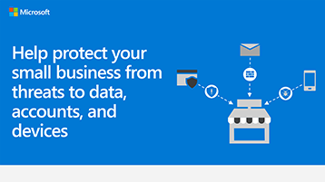

# Security info graphic for small businesses

**Summary:** Learn the basic terms for the threats your business faces and what you can do to protect your data, accounts, and devices. As an admin for Microsoft 365 for business, take action to make your business more secure, and help every employee learn how to keep your business data and devices safe.

The links for PowerPoint and PDF below can be downloaded and printed in tabloid format (also known as ledger, 11 x 17, or A3).

[PDF](downloads/smbthreatprotection-infographic.pdf) | [PowerPoint](https://github.com/MicrosoftDocs/microsoft-365-docs-pr/raw/live/m365-democracy/microsoft-365/admin/downloads/smbthreatprotection-infographic.pptx)
