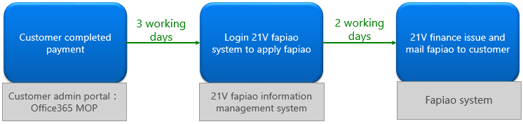
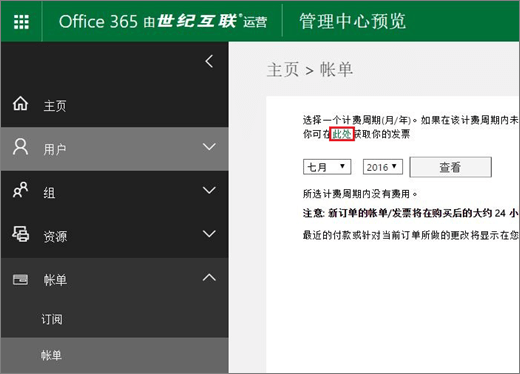
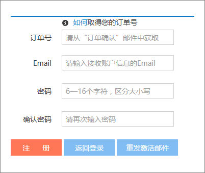
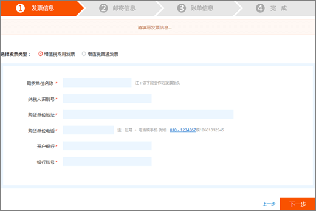
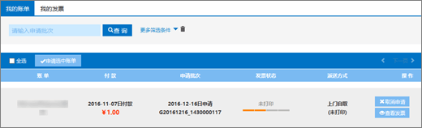
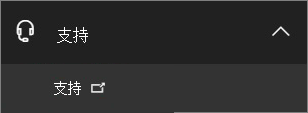
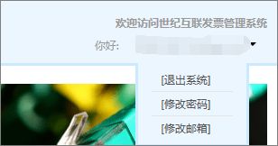
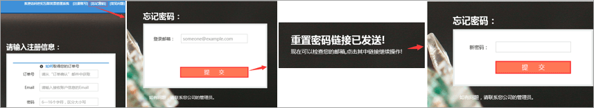

# Apply for a Fapiao for Office 365 operated by 21Vianet

You can submit your Fapiao request to the 21Vianet Fapiao management system about three days after you have paid. After you submit your Fapiao request, it will be processed in two days.
  

  
## Step 1: Apply for a Fapiao

There are two ways to apply for a Fapiao:
  
1. After making a payment in the Office 365 operated by 21Vianet website, you'll receive an order confirmation email that contains your order number and a link to the Fapiao management system. You can use the link in the email to create an account in the <a href="https://go.microsoft.com/fwlink/p/?linkid=837466" target="_blank">21Vianet Fapiao information management system</a>.

    Or

2. You can apply for a Fapiao from the <a href="https://go.microsoft.com/fwlink/p/?linkid=850627" target="_blank">admin center</a>.

    
  
## Step 2: Register with the 21Vianet Fapiao management system

> [!NOTE]
> You can use the same email name and password as your Office 365 account, or you can use something different.
  
1. Go to the <a href="https://go.microsoft.com/fwlink/p/?linkid=837466" target="_blank">21Vianet Fapiao information management system</a>.

2. In the registration form, enter your order number, email address, and password, then select **Registration**.

    
  
3. After your registration is complete, the system will send an activation email message to your email address. Open the email message and select the link to activate your account.

## Step 3: Submit your bill for a Fapiao

1. Log in to the <a href="https://go.microsoft.com/fwlink/p/?linkid=837465" target="_blank">Fapiao management system</a>.

2. Select the billing record, then select **Apply bill**.

    > [!NOTE]
    > The payment system is on a third-party platform and takes three days to synchronize the order and payment record.
  
    
  
3. Select the Fapiao type, enter the required information, then select **Next**.

    
  
    > [!NOTE]
    > - For a normal VAT Fapiao, you only need to enter the buyer's name.
    > - If necessary, you can apply for a Fapiao with different a title. However, you can only apply one Fapiao title for one bill in the system. If you want to split the Fapiao into different amounts or titles, please <a href="https://portal.partner.microsoftonline.cn/Support/SupportOverview.aspx" target="_blank">submit your request in the admin center</a>.
    > - The next time you apply for a Fapiao, the system automatically presents the previous Fapiao information.
    > - If you need a purchase certificate or a refund, the payer name and the Fapiao title must match.

4. Select a shipping method and enter the mailing information. You can choose Yunda or SF (freight collect). You can also go to the 21Vianet Shanghai branch to get the Fapiao. select **Next**.

    
  
    **21Vianet Shanghai branch company address:**

    Shanghai, Pudong New Area Keyuan Road No. 88, German Center, building 3, 657

    **Contact information:**

    Zhu qin qin 021-28986102

5. Verify that the information is correct, then select **Confirm**.

    
  
## Step 4: Check application progress

Your application is automatically transmitted to the 21Vianet Service Center, and will be completed in two working days.
  
After you submit the application, you can check the progress at any time. We will update the status of your application with remarks like **Issued** or **Mailed out**.
  

  
When Fapiao is out of use, the system will display a notice, and will indicate the expected time to issue the Fapiao.
  

  
## FAQs

### What services can I get from online support?

You can check the progress of your Fapiao request, and find out why you haven't received the Fapiao.
  
If you want to change the Fapiao title, please send the Fapiao back to us and we will reissue the Fapiao. You can submit the request through the <a href="https://portal.partner.microsoftonline.cn/Support/SupportOverview.aspx" target="_blank">admin center</a>.
  

  
### How do I change my login email address and password?

1. Log in to the <a href="https://go.microsoft.com/fwlink/p/?linkid=837465" target="_blank">Fapiao management system</a>, then select **Change email address**.

    
  
2. If you forgot your login password, you can use your login email address to reset the password. The Fapiao management system will send a new password to your email address. You can use the new password to login.

    
  
3. If you forgot your login email address, please contact 21Vianet customer service at (86) 400-089-0365.

### How do I find my order ID?

1. In the [admin center](https://go.microsoft.com/fwlink/p/?linkid=850627), go to the **Billing** \> **Bills & payments** page.

2. Find the invoice you want, select to view, or choose to download the PDF.

### What if I enter the wrong email address when I register?

If you enter the wrong email address when you register, you won't receive the activation email. The registration link in the email will automatically expire after 24 hours. You can return to the <a href="https://go.microsoft.com/fwlink/p/?linkid=837466" target="_blank">registration page</a> and register again with the correct email address.
  
### What if I don't receive an activation email?

If you don't receive an account activation email within 24 hours after you register, go to the <a href="https://go.microsoft.com/fwlink/p/?linkid=837466" target="_blank">21Vianet Fapiao information management system</a>, enter your email address, then select **Resend the activation email**. The system will resend the account activation email to your registered email address.
  

  
If you still don't receive an activation email, please contact 21Vianet customer service at (86) 400-089-0365.