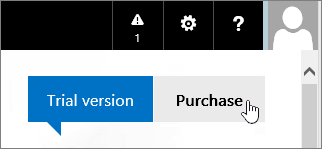

# Buy or try subscriptions for Office 365 operated by 21Vianet

> [!NOTE]
>  This article applies to Office 365 operated by 21Vianet in China.

## Buy or try Office 365

You can buy a subscription right away, or you can try Office 365 for up to 30 days. If you like it, you can buy your trial subscription and keep the domain, data, and configuration you set up in your trial.

1. Go to [Compare Office 365 for business plans](https://go.microsoft.com/fwlink/p/?linkid=393691&amp;clcid=0x409) and select the name of the plan you want to buy. Then, select **Buy now**.

2. Create an account by filling out the **Just a few details** page.

3. Follow the instructions to set up your 30-day trial or to complete your purchase.

## Buy your trial subscription

1. [Sign in to Office 365](https://go.microsoft.com/fwlink/p/?linkid=513813) with your work or school account.

2. If you're not already on the start page, select **Office 365** in the top-left hand corner.

    

3. At the top right-hand corner of the page, under the navigation bar, select **Purchase**.

    

4. On the **Purchase subscriptions** page, you'll see the different plans that you can buy. The plan that you've been trying is identified by the **In Trial** banner.

    > [!IMPORTANT]
    > If you purchase a different plan from your trial plan, you have to reassign your licenses from your trial plan to your new plan (before your 90-day grace period ends after your trial plan expires) in order to retain your data, accounts, and configuration. Otherwise, you will lose your data, accounts, and configuration.

5. Select the subscription that you want to purchase and then select **Buy now**.

6. Follow the steps to check out.

## Add subscriptions or add-ons to an existing Office 365 account

1. In the [admin center](https://go.microsoft.com/fwlink/p/?linkid=850627), go to the **Billing** \> **Purchase services** page.

2. Select the service(s) that you'd like to purchase, select **Buy**, and then select **Check out now**.

3. Follow the instructions to complete your purchase.

## Payment options

You can pay for your subscription by:

- Invoice

- Online payment using Alipay or China UnionPay

Proof of payment will be provided in the form of Fapiaos. You can submit your Fapiao request to our [Fapiao system](https://go.microsoft.com/fwlink/p/?LinkId=395314) about three (3) days after you have paid. For more information, see [Apply for a Fapiao for Office 365 operated by 21Vianet](apply-for-a-fapiao.md).

> [!NOTE]
>  International credit cards are not accepted.
