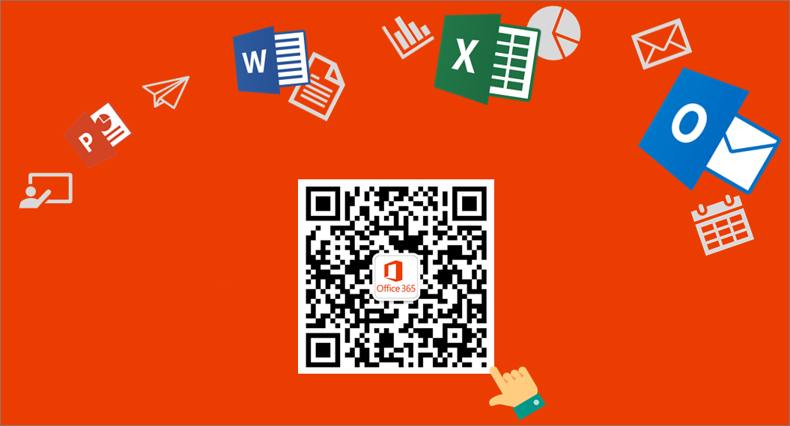

# Office 365 operated by 21Vianet

Office 365 operated by 21Vianet is designed to meet the needs for secure, reliable and scalable cloud services in China. This service is powered by technology that Microsoft has licensed to 21Vianet.

Microsoft does not operate the service itself. 21Vianet operates, provides, and manages delivery of the service. 21Vianet is the largest carrier-neutral Internet data center services provider in China, providing hosting, managed network services, and cloud computing infrastructure services. By licensing Microsoft technologies, 21Vianet operates local Office 365 datacenters to provide you the ability to use Office 365 services while keeping your data within China. 21Vianet also provides your subscription and billing services, as well as support.

> [!NOTE]
> These services are subject to Chinese laws.

 **Follow us on WeChat**

Scan this QR code to follow us on WeChat and get the latest updates for Office 365 operated by 21Vianet.

 **About services in Office 365 operated by 21Vianet**

The sections below highlight some of the differences you will find in each service. Ultimately our goal is to achieve parity with global services. However, due to the unique nature of the China services - operated by a partner from datacenters inside China - there are some features that have not yet been enabled. Customers will see the services come closer to full feature parity over time. For a more detailed look at services available for each Office 365 plan operated by 21Vianet, see the [Office 365 Service Description](/office365/servicedescriptions/office-365-platform-service-description/office-365-operated-by-21vianet).

If you would like to learn how to get started with general Office 365 services, see [Get started](../admin-overview/get-started-with-office-365.md).

## Office 365 Suite

|Function|Availability|
|---|---|
|Custom domains|Administrators can create and/or use custom domains registered through Chinese-specific domain providers. If you don't have a custom domain, you can [How to buy a domain name](../get-help-with-domains/buy-a-domain-name.md) from a domain name registrar. If you already have one, [Find your domain registrar or DNS hosting provider](../get-help-with-domains/find-your-domain-registrar.md).    Additionally, if you create a public website using the Office 365 SharePoint Online service, China Internet compliance policy requires that you get an Internet Content Provider (ICP) number.  **Note:** Automatic validation for disallowed words in custom domain names is not available.|
|Subscriptions, billing, and technical support|Provided by 21Vianet. For information on how to contact support, see [Contact Office 365 for business support](../../business-video/get-help-support.md).|
|Self-service password reset|Available for admins only. For more information, see [Change or reset your password in Office 365 operated by 21Vianet](https://support.microsoft.com/office/d8eb5b62-9d0e-4267-a9bf-2aa491ee6d0b).|
|Security, privacy, compliance, and details on levels of support|Provided by 21Vianet.|
|Office Desktop Setup|Office desktop setup is not available for Office 2010 and Office 2007. However, administrators can [Configure current Office desktop applications to work with Office 365](https://support.microsoft.com/office/85646aba-7e6c-4e24-a047-8fd9ce4f9d2e).|
|Mobile and device support\*|Coming soon are the following mobile features:     Mobile Device Management (MDM)     Blackberry Business Cloud Services (BBCS) is not available, but you can use Exchange ActiveSync devices or an offering from Research in Motion (RIM, the BlackBerry wireless email solution) to run Blackberry Enterprise Server (BES).     For more information on mobile support, see [Set up and manage mobile access for your users](https://support.microsoft.com/office/01fff219-4492-40f2-82d3-fd2ffc0ad802).|
|Office Lens|Not available.|
|Microsoft Planner|Coming soon.|
|Microsoft Teams|Not available.|
|Sway|Coming soon.|
|Help in multiple languages|Help is available in Simplified Chinese and English only.|
|Community-provided help|Community-provided help is not available yet, but you can select the Help button ( **?** ) in the upper right corner of your portal to see help articles.|

\*Optional services provided directly by Microsoft, and subject to Microsoft's Terms of Service and privacy statements.

## SharePoint Online

|Function|Availability|
|---|---|
|Sharing a document, library, or site by email with someone outside of your organization|This feature is available, but off by default as using it could make files shared accessible outside of your country/region. Administrators do have the ability to turn it on, but will get a warning message indicating that it could make files shared accessible outside of your country/region. Users who attempt to share with someone outside of the organization will also receive a warning. For more information, see [Share SharePoint files or folders in Office 365](https://support.microsoft.com/office/1fe37332-0f9a-4719-970e-d2578da4941c).|
|Access Services|Access 2013 is supported, but adding new Access apps may not be available as this feature will be retired from Office 365 and SharePoint Online. Creation of new Access-based web apps and Access web databases in Office 365 and SharePoint Online will stop starting in June 2017 and any remaining web apps and web databases by April 2018. Additionally, Access 2010 functionality is not supported, and attempting to use an Access 2010 database will result in errors and possible data loss.|
|Microsoft Power Apps|Microsoft Power Apps and Microsoft Power Automate are now available to customers in regulated industries and commercial organizations that do business with tables in China and require local data residency.|
|Information Rights Management (IRM)|The ability to set IRM capabilities to SharePoint for your organization is coming soon.|
|Ability to translate text or pages|Available, but off by default. Tenant admins can turn this ability on, but the translation cloud service may be located outside your country/region. If you do not want users to send content to a translation cloud service, you may keep these features disabled.|
|Public website ICP registration|China Internet compliance policy requires that you get an Internet Content Provider (ICP) number for your public website.|
|Public website features|Public websites are available only if you purchased Office 365 before March 9, 2015. However, Bing maps, external sharing, and comments are not available in a public web site as these features may send data outside of your country/region.|
|Newsfeed and Viva Engage (enterprise social networks)|Newsfeed (the social hub where you'll see updates from the people, documents, sites, and tags you're following) is available. Viva Engage is unavailable.|
|Autohosted apps|You can deploy a provider-hosted app that uses SharePoint and SQL Azure. For more information, see [Create a basic provider hosted app for SharePoint](/sharepoint/dev/sp-add-ins/get-started-creating-provider-hosted-sharepoint-add-ins). Coming soon is the ability for developers to deploy an app that uses an autohosted web site.|
|InfoPath|Not available.|
|SharePoint Store|The Office and SharePoint App Stores are optional services operated by Microsoft Corporation or its affiliate from any of Microsoft's worldwide facilities. The apps available in the Store are provided by various app publishers, and are subject to the app publisher's terms and conditions and privacy statement. Your use of any of these apps may result in your data being transferred to, stored, or processed in any country/region where the app publisher, its affiliates or service providers maintain facilities. Please carefully review the app publisher's terms and conditions and privacy statements before downloading and using such apps.|
|Office 365 Developer Site: Publish to SharePoint Store using the Seller Dashboard\*|Learn about the [requirements for submitting apps for SharePoint](/office/dev/store/submit-sharepoint-add-ins-for-office-365-operated-by-21vianet-in-china) for distribution to users of Office 365 operated by 21Vianet.|

\*Optional services provided directly by Microsoft, and subject to Microsoft's Terms of Service and privacy statements.

## Outlook Web App

|Function|Availability|
|---|---|
|Blackberry Business Cloud Services (BBCS)|Not available, but you can use Exchange ActiveSync devices or an offering from Research in Motion (RIM, the BlackBerry wireless email solution) to run Blackberry Enterprise Server (BES).|
|Information Rights Management|Coming soon.|
|Free/Busy information|Free/Busy information between on-premises and Exchange Online mailboxes is available.|
|Sharing your calendar|Calendar sharing between on-premises and Exchange Online mailboxes is available.|
|Sharing contacts|Coming soon.|
|Message tracking|Coming soon.|
|Apps|Coming soon.|
|Places feature|This feature shows maps of addresses in email; because it may allow data outside of your country/region, it is not available.|
|Connected Accounts|Connecting to other accounts such as Hotmail (Outlook.com) is coming soon.|

## Exchange

 New with Exchange 2013 Cumulative Update 5 (CU5), full-featured hybrid deployments between on-premises Exchange 2013 organizations and Office 365 services are now supported. Leveraging new improvements in the Hybrid Configuration wizard, Exchange 2013 CU5 supports the following hybrid features between your on-premises and Exchange Online organizations:

- Secure mail routing between on-premises and Exchange Online organizations.
- Mail routing with a shared domain namespace. For example, both on-premises and Exchange Online organizations use the @contoso.com SMTP domain.
- A unified global address list (GAL), also called a "shared address book."
- Free/busy and calendar sharing between on-premises and Exchange Online organizations.
- Centralized control of inbound and outbound mail flow. You can configure all inbound and outbound Exchange Online messages to be routed through the on-premises Exchange organization.
- A single Office Outlook Web App URL for both the on-premises and Exchange Online organizations.
- The ability to move existing on-premises mailboxes to the Exchange Online organization. Exchange Online mailboxes can also be moved back to the on-premises organization if needed.
- Centralized mailbox management using the on-premises Exchange admin center (EAC).
- MailTips, HD photo support for Outlook contacts, and multi-mailbox search between on-premises and Exchange Online organizations.
- Cloud-based message archiving for on-premises Exchange mailboxes.

For organizations running older or mixed versions of Exchange Server, some hybrid features aren't fully supported for Office 365 tenants hosted by 21Vianet. Use the following table to learn more about hybrid feature support in different Exchange deployment scenarios:

|On-Premises Exchange Version|Exchange Hybrid Server Version|Hybrid Configuration Wizard Supported?|Supported Hybrid Features|
|---|---|---|---|
|2016|N/A|Yes|All|
|2013 CU5|N/A|Yes|All|
|2013 SP1|2013 CU5|Yes|All|
|2013 SP1|2013 SP1|Yes|All|
|Mixed 2013 SP1/2010 SP3|2013 CU5|Yes|All, except In-place eDiscovery/Archiving, OWA access (see table below)|
|Mixed 2013 SP1/2010 SP3|2013 SP1|Yes|Only manually configured free/busy|
|2010 SP3|2010 SP3|No|None|
|2007|2013 CU5|Yes|Only free/busy|
|2007|2013 SP1 or 2010 SP3No|N/A|Not supported|
|2003|2013 SP1/CU5|N/A|Not supported|
|2003|2010 SP3|No|None|

> [!IMPORTANT]
> Delegate calendar access, when a user or set of users is provided access to another user's calendar, isn't supported in hybrid deployments with Office 365 tenants hosted by 21Vianet.

 Additionally, some Exchange messaging policy and compliance features aren't fully supported in hybrid deployments with Office 365 tenants hosted by 21Vianet. These features include:

- [Messaging Records Management (MRM)](/exchange/security-and-compliance/messaging-records-management/messaging-records-management)
- [In-Place eDiscovery](/exchange/security-and-compliance/in-place-ediscovery/in-place-ediscovery)
- [In-Place Hold](/exchange/security-and-compliance/in-place-and-litigation-holds)
- [In-Place Archiving](/exchange/in-place-archiving-in-exchange-2013-exchange-2013-help)
- [Mailbox auditing](/exchange/security-and-compliance/exchange-auditing-reports/exchange-auditing-reports)
- Accessing online archives with [Outlook Web App (OWA)](/exchange/clients-and-mobile-in-exchange-online/outlook-on-the-web/outlook-on-the-web)

Use the following table to learn more about feature support in different Exchange deployment scenarios:

|On-Premises Exchange Version|MRM (split archive)|OWA access (split archive)|In-Place eDiscovery|Mailbox Auditing|In-Place Hold/Archiving|
|---|---|---|---|---|---|
|All 2013 CU5|Supported|Not supported|Supported|Supported|Supported|
|All 2010 SP3|Not supported|Not supported|Supported1|Supported|Supported|
|At least one pre-2013 CU5 server|Supported2|Not supported|Not supported|Supported|Supported|

1 Separate searches are required for on-premises and Exchange Online mailboxes.

2 MRM move-to-archive policies can be used for mailboxes located on an Exchange 2013 CU5 or greater server.

To learn more about configuring a hybrid deployment with Office 365 tenants hosted by 21Vianet, see the following topics:

- [Hybrid Deployment Prerequisites](/exchange/hybrid-deployment-prerequisites)
- [Certificate Requirements for Hybrid Deployments](/exchange/certificate-requirements)
- [Create a Hybrid Deployment with the Hybrid Configuration Wizard](/exchange/hybrid-deployment/deploy-hybrid)

> [!IMPORTANT]
> The [Exchange Server Deployment Assistant](https://go.microsoft.com/fwlink/?LinkId=506768) is a free web-based tool that helps you configure a hybrid deployment between your on-premises organization and Office 365, or to migrate completely to Office 365. The tool asks you a small set of simple questions and then, based on your answers, creates a customized checklist with instructions to configure your hybrid deployment. We strongly recommend using the Deployment Assistant to configure a hybrid deployment. >  For organizations not wishing to upgrade to or add Exchange 2013 CU5 servers, Exchange 2013 SP1 organizations can configure shared calendar free/busy sharing between their on-premises and Exchange Online organizations. To configure this hybrid deployment feature, see [Configuring Exchange hybrid deployment features with Office 365 operated by 21Vianet](https://support.microsoft.com/office/26e7cc26-c980-4cc5-a082-c333de544b6d).

|Function|Availability|
|---|---|
|Coexistence and Free/Busy Sharing|Sharing calendar free/busy information between two or more on-premises Exchange organizations or sharing between two 21Vianet Office 365 tenants isn't supported. This feature is coming soon!|
|Calendar sharing|Exchange 2013 SP1 and greater supports manually configuring Internet calendar sharing with other on-premises Exchange or Exchange Online organizations. For more details about configuring this feature manually, see [Enable Internet Calendar Publishing](/exchange/enable-internet-calendar-publishing-exchange-2013-help).|
Sharing Exchange contact data on Apple mobile devices to the Apple iCloud.|This setting/feature is enabled by default. Administrators should turn this feature off to help prevent users from sharing Exchange data outside of your organization.|
|Exchange Hosted Email Encryption|Not available.|
|Microsoft Purview Message Encryption|Coming soon.|

## Office

|Function|Availability|
|---|---|
|Open an Office application from the **File** \> **Open in**... button|Available. The ability to do so while roaming is coming soon.|
|Save to OneDrive for Business while signed in with a Microsoft account|To keep your data within your country/region, you cannot save a document to your organization site (OneDrive for Business) when you are signed in to Office with a Microsoft account.|
|Ability to translate text or pages|This feature is available, but off by default. Administrators do have the ability to turn it on, but will get a warning message indicating that it could make data accessible outside of your country/region.|

## Office client

|Function|Availability|
|---|---|
|Manage account (from within the Office client)|This feature, and others like it that are intended to go to your Office 365 portal, currently point to the worldwide Office 365 portal, and you cannot sign in with your Office 365 operated by 21Vianet account. This is a known issue that is being fixed. In the meantime, you can use the URL <https://portal.partner.microsoftonline.cn/> to sign into your account and manage settings from there. For more information, see [Manage your Microsoft 365 Apps for enterprise account for Office 365 operated by 21Vianet](https://support.microsoft.com/office/fbe473d3-69de-4d0c-aecb-b9c2d0d45bc8).|

## OneNote

|Function|Availability|
|---|---|
|Insert and playback online video|Not available.|
|Research pane integration to Bing services|Not available.|
|Accessibility checker|Not available.|
|Class notebook|Not available.|
|Forms|Not available.|
|Immersive reader|Not available.|
|Insert online picture|Not available.|
|Meeting details|Not available.|
|Researcher|Not available.|
|Stickers|Not available.|
|Live Search (ability to search in online notebooks that are not opened in the client)|Not available.|
|Integration with Mac and iOS platform smart look up service|Not available.|
|Share notebook experience and sharing notification|Not available.|

## Skype for Business

|Function|Availability|
|---|---|
|Domain providers to support Skype for Business|You will need to register your domain with a Chinese-specific domain provider that supports SRV records. For more information on how to register domains, see [Find your domain registrar or DNS hosting provider](../get-help-with-domains/find-your-domain-registrar.md).|
|Dial-in conferencing (the ability to add telephone access to meetings for users who can't get to a computer)|You may see options in Skype for Business and in the Skype for Business Admin Center for Dial-in conferencing and providers, but these features are not yet available. They are coming soon.|
|Skype for Business desktop help|You can find help for Skype for Business desktop [here](https://support.microsoft.com/office/6ae5853c-f0fd-4710-aecf-f46def8377ad). However, desktop help is not available from the product unless you are using Office Click-To-Run.|
|Lync 2010|Not available.|
|Ability to join a meeting from your calendar when you're using a Samsung-based device with Google Chrome|Coming soon. In the meantime, you can open Skype for Business, go to the Meetings view, and join the meeting from there.|
|Desk Phone Devices like Polycom, Ares, and Tanjay|Not available.|
|Syndication partners|Not available.|
|Voice features, such as voice mail, ability to make and receive calls from PSTN numbers, call transferring, call forwarding|Not available. These features require syndication partners.|
|Archiving, or ability to tag a user and archive that user's emails and IMs in Exchange|Not available.|
|Skype for Business Web client (LWA) browser support for Firefox 29|Not available, but you can use an older version of Firefox.|
|Unified Contact Store (UCS)|The ability for users to keep all of their Skype for Business contact information in Microsoft Exchange Server 2013 is disabled.|
|Conferencing devices:     Polycom CX5100 Unified Conference Station     Logitech ConferenceCam CC3000e     Polycom CX7000     Polycom CX3000     Logitech BCC950 ConferenceCam     Polycom CX5000 HD|Not available.|

## Data Subject Requests for GDPR

GDPR grants individuals (or, data subjects) certain rights in connection with the processing of their personal data, including the right to correct inaccurate data, erase data or restrict its processing, receive their data and fulfill a request to transmit their data to another controller. The Tenant Administrator role for Office 365 operated by 21Vianet can request data on behalf of a data subject in the following ways:

- Using the Azure Active Directory Admin Center, a Tenant Administrator can permanently delete a data subject from Azure Active Directory and related services.

- System generated logs for Microsoft services operated by 21Vianet can be exported by Tenant Administrators using the Data Log Export.

For details and instructions, see [Data Subject Requests (DSR) for GDPR](https://www.trustcenter.cn/privacy/gdpr-office365.mdl).

## Related content

[Try or buy a Microsoft 365 for business subscription](../../commerce/try-or-buy-microsoft-365.md) (article)\
[Azure Information Protection support for Office 365 operated by 21Vianet](parity-between-azure-information-protection.md) (article)\
[View your bill or get a Fapiao](../../commerce/billing-and-payments/view-your-bill-or-invoice.md) (article)
