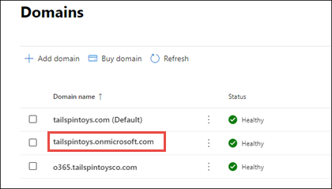
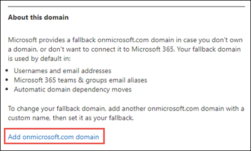
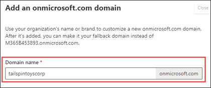

# Add a domain to Microsoft 365

 **[Check the Domains FAQ](domains-faq.yml)** if you don't find what you're looking for.

Check out all of our small business content on [Small business help & learning](https://go.microsoft.com/fwlink/?linkid=2224585).

Check out [Microsoft 365 small business help](https://go.microsoft.com/fwlink/?linkid=2197659) on YouTube.
  
## Before you begin

To add, modify, or remove domains, you **must** be a **Domain Name Administrator** or **Global Administrator** of a [business or enterprise plan](https://products.office.com/business/office). These changes affect the whole tenant; *Customized administrators* or *regular users* won't be able to make these changes.

> [!TIP]
> If you need help with the steps in this topic, consider [working with a Microsoft small business specialist](https://go.microsoft.com/fwlink/?linkid=2186871). With Business Assist, you and your employees get around-the-clock access to small business specialists as you grow your business, from onboarding to everyday use.

## Watch: Add a domain

Check out this video and others on our [YouTube channel](https://go.microsoft.com/fwlink/?linkid=2198213).

> [!VIDEO https://www.microsoft.com/videoplayer/embed/RE4dN8c?autoplay=false]

Your company might need multiple domain names for different purposes. For example, you might want to add a different spelling of your company name because customers are already using it and their communications have failed to reach you.

1. In the Microsoft 365 admin center, choose <a href="https://go.microsoft.com/fwlink/p/?linkid=2171997" target="_blank">**Setup**</a>.
1. Under **Get your custom domain set up**, select **View** > **Manage** > **Add domain**.
1. Enter the new domain name that you want to add, and then select **Next**.
1. Sign in to your domain registrar, and then select **Next**.
1. Choose the services for your new domain.
1. Select **Next** > **Authorize** > **Next**, and then **Finish**. Your new domain has been added.

## Add a domain

Follow these steps to add, set up, or continue setting up a domain. 

::: moniker range="o365-worldwide"

1. Go to the admin center at <a href="https://go.microsoft.com/fwlink/p/?linkid=2024339" target="_blank">https://admin.microsoft.com</a>.

::: moniker-end

::: moniker range="o365-21vianet"

1. Go to the admin center at <a href="https://go.microsoft.com/fwlink/p/?linkid=850627" target="_blank">https://portal.partner.microsoftonline.cn</a>.

::: moniker-end
    
2. Go to the **Settings** > **Domains** page. 

3. Select **Add domain**.
    
4. Enter the name of the domain you want to add, then select **Next**.
    
5. Choose how you want to verify that you own the domain.
    
    1. If your domain registrar uses [Domain Connect](#domain-connect-registrars-integrating-with-microsoft-365), Microsoft [will set up your records automatically](../get-help-with-domains/domain-connect.md) by having you sign in to your registrar and confirm the connection to Microsoft 365. You'll be returned to the admin center and Microsoft will then automatically verify your domain.
    2. You can use a TXT record to verify your domain. Select this and select **Next** to see instructions for how to add this DNS record to your registrar's website. This can take up to 30 minutes to verify after you've added the record. 
    3. You can add a text file to your domain's website. Select and download the .txt file from the setup wizard, then upload the file to your website's top level folder. The path to the file should look similar to: `http://mydomain.com/ms39978200.txt`. We'll confirm you own the domain by finding the file on your website.
    
6. Choose how you want to make the DNS changes required for Microsoft to use your domain.
    
    1. Choose **Add the DNS records for me** if your registrar supports [Domain Connect](#domain-connect-registrars-integrating-with-microsoft-365), and Microsoft [will set up your records automatically](../get-help-with-domains/domain-connect.md) by having you sign in to your registrar and confirm the connection to Microsoft 365.
    2. Choose **I'll add the DNS records myself** if you want to attach only specific Microsoft 365 services to your domain or if you want to skip this for now and do this later. **Choose this option if you know exactly what you're doing.**

7. If you chose to *add DNS records yourself*, select **Next** and you'll see a page with all the records that you need to add to your registrars website to set up your domain. 

    If the portal doesn't recognize your registrar, you can [follow these general instructions.](../get-help-with-domains/create-dns-records-at-any-dns-hosting-provider.md)
    
    If you don't know the DNS hosting provider or domain registrar for your domain, see [Find your domain registrar or DNS hosting provider](../get-help-with-domains/find-your-domain-registrar.md).
    
    If you want to wait for later, either unselect all the services and click **Continue**, or in the previous domain connection step choose **More Options** and select **Skip this for now**.
    
8. Select **Finish** - you're done!

## Add or edit custom DNS records

Follow the steps below to add a custom record for a website or 3rd party service.

1. Sign in to the Microsoft admin center at <a href="https://go.microsoft.com/fwlink/p/?linkid=2024339" target="_blank">https://admin.microsoft.com</a>.

2. Go to the **Settings**  > **Domains** page.

3. On the **Domains** page, select a domain. 
    
4. Under **DNS records**, select **Custom Records**; then select **Add record**.

5. Select the type of DNS record you want to add and type the information for the new record.
    
6. Select **Save**.

## Registrars with Domain Connect

[Domain Connect](https://www.domainconnect.org/) enabled registrars let you add your domain to Microsoft 365 in a three-step process that takes minutes. 
  
In the wizard, we'll just confirm that you own the domain, and then automatically set up your domain's records, so email comes to Microsoft 365 and other Microsoft 365 services, like Teams, work with your domain.
  
> [!NOTE]
> Make sure you disable any popup blockers in your browser before you start the setup wizard.
  
### Domain Connect registrars integrating with Microsoft 365

- [1&amp;1 IONOS](https://www.1and1.com/)
- [EuroDNS](https://www.eurodns.com/)
- [Cloudflare](https://www.cloudflare.com/)
- [GoDaddy](https://www.godaddy.com/)
- [WordPress.com](https://wordpress.com/)
- [Plesk](https://www.plesk.com/)
- [MediaTemple](https://mediatemple.net/)
- SecureServer or WildWestDomains (GoDaddy resellers using SecureServer DNS hosting)
    - Examples:
        - [DomainsPricedRight](https://www.domainspricedright.com/products/domain-registration)
        - [DomainRightNow](https://www.domainrightnow.com/)

### What happens to my email and website?

After you finish setup, the MX record for your domain is updated to point to Microsoft 365 and all email for your domain will start coming to Microsoft 365. Make sure you've added users and set up mailboxes in Microsoft 365 for everyone who gets email on your domain!
  
If you have a website that you use with your business, it will keep working where it is. The Domain Connect setup steps don't affect your website.

### Add an onmicrosoft.com domain

Each Microsoft 365 organization can have up to five onmicrosoft.com domains.

> [!NOTE]
> You must be a Global admin or a Domain Name admin to add a domain.
> Creating an additional .onmicrosoft domain and using it as your default will not do a rename for SharePoint Online. To make changes to your .onmicrosoft SharePoint domain you would need to use the [SharePoint domain rename preview](/sharepoint/change-your-sharepoint-domain-name) (currently available to any tenant with less than 10,000 sites).
> If you're using Microsoft 365 mail services, removal of your initial .onmicrosoft domain is not supported.

To add an onmicrosoft.com domain:

1. In the Microsoft 365 admin center, select **Settings**, and then select **Domains**.

2. Select an existing *.onmicrosoft.com* domain.

    
  

3. On the **Overview** tab, select **Add onmicrosoft.com domain**.

    

4. On the **Add onmicrosoft domain** page, in the **Domain name** box, enter the name for your new onmicrosoft.com domain. 

    

    > [!NOTE]
    > Make sure to verify the spelling and accuracy of the domain name you entered. You are limited to five onmicrosoft.com domains, and currently they cannot be deleted once they are created.     

5. Select **Add domain**. When successfully added, you will see a message stating this. 
    
    

You can set any domain you own as your default domain. 

For more details on how to add an onmicrosoft.com domain, see [Add or replace your onmicrosoft.com domain](add-or-replace-your-onmicrosoftcom-domain.md).

## Related content

[Domains FAQ](domains-faq.yml) (article) 
[What is a domain?](../get-help-with-domains/what-is-a-domain.md) (article) 
[Buy a domain name in Microsoft 365](../get-help-with-domains/buy-a-domain-name.md) (article) 
[Add DNS records to connect your domain](../get-help-with-domains/create-dns-records-at-any-dns-hosting-provider.md) (article) 
[Change nameservers to set up Microsoft 365 with any domain registrar](../get-help-with-domains/change-nameservers-at-any-domain-registrar.md) (article)
