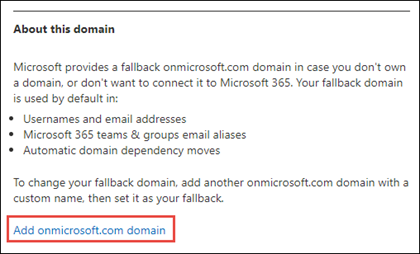
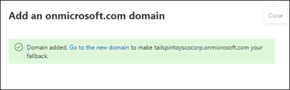
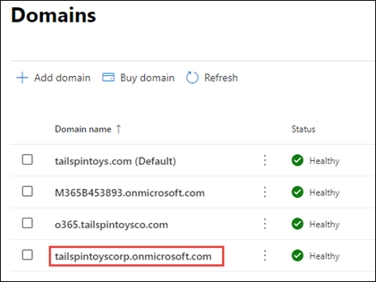
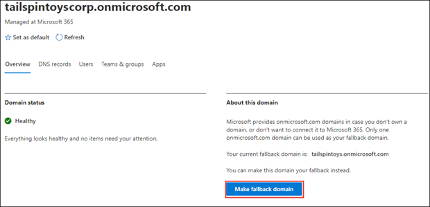
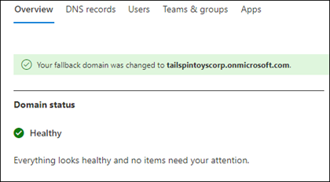

# Add and replace your onmicrosoft.com fallback domain in Microsoft 365

Check out all of our small business content on [Small business help & learning](https://go.microsoft.com/fwlink/?linkid=2224585).

When you sign up for Microsoft 365, Microsoft provides an *onmicrosoft.com* domain - your **fallback domain** - in case you don't own a domain, or don't want to connect it to Microsoft 365 (for example, tailspintoys.onmicrosoft.com). Your fallback domain is used by default in:

- Usernames and email addresses
- Microsoft 365 teams & groups email aliases
- Automatic domain dependency moves

It serves as a default email routing address for your Microsoft 365 environment. When a user is set up with a mailbox, email is routed to the fallback domain.  Even if a custom domain is used (for example, tailspintoys.com), if that custom domain is deleted from your Microsoft 365 environment, the fallback domain ensures that your user's email is successfully routed.

You can change your fallback domain in the Microsoft 365 admin center. Common reasons customers change their fallback domain include:

- Not knowing the company name to use when they first signed up for Microsoft 365. Now that they know the company name, they want their users to have sign in account names that are appropriate. 
- They want to change how their SharePoint URLs look like when they create a new site. SharePoint URLs in your Microsoft 365 environment are created based on your fallback domain name. If you didn't use the correct company name when you first signed up, your SharePoint URLs for your sites continue to use that name when you create new SharePoint sites.

While you can add more onmicrosoft.com domains, only one onmicrosoft.com domain can be used as your fallback domain. The steps in this article describe how to:
- Create a new onmicrosoft.com domain
- Assign it as your fallback domain

> [!NOTE]
> You are limited a total of five onmicrosoft.com domains in your Microsoft 365 environment. Once they are added, they cannot be removed. 
  
## Before you begin

To add, modify, or remove domains, you **must** be a **Domain Name Administrator** of a [business or enterprise plan](https://products.office.com/business/office). These changes affect the whole tenant; *Customized administrators* or *regular users* aren't able to make these changes.

## Add a new onmicrosoft.com domain

1. In the Microsoft 365 admin center, select **Settings**, and then select **Domains**.
2. Select your onmicrosoft.com default domain.

    
  
3. On the domain properties page, in the **About this domain** section, select **Add onmicrosoft domain**.

    

4. In the **Add onmicrosoft domain** page, in the **Domain name** box, type the name for your new onmicrosoft.com domain. 

    

    > [!NOTE]
    > Make sure to verify the spelling and accuracy of the domain name you entered. You are limited to five onmicrosoft.com domains, and currently they cannot be deleted once they are created.     

5. Select **Add domain**. When successfully added, you'll see a message stating this.
    
    

## Make your new onmicrosoft.com domain your fallback domain

> [!NOTE]
> Before changing your fallback domain to a new onmicrosoft.com domain, you may want to consider changing your onmicrosoft.com SharePoint domain. Creating an additional onmicrosoft domain and using it as your fallback domain will not do a rename for SharePoint Online. Your existing SharePoint and OneDrive URLs will remain the same.  You are able to change your.onmicrosoft SharePoint domain through the PowerShell steps provided in [SharePoint domain rename preview](/sharepoint/change-your-sharepoint-domain-name) (currently available to any tenant with less than 10,000 sites).

After you create your new onmicrosoft.com domain, do the following to change it to your fallback domain.

1. In the Microsoft 365 admin center, select **Settings**, and then select **Domains**. 

2. Select the new onmicrosoft.com domain that you created.

     

3. On the domain's property page, select **Make fallback domain**.
 
     

4. A message displays on the page stating that your fallback domain has changed to the new domain.

     

## Related content

[Domains FAQ](domains-faq.yml) (article) 
[What is a domain?](../get-help-with-domains/what-is-a-domain.md) (article) 
[Buy a domain name in Microsoft 365](../get-help-with-domains/buy-a-domain-name.md) (article) 
[Add DNS records to connect your domain](../get-help-with-domains/create-dns-records-at-any-dns-hosting-provider.md) (article) 
[Change nameservers to set up Microsoft 365 with any domain registrar](../get-help-with-domains/change-nameservers-at-any-domain-registrar.md) (article)
