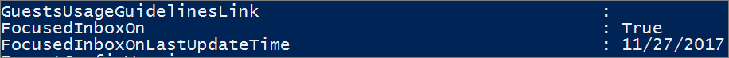
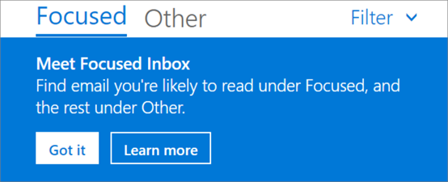
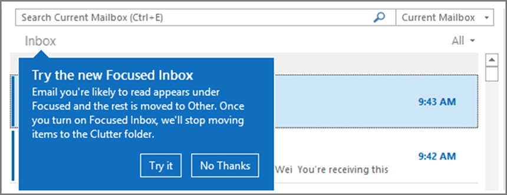

# Configure Focused Inbox for everyone in your organization

If you're responsible for configuring how email works for EVERYONE in a business this article is for you! It explains how to customize it or turn it off for your business, and answers [frequently asked questions](#faq-for-focused-inbox).

If you would like to turn off Focused Inbox for just yourself, please see [Turn off Focused Inbox](https://support.microsoft.com/office/f714d94d-9e63-4217-9ccb-6cb2986aa1b2).  

If you want to be sure that your users receive business-specific email messages, for example, from HR or payroll, you can configure Focused Inbox so these messages reach the Focused view. You can also control whether users in your organization see the Focused Inbox in their mailbox.
  
## Turn Focused Inbox On or Off in your organization

You use PowerShell to turn Focused Inbox on or off for everyone in your organization. Do you want to do this in the Microsoft 365 admin center? Let our Engineering team know. **[Vote here!](https://go.microsoft.com/fwlink/?linkid=862489)**
  
**To turn off Focused Inbox:**
  
The following PowerShell example turns Focused Inbox **Off** in your organization. However, it doesn't block the availability of the feature for your users. If they want, they can still re-enable Focused Inbox again on each of their clients. 
  
1. [Connect to Exchange Online PowerShell](/powershell/exchange/connect-to-exchange-online-powershell).

2. You need to be assigned permissions before you can perform this procedure or procedures. To see what permissions you need, see the "Transport rules" entry in [Messaging policy and compliance permissions](/exchange/messaging-policy-and-compliance-permissions-exchange-2013-help).

3. Run the **Get-OrganizationConfig** cmdlet. 

    ```powershell
    Get-OrganizationConfig
    ```

4. Look for **FocusedInboxOn** to view its current setting: 

    
  
5. Run the following cmdlet to turn Focused Inbox off.

    ```powershell
    Set-OrganizationConfig -FocusedInboxOn $false
    ```

6. Run the **Get-OrganizationConfig** cmdlet again and you'll see that FocusedInboxOn is set to $false, which means it's been turned off. 

**To turn on Focused Inbox:**
  
- In Step 5 above, run the following cmdlet to turn Focused Inbox on.

  ```powershell
  Set-OrganizationConfig -FocusedInboxOn $true
  ```
    
## What do users see after I turn on Focused Inbox?

Your users will see the Focused view only after they close and restart Outlook. When they restart Outlook, they'll see a Tip in the Outlook user interface giving them to the option to use the new Focused Inbox.
  

  
If you're switching from Clutter to Focused Inbox, they can decide to enable it ("Try it") or dismiss the feature. If the user has multiple (supported) clients, they can enable/disable Focused Inbox individually on each one. The tip looks like this:
  

  
When a user decides to start using Focused Inbox, Clutter gets disabled automatically. The Clutter folder gets converted into a standard folder, that allows the user to rename or delete it.
  
## Turn Focused Inbox On or Off for specific users

This example turns Focused Inbox **Off** for Tim Matthews in the Contoso organization. However, it doesn't block the availability of the feature to him. If he wants, he can still re-enable Focused Inbox again on each of his clients. 
  
1. [Connect to Exchange Online PowerShell](/powershell/exchange/connect-to-exchange-online-powershell).

2. You need to be assigned permissions before you can perform this procedure or procedures. To see what permissions you need, see the "Transport rules" entry in the Messaging policy and compliance permissions topic.

3. Run the **Get-FocusedInbox** cmdlet, for example: 

    ```powershell
    Get-FocusedInbox -Identity <tim@contoso.com>
    ```

4. Look for FocusedInboxOn to view its current setting:

    
  
5. Run the following cmdlet to turn off Focused Inbox:

    ```powershell
    Set-FocusedInbox -Identity <tim@contoso.com> -FocusedInboxOn $false
    ```

    OR, run the following cmdlet to turn it on:

    ```powershell
    Set-FocusedInbox -Identity <tim@contoso.com> -FocusedInboxOn $true
    ```

## Use the UI to create a transport rule to direct email messages to the Focused view for all your users

1. Go to the <a href="https://go.microsoft.com/fwlink/p/?linkid=2059104" target="_blank">Exchange admin center</a>.

2. Navigate to **mail flow** \> **Rules**. Select  and then select **Create a new rule...**. 

3. After you're done creating the new rule, select **Save** to start the rule.

    The following image shows an example where all messages From "Payroll Department" are to be delivered to the Focused Inbox.

    

    > [!NOTE]
    > The message header value text in this example is, **X-MS-Exchange-Organization-BypassFocusedInbox**.
  
## Use PowerShell to create a transport rule to direct email messages to the Focused view for all your users

1. [Connect to Exchange Online PowerShell](/powershell/exchange/connect-to-exchange-online-powershell).

2. You need to be assigned permissions before you can perform this procedure or procedures. To see what permissions you need, see the "Transport rules" entry in [Messaging policy and compliance permissions](/exchange/messaging-policy-and-compliance-permissions-exchange-2013-help).

3. Run the following command to allow all messages from "Payroll Department," for example, to be delivered to the Focused Inbox.

    ```powershell
    New-TransportRule -Name <name_of_the_rule> -From "Payroll Department" -SetHeaderName "X-MS-Exchange-Organization-BypassFocusedInbox" -SetHeaderValue "true"
    ```

> [!IMPORTANT]
> In this example, both "X-MS-Exchange-Organization-BypassFocusedInbox" and "true" are case sensitive.
> Also, Focused Inbox will honor the X-header that bypasses Clutter, so if you use this setting in Clutter, it will be used in Focused Inbox. 
> For detailed syntax and parameter information, see [New-TransportRule](/powershell/module/exchange/new-transportrule).

### How do you know this worked?

You can check email message headers to see if the email messages are landing in the Inbox due to the Focused Inbox transport rule bypass. Pick an email message from a mailbox in your organization that has the Focused Inbox transport rule applied. Look at the headers stamped on the message, and you should see the **X-MS-Exchange-Organization-BypassFocusedInbox: true** header. This means the bypass is working. Check out the [View the Internet header information for an email message](https://go.microsoft.com/fwlink/p/?LinkId=822530) article for info on how to find the header information.

### What will the user see?

If a transport rule is in place, a notification will be shown for the override. Outlook on the web will disable the "Always move to Other" and show a tooltip. Outlook clients on desktop will allow selection for "Always move to Other" and will pop up a dialog.

## Turn on/off Clutter

We've received reports that Clutter suddenly stopped working for some users. If this happens, you can enable it again for specific users. See [Configure Clutter for your organization](../email/configure-clutter.md).

## FAQ for Focused Inbox

Here are answers to Frequently Asked Questions about Focused Inbox.

### Can I control how I roll out Focused Inbox in my organization?

Yes. You can turn Focused Inbox on or off for your entire organization, or you can turn it on or off for specified users. See above.
  
### Is the Focused Inbox feature ONLY available for Office 2016 clients?

Yes, only users with Office 2016 are affected. The feature is not going to be backported to Outlook 2013 or earlier.
  
### How long does it take for Focused Inbox changes to take place in Outlook?

Once you turn on or turn off Focused Inbox, the settings will take effect once your users close and restart Outlook.
  
### What happens to Clutter once I turn on Focused Inbox?

After switching, you'll no longer receive less actionable email in the Clutter folder. Instead, email will be split between the Focused and Other tabs in your inbox. The same algorithm that moved items to the Clutter folder now powers Focused Inbox, meaning that any emails that were set to move to Clutter will now be moved to Other. Any messages already in your Clutter folder will remain there until you decide to delete or move them.
  
Check out this post by [Tony Redmond](https://www.petri.com/author/tony-redmond), Microsoft MVP: [How the Focused Inbox Replaces Clutter Inside Office 365](https://www.petri.com/focused-inbox-office-365).
  
### Can I keep users on Clutter? What is Microsoft's recommendation when it comes to using Clutter vs Focused Inbox?

Yes, you can keep users on Clutter and disable Focused Inbox, however, eventually Clutter will be fully replaced with Focused Inbox so Microsoft's recommends moving to Focused Inbox now. To learn more about when you use Clutter with Exchange Online, see this blog post: [Update on Focused Inbox and our plans for Clutter](https://techcommunity.microsoft.com/t5/Outlook-Blog/Update-on-Focused-Inbox-and-our-plans-for-Clutter/ba-p/136448).
  
### Should I disable Clutter for my end users if we are going to move everyone to Focused Inbox?

No. It's possible to disable Clutter for a mailbox explicitly by running the Set-Clutter cmdlet. However, if you do this, the mailbox owner will see messages that were previously redirected to the Clutter folder remain in the Inbox and they'll have to process those messages until their client is upgraded to a version that supports the Focused Inbox. It's therefore best not to disable Clutter until the upgraded clients are available.
  
### Why are there two different cmdlets for managing Focused Inbox?

There are two states associated with Focused Inbox.
  
- **Organization Level**: Focused Inbox state, and an associated last update time-stamp.

- **Mailbox Level**: Focused Inbox state, and an associated last update time-stamp 

### How does Outlook decide to show the Focused Inbox experience with these two states?

Outlook decides to show the experience by choosing which cmdlet has the latest time stamp. By default, both time stamps are "null" and in this case, the feature is enabled.
  
### Why does the Get-FocusedInbox cmdlet return "true", when I've turned Focused Inbox off in my organization?

There are two cmdlets for controlling Focused Inbox. When you run Get-FocusedInbox for a mailbox, it returns the mailbox level state of the feature. The experience in Outlook is chosen based on which cmdlet state was last modified.
  
### Can I run a script to see who has turned on Focused Inbox?

No, and this is by design. Focused Inbox enablement is a client-side setting, so all the cmdlet can do is tell you if the user's mailbox is eligible for the client experience. It is possible for it to be simultaneously enabled in some clients and disabled in others, for example, enabled in Outlook app and Outlook Mobile but disabled in Outlook on the web.

## Related content

[Configure Clutter for your organization](../email/configure-clutter.md) (article)\
[Configure shared mailbox settings](../email/configure-a-shared-mailbox.md) (article)\
[Create signatures and disclaimers](create-signatures-and-disclaimers.md) (video)
