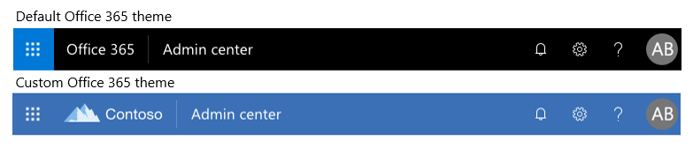

# Customize the Office 365 theme for your organization

Learn how to customize your theme in the Microsoft 365 admin center. As the admin of your Office 365 for business subscription, you can change the default theme that appears in the top navigation bar for everyone in the organization. You can add your company logo and change the colors to match the rest of your brand. You can even add a destination link for users to navigate to when they select your logo. You can see here the default theme and custom theme result in Office 365.
  

  
## Customize your theme in the admin center

1. In the admin center, go to the **Settings** \> **Settings**, and then choose the **Organization profile** tab.

2. On the **Organization profile** tab, choose **Custom themes**.

3. On the **Customs themes** panel, change the theme elements you want for your organization:
    
  - **Use a custom logo image**: Choose whether to use an image from a URL or to upload an image. If you use a URL, please ensure that the URL uses HTTPS and is 200 x 30 pixels of any format of any size. You may upload a logo under 10 KB that is 200 x 30 pixels in JPG, PNG, GIF, or SVG format.

    > [!NOTE]
    > For the logo to appear in the SharePoint mobile app, use only SVG images. Images uploaded in any other format don’t display in the app. Logos are not clickable in the SharePoint Mobile app.
    
  - **Make logo clickable**: You may use your logo in the navigation bar as a link to any company resource. You may enter the URL for the logo here, starting with http:// or https://. This is optional.
    
  - **Select background image**: Select the image and upload your own JPG, PNG, or GIF with a resolution of 1366 x 50 pixels, no larger than 15 KB. The background image appears in the top navigation bar on every page.
    
    > [!NOTE]
    > Images that contain text may not display as expected. Built-in elements that appear on the right and left sides of the navigation bar can vary across services, and your text may be obscured by those elements. Due to the dynamic nature of the navigation bar, at this time we are unable to provide guidance for image padding that would result in a consistent experience. 
    
  - **Navigation bar color**: Select a color to use for the background of the navigation bar. The appears at the top on every page.
    
  - **Text and icons**: Select a color to use for the text and icons on the top navigation bar.
    
  - **Accent color**: Select a color to use for the navigation bar button hover color and page accents like buttons and text on certain applications.

   - **Prevent users from overriding theme**: Flip this toggle to prevent users from choosing their own theme from our theme selection. This does not prevent users from being able to set a high contrast theme.
      
  - **Show the user name**: Choose whether to show a user's full name at the entry point to the account manager in the top right of the page when the user is signed in. By default, users will see their photo or their initials if a photo hasn't been uploaded.
    
4. Select **Save changes**.
    
You'll see your new theme on the admin center right away and after a short delay, you'll see it throughout Office 365, including Outlook and SharePoint pages. You can remove your custom icon or custom colors at any time. Just return to the theme page and select **Remove custom theming**.
  
## Best Practices

When choosing a **Logo image**, we recommend using an SVG file type, wherever possible, so that your logo will have a high resolution appearance on all screens and at all zoom levels.

When choosing custom colors, choose a **Nav bar background color** that has a high contrast ratio with the **Logo image** that you picked. Also choose a **Text and icons** color with a high contrast ratio to the **Nav bar background color** to ensure that all text and icons are easily visible.

When choosing custom colors, pick an **Accent color** that shows up well on a white or light background. The **Accent color** is used to color some links and buttons that show up on a white or light background. For example, the **Accent color** is used to color elements in a user's inbox and on their Office.com portal page. 
  
The recommended contrast ratio between text, icon, or button color and background color is 4.5:1.

Here is a simple flow chart to help you quickly get set up with a visually appealing custom Office 365 theme for your organization:
  - I would like to use a colorful version of our logo.
    - We recommend the following settings:
      - **Logo image**: Your organization's colorful logo.
      - **Navigation bar color**: A neutral color. We recommend #FAF9F7 for a light color and #252423 for a dark color.
      - **Text and icon color**: A color to contrast the **Navigation bar color**. We recommend #FAF9F7 for a light color and #252423 for a dark color.
      - **Accent color**: A dark brand color. With certain applications, this color must be visible on a light background.
  - I would like to use a neutral version of our logo and represent color in the navigation bar.
    - We recommend the following settings:
      - **Logo image**: Your organization's neutral logo.
      - **Navigation bar color**: A brand color that contrasts against your logo.
      - **Text and icon color**: Choose a color that contrasts against the brand color you chose for the **Navigation bar color**. We recommend #252423 for a dark color and #FAF9F7 for a light color.
      - **Accent color**: A dark brand color. With certain applications, this color must be visible on a light background.
  
## Related articles

[Add custom tiles to the My apps page and app launcher](../manage/customize-the-app-launcher.md)
  
  

