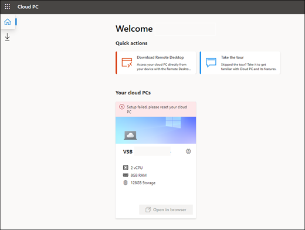
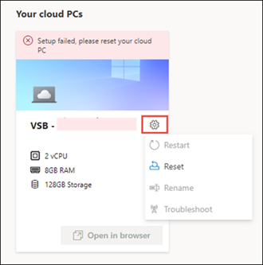
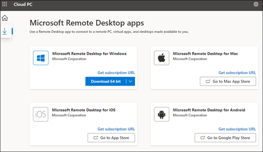

# Get started with Windows 365 Business and Cloud PCs

This article is for people who plan to buy and set up Windows 365 Business for their organization. 
  
[Windows 365 Business](https://www.microsoft.com/windows-365/business) is a version of Windows 365 that is made specifically for use in smaller companies (up to 300 seats). It gives organizations an easy, streamlined way of providing Cloud PCs to their users.  With Windows 365 Cloud PCs, you can stream your apps, data, content, settings, and storage from the Microsoft cloud. 

## Prerequisites
There are no perquisites to set up Windows 365 Business.

## Buy subscriptions

You can buy Windows 365 Business subscriptions for your users through two ways:
- The [Windows 365 products site](https://www.microsoft.com/windows-365/business/compare-plans-pricing)
- Microsoft 365 admin center

After you buy a subscription, you can use the Microsoft 365 admin center to assign licenses to users in your organization. 

### Buy subscriptions through the Windows 365 products site

If you don't already have Microsoft 365 subscription, you can buy your Windows 365 Business subscriptions on the [Windows 365 products site](https://www.microsoft.com/windows-365/business/compare-plans-pricing). Use the following steps to buy a Windows 365 Business subscription through the Windows 365 products page.   

1. On the Windows 365 Business page, select **See plans and pricing**. 
2. On the next page, select the subscription you want to purchase, and then select **Buy now**.
3. On the **Thank you for choosing Windows 365 Business** page, follow the steps to set up your account.
4. In **step 5 - Confirmation details**, if you are ready to assign licenses to users, select **Get started** to go to your Cloud PC home page at windows365.microsoft.com.
5. On the Cloud PC home page, in the **Quick actions** section, select **Manage your organization**. This takes you to the Microsoft 365 admin center where you can [assign licenses to users](/microsoft-365/business-video/set-up-cloud-pc-for-business#Assign-licenses-to-users).

### Buy a subscription through the Microsoft admin center

If you already have a Microsoft 365 tenant and are a Global or Billing admin, you can use the Microsoft 365 admin center to buy a Windows 365 Business subscription for your organization.

1. In the Microsoft admin center, go to the **Billing > Purchase services** page.
2. On the **Purchase services** page, search for **Windows 365 Business**. When you find it, select **Details**.
3. On the **Windows 365 Business** page, in the **Processor/Ram/Storage Options** section, use the **Select a subscription** menu to select a subscription for your users based on their CPU, RAM, and storage needs. See [Windows 365 Business sizing options](windows-365-business-sizing.md) for guidance on selecting the subscription that best fits your users needs.
4. On the **Checkout** page, enter the number of subscriptions you want to buy, as well and your payment information. Then select **Place Order**.
5. The **You're all set!** page will appear confirming your purchase.

## Assign licenses to users 

Whether you purchased your subscriptions through the Windows 365 products site, or through the Microsoft 365 admin center, you can [assign licenses to users](/microsoft-365/admin/manage/assign-licenses-to-users) through the **Billing** page in the Microsoft 365 admin center.

You can assign different Windows 365 Business license types to a user, based on the users business need. See [Windows 365 Business sizing options](windows-365-business-sizing.md)  for guidance on which license type might be suitable for your users. 

## Get your users started with Cloud PC

After licenses are assigned, let your users know that they can access their Cloud PCs in two different ways:

- Via the Cloud PC home page (windows365.microsoft.com)
- By using a Microsoft Remote Desktop client

### Cloud PC home page

Users can navigate to **windows365.microsoft.com** to access their Cloud PCs.  

On their Cloud PC home page, users will see the Cloud PCs they have access to in the **Your cloud PCs** section. 

Users can select **Open in browser** to open their Cloud PC.

> [!NOTE]  
> Mobile devices aren’t currently supported.

#### User actions

While on the Cloud PC home page, users can perform actions on their Cloud PCs by selecting the gear icon on a Cloud PC card.

     

- **Restart**: Restarts the Cloud PC.
- **Rename**: Changes the name of the Cloud PC shown to the user on Microsoft 365.com. 
- **Reset**:  Reset does the following:
    - Reinstalls Windows 10.
    - Removes your personal files.
    - Removes any changes you made to settings.
    - Removes your apps.
    > [Important]  
    > Before resetting your Cloud PC, make sure to back up any important files you need to keep to a cloud storage service or external storage. Resetting your Cloud PC will delete these files. 
- **Troubleshoot**: Troubleshoot and attempt to fix any issues that may be keeping a user from connecting to their Cloud PC. The following table describes the return states that can result from the checks.

   

|**Return state**|**Description**|
|:-----|:-----|
|No issues detected    |None of the checks ran discovered an issue with the Cloud PC.    |
|Issues resolved    |An issue was detected and fixed.    |
|Can’t connect to Cloud PC. We’re working to fix it, try again later.    |A Microsoft service required for connectivity is unavailable. Try connecting again later.     |
|We couldn’t fix issues with your Cloud PC. Contact your administrator.   |An issue was detected but it was unable to be fixed. This could be due to a ongoing Windows update or another issue. If this error persists for an extended period of time the Cloud PC may need to be reset.    |

 

### Remote Desktop

The Microsoft Remote Desktop app lets users access and control a remote PC, including a Cloud PC. Windows 365 users can download and install the Remote Desktop client they need from the Cloud PC home page. 

#### Install the Microsoft Remote Desktop app

To set up their Remote Desktop client, users follow these steps:

1. On the Cloud PC home page, select the Microsoft Remote Desktop apps icon (under the home icon). 
2. On the Microsoft Remote Desktop apps page, download and install the Remote Desktop app you need. 

      

For a list of clients by operating system, see [Remote Desktop clients](/windows-server/remote/remote-desktop-services/clients/remote-desktop-clients). 

## Installing apps

Users can install apps on their Cloud PC as they would normally in Windows by either downloading them from the application’s website or by downloading them from the Microsoft Store.

All Windows 365 Business users have local administrator privileges on their Cloud PC, so they should have the permissions required to install apps to their workspaces.

 ## Management through Intune

Windows 365 Business does not enroll Cloud PCs to [Intune](/mem/intune/fundamentals/what-is-intune) as part of the provisioning process. If the tenant and users are properly licensed, Cloud PCs can be enrolled to Intune using the same procedure for [enrolling Windows 10 machines to Intune](/mem/intune/user-help/enroll-windows-10-device).

## How to get help

If you need to get help while setting up Windows 365 Business in the Microsoft 365 admin center, see [Get help or support](/microsoft-365/business-video/get-help-support).

## Related content

## Related content

[Windows 365 Business](https://www.microsoft.com/windows-365/business) (link page)\
[Windows 365 Business sizing options](windows-365-business-sizing.md) (link page)\
[Windows 365 Business plan comparison](https://www.microsoft.com/windows-365/business/compare-plans-pricing) (link page)\
