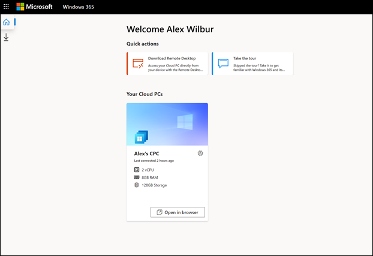

# Get started with Windows 365 Business and Cloud PCs

This article is for people who plan to buy and set up Windows 365 Business for their organization.
  
[Windows 365 Business](https://www.microsoft.com/windows-365/business) is a version of Windows 365 that is made specifically for use in smaller companies (up to 300 seats). It gives organizations an easy, streamlined way of providing Cloud PCs to their users.  With Windows 365 Cloud PCs, you can stream your apps, data, content, settings, and storage from the Microsoft cloud.

> [!NOTE]  
> Before starting, make sure that your [Azure AD device settings](/azure/active-directory/devices/device-management-azure-portal#configure-device-settings) for **Users may join devices to Azure AD** are set to **All**.

   
## Prerequisites
There are no licensing prerequisites to set up Windows 365 Business.

For the best onboarding experience, please refer to the [setup troubleshooting guide](troubleshoot-windows-365-business.md) to make sure your environment preferences are optimized for Windows 365 Business. 

## Buy subscriptions

There are two different ways in which you can buy Windows 365 Business subscriptions for your users:

- The [Windows 365 products site](https://www.microsoft.com/windows-365/business/compare-plans-pricing)
- Microsoft 365 admin center

After you buy a subscription, you can use the Microsoft 365 admin center to assign licenses to users in your organization.

### Buy subscriptions through the Windows 365 products site

If you don't already have a Microsoft 365 subscription, you can buy your Windows 365 Business subscriptions on the [Windows 365 products site](https://www.microsoft.com/windows-365/business/compare-plans-pricing). Use the following steps to buy a Windows 365 Business subscription through the Windows 365 products page.

1. On the [Windows 365 Business](https://www.microsoft.com/windows-365/business) page, select **See plans and pricing**.
2. On the next page, select the subscription you want to purchase, and then select **Buy now**.
3. On the **Thank you for choosing Windows 365 Business** page, follow the steps to set up your account.
4. In **step 5 - Confirmation details**, if you are ready to assign licenses to users, select **Get started** to go to your Windows 365 home page at https://windows365.microsoft.com.
5. On the Windows 365 home page, in the **Quick actions** section, select **Manage your organization**. This takes you to the Microsoft 365 admin center where you can assign licenses to users.

Users without the Global or Billing admin roles can use self-service purchase to buy a subscription for Windows 365 Business directly from the [Windows 365 Business products site](https://www.microsoft.com/windows-365/business?rtc=1). A user who buys a subscription this way is granted a limited view of the [Microsoft 365 admin center](https://go.microsoft.com/fwlink/p/?linkid=2024339), where they can assign licenses for that subscription to other users in their organization. Assigning a license to another user automatically creates a Windows 365 Business Cloud PC for them, which can be accessed from the [Windows 365 home page](https://windows365.microsoft.com/).

> [!NOTE]
> Self-service purchase isn’t available in India or for government or education customers.

To learn more about self-service purchase, see the [Self-service purchase FAQ](../../commerce/subscriptions/self-service-purchase-faq.yml).

### Buy a subscription through the Microsoft admin center

If you already have a Microsoft 365 tenant and are a Global or Billing admin, you can use the Microsoft 365 admin center to buy a Windows 365 Business subscription for your organization.

1. In the Microsoft admin center, go to the **Billing > Purchase services** page.
2. On the **Purchase services** page, search for **Windows 365 Business**. When you find it, select **Details**.
3. On the **Windows 365 Business** page, in the **Processor/Ram/Storage Options** section, use the **Select a subscription** menu to select a subscription for your users based on their CPU, RAM, and storage needs. See [Windows 365 Business sizing options](windows-365-business-sizing.md) for guidance on selecting the subscription that best fits your users' needs.
4. On the **Checkout** page, enter the number of subscriptions you want to buy, as well and your payment information. Then select **Place Order**.
5. The **You're all set!** page appears confirming your purchase.

## Assign licenses to users

Whether you purchased your subscriptions through the Windows 365 products site, or through the Microsoft 365 admin center, you can [assign licenses to users](/microsoft-365/admin/manage/assign-licenses-to-users) through the **Billing** page in the Microsoft 365 admin center.

You can assign different Windows 365 Business license types to a user, based on the users business need. See [Windows 365 Business sizing options](windows-365-business-sizing.md)  for guidance on which license type might be suitable for your users.

> [!IMPORTANT]
> The first time a Windows 365 license is assigned on your tenant, a system account called **Windows 365 BPRT Permanent User** is automatically created in Azure Active Directory. Do not delete this account or make any changes to it (such as changing the name or UPN). If the system account is deleted, the setup might fail. This system account ensures a smooth set up process, and doesn't have any write capabilities or access to your tenant beyond the scoped service capabilities of Windows 365 Business. If you delete this user, follow these [troubleshooting steps](/microsoft-365/admin/setup/troubleshoot-windows-365-business?#step-2-verify-that-the-windows-365-bprt-permanent-user-system-account-is-active).

## Get your users started with Cloud PC

After licenses are assigned, let your users know that there are two different ways in which they can access their Cloud PCs:

- Via the Windows 365 home page (https://windows365.microsoft.com)
- By using a Microsoft Remote Desktop client

### Windows 365 home page

Users can navigate to **https://windows365.microsoft.com** to access their Cloud PCs.  

On their Windows 365 home page, users see the Cloud PCs they have access to in the **Your Cloud PCs** section.

Users can select **Open in browser** to open their Cloud PC.

> [!NOTE]  
> Mobile devices aren’t currently supported.

#### User actions

While on the Windows 365 home page, users can perform actions on their Cloud PCs by selecting the gear icon on a Cloud PC card.

- **Restart**: Restarts the Cloud PC.

- **Reset**:  Reset does the following:

    - Reinstalls Windows 10.
    - Removes your personal files.
    - Removes any changes you made to settings.
    - Removes your apps.

    > [!IMPORTANT]  
    > Before resetting your Cloud PC, make sure to back up any important files you need to keep to a cloud storage service or external storage. Resetting your Cloud PC will delete these files.

- **Rename**: Changes the name of the Cloud PC shown to the user on the Windows 365 home page.

- **Troubleshoot**: Troubleshoot and attempt to fix any issues that may be keeping a user from connecting to their Cloud PC. The following table describes the statuses that can result from the checks.

    | Status | Description |
    |:-----|:-----|
    |No issues detected |None of the checks ran discovered an issue with the Cloud PC. |
    |Issues resolved |An issue was detected and fixed. |
    |Can’t connect to Cloud PC. We’re working to fix it, try again later. |A Microsoft service required for connectivity is unavailable. Try connecting again later. |
    |We couldn’t fix issues with your Cloud PC. Contact your administrator. |An issue was detected but it was unable to be fixed. This could be due to an ongoing Windows update or another issue. If this error persists for an extended period of time the Cloud PC may need to be reset. |

### Remote Desktop

The Microsoft Remote Desktop app lets users access and control a remote PC, including a Cloud PC. Windows 365 users can download and install the Remote Desktop client they need from the Windows 365 home page.

#### Install the Microsoft Remote Desktop app

To set up their Remote Desktop client, users follow these steps:

1. On the **Windows 365 home page**, select the **Microsoft Remote Desktop apps** icon (under the home icon).
2. On the **Microsoft Remote Desktop apps** page, download and install the Remote Desktop app you need.

   

For a list of clients by operating system, see [Remote Desktop clients](/windows-server/remote/remote-desktop-services/clients/remote-desktop-clients).

## Installing apps

Users can install apps on their Cloud PC as they would normally in Windows by either downloading them from the application’s website or by downloading them from the Microsoft Store.

All Windows 365 Business users have local administrator privileges on their Cloud PC, so they should have the permissions required to install apps to their workspaces.

> [!IMPORTANT]
> If a user tries to use a Microsoft 365 Business Standard license on their Cloud PC, they might see the following error: "Account Issue: The products we found in your account cannot be used to activate Office in shared computer scenarios." In this scenario, the user must uninstall the version of Office installed on their Cloud PC and install a new copy from Office.com.

## Management through Intune

If the organization and users are properly licensed, Cloud PCs can be enrolled to Intune using the same procedure for [enrolling Windows 10 machines to Intune](/mem/intune/user-help/enroll-windows-10-device).

## Sending outbound email messages using port 25 is not supported

Sending outbound email messages directly on port 25 from a Windows 365 Business Cloud PC is not supported. Communication over port TCP/25 is blocked at the Windows 365 Business network layer for security reasons. If your email service uses Simple Mail Transfer Protocol (SMTP) for your email client application, you can use their web interface, if available. Or you can ask your email service provider for help to configure their email client app to use secure SMTP over Transport Layer Security (TLS), which uses a different port.

## How to get help

If you need to get help while setting up Windows 365 Business in the Microsoft 365 admin center, see [Get help or support](/microsoft-365/business-video/get-help-support).

## Related content

[Windows 365 Business](https://www.microsoft.com/windows-365/business)  
[Windows 365 Business sizing options](windows-365-business-sizing.md)  
[Windows 365 Business plan comparison](https://www.microsoft.com/windows-365/business/compare-plans-pricing)  
[Remote Desktop client app comparison](/windows-server/remote/remote-desktop-services/clients/remote-desktop-app-compare) 
[Set up Microsoft Teams in your small business](/microsoftteams/deploy-small-business)
