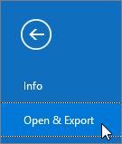
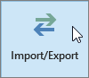
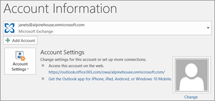

# Migrate email and contacts to Microsoft 365

Check out all of our small business content on [Small business help & learning](https://go.microsoft.com/fwlink/?linkid=2224585).

Check out [Microsoft 365 small business help](https://go.microsoft.com/fwlink/?linkid=2197659) on YouTube.

Import or migrate email from Gmail or another email provider to Microsoft 365.
  
 **Want help with this?**  [Contact Microsoft 365 for business support](../../business-video/get-help-support.md). 

> [!TIP]
> If you need help with the steps in this topic, consider [working with a Microsoft small business specialist](https://go.microsoft.com/fwlink/?linkid=2186871). With Business Assist, you and your employees get around-the-clock access to small business specialists as you grow your business, from onboarding to everyday use.
  
You need to use a version of Outlook that is installed on your desktop for this task. Outlook is included in most Microsoft 365 [plans](https://go.microsoft.com/fwlink/p/?LinkId=723731).
  
## Watch: Import and redirect email

Check out this video and others on our [YouTube channel](https://go.microsoft.com/fwlink/?linkid=2197916).

> [!VIDEO https://www.microsoft.com/videoplayer/embed/40f7df36-9e24-44e5-8791-e9ed0dd8fd21?autoplay=false]

After signing up for Microsoft 365, you might still have email going to an old account; for example, if you used a Gmail or Outlook account for work. You can continue to use both the new and old accounts, or you can import the data from the old account into your new one.

## Migrate Gmail to Microsoft 365

Follow these steps to import or migrate email, contacts, and calendar from Gmail into Outlook with Microsoft 365:
  
- [Import Gmail to Outlook](https://support.microsoft.com/office/20fdb8f2-fed8-4b14-baf0-bf04b9c44bf7)
    
- [Import contacts to Outlook](https://support.microsoft.com/office/bb796340-b58a-46c1-90c7-b549b8f3c5f8)
    
- [Import Google Calendar](https://support.microsoft.com/office/098ed60c-936b-41fb-83d6-7e3786437330)

## Watch: Import calendars
    
> [!VIDEO https://www.microsoft.com/videoplayer/embed/c1e45708-9a92-475b-910b-f5aa40614d92?autoplay=false]
  
## Import Outlook pst files to Microsoft 365 (desktop)

Follow these steps to export email, contacts and calendars from Outlook to a .pst file, and then import that file to Outlook with Microsoft 365:
  
1. [Export email, contacts, and calendar](https://support.microsoft.com/office/14252b52-3075-4e9b-be4e-ff9ef1068f91)
    
2. [Import mail, contacts, and calendar](https://support.microsoft.com/office/431a8e9a-f99f-4d5f-ae48-ded54b3440ac)
    
If you just want contacts, follow these steps:
  
1. [Export contacts from Outlook](https://support.microsoft.com/office/10f09abd-643c-4495-bb80-543714eca73f)
    
2. [Import contacts to Outlook](https://support.microsoft.com/office/bb796340-b58a-46c1-90c7-b549b8f3c5f8)
    
To start the process, open Outlook and choose **File** \> **Open &amp; Export** \> **Import/Export**.
  

  
## See other email accounts in Outlook

Just want to see your email from another provider (like Gmail, Yahoo, or Live.com) in Outlook? No need to import or migrate. You can set up Outlook or Outlook Web App so you can access your other accounts from the same place as your Microsoft 365 mailbox and send, receive, and read email sent to those accounts.
  
### Outlook (desktop)

Add an account, such as your private Gmail account, to Outlook.
  
- Open Outlook, then go to **File** \> **Add account**.

Need more detailed steps? See [Add an account](https://support.microsoft.com/office/6e27792a-9267-4aa4-8bb6-c84ef146101b).
  

  
## Multiple mailboxes: Admins can bulk import email, contacts, and calendars to Microsoft 365

Depending on your source email system, you can choose from several bulk migration methods. Read [Ways to migrate multiple email accounts to Microsoft 365](/Exchange/mailbox-migration/mailbox-migration) to decide which method works for you.

## Related content

[Plan your setup of Microsoft 365 for business](plan-your-setup.md) (article)\
[Install Microsoft 365 apps](install-applications.md) (link page)\
[Overview of the Microsoft 365 admin center](../admin-overview/admin-center-overview.md) (video)
