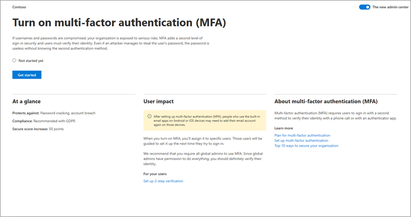

# Difference between the setup wizard and the Setup page

Microsoft 365 provides two setup experiences: 

- Initial setup using the setup wizard
- Ongoing and advanced setup using the **Setup** page

The setup wizard provides a guided walkthrough for setting up the basic Microsoft 365 configuration. After you complete the initial setup, you can go to the **Setup** page to finish setting up and configuring the services that come with your subscriptions.

## Use the setup wizard to complete initial setup tasks

To set up your account, go to the [admin center](https://go.microsoft.com/fwlink/p/?linkid=2024339), select **Setup** in the left navigation pane, and then select **Guided setup** on the **Setup** page.

The setup wizard guides you through the following steps:

1. Install the Microsoft 365 apps on your computer.

2. Choose and verify your domain, such as contoso.com.

3. Add new users and assign licenses to them so that they can download and install Microsoft 365 apps.

4. Connect your domain.

## Use the Setup page to complete and manage your configuration

To access the **Setup** page in the [admin center](https://go.microsoft.com/fwlink/p/?linkid=2024339), select **Setup** in the navigation pane. Based on products you've purchased, features you've set up, and your admin role, tasks and related information from across Microsoft 365 are surfaced here.

You'll see the complete list of setup tasks arranged in logical categories, including those that you completed in the setup wizard.

Choose **View** for any task to get at-a-glance information, such as task description, user impact, prerequisites, effort to implement, and security and adoption statistics to help you understand consequences and impact before proceeding.

You'll also see the status of the task (**Started**, **Not started yet**, or **Completed**). If you're multi-tasking, working on tasks over several days, or if there are multiple admins working on tasks, you can track completion by seeing at a glance which tasks have been completed and which ones still require attention. 

For access to comprehensive articles about the features you're setting up, select any of the **Learn more** links. The collection of tasks is always here, so you can return to the **Setup** page at any time to explore resources further.

When you're ready to complete a task, select **Get started** to walk through the configuration process. Once you complete a task, the **Get started** button changes to a **Manage** button, allowing you to manage the task, as needed.

