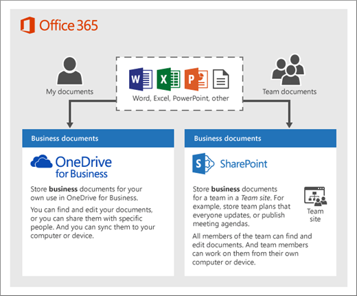
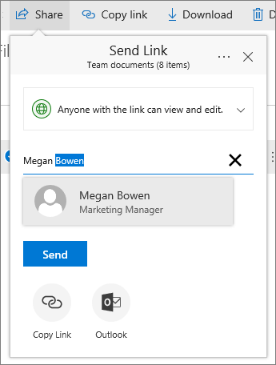
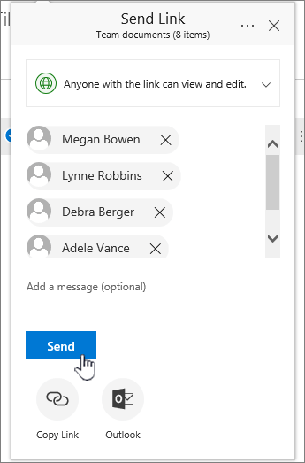
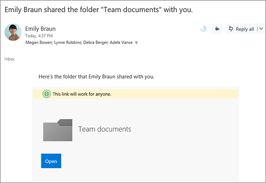
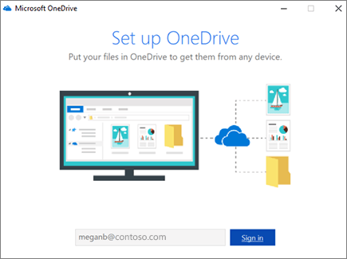
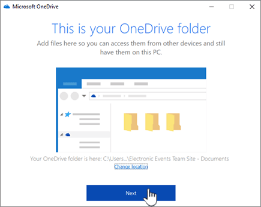
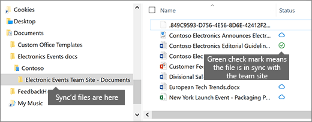

# Set up file storage and sharing in Microsoft 365

One of the best ways to set up file storage and sharing for your business is to use OneDrive and a team site together. This is ideal if you have a small business with a few employees.

## Watch: Where to store files in Office 365

> [!VIDEO https://www.microsoft.com/videoplayer/embed/RE1FTHX] 

If you found this video helpful, check out the [complete training series for small businesses and those new to Microsoft 365](../../business-video/index.yml).

## Microsoft 365 document storage and management

- OneDrive is designed for individual use, with the occasional sharing of files.

- A team site is designed for sharing and collaborating on files regularly. A team site is ideal for storing files that have shared ownership where several people own the files and might collaborate on them. Create a Microsoft Team to add a team site. [Learn more at Create a team in Teams](https://support.microsoft.com/office/174adf5f-846b-4780-b765-de1a0a737e2b).

Both OneDrive and team sites provide anywhere access for you and your employees.
  

  
Here are recommendations for what to store in each location when you use OneDrive and team sites together: 

  
|Storage location|What's it for|What to store here|
|:-----|:-----|:-----|
|**OneDrive** |Storing content in OneDrive is like storing files on your computer; no one else can easily access them.  For more info, see [What is OneDrive for Business?](https://support.microsoft.com/office/187f90af-056f-47c0-9656-cc0ddca7fdc2)   |Business files that other team members won't need to collaborate on or access regularly.  |
|**SharePoint team sites**   |Collaboration. When you create a Microsoft 365 group (for example, in the Microsoft 365 admin center, in Outlook, or by creating a team in Microsoft Teams), a SharePoint team site is created for that group. Likewise, when you create a new SharePoint team site from the SharePoint home page or from the new SharePoint admin center, it also creates a Microsoft 365 group. For more info, see [What is a SharePoint team site?](https://support.microsoft.com/office/75545757-36c3-46a7-beed-0aaa74f0401e) and [Create a team site in SharePoint Online](https://support.microsoft.com/office/ef10c1e7-15f3-42a3-98aa-b5972711777d).    |Files that have shared ownership. We recommend separate team sites for each unit of work in your organization. For example, to keep personnel and financial documents private to a small team, create a separate team site.    |

> [!NOTE]
> SharePoint also has other types of sites you can use for your business. You can use [communication sites](https://support.microsoft.com/office/7fb44b20-a72f-4d2c-9173-fc8f59ba50eb) in your intranet to publish information for a broad audience. And you can use [hub sites](https://support.microsoft.com/office/fe26ae84-14b7-45b6-a6d1-948b3966427f) to connect sites in your intranet.
  
## Start using OneDrive and your team site

### Team members can store their own files in OneDrive

Each person in your business who has a Microsoft 365 license assigned (and SharePoint Online selected) gets OneDrive cloud storage. They can store business-related files here for access from any device, and they are only available to that user. For example, they might store a draft proposal, their meeting notes, or the script for a demo they're going to deliver.
  
Employees can also share OneDrive files and folders. If an employee is away or leaves the company, others can access shared files stored in OneDrive (OneDrive team folder sharing).
  
Here's how each person on your team can set up OneDrive and share files.

1. Go to the <a href="https://portal.office.com/ " target="_blank">Microsoft 365 Portal</a>, and sign in with your user name and password.

2. From the App launcher, select **OneDrive**.

3. In OneDrive, team members can store their own business-related files. You can share either individual files, or a whole folder. Pick a file or folder, right-click, and then choose **Share**.

    
  
4. On the **Send Link** page, leave the default selection **Anyone with the link can view and edit**.

    Type names or email addresses of team members who you want to have access to the folder, and add an optional message.

    If you want your own copy of the email that will be sent, add your email address to the list.

    
  
5. When you're done entering who you want to share with, select **Send**. The email is immediately sent to the people you invite.

    
  
6. Here's what the email looks like. 

    
  
### Upload files to a team site for online collaboration

Team sites come with a place to store files, called a document library.  
  
Here are the steps to add files:
  
1. On the home page of your team site, choose **Documents** from the left-hand navigation menu. This will take you to your **Documents library**.
  
2. While you're still signed in to Microsoft 365, open Windows **File Explorer** from your taskbar or other location. Go to the files you want to upload to your team site.

3. Select the files you want to upload to your team site, and then drag them to the **Document library**.
  
4. When you're done, the files will be stored in both your team site and your computer.
  
5. You can delete the files from your computer. In the next step, [Sync online files with your PC or Mac](#sync-online-files-with-your-pc-or-mac), you're going to create a new location for these files on your computer.

    If you have numerous files or large files to upload to your team site, read these tips on [uploading large or many files to a library](https://support.microsoft.com/office/da549fb1-1fcb-4167-87d0-4693e93cb7a0#__toc384119242).

    If you need more storage space, see [Change storage space for your subscription](../../commerce/add-storage-space.md).

### Sync online files with your PC or Mac

Now that you have files on your team site, you can set them up to sync with your PC or Mac. This way, you can work on your files from your PC or Mac instead of working in Microsoft Edge, Chrome, or another browser. It's also useful to have a version of your files synced on your computer for situations when you need to get to a file and you aren't connected to the Internet.
  
After you set up files to sync with your computer, when you're connected to the Internet, they'll be synchronized automatically.
  
Here's how to synchronize files on your team site with your desktop:
  
1. On the home page of your team site, choose **Documents** from the left-hand navigation menu. This takes you to your Documents library.

    > [!TIP]
    > When syncing files on your team site, you're syncing each file library on the site, not the entire site.
  
2. Choose **Sync** to synchronize all the files. Or browse to the specific folder you want to sync.

3. If prompted to switch apps, choose **Yes**. OneDrive is the process doing the synchronization.
  
4. If you then get a **Set up OneDrive** prompt, sign in with your work or school account.

    
  
5. If you haven't yet synced your OneDrive, you might see a **This is your OneDrive folder** screen. Check the path under **Your OneDrive folder is here**. Choose **Change Location** if you want to use a different path, and then select **Next**.

    
  
6. The files in your team sites will appear in the left pane of File Explorer under the name of your organization. The files in OneDrive will appear under "OneDrive - \<Name of Organization\>"

    
  
7. Test the synchronization by opening a file in the team's folder on your computer. Make a change, and then choose **Save**.

## Best practices for file storage and sharing

Here are a few tips for getting the most from OneDrive or your SharePoint team site.
  
### File storage and collaboration recommendations for other types of small businesses

- **Sole proprietorships**: Use OneDrive to store your own files and share them with customers on a case-by-case basis.

- **Co-ownerships**: Both owners use OneDrive and share files back and forth.

- **Businesses with external clients or partners who need access to files**: Create a new team site to store and share documents intended for a specific customer. Set up the site to allow access to only that customer. You then don't need to worry that one customer will accidentally get access to information intended for another customer.

### Keep private files private

When you store a file in OneDrive it's only accessible by you, unless you share it with others. When you share files, you can choose to create a link that can be forwarded, or to share with only specific people. You can also create separate folders in OneDrive for different purposes such as public, personal, or for individual projects. Each folder can be shared with a different person or group, or nobody else at all.
  
For more information on sharing, also see [Share files and folders with Microsoft 365](https://support.microsoft.com/office/72f26d6c-bf9e-432c-8b96-e3c2437f5b65).
  
### Track how much space you have left

To see how much storage space you have left in OneDrive, see [Manage your OneDrive for Business storage](https://support.microsoft.com/office/31519161-059C-4764-B6F8-F5CD29F7FE68).
  
### What files can be stored in OneDrive and a team site?

While you can upload almost all types of files, some file names and characters in file names aren't allowed. For more info, see [Invalid file characters and file types in OneDrive for Business](https://support.microsoft.com/office/64883A5D-228E-48F5-B3D2-EB39E07630FA).
  
### Enable or disable third-party storage services

You can enable third-party storage for your users in Microsoft 365 so they can store and share documents using services like Dropbox in addition to OneDrive and team sites. This can be a great way to provide services that your users may already be using or prefer to use for business projects. If you don't want people in your organization using Office to open files in a third-party service, follow these steps to turn it off.
  
> [!IMPORTANT]
> Third-party storage is enabled by default so you need to perform these steps right away if you don't want it available to your users.
  
1. Sign in to to the <a href="https://go.microsoft.com/fwlink/p/?linkid=2024339" target="_blank">admin center</a>.

2. Go to the **Settings** \> <a href="https://go.microsoft.com/fwlink/p/?linkid=2053743" target="_blank">**Org settings**</a> page.

3. On the **Services** tab, select **Office on the web**.

4. Select or deselect the check box to turn third-party storage on or off, then select **Save changes**.

## Next steps

- [Customize your team site for file storage and sharing](customize-team-site.md). This step-by-step tutorial shows you how to you can take advantage of more storage and collaboration features.

- **Set up Office apps on your tablets and phones.** You need to do this so you can **edit** files that are stored in OneDrive and on team sites from your tablet or phone. If you don't install the Office apps for your tablet or phone, you'll be able to view the files but not edit them.

  - [Install and set up Office on an Android with Microsoft 365](https://support.microsoft.com/office/cafe9d6f-8b0c-4b03-b20a-12438a82a22d)

  - [Install and set up Office on an iPhone or iPad with Microsoft 365](https://support.microsoft.com/office/9df6d10c-7281-4671-8666-6ca8e339b628)

  - [Set up Office on Windows Phone with Microsoft 365](https://support.microsoft.com/office/2b7c1b51-a717-45d6-90c9-ee1c1c5ee0b7)

## Related content

[Add storage space for your subscription](../../commerce/add-storage-space.md) (article)\
[Share files and folders with Microsoft 365 Business](https://support.microsoft.com/office/share-files-and-folders-with-microsoft-365-business-72f26d6c-bf9e-432c-8b96-e3c2437f5b65) (video)\
[Customize your team site for file storage and sharing](customize-team-site.md) (article)