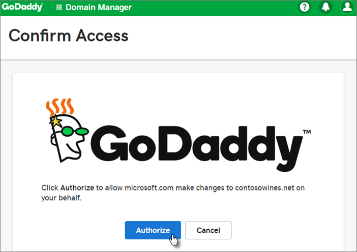

# Set up Microsoft 365 Business Standard with a new or existing domain

Check out all of our small business content on [Small business help & learning](https://go.microsoft.com/fwlink/?linkid=2224585).

When you purchase Microsoft 365 Business Standard, you have the option of adding a domain you own, or buying one. Check out [Sign up for a Microsoft 365 Business Standard subscription](../simplified-signup/signup-business-standard.md).

In this article, we'll walk you through the steps of adding an existing domain you already own or buying a new one. If you purchased a new domain when you signed up, your domain is all set up and you can move to [Add users and assign licenses](#add-users-and-assign-licenses).

> [!Tip]
> If you have a Microsoft 365 Business Premium subscription, please see [Set up Microsoft 365 Business Premium](../../business-premium/m365-business-premium-setup.md).

## Set up Microsoft 365 for business

> [!VIDEO https://www.microsoft.com/videoplayer/embed/RE471FJ]

## Before you begin

To add, modify or remove domains you must be a global administrator. For more info, see [About admin roles](../add-users/about-admin-roles.md).

> [!IMPORTANT]
> The person who signs up for Microsoft 365 for business (usually the business owner) automatically becomes the technical administrator of the organization. You can add other people as admins if you want help managing your Microsoft 365 services. Check out [Assign admin roles](../add-users/assign-admin-roles.md) for more info.

## Watch: Add an existing domain to your Microsoft 365 Business Standard subscription

> [!VIDEO https://www.microsoft.com/videoplayer/embed/RWxApu]

## Steps: Add an existing domain to your Microsoft 365 Business Standard subscription

1. From the **How you'll sign in** page on the Microsoft 365 Business Standard sign up, choose **Create a new business email account (advanced)**.

2. On the **Install your Microsoft 365 apps** page, you can optionally install the apps on your own computer.

3. In the **Add domain** step, enter the domain name you want to use (like contoso.com).

    > [!IMPORTANT]
    > If you purchased a domain during the sign-up, you will not see **Add a domain** step here. Go to [Add users](#add-users-and-assign-licenses) instead.

4. Follow the steps to [Add DNS records to connect your domain](../get-help-with-domains/create-dns-records-at-any-dns-hosting-provider.md) that verifies you own the domain. If you know your domain host, see also [Add a domain to Microsoft 365](/microsoft-365/admin/setup/add-domain).

    If your hosting provider is GoDaddy or another host enabled with [domain connect](/office365/admin/get-help-with-domains/domain-connect), the process is easy and you'll be automatically asked to sign in and let Microsoft authenticate on your behalf.

    

## Add users and assign licenses

You can add users now, but you can also [add users later](../add-users/add-users.md) in the admin center.

Any users you add get automatically assigned a Microsoft 365 Business Standard license.

1. If your Microsoft 365 Business Standard subscription has existing users you get an option to assign licenses to them now. Go ahead and add licenses to them as well.

2. After you've added the users, you'll also get an option to share credentials with the new users you added. You can choose to print them out, email them, or download them.

## Connect your domain
  
To set up services, you have to update records at your DNS host or domain registrar.
  
1. The setup wizard typically detects your registrar and gives you a link to step-by-step instructions for updating your NS records at the registrar website. If it doesn't, [Change nameservers to set up Microsoft 365 with any domain registrar](../get-help-with-domains/change-nameservers-at-any-domain-registrar.md).

    - If you have existing DNS records, for example an existing web site, but your DNS host is enabled for [domain connect](/office365/admin/get-help-with-domains/domain-connect), choose **Add records for me**. On the **Choose your online services** page, accept all the defaults, and choose **Next**, and choose **Authorize** on your DNS host's page.
    - If you have existing DNS records with other DNS hosts (not enabled for domain connect), you'll want to manage your own DNS records to make sure the existing services stay connected. See [domain basics](/office365/admin/get-help-with-domains/dns-basics) for more info.

2. Follow the steps in the wizard and email and other services will be set up for you.

    When the signup process is complete, you'll be directed to the admin center, where you'll follow a wizard to install Microsoft 365 apps, add your domain, add users, and assign licenses. After you complete the initial setup, you can use the **Setup** page in the admin center to continue setting up and configuring the services that come with your subscriptions.

    For more information about the setup wizard and the admin center **Setup** page, see [Difference between the setup wizard and the Setup page](o365-setup-wizard-and-setup-page.md).

## Watch: Set up business email with a new domain

> [!VIDEO https://www.microsoft.com/videoplayer/embed/RWyVVA]

## Steps: Set up business email with a new domain

1. From the **How you'll sign in** page on the Microsoft 365 Business Standard sign up, choose **Create a new business email account (advanced)**.

2. Follow the steps to buy a new domain and enter the domain name you want to use (like contoso.com). After you've completed buying your domain, you can [add users and licenses](../add-users/add-users.md) and install your Microsoft 365 apps in the admin center.

## Finish setting up

Follow the steps below to set up Outlook, Teams, OneDrive and your website.

### Step: Set up Outlook for email

1. On the Windows Start menu, search for Outlook, and select it.

    (If you're using a Mac, open Outlook from the toolbar or locate it using the Finder.)

    If you've just installed Outlook, on the Welcome page, select **Next**.

2. Choose **File** \> **Info** \> **Add Account**.

3. Enter your Microsoft email address and select **Connect**.

## Watch: Set up Outlook for email

> [!VIDEO https://www.microsoft.com/videoplayer/embed/9fe86884-8a83-42cc-bca9-61a12e6dad31?autoplay=false]
  
More at [Set up Outlook for email](https://support.microsoft.com/office/f5bf0cd1-e1f3-4b0d-a022-ecab17efe86f).
  
### Import email

If you were using Outlook with another email account, you can import your previous email, calendar, and contacts into your new Microsoft account.
  
1. **Export your old email**

    In Outlook, choose **File** \> **Open &amp; Export** \> **Import/Export**.

    Select **Export to a File** and then follow the steps to export your Outlook Data File (.pst) and any subfolders.

2. **Import your old email**

    In Outlook, choose **File** \> **Open &amp; Export** \> **Import/Export** again.

    This time, select **Import from another program or file** and follow the steps to import the backup file you created when you exported your old email.

## Watch: Import and redirect email

> [!VIDEO https://www.microsoft.com/videoplayer/embed/40f7df36-9e24-44e5-8791-e9ed0dd8fd21?autoplay=false]
  
More at [Import email with Outlook](https://support.microsoft.com/office/6a3771d4-4c1d-4a25-92a6-0b8e476335de).

You can also use <a href="https://go.microsoft.com/fwlink/p/?linkid=2059104" target="_blank">Exchange admin center</a> to import everyone's email. For more information, see [migrate multiple email accounts](/Exchange/mailbox-migration/mailbox-migration).

## Set up Microsoft Teams and OneDrive for business

Select the OneDrive cloud icon from your taskbar and follow the steps to move your files to your new OneDrive for Business folder. Select **Next** to set up Microsoft Teams.

1. Open Microsoft Teams, select your profile icon, and then **Add work or school account**. Follow the steps to add your new account to Teams.

## Use a public website

Microsoft 365 doesn't include a public website for your business. If you want to set one up, consider using a Microsoft partner, such as GoDaddy or WIX.
  
1. From the admin center, go to **Resources**, and then select **Public website**.

2. Select **Learn more** under one of the options, and then sign up with a website partner and use their tools to set up and design your site.

## Watch: Create your business website

> [!VIDEO https://www.microsoft.com/videoplayer/embed/4839abc6-9323-4cbf-a79d-2907235f9ebb]

## Invite users to join your subscription and organization

Once you've set up your organization, you can invite other users to join your Microsoft 365 business subscription. They'll get access to all the features of the subscription.

[Invite users to my subscription](../simplified-signup/admin-invite-business-standard.md)

Let your users know they can follow the steps in the articles below to join your organization and subscription.

- [Accept an email invitation](../simplified-signup/user-invite-business-standard.md)

- [Accept an email invitation using an Outlook, Yahoo, Gmail or other account (User)](../simplified-signup/user-invite-msa-nodomain-join.md)

## Related topics

[Migrate data to my Microsoft 365 Business Standard subscription](../simplified-signup/migrate-data-business-standard.md)
