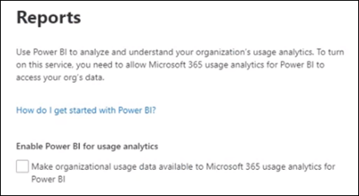
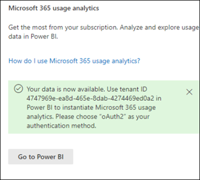
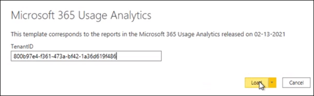
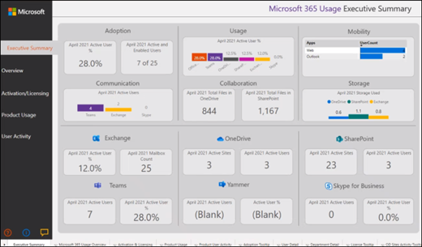

# Connect to Microsoft 365 Government Community Cloud (GCC) data with Usage Analytics

Use the following procedures to connect to your data with the Microsoft 365 Usage Analytics report in a Microsoft 365 Government Community Cloud (GCC) tenant. 

> [!NOTE]
> These instructions are specifically for Microsoft 365 GCC tenants and are not applicate to GCC HIgh and DOD.

## Before you begin

To initially configure Microsoft 365 Usage Analytics: 

- You need to be a Microsoft 365 Global admin to enable data collection. 
- You need the [Power BI Desktop](https://powerbi.microsoft.com/en-us/desktop/) application to use the template file. 
- You need a [Power BI Pro license](https://go.microsoft.com/fwlink/p/?linkid=845347) or Premium capacity to publish and view the report. 

## Step 1: Make you organization’s data available for the Microsoft 365 Usage Analytics report

1. In the Microsoft 365 admin center, expand the navigation menu, select **Reports**, then select **Usage**. 
2. On the **Usage Reports** page, in the Microsoft 365 Usage Analytics section, select **Get Started**. 
3. Under **Enable Power BI for usage analytics**, select **Make organizational usage data available to Microsoft usage analytics for Power BI**, and then select **Save**.

     

    This will start a process to make your organizations data accessible for this report, and you will see a message stating that **We’re getting your data ready for Microsoft 365 usage analytics**. Note that this process can take 24 hours to complete. 

4. When your organizations data is ready, refreshing the page will show a message stating that your data is now available, and will also provide your **tenant ID** number. You will need to use the tenant ID in a later step when you attempt to connect to your tenant data. 
 
     
 
    > [!IMPORTANT]
    > When your data is available, do not select **Go to Power BI**, which will take you to the Power BI Marketplace.  The template app for this report required by GCC tenants is not available in the Power BI Marketplace.  

## Step 2: Download the Power BI template, connect to your data, and publish the report

Microsoft 365 GCC users can download and use the Microsoft 365 Usage Analytics report template file to connect to their data. You will need Power BI Desktop to open and use the template file. 

 > [!NOTE]
 > Currently, a template app for the Microsoft 365 Usage Analytics report is not available for GCC tenants in the Power BI Marketplace.  

1. After downloading the [Power BI template](https://download.microsoft.com/download/7/8/2/782ba8a7-8d89-4958-a315-dab04c3b620c/Microsoft%20365%20Usage%20Analytics.pbit), open it using Power BI Desktop. 
2. When prompted for a **TenantID**, enter the tenant ID you received when you prepared your organization’s data for this report in step 1. Then select **Load**. It will take several minutes for your data to load. 

     

3. When loading completes, your report will display, and you will see an executive summary of your data. 

     
 

4. Save your changes to the report. 
5. Select **Publish** in the Power BI Desktop menu to publish the report to the Power BI Online service where it can be viewed. This requires either a Power BI Pro license or Power BI Premium capacity. As part of the [publish process](/power-bi/create-reports/desktop-upload-desktop-files#to-publish-a-power-bi-desktop-dataset-and-reports), you will need to select a destination to publish to an available workspace in the Power BI Online Service.

## Related content

[About usage analytics](usage-analytics.md)  
[Get the latest version of usage analytics](get-the-latest-version-of-usage-analytics.md)  
[Navigate and utilize the reports in Microsoft 365 usage analytics](navigate-and-utilize-reports.md)  
