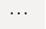
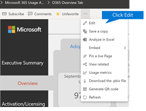
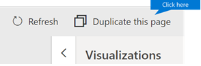
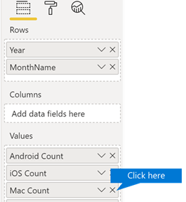
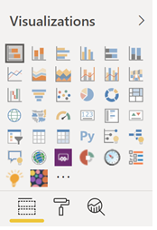
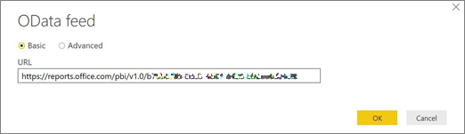
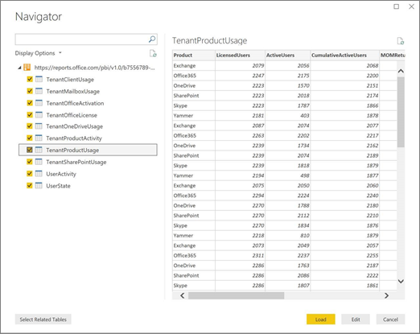
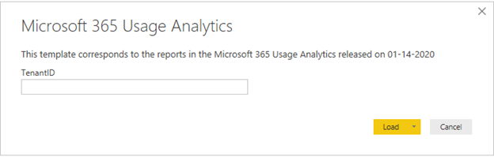

# Customize the reports in Microsoft 365 usage analytics

Microsoft 365 usage analytics provides a dashboard in Power BI that offers insights into how users adopt and use Microsoft 365. The dashboard is just a starting point to interact with the usage data. The reports can be customized for more personalized insights.

You can also use the Power BI desktop to further customize your reports by connecting them to other data sources to gain richer insights about your business.

## Customizing reports in the browser

The following two examples show how to modify an existing visual and how to create a new visual.

### Modify an existing visual

This example shows how to modify the **Activation** tab within the **Activation/Licensing** report.

1. Within the **Activation/Licensing** report, select the **Activation** tab.

2. Enter the edit mode by choosing the **Edit** button on the top through the  button.

    

3. On the top right, choose **Duplicate this page**.

    

4. In the bottom right, choose any of the bar-charts showing the count of users activating based on the OS such as Android, iOS, Mac, etc.

5. In the **Visualizations** area to the right, in order to remove **Mac Count** from the visual, select the **X** next to it.

    

### Create a new visual

The following example shows how to create a new visual to track new Viva Engage users on monthly basis.

1. Go to the **Product Usage** report using the left nav and select the **Viva Engage** tab.

2. Switch to edit mode by choosing  and **Edit**.

3. At the bottom of the page, select the  to create a new page.

4. In the **Visualizations** area to the right, choose the **Stacked bar chart** (top row, first from left).

    

5. Select the bottom right of that visualization and drag to make it larger.

6. In the **Fields** area to the right, expand the **Calendar** table.

7. Drag **MonthName** to the fields area, directly below the **Axis** heading in the **Visualizations** area.

    

8. In the **Fields** area to the right, expand the **TenantProductUsage** table.

9. Drag **FirstTimeUsers** to the fields area, directly below the **Value** heading.

10. Drag **Product** to the **Filters** area, directly below the **Visual level filters** heading.

11. In the **Filter Type** area that appears, select the **Viva Engage** check box.

    

12. Just below the list of visualizations, choose the **Format** icon .

13. Expand Title and change the **Title Text** value to **First-Time Viva Engage Users by Month**.

14. Change the **Text Size** value to **12**.

15. Change the title of the new page by editing the name of the page on bottom right.

16. Save out the report by Clicking on **Reading View** on top and then **Save**.

## Customizing the reports in Power BI Desktop

For most customers modifying the reports and chart visuals in Power BI web will be sufficient. For some however, there may be a need to join this data with other data sources to gain richer insights contextual to their own business, in which case they can customize and build additional reports using Power BI Desktop. You can download [Power BI Desktop](https://go.microsoft.com/fwlink/p/?linkid=849797) for free.

### Use the reporting APIs

You can start by connecting directly to the ODATA reporting APIs from Microsoft 365 that power these reports.

1. Go to **get data** \> **Other** \> **ODATA Feed** \> **Connect**.

2. In the URL window enter "https://<i></i>reports.office.com/pbi/v1.0/\<tenantid\>"

    **NOTE:**
    The reporting APIs are in preview and are subject to change until they go into production.

    

3. Enter your Microsoft 365 (organization or school) admin credentials to authenticate to Microsoft 365 when prompted.

    See the [FAQ](usage-analytics.md#faq) for more information about who is allowed to access the Microsoft 365 Adoption template app reports.

4. Once the connection is authorized, you will see the Navigator window that shows the datasets available to connect to.

    Select all and choose **Load**.

    This will download the data into your Power BI Desktop. Save this file and then you can start creating the reports you need.

    

### Use the Microsoft 365 usage analytics template

You can also use the Power BI template file that corresponds to the Microsoft 365 usage analytics reports as a starting point to connect to the data. The advantage of using the pbit file is that it has the connection string already established. You can also take advantage of all the custom measures that are created, on top of the data that the base schema returns and build on it further.

You can download the Power BI template file from the [Microsoft Download Center](https://download.microsoft.com/download/7/8/2/782ba8a7-8d89-4958-a315-dab04c3b620c/Microsoft%20365%20Usage%20Analytics.pbit). After you download the Power BI template file, follow these steps to get started:

1. Open the pbit file.

2. Enter your tenant id value in the dialog.

    

3. Enter your admin credentials to authenticate to Microsoft 365 when prompted.

     for more information about who is allowed to access the Microsoft 365 usage analytics reports.

    Once authorized, the data will be refreshed in the Power BI file.

    Data load may take some time, once complete, you can save the file as a .pbix file and continue to customize the reports or bring an additional data source into this report.

4. Follow [Getting started with Power BI](/power-bi/fundamentals/desktop-getting-started) documentation to understand how to build reports, publish them to the Power BI service, and share with your organization. Following this path for customization and sharing may require additional Power BI licenses. See Power BI [licensing guidance](https://go.microsoft.com/fwlink/p/?linkid=849803) for details.
