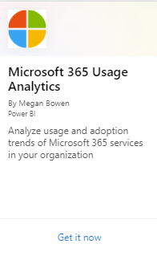
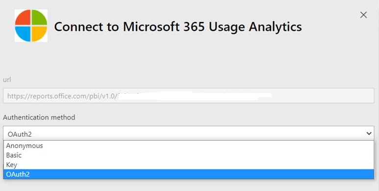

# Enable Microsoft 365 usage analytics

To enable Microsoft 365 usage analytics in a Microsoft 365 US Government Community Cloud (GCC) tenant, see [Connect to Microsoft 365 Government Community Cloud (GCC) data with Usage Analytics](connect-to-gcc-data-with-usage-analytics.md).

## Before you begin

To get started with Microsoft 365 usage analytics, you must first make the data available in the <a href="https://go.microsoft.com/fwlink/p/?linkid=2024339" target="_blank">Microsoft 365 admin center</a>, then select **Reports** > **Usage** and initiate the template app in Power BI.

## Get Power BI

If you don't already have Power BI, you can [sign up for Power BI Pro](https://go.microsoft.com/fwlink/p/?linkid=845347). Select **Try free** to sign up for a trial, or **Buy now** to get Power BI Pro.

You can also expand **Products** to buy a version of Power BI.

> [!NOTE]
> You need a Power BI Pro license to install, customize, and distribute a template app. For more information, please see [Prerequisites](/power-bi/service-template-apps-install-distribute?source=docs#prerequisites).

To share your data, both you and the people who you share the data with need a Power BI Pro license. Or the content needs to be in a workspace in a [Power BI premium service](/power-bi/service-premium-what-is).

## Enable the template app

To enable the template app, you have to be a **Global administrator**.

See [about admin roles](../add-users/about-admin-roles.md) for more information.

1. In the admin center, go to the **Settings** \> **Org settings** \> **Services** tab.

2. On the **Services** tab, select  **Reports**.

3. On the Reports panel that opens, set **Make report data available to Microsoft 365 usage analytics for Power BI** to **On** \> **Save**.

The data collection process completes in two to 48 hours depending on the size of your tenant. The **Go to Power BI** button is enabled (no longer gray) when data collection is complete. Once complete, the app provides historical usage data at your organization level. 

> [!NOTE]
> The data for the **"User Activity"** tab is only refreshed after the fifteenth day of the current month and the first day of the next month, so it will remain empty initially until the first refresh is completed.

## Start the template app

To start the template app, you have to be either a **report reader**, **Exchange administrator**, **Skype for Business administrator**, or **SharePoint administrator**.

1. Copy the tenant ID and select **Go to Power BI**.

2. When you get to Power BI, sign in. Then **Select Apps**->**Get apps** from the navigation menu.

3. In the **Apps** tab, type Microsoft 365 in the search box and then select **Microsoft 365 usage analytics** \> **Get it now**.

    

4. Once the app is installed, open it by selecting the tile.

5. Select **Explore app** to view the app with sample data. Choose **Connect** to connect the app to your organization’s data.

6. Choose **Connect**, on the **Connect to Microsoft 365 usage analytics** screen, then type in the tenant ID (without dashes) you copied in step (1), and select **Next**.

7. On the next screen, select **OAuth2** as the **Authentication method** \> **Sign in**. If you choose any other authentication method, the connection to the template app fails.

    

8. After the template app is instantiated, the Microsoft 365 usage analytics dashboard is available in Power BI on the web. The initial loading of the dashboard takes between 2 to 30 minutes.

Tenant level aggregates will be available in all reports after opting in. **User-level details will only become available around the 5th of the next calendar month after opting in**. This impacts all reports under User Activity (See [Navigate and utilize the reports in Microsoft 365 usage analytics](navigate-and-utilize-reports.md) for tips on how to view and use these reports).

## Make the collected data anonymous

Reports provide information about your organization’s usage data. By default, reports display information with identifiable names for users, groups, and sites. Starting September 1, 2021, we're hiding user information by default for all reports as part of our ongoing commitment to help companies support their local privacy laws.
  
Global administrators can revert this change for their tenant and show identifiable user information if their organization's privacy practices allow it. It can be achieved in the Microsoft 365 admin center by following these steps:
  
1. In the admin center, go to the **Settings** \> **Org Settings** \> **Services** page.

2. Select **Reports**. 
  
3. Uncheck the statement **Display concealed user, group, and site names in all reports**, and then save your changes.  
  
It takes a few minutes for these changes to take effect. Showing identifiable user information is a logged event in the Microsoft Purview compliance portal audit log.   

## Related content

[About usage analytics](usage-analytics.md) (article)\
[Get the latest version of usage analytics](get-the-latest-version-of-usage-analytics.md) (article)\
[Navigate and utilize the reports in Microsoft 365 usage analytics](navigate-and-utilize-reports.md) (article)
