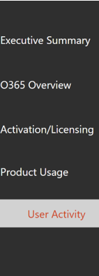
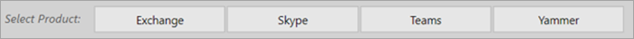
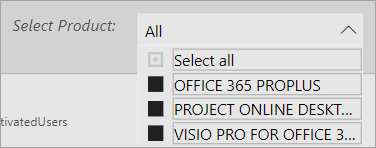
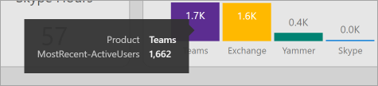
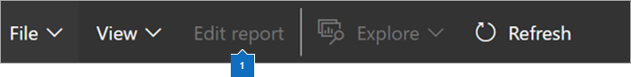
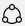

# Navigate and utilize the reports in Microsoft 365 usage analytics

The dashboard provides you with a quick overview of the main usage and adoption metrics. By selecting the top-level metrics, you can access reports that provide more details and insights. Each report tab contains data visualizations specific to an aspect of usage and adoption for your organization. The data collected is explained in the title of each report and a tile appears that contains further information about the visualizations on the report tab that you are viewing.

To get started with your reports, here are some tips:

- Use the navigation tabs on the left or on a related metric on the **Executive Summary** page to navigate to each top-level report.

    

- Use the navigation tabs at the top of each top-level report to navigate to different reports within that level.

    

- Many reports contain a slicer where you can filter on the product, AAD attribute, or activity that you want to view. These can be either single-select or multi-select.

    

    

- Hover over data points to view a callout that contains details.

    

The user who has instantiated the template app will have the ability to customize the report to their needs. To customize the template app:

- Select **Edit report** at the top of the report.

    

- Create your own visuals by using the underlying [datasets](usage-analytics-data-model.md).

- Use PowerBI Desktop to bring in your own data sources.

To share your reports, just select the share button  at the top of the page.

To learn how to customize the reports, see [Customizing the reports in Microsoft 365 usage analytics](customize-reports.md).

You can find lots of additional information in the Power BI help documentation:

- [Power BI basic concepts](/power-bi/service-basic-concepts)

    Learn about dashboard, datasets, reports, and other Power BI concepts.

- [Get started with Power BI](/power-bi/service-get-started?wt.mc_id=O365_Reports_PBI_contentpack)

    Learn the basic functionality in Power BI. Find links to how to use Power BI Desktop.

- [Share dashboards and reports](/power-bi/service-share-dashboards)

    Learn how to share reports with your colleagues or people outside your organization. You can also share the report or a filtered version of the report.