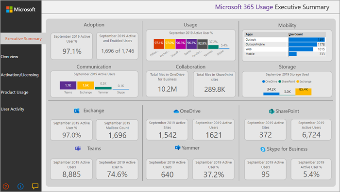

# Microsoft 365 usage analytics

Use Microsoft 365 usage analytics within Power BI to gain insights on how your organization is adopting the various services within Microsoft 365. You can visualize and analyze Microsoft 365 usage data, create custom reports and share the insights within your organization. You can also gain insights into how specific regions or departments are using Microsoft 365.
  
Microsoft 365 usage analytics gives you access to a prebuilt dashboard that provides a cross-product view of the last 12 months and contains many prebuilt reports. Each report provides you with specific usage insights. User-specific information is available for the last full calendar month.
  
The [data model](usage-analytics-data-model.md) that powers the template app includes user attributes from Active Directory, enabling the ability to pivot in certain reports. The following Active Directory attributes are included: location, department, and organization. 
  
See [Enable Microsoft 365 usage analytics](enable-usage-analytics.md) to start collecting data. 
  
Microsoft 365 usage analytics contains many reports detailed in the following sections. 

You can access detailed reports for each area by selecting the data tables. You can view all pre-built reports by selecting the tabs at the bottom of the site. For more detailed instructions, read [Navigating and utilizing the reports](navigate-and-utilize-reports.md) and [Customizing the reports](customize-reports.md).

## Executive summary

The executive summary is a high-level, at-a-glance view of Microsoft 365 for Business adoption, usage, mobility, communication, collaboration, and storage reports. It is meant for business decision makers. It provides a view into how some individual services are being used, based on all the users who are enabled and those users who are active. All values of the month shown on the report refer to the latest complete month. 

This summary lets you quickly understand usage patterns in Microsoft 365 and how and where your employees are collaborating.

## Overview

The Microsoft 365 overview report contains the following reports. You can view them by choosing the tab on top of the report page. All values of the month shown on the top section of the report refer to the latest complete month.

- **Adoption** &ndash; Offers an all-up summary of adoption trends. Use the reports in this section to learn how your users adopted Microsoft 365, and how overall usage of the individual services changed month over month. You can see how may users are enabled, how many are actively using Microsoft 365, how many are returning users, and how many are using the product for the first time.

- **Usage** &ndash; Offers a drill-down view into the volume of active users and the key activities for each product for the last 12 months. Use the reports in this section to learn how people in your organization are using Microsoft 365.

- **Communication** &ndash; You can see at a glance whether people in your organization prefer to stay in touch by using Teams, Viva Engage, email, or Skype calls. You can observe if there are shifts in patterns in the use of communication tools among your employees. 

- **Collaboration** &ndash; See how people in your organization use OneDrive and SharePoint to store documents and collaborate with each other, and how these trends evolve month over month. You can also see how many users shared documents internally or externally and how many users used SharePoint sites or OneDrive accounts, broken out by owners and other collaborators.

- **Storage** &ndash; Use this report to track cloud storage for mailboxes, OneDrive, and SharePoint sites.

- **Mobility** &ndash; Track which clients and devices people use to connect to email, Teams, Skype, or Viva Engage.

## Activation and licensing

The activation and license page offers reports on Microsoft 365 activation. That is, how many users downloaded and activated Microsoft 365 productivity apps and how many licenses were assigned by your organization. The month value towards the top refers to the current month, and the metrics reflect values aggregated from the beginning of the month to the current date.

- **Activation** &ndash; Track service plan (for example, Microsoft 365 Apps for enterprise, Project, and Visio) activations in your organization. Each person with a Microsoft 365 license can install products on up to five devices. You can also use reports in this section to see the devices on which people installed Microsoft 365 productivity apps. To activate a plan, a user must install the app and sign in with their account.

- **Licensing** &ndash; This report contains an overview of license types, the count of users who were assigned each license type, and the license assignment distribution for each month. The month value towards the top refers to the current month, and the metrics reflect values aggregated from the beginning of the month to the current date.

## Product usage

This report contains a separate report for each Microsoft 365 service, including Exchange, Microsoft 365 groups, OneDrive, SharePoint, Skype, Teams, and Viva Engage. Each report contains total enabled vs. total active user reports, counts of entities such as mailboxes, sites, groups, accounts, and activity type reports where appropriate. All values of the month shown on the top section of the report refer to the latest complete month.

## User activity

User activity reports are available for certain individual services. These reports provide user-level detail usage data joined with Active Directory attributes. In addition, the Department Adoption report lets you slice by Active Directory attributes so that you can see active users across all individual services. All metrics are aggregated for the latest complete month. To view the content date, navigate to the table page and select UserActivity table where the value under TimeFrame provides the reporting period. 

> [!NOTE]
> Global Reader and Usage Summary Reports Reader don't have the permission to view the user activity reports. 

## FAQ

### Is this template app going to be available through purchase or is it free?

It isn't free, and you need a Power BI Pro license. For details see [prerequisites](/power-bi/service-template-apps-install-distribute#prerequisites) for installing, customizing, and distributing a template app.

To share the dashboards with others, see more at [Share dashboards and reports](/power-bi/service-how-to-collaborate-distribute-dashboards-reports#share-dashboards-and-reports).

### Who can connect to Microsoft 365 usage analytics?

You have to be either an **Exchange admin**, **Skype for Business admin**, **SharePoint admin**, **Global reader**, **Report reader**, **Usage Summary Reports Reader** in order to establish the connection to the template app. See [About admin roles](../add-users/about-admin-roles.md) for more information. **Note:** **Global Reader** and **Usage Summary Reports Reader** only allow access to tenant level aggregates in Microsoft 365 usage analytics and they don't have the permission to view the user activity reports. 

### Who can customize the usage analytics reports?

Only the user who made the initial connection to the template app can customize the reports or create new reports in the Power BI web interface. See [Customizing the reports in Microsoft 365 usage analytics](customize-reports.md) for instructions.

### Can I only customize the reports from the Power BI web interface?

In addition to customizing the reports from the Power BI web interface, users can also use Power BI Desktop to connect directly to the Microsoft 365 reporting service to build their own reports.

### How can I get the pbit file that this dashboard is associated with?

You can access to the pbit file from the [Microsoft Download center](https://download.microsoft.com/download/7/8/2/782ba8a7-8d89-4958-a315-dab04c3b620c/Microsoft%20365%20Usage%20Analytics.pbit). 

### Who can view the dashboards and reports?

If you connected to the template app, you can share it with anybody by using the [sharing functionality](/power-bi/collaborate-share/service-share-dashboards). Power BI licensing requires that both the user sharing and the user with whom a dashboard is shared have Power BI Pro or Power BI Premium.

### Can anyone share the dashboard, or does it have to be the person who connected to the dashboard?

When sharing the dashboard, you can either allow users to reshare the dashboard with others or not. You can set this option at the time of sharing.

### Is it possible to work on and customize the same template app with a group of people?

Yes. To enable a group of admins to work together on the same template app, you can use the app workspace functionality of Power BI, for more information, see [How should I collaborate and share dashboards and reports?](/power-bi/collaborate-share/service-how-to-collaborate-distribute-dashboards-reports) 

### For which timeframe is data available?

Most of the reports display data for the previous 12 months. However, some of the charts may show less history since the data collection for different products and reports were started at different times and thus data for the full 12 months might not be available. All the reports eventually build up to 12 months of history. Reports that show user level details show data for the previous complete month.

### What data is included in the template app?

The data in the template app currently covers the same set of activity metrics available in the [Activity Reports](../activity-reports/activity-reports.md). As reports are added to the activity reports, they will be added to the template app in a future release.

### How does the data in the template app differ from the data in the usage reports?

The underlying data you see in the template app matches the data you see in the activity reports in the Microsoft 365 admin center. The key differences are that in the admin center data is available for the last 7/30/90/180 days while the template app presents data on a monthly basis for up to 12 months.

In addition, user level details in the template app are only available for the last complete month for users who were assigned a product license and performed an activity.

### When should I use the template app and when the usage reports?

The [Activity Reports](../activity-reports/activity-reports.md)  are a good starting point to understand usage and adoption of Microsoft 365. The template app combines the Microsoft 365 usage data and your organization’s Active Directory information and enables admins to analyze the data set using the visual analytics capabilities of Power BI. This enables admins to not just visualize and analyze Microsoft 365 usage data, but also slice it by Active Directory properties such as departments, location etc. They can also create custom reports and share the insights within their organization. 

### How often is the data refreshed? 

When you connect to the template app for the first time, it automatically populates with your data for the previous 12 months. After that, the template app data refreshes weekly. Customers can choose to modify the refresh schedule if their use of this data demands a different update rhythm.

The back-end Microsoft 365 service refreshes data on a daily basis and provides data that is between 5-8 days latent from the current date.

The **Content date** column in each dataset represents the freshness date of the data in the template app.

### How is an active user defined?

The definition of active user is the same as the definition of [active user](../activity-reports/active-users.md) in the activity reports.

### What SharePoint site collections are included in the SharePoint reports?

The current version of the template app includes file activity from SharePoint team sites and SharePoint group sites.

### Which groups are included in the Microsoft 365 Groups usage report?

The current version of the template app includes usage from Outlook groups, Viva Engage groups, and SharePoint groups. It does not include groups related to Microsoft Teams or Planner.

### When will an updated version of the template app become available?

Major changes to the template app are released twice a year, which may include new reports or new data. Minor changes to the reports may be released on a more frequent basis.

### Is it possible to integrate the data from the template app into existing solutions? 

The data in the template app can be retrieved through the Microsoft 365 APIs (in preview). When they ship to production, they are merged within the [Microsoft Graph reporting APIs](https://go.microsoft.com/fwlink/p/?linkid=848843). 

### Are there plans to expand the template app to show usage data from other Microsoft products?

This is considered for future improvements. Check the [Microsoft 365 Roadmap](https://www.microsoft.com/microsoft-365/roadmap) for updates.

### How can I pivot by company information in Active Directory?

Company information is included one of the Active Directory fields in the template app and you can see it as a pre-built filter in the **Product User activity** reports. It is available as column in the **UserState** table.

### Is it possible to bring in more fields from Active Directory?

More customization on this data is possible by connecting to the [Microsoft Graph reporting APIs](https://go.microsoft.com/fwlink/p/?linkid=848843) to pull additional fields from Microsoft Entra ID and join to the dataset. 

### Is it possible to aggregate the information in the template app across multiple subscriptions?

At this time, the template app is for a single subscription, as it is associated with the credentials that were used to initially connect to it.

### Is it possible to see usage by plan (for example, E1, E3)?

In the template app, usage is represented at the per product level. Data about the various subscriptions that are assigned to users are provided, however it is not possible to correlate user activity to the subscription assigned to user.

### Is it possible to integrate other data sets into the template app?

You can use Power BI Desktop to connect to the Microsoft 365 APIs (in preview) to bring more data sources to combine with the template app data.

See the [Customize document](customize-reports.md).

### Is it possible to see the "Top Users" reports for a specific timeframe?

All user level reports present aggregated data for the previous month.

### Will the template app be localized? 

This is currently not on the roadmap.

### I have a specific question about the data I'm seeing for my organization. Who can I reach out to?

You can use the feedback button in the admin center activity overview page, or you can open a support case([Get support](../get-help-support.md) to get help with the template app. 

### How can partners access the data?

If a partner delegates admin rights, they can connect to the template app on behalf of their customer.

### Can I hide identifiable information such as user, group, and site names in reports?

Yes, see [Make the collected data anonymous](enable-usage-analytics.md#make-the-collected-data-anonymous).

## Related content

[Enable Microsoft 365 usage analytics](enable-usage-analytics.md) (article)\
[Navigate and utilize the reports in Microsoft 365 usage analytics](navigate-and-utilize-reports.md) (article)\
[Microsoft 365 Reports in the admin center](../activity-reports/activity-reports.md) (video)
