# What's new in the Microsoft 365 admin center

::: moniker range="o365-21vianet"

> [!NOTE]
> Some of the information in this article might not apply to Office 365 operated by 21Vianet.

::: moniker-end

We're continuously adding new features to [the Microsoft 365 admin center](microsoft-365-admin-center-preview.md), fixing issues we learn about, and making changes based on your feedback. Take a look below to see what's available for you today. Some features get rolled out at different speeds to our customers. If you aren't seeing a feature yet, [try adding yourself to targeted release](manage/release-options-in-office-365.md).

And if you'd like to know what's new with other Microsoft cloud services:

- [What's new in Azure Active Directory](https://docs.microsoft.com/azure/active-directory/fundamentals/whats-new)
- [What's new in the Exchange admin center](https://docs.microsoft.com/Exchange/whats-new)
- [What's new in Microsoft Intune](https://docs.microsoft.com/mem/intune/fundamentals/whats-new)
- [What's new in the Microsoft 365 compliance center](https://docs.microsoft.com/Office365/SecurityCompliance/whats-new)
- [What's new in Microsoft 365 Defender](https://docs.microsoft.com/microsoft-365/security/mtp/whats-new)
- [What's new in the SharePoint admin center](https://docs.microsoft.com/sharepoint/what-s-new-in-admin-center)
- [Office updates](https://docs.microsoft.com/OfficeUpdates/)

## Ignite 2020 (August & September)

Welcome to Microsoft Ignite - our first online-only Ignite. We hope to see you in one of our sessions: [Microsoft Ignite 2020 Session Catalog](https://myignite.microsoft.com/sessions). Here's just a few of the things we'll be talking about at Ignite. 
> [!NOTE]
> Not all features are going to be available to everyone right away. If you aren't seeing the new features, [join Targeted Release](manage/release-options-in-office-365.md).

### Multi-tenant management

We've developed a set of features for multi-tenant admins like you to get your job done faster and more efficiently.

- **Your tenants**: Quickly switch between the tenants you manage.
- **All tenants**: A new page where you can quickly see the health of all your tenants' services, any open service requests, your products and billing, recommended setup tasks, and the number of users in that tenant.
- **Setup**: The multi-tenant Setup page gives you a list view of the Setup page, but organized for many tenants. You can see which features aren't turned on, which tasks are complete for all tenants, tasks that tenants still need to complete. This view will help you keep track of feature adoption and to make sure the recommended security setup tasks are always done.
- **Service health**: The service health view shows you if any incidents or advisories are affecting the tenants. It will even tell you how many of your managed tenants are affected. Just select an incident to get more information on the overview tab, then switch over to the Tenants affected tab to drill down and support that tenant.
- **Cross-tenant mailbox migrations** is a new service, now in public preview, that lets you move mailboxes between tenants without the need to offboard and then onboard mailboxes. 
- **Cross-tenant domain sharing**: Soon, you can join a private preview for capabilities that allow you to share a domain across multiple tenants. For example, if Contoso acquires Wingtip Toys, Contoso can share the domain with Wingtip Toys so that people in both tenants can use "contoso.com" as their email addresses.

### Monitor your most important accounts

You can monitor and track failed or delayed email messages sent to your users who have a high business impact, like your CEO. You track priority accounts by adding users to your priority accounts list in the Microsoft 365 admin center. Add executives, leaders, managers, or other users who have access to sensitive or high priority information.

Priority accounts are only available to organizations that meet both of the following requirements:

- Office 365 E3 or Microsoft 365 E3, or Office 365 E5 or Microsoft 365 E5.
- At least 10,000 licenses and at least 50 monthly active Exchange Online users.

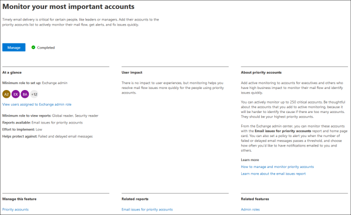

There are two ways to get started:

- Go to **Users**, and then in the "more actions" menu select **Manage priority accounts** to add users to the list.
- Go to **Setup**, find the setup task **Monitor your most important accounts**, and then select **Get started**.

For more info on priority accounts, check out [Monitoring priority accounts](https://docs.microsoft.com/microsoft-365/admin/setup/priority-accounts).

### Search faster and get better results from any page

We've started rolling out a new Search experience for the admin center, and we can't wait for you to try it out.
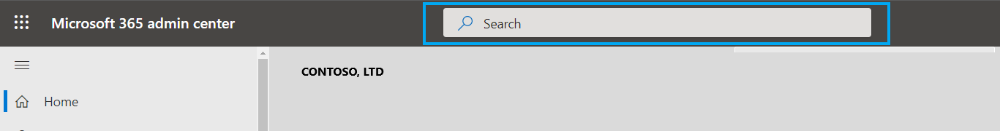

- The Search box moved to the header area where it says "Microsoft 365 admin center" so you now search from any page, not just the Home page. We've even got a shortcut: **Alt+S**.
- Search is smarter and will give you better results, even faster. Try typing "2fa" to get started.
- Search results are organized by the type of item or action you can take.
  - **Users**: Select the user's name and you can edit that user right there. If you select the "more actions" menu next to their name, you can reset their password. You can search by display name, last name, first name, username or primary email address, and email aliases. But to get an exact match, search by primary email address or username.
  - **Groups**: Edit the group from any page, add members, assign owners.
  - **Actions**: Similar to how you can search for a user and then reset their password, you can also search "reset password" from any page and then reset one or more passwords for users.
  - **Navigation**: Results under Navigation can quickly help you get to a page in the admin center quickly. For example, searching "roles" will take you to the Roles page for Azure AD roles.
  - **Settings**: Search for any setting related to your organization, the services you subscribe to, and security and privacy settings. 
  - **Domains**: You can find quick links to your domains, and then the link will take you to that domain's Overview and health page.
  - **Documentation**: If we can't find a result for you, we'll try to find some documentation to help. It takes a little longer for the curated list of articles to find a match, so wait a second to let Search find the results. 
  - **Feedback**: Didn't find what you were looking for? Send us feedback from Search. We will add searching functionality for more pages and more features across the admin center.

### Microsoft 365 admin mobile app

The [Microsoft 365 admin mobile app](https://www.microsoft.com/microsoft-365/business/manage-office-365-admin-app), which is included with your subscription, lets you manage Microsoft 365 from your mobile device so you can get away from your desk to do every day tasks. In fact, there are over 90 features in the app--and we just added a few more:

- **Support for Microsoft Intune's Mobile Application Management and Conditional Access policies**: You can now use your personal device to manage Microsoft 365 even if your org has turned on Intune's Mobile Application Management and conditional access policies.
- **Message center notifications**: Turn on message center notifications at **Settings** > **Notifications** if you wish to be alerted about new message center posts. Through notifications, we want to ensure you stay informed about important information and events across your tenant.
- **Billing alerts**: You can also turn on billing notifications at **Settings** > **Notifications** if you want to get billing notifications on your device if a subscription is about to expire.
- **Dark mode**: Welcome to the dark side of the mobile app. This was one of our most requested features. Go to **Settings** > **Themes** to turn it on.
- **Report an issue**: You can now report an issue in the app or view issues reported by other admins. Visit **Service health** to check it out.

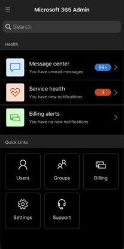

### Usage recommendations for small and medium businesses

Small and medium businesses might get a recommendation on the **Home** page if some of the people in the org aren't actively using Teams, OneDrive, or Office apps. When you view the recommendation, you can quickly email Microsoft training to inactive users to help them get started with the app and to make sure you are getting the full value from your subscriptions.

### Remote work collection

In October, we'll be adding a remote work collection to help small business owners and their staff get online and working remotely.  **Remote work essentials** setup is a curated list of all features Microsoft recommends to securely enable remote work and to collaborate effectively. In a couple of weeks, you can try it out in **Setup** > **Remote work essentials**.

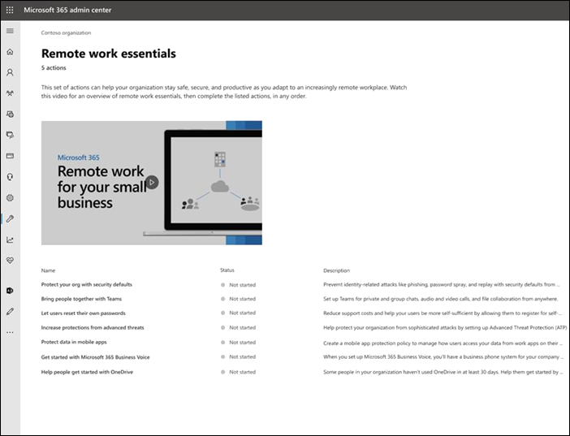

For more information about how to securely allow remote work and a handy web address that's easy to remember and share, go to [aka.ms/remote-business](https://aka.ms/remote-business).

### Need help? moving to more admin centers

We're continuously looking at and updating the content and tools to keep up with changes in the product. We now have many more self-serve diagnostic tools to help you resolve issues quickly and efficiently. Here are a few that were recently added:

- Change your Exchange Web Service throttling policy
- Checking status of Teams provisioning and validation to specific users
- Fix DKIM setup issues
- Diagnose Intune user enrollment errors

And we are rolling out the new and improved support experience you already see in the Microsoft 365 admin center to some of the other admin centers. Teams Admin Center and Security and Compliance Admin Centers already have this new experience. And soon, **Exchange admin center**, **SharePoint admin center**, and **Office.com** will be updated along with this new help experience for admins.

### Manage changes with Microsoft Planner

In May, we announced that you'll soon be able to sync Message center posts to Microsoft Planner and now it's available for everyone to use.  You can now create tasks from messages, assign them, and track them to completion. The first time, you select **Planner syncing** you'll need to connect to the appropriate plan.

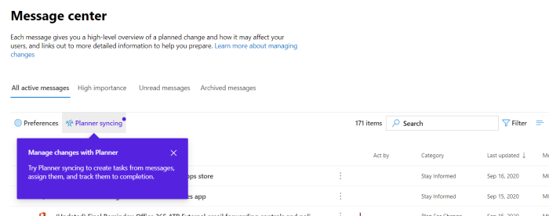

To learn more about it, check out this article and video to see how it works: [Track your message center posts in Planner](https://docs.microsoft.com/Office365/Planner/track-message-center-tasks-planner)

### Documentation, Training, and Videos

- Brand new and just in time for Microsoft Ignite--[The Virtual Hub](https://adoption.microsoft.com/virtual-hub/). Deep dive into technical training for IT pros and developers. Quickly find around 20 new videos as part of #SIDETRACKED, the name of the Ignite admin track this year.
- [What's new with Microsoft 365](https://www.youtube.com/watch?v=OVjb2lGJ4GU&t=2s) video series: This month, we cover new features available in Whiteboard for Teams and on the web, how to automate user provisioning to Azure AD, new Power Automate triggers and actions in Teams, and more. And stay tuned for next month, where we'll have a recap of all the great things happening at Ignite!
- We did a redesign of the [Microsoft 365 documentation](https://docs.microsoft.com/microsoft-365) page that focuses on solutions first. We'll highlight new solutions as they become available on this page, so keep an eye out.

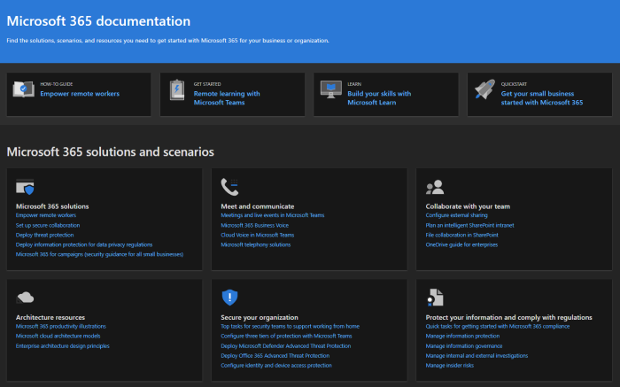

## July 2020

### Getting ready for Ignite 2020

As we're moving into Ignite season at Microsoft, we're not releasing as many features so that we have a lot to talk about during our sessions.

The next update to this article will be on opening day of our first online-only Ignite. And this year, it is free to attend! Check it out, get signed up: [Microsoft Ignite 2020](https://www.microsoft.com/ignite).

### Your products

There has been a lot of work done in the subscriptions management to make the page faster to load, faster to find what you're looking for, and to meet the web accessibility standards ([WCAG 2.1 guidelines](http://www.w3.org/TR/WCAG21/)).

- **Table redesign**: The table was redesigned so that you can group similar subscriptions. Go to **Billing** > **Your products**.
- **Product details**: Get more details than ever about your subscriptions by selecting the product in the list.
- **Do it all from here**: And you don't have to go to jump around several pages to manage one product. For example, if you need to cancel a subscription, the panel will open to do the action right there.

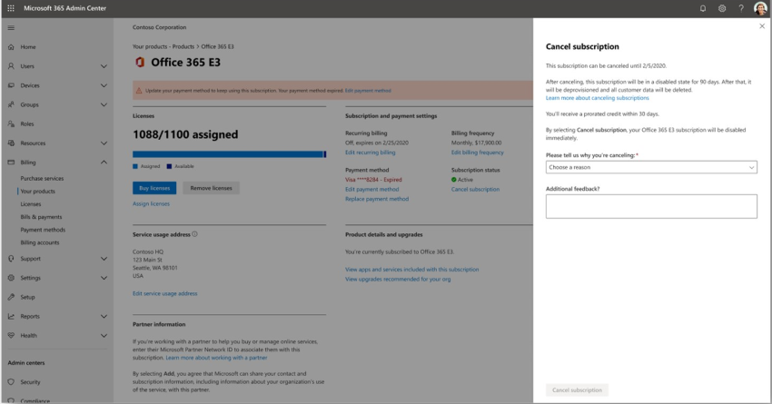

### Domains

Domain management can be complicated, and we've released a new feature to make that easier. Go to Settings > Domains and then select a domain to get more information about your domain and the domain's health.

:::image type="content" source="../media/MAC-WN-DomainDNS.PNG" alt-text="Domains details page for contoso.com":::

### Docs, training, and videos (July 2020)

[What's new with Microsoft 365](https://youtu.be/m1Nu8WJgCDY) video series: This month, we cover the new Yammer experience for web and mobile, how to integrate the Yammer Communities app for Microsoft Teams, new policy packages to support Firstline Workers and managers, and more.

## June 2020

### Keeping up with Office What's New management

A few months ago, we added a setting that lets you manage the [What's New messages that show up in a user's Office apps](#office-whats-new-management). This month, we released a new Home page card that will help you act quickly and keep track of the **What's New** messages that you want shown to the users in your organization.

### Docs, training, and videos (June)

- [Getting started with Teams](https://support.microsoft.com/office/184f1aba-2f91-43f0-86e1-9fae607e24f6)

## May 2020

### New update channel for Office

On May 12, we announced the availability of a new update channel for Office:  Monthly Enterprise Channel. This update channel provides your users with new Office features once a month, on the second Tuesday of the month.

If you allow your users to self-install Office from the portal, you can select Monthly Enterprise Channel for them. To do this, sign in to the Microsoft 365 admin center and go to **Show all** >**Settings** > **Org settings** > **Services** > **Office software download settings**. If you select **Once a month (Monthly Enterprise Channel)**, then any new self-installs of Office will be configured to use Monthly Enterprise Channel.

In conjunction with the release of Monthly Enterprise Channel, we’re also revising the names of the existing update channels. For example, Monthly Channel is being renamed to Current Channel. The new names take effect on June 9, 2020.

For more information, see [Changes to update channels for Microsoft 365 Apps](https://docs.microsoft.com/DeployOffice/update-channels-changes).

### New admin roles

We've added some new Azure Active Directory admin roles to the Microsoft 365 admin center.

- Hybrid identity admin role gives users permission to manage cloud provisioning and authentication services.
- Network admin role lets users manage network locations and review network insights for Microsoft 365 Software as a Service apps.
- Printer admin role grants permission to manage all aspects of printers and printer connections.
- Printer technician is a subset of the Printer admin role where those users can register and unregister printers, and update printer status.
To find out more about these roles, see [About admin roles](https://docs.microsoft.com/microsoft-365/admin/add-users/about-admin-roles).

### Export groups list

We've heard from a lot of admins that they need to share information about groups and their usage to people who don't have access to the admin centers. You can now export the Groups list to a CSV file for auditing purposes, which means you can throw out that old PowerShell script. To try it out, go to **Groups** > **Groups**, and then select **Export groups** from the command bar.

### Microsoft 365 solution and architecture center

Just this month, we released a new site on [https://docs.microsoft.com](https://docs.microsoft.com) called the [Microsoft 365 solution and architecture center](https://docs.microsoft.com/microsoft-365/solutions/solution-architecture-center), which brings together the technical guidance you need to understand, plan, and implement integrated Microsoft 365 solutions for secure and compliant collaboration. In this center, you'll find:

- Foundational solution guidance
- Workload solutions and scenario guidance
- Solution and architecture illustrations (The posters!!!)
- Industry specific guidance
- Enterprise architecture design principals

### Docs, training, and videos (May)

- **What's new in Microsoft 365 video series**: This month, we cover the new support experience in the Teams admin and Security and Compliance Centers, Planner integration with the Message Center, and the new 3x3 video layout in Microsoft Teams. 
- The [Microsoft 365 admin center help](https://docs.microsoft.com/microsoft-365/admin/) hub page was updated to help you find what you need more quickly. And if you go look at that page right now, we've added a card to inform you of important updates and changes.

## April 2020

### Intune roles management

[April 2020](#april-2020)

Well, we did it! We've taken the second step towards a unified roles experience and you can now manage Intune roles in the Microsoft 365 admin center. You can also leverage features such as the ability to search for roles and view role permissions. This means you don’t need two separate tools to manage roles for Microsoft 365 and Intune. When you sign into the Microsoft 365 admin center, you’ll see that there are two pivots on the Roles page, one for Azure AD and one for Intune.

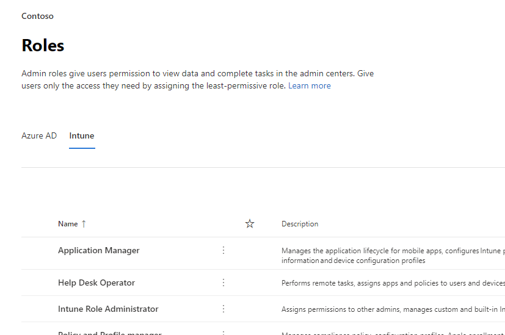

### Sync Message Center posts to Planner

Starting in May, admins who are in Targeted release will start seeing the "Planner syncing" button in the message center. You can now track messages that need action, select the type of messages you'd like to track, assign messages to track as tasks, and tag messages for later attention.

[Join Targeted Release](manage/release-options-in-office-365.md) to get started!

### "Need help?" launched in Teams admin center & Security and Compliance centers

The Teams admin center, Security center, and Compliance center are now using the same "Need help?" feature that the Microsoft 365 admin center uses for finding help and contacting support. We've received a lot of feedback from admins that you wanted the same level of help and support and we're happy to bring that to you. Try it out and give us your feedback!

#### Need chat?

Our support agents have been working from home while still taking customer cases and limitations on internet bandwidth while working from home can impact customer call quality. In order to continue supporting you, we have launched live chat support option for commercial customers in the Microsoft 365 admin center.

While creating a service request, you'll now see chat as an option, in addition to phone and email. Select chat as a preferred channel of communication and create the request. Once you've created the  request, you can start the chat when you are ready to chat with Microsoft agents.

### Teams updates

With the increased usage of Teams, we've added a few features to help you manage them.

- A new recommendation card on the admin center Home page shows which users have not actively used Teams for 30 days. You can send those users a training email to get them started using Teams.
- **Bring people together with teams**: Go to **Setup** to see a new page to help you turn on Teams for licensed users and allow guest access, so you can work with external customers in Teams.
- A Microsoft Teams card is now pinned by default to your Home page. It shows whether Teams is turned on, and if guest access is allowed. It also allows you to check the setup status for newly licensed Teams users, and check if network issues might be impacting Teams users.
- Finally, Teams is now a step in the initial set up flow if you purchased a license that includes Teams.

### Productivity score

Productivity Score gives insights about how people use Microsoft cloud services and the technology experiences that support them. The score reflects your organization’s performance against employee and technology experience measures and compares your score with organizations like yours. This month, we are introducing the following new concepts to the preview experience:

- Trend view of primary insights on home page and category detail pages
-Endpoint Analytics and Network Connectivity categories added to Technology Experience
- Relevant Technology Experience insight shown in Employee Experience categories
- New Communications category as part of Employee Experience
- User details with organizational metadata in Employee Experience categories

If you'd like to learn more, check out the blog: [Measure and improve the Microsoft 365 experience with Microsoft Productivity Score](https://techcommunity.microsoft.com/t5/microsoft-365-blog/measure-and-improve-the-microsoft-365-experience-with-microsoft/ba-p/1348618). Productivity score is currently in private preview. [Join the Productivity score private preview](https://aka.ms/productivityscorepreview) to get started.

### Groups updates

We've got two updates for Groups this month:

- You can now edit email addresses for Office 365 groups (Also known as Groups in Outlook, and soon to be known as Microsoft 365 groups).
- We've heard your feedback and we've added clearer error messaging for why you can't convert a group to a Microsoft Team.

### Docs, videos, and training (April)

**What's new in Microsoft 365 video series**: This month, we cover tips and resources to help small businesses transition to remote work including how to roll out Microsoft Teams, remote work training resources to stay connected with clients and partners, and the new Microsoft 365 Business Voice plan. [What's New in Microsoft 365](https://go.microsoft.com/fwlink/p/?linkid=2118096)

#### For your users

- [Schedule a meeting](https://support.microsoft.com/office/c61b4f61-ee62-4a06-8bf7-0a1cd302700a)
- [Join a Teams meeting](https://support.microsoft.com/office/078e9868-f1aa-4414-8bb9-ee88e9236ee4)
- [Create an org-wide team](https://support.microsoft.com/office/037bb27a-bcc9-48fe-8d72-44d9482420a3)
- [Create a Team with guests](https://support.microsoft.com/office/11fbb083-52ee-434d-8c6e-63711fdafac7)
- [Join a Team as a guest](https://support.microsoft.com/office/928d1eef-61e2-49ec-b754-c2fe86b34824)
- [Create a group email address](https://support.microsoft.com/office/ded875f9-a9de-437f-b559-2ae4f235bb2b)

#### For admins and business owners

- [Empower your small business with remote work](https://support.microsoft.com/office/9b91a85a-39b4-40a6-a590-0f9bea0ba8e6)
- [Running a remote small business](https://support.microsoft.com/office/9ac1a0f1-789b-4143-b954-5821d5d89298)
- [Sign up for Microsoft Business Basic](https://support.microsoft.com/office/9ac1a0f1-789b-4143-b954-5821d5d89298)
- [Setting up two-factor sign-in](https://support.microsoft.com/office/9ac1a0f1-789b-4143-b954-5821d5d89298)

## March 2020

### Featured Feedback Fix: Improve "add user" reliability for licensing

We received a lot of feedback from admins about the how hard it is to assign licenses when adding users. We've made the first update to this fix and we've migrated to a more reliable behind-the-scenes service to process those requests. And if something goes wrong, you'll now get an error message that lets you to try again.

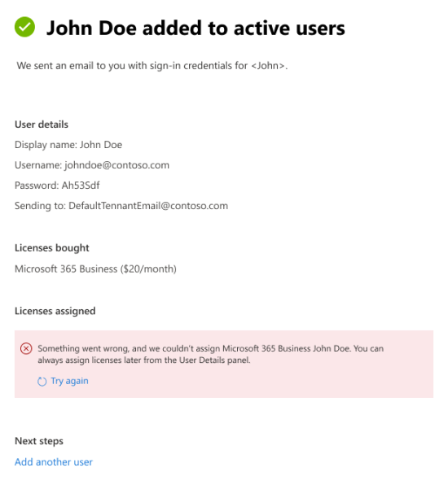

### Microsoft Teams home page card

With the uptick in Teams usage, some orgs will get a pinned dashboard card that makes turning Teams on more discoverable. The card also has links to training and docs to help your org transition to remote work. Just go to the **Home** page to see the new card.

### Customize your organization's SharePoint mobile app theme

Using the Microsoft 365 admin center, you can now customize your organization's theme in SharePoint mobile app for iOS and SharePoint mobile app for Android. This feature conveniently provides a mobile intranet app experience that can match your SharePoint Online for employees on the go. Theme customization includes your logo image, navigation bar color, text and icon colors, and accent colors, making for easy recognition.

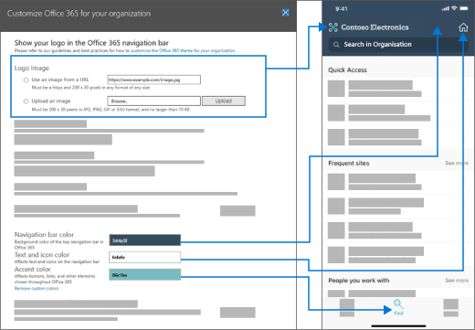

### Improvements to the "Add a group" wizard

When admins created a new group - and made it a Team at they same time, they could assign owners who don't have a license that includes Teams. And that created some headaches. We've updated the wizard flow to verify that owners have a Teams license and if they don't the option to turn the group into a Team is disabled.

### Microsoft 365 offerings for small and medium businesses

We know that this is an announcement for next month, but we want to make sure you're prepared.

Starting on April 21, we're making changes related to our Office 365 subscriptions for small and medium businesses – and to Office 365 ProPlus. These products will now use the Microsoft 365 brand.

The new product names go into effect on April 21, 2020. This is a change to the product name only, and there are no pricing or feature changes at this time.

|Current name |New name  |
|---------|---------|
|Office 365 Business Essentials     |   Microsoft 365 Business Basic      |
|Office 365 Business Premium     |    Microsoft 365 Business Standard     |
|Microsoft 365 Business     |    Microsoft 365 Business Premium     |
|Office 365 Business     |    Microsoft 365 Apps for business       |
|Office 365 ProPlus    |   Microsoft 365 apps for enterprise      |

### Videos, training, and docs

[What's New in Microsoft 365 web series](https://go.microsoft.com/fwlink/p/?linkid=2118096): In this month's episode, we highlight the 3-year anniversary of Microsoft Teams and cover new features including improved audio quality in online meetings, Targeted Communications for firstline managers with the Shifts app, Teams and Skype consumer interoperability, and more.

## February 2020

### Featured Feedback Fix: Multi-organization switcher

We received a lot of feedback from partners and admins about the challenges of managing multiple Microsoft cloud orgs. One of our first multi-org management features is the **Organization switcher**, which lets you change between the orgs that you manage in just 2 clicks.
> [!TIP]
> You don't have to do anything to make the organization switcher appear as long as you are the Partner of record for at least one organization.

1. In the Microsoft 365 admin center, select the org name.
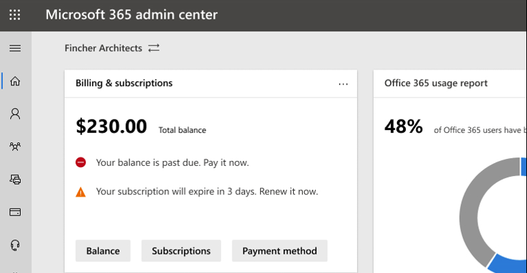

2. In the organization switcher, select the org you want to manage.

That's literally it!!!

### Groups

A couple of changes in the groups area this month:

- **Sort by group name**: You can sort the groups list alphabetically, by selecting the **Group name** column.
- **Restore deleted Microsoft 365 groups**: You don't have to go to the Exchange admin center anymore to restore  deleted Microsoft 365 groups. Go to **Microsoft 365 admin center** \> **Groups** \> **Deleted groups** \> (select a group from the list) \> **Restore group**. It'll restore the group back to the **Groups** list and restore the group's email, conversations, notebook, files, and calendar.

### Videos, training, and docs (February)

- **What's new in Microsoft 365 video series**: This month, we're focused on custom search capabilities for SharePoint Online, the Office "What's New" management feature that lets you show or hide specific features from end-users via the in-app help pane, the latest security and compliance updates in Yammer, and more. Here's the latest episode: [What's New in Microsoft 365](https://go.microsoft.com/fwlink/p/?linkid=2118096)

- **Docs move**: We combined the Office 365 admin web articles with the Microsoft 365 content and you might've noticed the new URL. For example, this article used to be hosted at: **docs.microsoft.com/Office365/Admin/whats-new-in-preview**, but the URL is now: **docs.microsoft.com/microsoft-365/admin/whats-new-in-preview**. If you've bookmarked pages, you should update your links; however, content links will be redirected to the new content repo.

## January 2020 - Happy New Year

> [!NOTE]
> Did you know that there's a [What's New in Microsoft 365](https://go.microsoft.com/fwlink/p/?linkid=2118096) video series on YouTube? It highlights the latest features that we've rolled out to users. Every month, we'll start linking to the latest episode in the [Videos, training, and docs](#videos-training-and-docs) section.     Here's the latest episode: [What's New in Microsoft 365](https://go.microsoft.com/fwlink/p/?linkid=2118096)

### Dark mode

When we first rolled out dark mode, it was only available on the Home page. Dark mode is now out of preview and is in Targeted release across most pages in the admin center.

1. First, you'll need to turn on Targeted Release: Go to **Settings** \> **Settings** \> **Organization profile** \> **Release preferences**.
1. And then to turn on dark mode, go to the **Home** page, and then select the **Dark mode** button. (It's next to the **Search** field and this article's **What's new** link.)
1. For any page that has dark mode available, the button is at the top of the page, next to **The new admin center** toggle.

### Office What's New management

Admins want control over how Microsoft communicates "What's New" to their users in the Office apps - and you now have that control. Go to **Settings** \> **Office What's New management Preview**. Select a feature to view its details, and then you can select the **Hide from users** button if you don't want your users to see a particular "what's new" message. For example, your organization might be waiting to let users know about a feature until everyone in your org is trained on it.

This feature was first released to preview in November, but there have been a few feature updates that you should know about: [Office What's New management preview updates now available](https://techcommunity.microsoft.com/t5/microsoft-365-blog/office-what-s-new-management-preview/ba-p/1020438)

### Partners

Howdy, Partners! (Couldn't help myself.) We've got an update for you this month, as well. There's a new feature that allows Partners to give CSP customers the option to accept their Microsoft Customer Agreement (MCA) in the **Billing accounts** section of the admin center. In this new experience:

1. The customer receives an invitation email with a link to accept the partner relationship and the MCA.
2. After the customer signs in, they can view and accept the MCA and partner permissions - right from the admin center.

### Resource mailboxes

The Resource mailboxes list has been updated to the new style. In the Microsoft 365 admin center, go to **Resources** \> **Rooms & equipment**.

### Videos, training, and docs (January)

Check out the small business admin training that we released in January:

- [Create your business website](https://support.microsoft.com/office/3325d50e-d131-403c-a278-7f3296fe33a9)
- [Find answers and help](https://support.microsoft.com/office/7f681212-c649-4a3e-a43b-32b1d1e58988)
- [Get help or support](https://support.microsoft.com/office/18948a4c-3eb1-4b30-b1bc-a4cc29eb7655)
- [Delete a user](https://support.microsoft.com/office/6bcdad7b-732a-4260-997a-8c176bc3d9d6)
- [Choose a Microsoft subscription](https://support.microsoft.com/office/b9f7c78e-430f-4117-89ec-2eeb1dced2ca)
- [Overview of Microsoft 365 for business security](https://support.microsoft.com/office/3274b159-a825-46d7-9421-7d6e209389d1)

## November and December 2019

We're combining November's and December's news because after Ignite we had very few announcements to make. See you in the new year!

### Change from credit card to invoice payment

We've starting to roll out the ability to change your payment method from credit card to an invoice. Go to **Billing**\> **Your products**, select a subscription, and then select the **Edit** link next to the credit card payment.

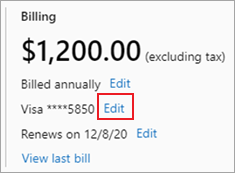

Want to read more about it? [Change from credit card or bank account to invoice](../commerce/billing-and-payments/change-payment-method.md)

### Global reader

We mentioned the Global reader role in the [October 2019 - Ignite Edition](#october-2019---ignite-edition), but as it's rolling out more broadly, let's discuss some details:

- The Global reader role is the read-only counterpart to the Global admin role. The Global reader can see everything that the Global admin has permission to do.
- With a few exceptions, like some compliance and security features, Global readers have access to view all of the Microsoft cloud admin centers that your org is licensed to use.
- Assign the Global reader role to users who need it for planning, audits, and investigations.
- You can also combine the global reader role with another role that has fewer permissions. For example, a small business owner might be assigned the **Billing admin** + **Global reader** roles so that they can pay the bills and stay on top of changes to their cloud organization.
- Global readers can go to any page in the Microsoft 365 admin center. When they open an editable page,  there will be a warning at the top telling them that they don't have permission to save changes, and the save button will be disabled.

We'd love to get your feedback about the global reader role and any of the role-based permissions that you'd like to see in the future. [Give feedback for role-based permissions](https://office365.uservoice.com/forums/273493-office-365-admin/suggestions/10115430-have-a-consistent-experience-when-assigning-admin)

### New Settings page

The **Organization profile**, **Security & privacy**, and **Services & add-ins** pages have all been combined into one page with 3 vertical tabs. And the best part -- from one single location, you can now search for all settings.
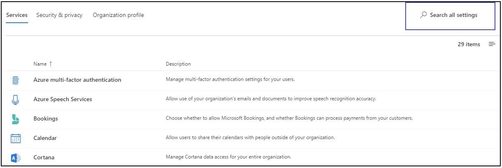

### Training & Docs

This section is a new feature of this article, where we'll start linking to new training and documentation that we think you will find interesting.

In November, we released quite a few learning paths to [Microsoft Learn](https://docs.microsoft.com/learn/) website to help IT pros learn about and get trained on Microsoft 365. Check them out:

- [Microsoft 365 fundamentals](https://docs.microsoft.com/learn/paths/m365-fundamentals/)
- [Extend Office fundamentals](https://docs.microsoft.com/learn/paths/extend-office-fundamentals/)
- [Microsoft 365 - Modernize your enterprise deployment with Windows 10 and Microsoft 365 Apps for enterprise](https://docs.microsoft.com/learn/paths/m365-getmodern/)
- [Manage your enterprise deployment with Microsoft 365](https://docs.microsoft.com/learn/paths/manage-enterprise-deployment-m365/)
- [Upgrade Microsoft Office for IT at scale](https://docs.microsoft.com/learn/paths/m365-office-for-it/)
- [Deliver remote desktops and apps from Azure with Windows Virtual Desktop
](https://docs.microsoft.com/learn/paths/m365-wvd/)
- [Modernize your workplace with Microsoft 365 and Surface for Business](https://docs.microsoft.com/learn/paths/modernize-workplace-with-m365-and-surface/)
- [Protect identity and access with Microsoft 365](https://docs.microsoft.com/learn/paths/m365-identity/)
- [Protect enterprise information with Microsoft 365](https://docs.microsoft.com/learn/paths/m365-information-protection/)
- [Manage security with Microsoft 365](https://docs.microsoft.com/learn/paths/m365-security-management/)
- [Defend against threats with Microsoft 365 Defender](https://docs.microsoft.com/learn/paths/m365-security-threat-protection/)
- [Manage team collaboration with Microsoft Teams](https://docs.microsoft.com/learn/paths/m365-manage-team-collaboration/)
- [Collaborate with SharePoint in Microsoft 365](https://docs.microsoft.com/learn/paths/m365-teams-sharepoint/)

## October 2019 - Ignite Edition

Welcome to the Ignite Edition of the What's new in the Microsoft 365 admin center! Of course, this isn't a complete list of announcements, but here are a few highlights. Also, check out the Ignite blogs for more great info about releases:

- [ADMIN - Security, Productivity, and Network Enhancements for Microsoft 365](https://techcommunity.microsoft.com/t5/Microsoft-365-Blog/ADMIN-Security-Productivity-and-Network-Enhancements-for/ba-p/964019).
- [What's New in Microsoft Teams - Ignite 2020](https://techcommunity.microsoft.com/t5/Microsoft-Teams-Blog/What-s-New-in-Microsoft-Teams-Ignite-2019/ba-p/937025).

### Role-based access control

There have been a lot of changes for Roles in the admin center since we started rolling out in June:

- **Compare roles** - Select up to 3 roles to compare the permissions for each one. This will help you find the least permissive role to assign to users. Go to **Roles**, use the multi-select checkbox in the first column to choose up to 3 roles, and then select **Compare roles**.

    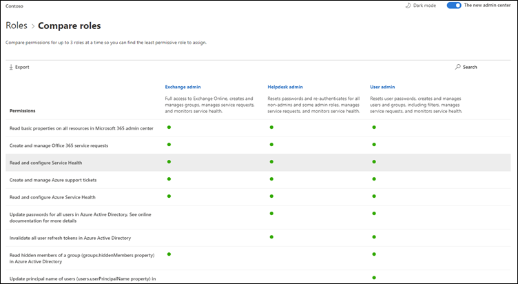

- **Favorites** - You can add a star to your favorite or most-used roles, so that you can easily find them by sorting the column or creating a filter.
- **Active users** > **Manage roles** - This has been updated to align with the changes in Roles. As with the Roles list, we've scoped the default list of roles to the most useful, but you can see all roles by expanding **Show all by category**.
- **Global reader role** - You asked for it! You got it! The [Global reader](add-users/about-admin-roles.md) role!

### Report an issue

Service health has been updated to the new style and if you are impacted by an issue that is not showing up on your Service health dashboard, you can **Report an issue** to let Microsoft know. Go to **Health** > **Service health**.

### "Viral" subscriptions

As you know, users can turn on free subscriptions to a myriad of products like Power BI and App Connect. You can now see the "viral subscriptions" that your users have been trying. Go to **Billing** > **Your products**. Select the **Account type** filter on the subscriptions tab to see the user-purchased subscriptions. If needed, you now have the ability to remove these subscriptions from your account.

### User templates

Templates allow you to easily add many users by saving and reusing the shared settings for these users. You can save values for roles, licenses assigned, contact information, location, and more. When you use the template to create a new user, they will automatically get the saved value for these settings. Go to **Users** > **Active users**, and then select **User templates** to try it out.

### Office "What's New" management (Preview)

When an important ‎Office‎ feature is released to an Office app, users will get a "What's new" card to learn about the new feature. If you don't want users to see the card, you can hide it. You can also choose when you'd like users to see the card by showing it. Go to **Settings** > **Office What's New management** to check it out.

### SharePoint URL change

Technically, this isn't the Microsoft 365 admin center's news to tell, but we're so excited we wanted to make sure you see this news:
> [!IMPORTANT]
> You can now get to YOUR SharePoint admin center with a regular URL: [https://admin.microsoft.com/SharePoint](https://admin.microsoft.com/SharePoint)

For more info, see [What's new in the SharePoint admin center](https://docs.microsoft.com/sharepoint/what-s-new-in-admin-center).

## September 2019

We are ramping up for some exciting feature releases at Ignite 2019, so we're only announcing a few new features that were released in September. But stay tuned for next month's article, it'll be published on the first day of Ignite!

### Featured Feedback Fix – The option to convert the deleted user's mailbox to a shared mailbox is back

We heard your feedback loud and clear and we brought back the ability to give someone else access to a deleted user's mailbox by converting it to a **shared mailbox**. Adding this back to the delete user wizard lets you decide what to do with the data:

- Email: Give someone else access to the deleted user's mailbox by converting it to a shared mailbox.
- Files: Save their OneDrive files and give someone else access.
- Permissions: Remove permissions if others had access to this mailbox.
- Aliases: Remove email aliases so they are available to use for another user right away.
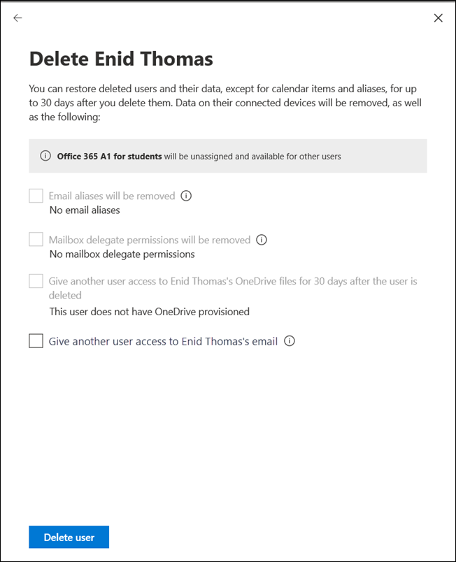

### Initial setup

There's been an update to another of our initial setup wizards: Microsoft 365 for business. The steps have been streamlined and we've moved two of the set up tasks into the Setup page:

- **Secure Windows 10 computers** - set up policies to better protect your Windows 10 devices from viruses, malware, and attacks by hackers.
- **Automatically install Office** - When you turn this on and users have connected their PCs to Microsoft 365 Business, their computers will automatically update to the latest Office apps - and stay up to date.

## August 2019

### Billing

We've got some updates for billing and subscriptions this month:

- Device-based subscriptions: You can assign or unassign **Microsoft 365 Apps for Education (device)** licenses to devices in the Microsoft 365 admin center. **Microsoft 365 Apps for Education (device)** is an add-on license that will lets you to assign a license to a device. Go to **Billing** > **Your products** to find and purchase the license.
- User-based license management: We've updated how you assign licenses in **Users** > **Active users** to the new style. For more information, see:
  - [Assign licenses to users](manage/assign-licenses-to-users.md)
  - [Unassign licenses from users](manage/remove-licenses-from-users.md)

### Setup page updates

Setup now has categories and sections, including a **Recommended for you** section where we intelligently suggest your next step in turning on features and setting up your organization. We've also added a new feature to set up:

- **Microsoft Defender for Office 365** - If your org is licensed to use Microsoft Defender for Office 365 and you haven't configured it or turned it on yet, you'll see this page. Go to **Setup** to try it out.

### Report an issue (August)

If you are impacted by an issue that is not showing up on your Service health dashboard, the **Report an issue** feature will provide you with a quick and easy way to let us know. Go to **Health** > **Service health**.

## July 2019

### Message center

The Message center has been updated to the new design and it looks amazing!

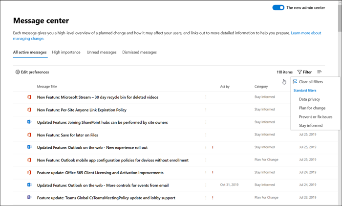

- You can now view **Messages by status**. Just select one of the tabs: **All active messages**, **High importance**, **Unread messages**, and **Dismissed messages**.
- You can also filter by category **Data privacy**, **Plan for change**, **Prevent or fix issues**, and **Stay informed** message categories.
- Select a message from the list and you have a few options in the command bar: **Dismiss**, **Mark as read** or **Mark as unread**, or **Share**.
- And when you open a message, you have even more options:
  - Copy a link of the message to your clipboard to save it for later or to share it with colleagues.
  - Mark messages as **Read** or **Unread**.
  - Give feedback about a message by selecting **Like** or **Dislike**, a feedback pane opens asking you to provide specific feedback on what you liked or didn't like about this message.

### Navigation pane intelligence

 The navigation pane now remembers your last actions and shows you the pane in the last state that you left it in. It will also make frequently used items visible by default.

### Initial setup & the Setup page

We've got some exciting changes to help you get your organization set up. First off, let's discuss the difference between **setup** and the **Setup page**. **Setup** refers to the initial setup wizard that you used to onboard to Microsoft's online services. That usually includes three specific steps: **Connect a domain**, **Add users**, and **Download the Office apps**. The **Setup page** is the page in the admin center that has recommended set up tasks to ensure that you're getting the most out of your subscriptions - like turning on features you've purchased licenses for.

- **Setup** - The initial setup wizard has been updated for **Microsoft 365 for business** subscriptions. This new design will help new organizations get through the wizard faster and with greater success.
- **Setup page** - The **Setup** page helps you finish setting up and securing the services that come with your subscriptions. You can also see any dismissed recommendations on the **Setup** page. To see if it's available for your subscriptions yet, go to the **Microsoft 365 admin center** > **Setup**.

### Billing & subscriptions

- **Software** product type - You can now view software products purchased through a Cloud Service Provider (CSP). To see your downloads and keys, go to **Billing** > **Your products** > **Software** tab.
- You can view Modern Azure products and services from the Microsoft 365 admin center, whether you purchased them from Microsoft or a third-party provider. Examples of Modern Azure products included:
  - Azure Reserved Virtual Instances
  - Azure Support Plans
  - Azure Hybrid Use Benefits (AHUB)
  - Manage Applications
  - Device Services
  - Azure Subscriptions

### Simplify multi-factor authentication

Admins have access to sensitive information in your organization. Require all admins to use multi-factor authentication when signing in. The new wizard helps you get it done with just one step. To try it out, go to **Setup** > **Strengthen sign-in security**.

### Users

The **Deleted users** and **Guest users** pages were updated to the new style.

- **Guest users**: You add guest users by inviting them to view or share files from SharePoint or OneDrive. You can view guest users from **Users** > **Guest users**.
- **Deleted users**: On the updated **Deleted users** page, you can do all the actions that you could in the older admin center, but now you add and remove columns. And we have a lot of column options to choose from. In fact, it's the same columns that you can choose on the **Active users** page.

## June 2019

### Featured feedback request - Dark mode

Viewing the admin center in dark mode is in preview! You can test it out on the **Home** page only right now. On the **Home** page, the **Dark mode** button is in the command bar next to the **What's new** link.

### Roles management

At the end of June we started rolling out new way to manage admin roles. When it's available for you, go to **Roles** > **Roles**. Until then, take a look - it's awesome!
  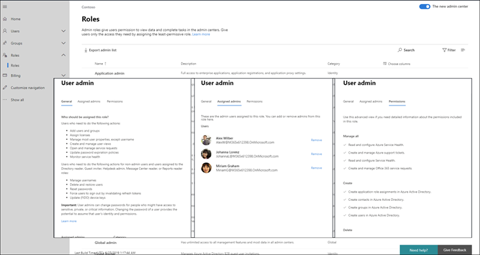  

This new experience makes it easier to see who has admin permissions and to assign roles that grant the right level of access to your admins. And we also added more roles from Azure AD so that you don't waste time going to multiple admin centers.
What else can you do here?

- Export a list of all admins in your org who are assigned Azure Active Directory roles in Microsoft 365.  
- View all admins assigned to a specific role, add or remove admins from a specific role, search for roles by name and keyword, and learn more about what each role allows a user to do.
- Quickly search for a specific role and create filters.

### Payment method

We've updated how you pay for your subscriptions. Go to **Billing** > **Bills & payments** > **Payment methods**. You can see your payment methods in a list view. Select any item in the list to remove it, edit it, and easily see which subscription that payment method is associated with.

## May 2019

### May's featured fix - Case sensitivity

Now when you search for shared mailboxes, contacts, resources, and mailbox permissions, your search terms don't have to be case-sensitive.

**User and group management**
This month, we updated **Block user**, **Reset password**, **Contacts** list view, **Groups** list view, and the **Groups** details pages to the new admin center style.

- With the new **Groups** list view, you get richer data about your groups, and you can customize the way you see your data -- and the groups list remembers how you want to see your data. For example, you can now filter on **Groups with Teams** to see if your groups are part of a Team and you can add the **Teams status** column.
- The groups list also brings with it all the improvements we made to the list experience in user management, including quick actions and the contextual command bar.

**Recommendations** 
You might see a new recommendation pop-up in your admin center - we just added 4 new ones. Of course, you'll only see recommendations if we think it will benefit your organization. But don't wait until we show you the recommendation - you can add it from the card library.

- **Password expiry** - We recommend that passwords get set to **Never expire**. And if your org has a different setting, you might just see this recommendation.
- **Too many global admins** - Because having too many global admins is a security threat, if you have more than 4 global admins, you'll see this recommendation. We suggest giving users only the access they need to get their job done.
- **Intune device protection** - If your licenses include Intune and we detect that you either haven't finished setting up Intune or enrolled your devices, we'll recommend that you create an Intune policy to protect your organization's files when users access them from their mobile devices.
- **Get monthly Office feature updates** - We've gotten feedback from our very small customers that when they get monthly Office feature updates, their users are  happier. So, if you're a very small business and you're currently get your Office feature updates every six months, you'll see this recommendation.

**Settings**  
As for settings, there have been quite a few changes. Mostly, just updating the existing settings to the new admin center style. As we're moving forward and add new settings that you've never seen before, we'll start mentioning them here. And we've got one-whole setting to announce: **Modern authentication**. Yes, there is a new setting to turn on **Modern authentication**! To check it out, go to **Settings** > **Services & add-ins** > **Modern authentication**.

## April 2019

Things are looking great for the admin center. We've been reading your feedback and suggestions, answering most of them, and really taking all you have to say to heart. Of course, we're still doing the work to make sure everything is up to parity with the old admin center. And please remember - as we roll out new features, you might not get it right away.

### Featured feature - Add users

For April, we're featuring the **Add user** wizard that walks you through...wait for it...adding users. It's a step-by-step to add the user's basic info like email and display name, assigning a license and a role, adding their contact information, and then reviewing the user's account before you commit. **Why did we make this change?** We heard your feedback that you didn't like the nearly infinite scroll to add users in the previous experience.
  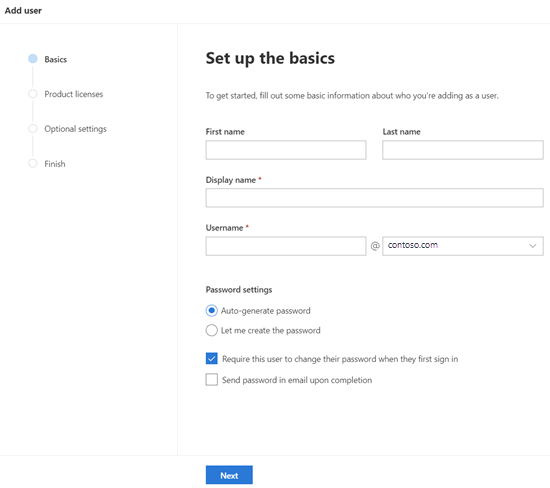  

There are two ways you can check it out:  

1. From the **Home** page, select **Add user** from the **User management** card. The wizard opens right there, so you don't have to navigate from any work you're doing on the **Home** page.
2. Go to **Users** > **Active users**, and then select **Add user** from the command bar.
  

We've made a few more changes to **user management**, here's a quick list:

- The **Manage roles** pane has been updated to the new style and is accessible. We've also updated the **Block user** and **Delete user** panes to the new style.
- **Manage product licenses** changed position in the command bar.
- Changing a user's photo is now easier. In **Active users** select a user, and then **Change photo** under their picture.

### But wait! There's more

- There's a new setup banner on the **Home** page that you'll see if you haven't finished the set up steps, like adding a domain, adding users, and downloading the Office apps.
- The **Group** list and details pane have been updated to the new style. Go to **Groups** > **Groups** to view the changes.
  - Speaking of groups, we've also added a **Microsoft Teams** tab to the groups details pane where you can turn any Microsoft 365 group into a Team. To "teamify" a group select any Microsoft 365 group from the list, select the **Microsoft Teams** tab, and then **Create Team**. If the group is already a Team, you'll get a link to manage it from the **Teams admin center**.
  - Finally, you can add the **Teams status** to the **groups** list. On the column header, select **Choose columns** > **Teams status** > **Save**.
- **New limited admin roles** - We've release some new admin roles so that you can give users only the access they need.
  - **Kaizala admin**: Users in this role have permission to perform all management tasks within Microsoft Kaizala, including create and manage users in Kaizala directory, manage Kaizala groups, manage action cards and connectors, and create service requests.
  - **Search admin**: Users in this role have full access to all Microsoft Search management features in the Microsoft 365 admin center. Search admins can delegate the Search admin and Search editor roles to users, and create and manage content, like bookmarks, Q&A items, and locations. Additionally, these users can view the Message center, monitor service health, and create service requests.
  - **Search editor**: Users in this role can create, manage, and delete content for Microsoft Search in the Microsoft 365 admin center, including bookmarks, Q&A items, and locations.
- There's a bonanza of **Billing** changes this month...
  - You can now update the CVV for existing credit cards without having to delete it and add it again. You can update the CVV by going to **Bills** > **Payment methods**.
    - We've made it easier to locate your **Invoices** and understand any billing issues your account may be having. And now you can see your Bills in the web browser instead of having to download the PDF. Go to **Bills** > **Invoices**.
    - On the **Your products** page, we now aggregate your subscription information if you've got multiple subscriptions of the same type.

## March 2019 - We've officially released the admin center

Well, if you missed the exciting news, we've officially release the new and improved Microsoft 365 admin center! Here's the blog post where we announced it: [The new Microsoft 365 admin center available today](https://techcommunity.microsoft.com/t5/Microsoft-365-Blog/The-new-Microsoft-365-admin-center-available-today/ba-p/377870). For March, we'll rely on the blog post for you to check out the features released - plus, you can also read the post for the features that are getting released in the near future, which we're not allowed to do in core content.
  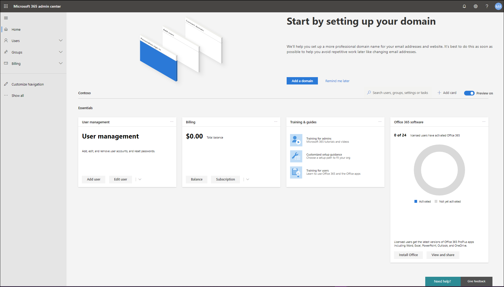  
We do have one change to the **Billing & subscriptions** area that we'd like to mention. I mean, y'all didn't think we were done with improving it, did you? Because we're not! In fact, this month we added added the ability to manage your partner relationships to **Billing** > **Billing accounts**. From here you can review your partner relationships across Advisor, CSP, and Indirect resellers. You can also accept new partner relationship requests, including delegated admin permissions.

As always, your feedback is important to us, so keep it coming! On any page in the admin center, you can give feedback by selecting **Give feedback** in the bottom-right, next to **Need help?**

## February 2019 - Billing & Subscriptions Edition

This month, we're going to focus on all the improvements we've made to the areas affectionately referred to as "Billing and subscriptions". In the past, you probably didn't refer to those things affectionately, but we think you will now...

- **Payment methods** - We heard your feedback that updating your payment method was difficult and we've made a lot of changes around it. Go to **Billing** > **Payment methods**. You can easily see your payment methods, like your Visa card, and which subscription it is associated with. In your list of payment methods, select the **More** menu (3 little dots next to the expiration date), and then select **View subscriptions**. You can also edit and delete your payment methods using the **More** menu.
- **Billing account** - Targeted release customers will see the new Billing account page first and then we'll roll it out to world-wide. When it's available for you, go to **Billing** > **Billing account**. What can you do on the new billing account page? I'm glad you asked:
  - Update the address and other contact information in your organizational profile directly from this page. You don't have to go to **Settings** > **Organization profile**, unless you want to.
  - And we're making life easier for Direct or Volume licensing customers, you can accept and review customer agreements from **Billing accounts**. You can also connect with other orgs allowing you to link the orgs together to share licenses and resources.
- We've also done a few smaller enhancements and bug fixes:
  - Reactivate a subscription with an Invoice payment
  - Edit the service usage address for your subscriptions
  - And on the Inventory details page, we've added some notification enhancements, we link you to the actual page where you can do the work, and there are more actions on the inventory details card. Go to **Billing** > **Bills** > **View details** on any invoice.

## January 2019 - Happy New Year

- Still adding in **Services & add-ins** - We've updated more of the **Settings > Services & add-ins** pages. Try Integrated Apps or Reports to see the latest.
- **Searching for improvements?** Look no further than the **Search** box in the command bar. It's been updated to let you search for tasks. For example, try "password reset" or "add a user".

### Featured Feedback Fix - Licenses and apps

We re-combined **Licenses and apps** in the user details pane based on your feedback. We initially separated the two features to provide space for the details of all license and all app possibilities. We heard from you that separating licenses and apps into two panes added confusion. We listened, and brought licenses and apps back together into one tab. Now you can make sure that an app is turned off in all licenses assigned to a user in one pane. Milk and cookies. Licenses and apps. We get it now.

Check it out: **Users > Active users > Edit** or **Add user > Licenses and Apps**
