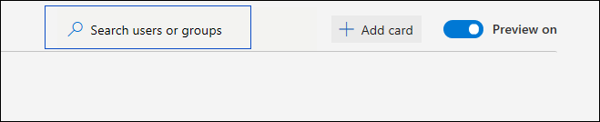
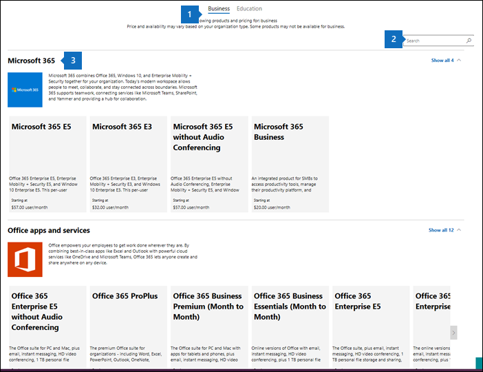
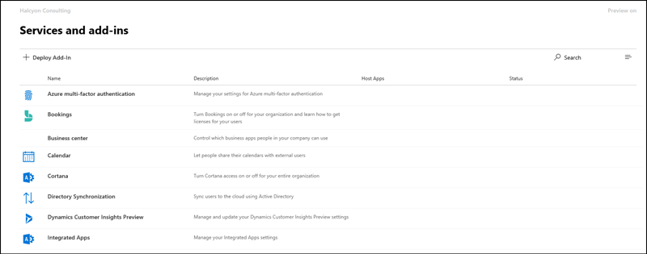
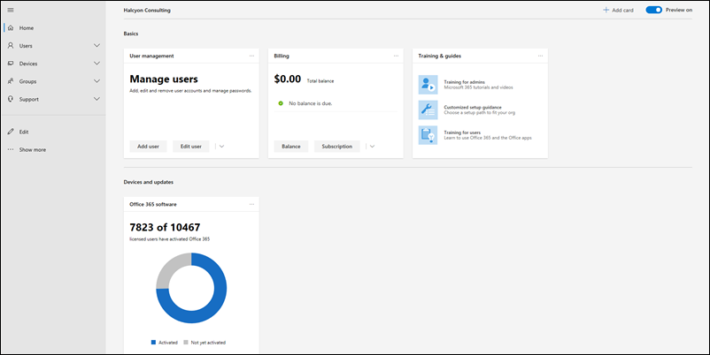
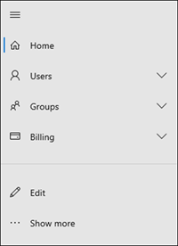
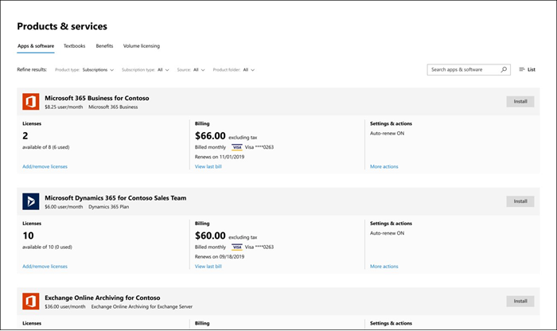
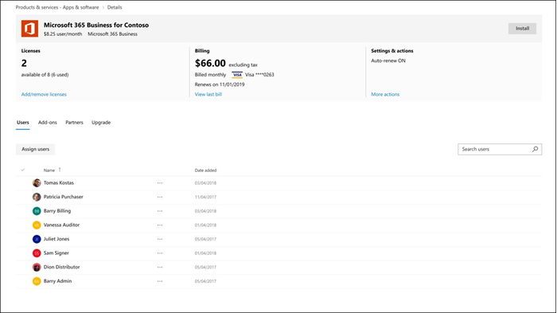
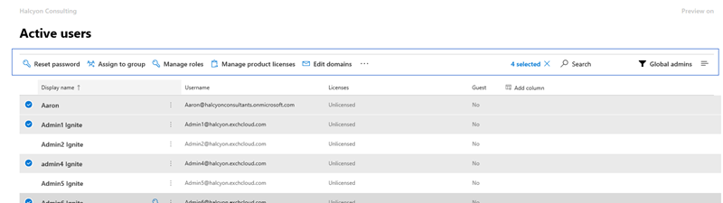
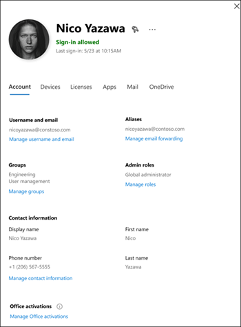

# What's new in the Microsoft 365 admin center

We're continuously adding new features to [the Microsoft 365 admin center](microsoft-365-admin-center-preview.md), fixing issues we learn about, and making changes based on your feedback. Take a look below to see what's available for you today. Some features get rolled out at different speeds to our customers. If you aren't seeing a feature yet, [try adding yourself to targeted release](manage/release-options-in-office-365.md).

> [!IMPORTANT]
> **"Classic" admin center retirement starting in March**  
When you sign-in to admin.microsoft.com, you'll now go to the new admin center every time. And in March, we will start disabling the ability to switch back to the classic admin center. For now, you can still switch back, but as the new admin center comes to parity (and exceeds it) we will turn off the switch for all organizations.    *Last updated: March 2, 2020*

And if you're interested in what's new in other admin centers:

- [What's new in the Microsoft 365 compliance center](https://docs.microsoft.com/Office365/SecurityCompliance/whats-new)
- [What's new in the SharePoint admin center](https://docs.microsoft.com/sharepoint/what-s-new-in-admin-center)

## February 2020

### Featured Feedback Fix: Multi-organization switcher

We received a lot of feedback from partners and admins about the challenges of managing multiple Microsoft cloud orgs. One of our first multi-org management features is the **Organization switcher**, which lets you change between the orgs that you manage in just 2 clicks.
> [!TIP]
> You don't have to do anything to make the organization switcher appear as long as you are the Partner of record for at least one organization.

1. In the Microsoft 365 admin center, select the org name.

2. In the organization switcher, select the org you want to manage.

That's literally it!!!

### Groups

A couple of changes in the groups area this month:

- **Sort by group name**: You can sort the groups list alphabetically, by selecting the **Group name** column.
- **Restore deleted Office 365 groups**: You don't have to go to the Exchange admin center anymore to restore  deleted Office 365 groups. Go to **Microsoft 365 admin center** \> **Groups** \> **Deleted groups** \> (select a group from the list) \> **Restore group**. It'll restore the group back to the **Groups** list and restore the group's email, conversations, notebook, files, and calendar.

### Videos, training, and docs

- **What's new in Microsoft 365 video series**: This month, we're focused on custom search capabilities for SharePoint Online, the Office "What's New" management feature that lets you show or hide specific features from end-users via the in-app help pane, the latest security and compliance updates in Yammer, and more. Here's the latest episode: [What's New in Microsoft 365](https://go.microsoft.com/fwlink/p/?linkid=2118096)

- **Docs move**: We combined the Office 365 admin web articles with the Microsoft 365 content and you might've noticed the new URL. For example, this article used to be hosted at: **docs.microsoft.com/Office365/Admin/whats-new-in-preview**, but the URL is now: **docs.microsoft.com/microsoft-365/admin/whats-new-in-preview**. If you've bookmarked pages, you should update your links; however, content links will be redirected to the new content repo.

## January 2020 - Happy New Year

> [!NOTE]
> Did you know that there's a [What's New in Microsoft 365](https://go.microsoft.com/fwlink/p/?linkid=2118096) video series on YouTube? It highlights the latest features that we've rolled out to users. Every month, we'll start linking to the latest episode in the [Videos, training, and docs](#videos-training-and-docs) section.     Here's the latest episode: [What's New in Microsoft 365](https://go.microsoft.com/fwlink/p/?linkid=2118096)

### Dark mode

When we first rolled out dark mode, it was only available on the Home page. Dark mode is now out of preview and is in Targeted release across most pages in the admin center.

1. First, you'll need to turn on Targeted Release: Go to **Settings** \> **Settings** \> **Organization profile** \> **Release preferences**.
1. And then to turn on dark mode, go to the **Home** page, and then select the **Dark mode** button. (It's next to the **Search** field and this article's **What's new** link.)
1. For any page that has dark mode available, the button is at the top of the page, next to **The new admin center** toggle.

### Office What's New management

Admins want control over how Microsoft communicates "What's New" to their users in the Office apps - and you now have that control. Go to **Settings** \> **Office What's New management Preview**. Select a feature to view its details, and then you can select the **Hide from users** button if you don't want your users to see a particular "what's new" message. For example, your organization might be waiting to let users know about a feature until everyone in your org is trained on it.

This feature was first released to preview in November, but there have been a few feature updates that you should know about: [Office What's New management preview updates now available](https://techcommunity.microsoft.com/t5/microsoft-365-blog/office-what-s-new-management-preview/ba-p/1020438)

### Partners

Howdy, Partners! (Couldn't help myself.) We've got an update for you this month, as well. There's a new feature that allows Partners to give CSP customers the option to accept their Microsoft Customer Agreement (MCA) in the **Billing accounts** section of the admin center. In this new experience:

1. The customer receives an invitation email with a link to accept the partner relationship and the MCA.
2. After the customer signs in, they can view and accept the MCA and partner permissions - right from the admin center.

### Resource mailboxes

The Resource mailboxes list has been updated to the new style. In the Microsoft 365 admin center, go to **Resources** \> **Rooms & equipment**.

### Videos, training, and docs (January)

Check out the small business admin training that we released in January:

- [Create your business website](https://support.office.com/article/3325d50e-d131-403c-a278-7f3296fe33a9)
- [Find answers and help](https://support.office.com/article/7f681212-c649-4a3e-a43b-32b1d1e58988)
- [Get help or support](https://support.office.com/article/18948a4c-3eb1-4b30-b1bc-a4cc29eb7655)
- [Delete a user](https://support.office.com/article/6bcdad7b-732a-4260-997a-8c176bc3d9d6)
- [Choose a Microsoft subscription](https://support.office.com/article/b9f7c78e-430f-4117-89ec-2eeb1dced2ca)
- [Overview of Microsoft 365 for business security](https://support.office.com/article/3274b159-a825-46d7-9421-7d6e209389d1)

## November and December 2019

We're combining November's and December's news because after Ignite we had very few announcements to make. See you in the new year!

### Change from credit card to invoice payment

We've starting to roll out the ability to change your payment method from credit card to an invoice. Go to **Billing**\> **Products & services**, select a subscription, and then select the **Edit** link next to the credit card payment.

Want to read more about it? [Change from credit card or bank account to invoice](../commerce/billing-and-payments/change-payment-method.md#change-from-credit-card-or-bank-account-to-invoice)

### Global reader

We mentioned the Global reader role in the [October 2019 - Ignite Edition](#october-2019---ignite-edition), but as it's rolling out more broadly, let's discuss some details:

- The Global reader role is the read-only counterpart to the Global admin role. The Global reader can see everything that the Global admin has permission to do.
- With a few exceptions, like some compliance and security features, Global readers have access to view all of the Microsoft cloud admin centers that your org is licensed to use.
- Assign the Global reader role to users who need it for planning, audits, and investigations.
- You can also combine the global reader role with another role that has fewer permissions. For example, a small business owner might be assigned the **Billing admin** + **Global reader** roles so that they can pay the bills and stay on top of changes to their cloud organization.
- Global readers can go to any page in the Microsoft 365 admin center. When they open an editable page,  there will be a warning at the top telling them that they don't have permission to save changes, and the save button will be disabled.

We'd love to get your feedback about the global reader role and any of the role-based permissions that you'd like to see in the future. [Give feedback for role-based permissions](https://office365.uservoice.com/forums/273493-office-365-admin/suggestions/10115430-have-a-consistent-experience-when-assigning-admin)

### New Settings page

The **Organization profile**, **Security & privacy**, and **Services & add-ins** pages have all been combined into one page with 3 vertical tabs. And the best part -- from one single location, you can now search for all settings.

### Training & Docs

This section is a new feature of this article, where we'll start linking to new training and documentation that we think you will find interesting.

In November, we released quite a few learning paths to [Microsoft Learn](https://docs.microsoft.com/learn/) website to help IT pros learn about and get trained on Microsoft 365. Check them out:

- [Microsoft 365 fundamentals](https://docs.microsoft.com/learn/paths/m365-fundamentals/)
- [Extend Office fundamentals](https://docs.microsoft.com/learn/paths/extend-office-fundamentals/)
- [Microsoft 365 - Modernize your enterprise deployment with Windows 10 and Microsoft 365 Apps for enterprise](https://docs.microsoft.com/learn/paths/m365-getmodern/)
- [Manage your enterprise deployment with Microsoft 365](https://docs.microsoft.com/learn/paths/manage-enterprise-deployment-m365/)
- [Upgrade Microsoft Office for IT at scale](https://docs.microsoft.com/learn/paths/m365-office-for-it/)
- [Deliver remote desktops and apps from Azure with Windows Virtual Desktop
](https://docs.microsoft.com/learn/paths/m365-wvd/)
- [Modernize your workplace with Microsoft 365 and Surface for Business](https://docs.microsoft.com/learn/paths/modernize-workplace-with-m365-and-surface/)
- [Protect identity and access with Microsoft 365](https://docs.microsoft.com/learn/paths/m365-identity/)
- [Protect enterprise information with Microsoft 365](https://docs.microsoft.com/learn/paths/m365-information-protection/)
- [Manage security with Microsoft 365](https://docs.microsoft.com/learn/paths/m365-security-management/)
- [Defend against threats with Microsoft 365 and Microsoft threat protection](https://docs.microsoft.com/learn/paths/m365-security-threat-protection/)
- [Manage team collaboration with Microsoft Teams](https://docs.microsoft.com/learn/paths/m365-manage-team-collaboration/)
- [Collaborate with SharePoint in Microsoft 365](https://docs.microsoft.com/learn/paths/m365-teams-sharepoint/)

## October 2019 - Ignite Edition

Welcome to the Ignite Edition of the What's new in the Microsoft 365 admin center! Of course, this isn't a complete list of announcements, but here are a few highlights. Also, check out the Ignite blogs for more great info about releases:

- [ADMIN - Security, Productivity, and Network Enhancements for Microsoft 365](https://techcommunity.microsoft.com/t5/Microsoft-365-Blog/ADMIN-Security-Productivity-and-Network-Enhancements-for/ba-p/964019).
- [What's New in Microsoft Teams - Ignite 2020](https://techcommunity.microsoft.com/t5/Microsoft-Teams-Blog/What-s-New-in-Microsoft-Teams-Ignite-2019/ba-p/937025).

### Role-based access control

There have been a lot of changes for Roles in the admin center since we started rolling out in June:

- **Compare roles** - Select up to 3 roles to compare the permissions for each one. This will help you find the least permissive role to assign to users. Go to **Roles**, use the multi-select checkbox in the first column to choose up to 3 roles, and then select **Compare roles**.

    

- **Favorites** - You can add a star to your favorite or most-used roles, so that you can easily find them by sorting the column or creating a filter.
- **Active users** > **Manage roles** - This has been updated to align with the changes in Roles. As with the Roles list, we've scoped the default list of roles to the most useful, but you can see all roles by expanding **Show all by category**.
- **Global reader role** - You asked for it! You got it! The [Global reader](add-users/about-admin-roles.md#roles-available-in-the-microsoft-365-admin-center) role!

### Report an issue

Service health has been updated to the new style and if you are impacted by an issue that is not showing up on your Service health dashboard, you can **Report an issue** to let Microsoft know. Go to **Health** > **Service health**.

### "Viral" subscriptions

As you know, users can turn on free subscriptions to a myriad of products like Power BI and App Connect. You can now see the "viral subscriptions" that your users have been trying. Go to **Billing** > **Products & services**. Select the **Account type** filter on the subscriptions tab to see the user-purchased subscriptions. If needed, you now have the ability to remove these subscriptions from your account.

### User templates

Templates allow you to easily add many users by saving and reusing the shared settings for these users. You can save values for roles, licenses assigned, contact information, location, and more. When you use the template to create a new user, they will automatically get the saved value for these settings. Go to **Users** > **Active users**, and then select **User templates** to try it out.

### Office "What's New" management (Preview)

When an important ‎Office‎ feature is released to an Office app, users will get a "What's new" card to learn about the new feature. If you don't want users to see the card, you can hide it. You can also choose when you'd like users to see the card by showing it. Go to **Settings** > **Office What's New management** to check it out.

### SharePoint URL change

Technically, this isn't the Microsoft 365 admin center's news to tell, but we're so excited we wanted to make sure you see this news:
> [!IMPORTANT]
> You can now get to YOUR SharePoint admin center with a regular URL: [https://admin.microsoft.com/SharePoint](https://admin.microsoft.com/SharePoint)

For more info, see [What's new in the SharePoint admin center](https://docs.microsoft.com/sharepoint/what-s-new-in-admin-center)

## September 2019

We are ramping up for some exciting feature releases at Ignite 2019, so we're only announcing a few new features that were released in September. But stay tuned for next month's article, it'll be published on the first day of Ignite!

### Featured Feedback Fix – The option to convert the deleted user's mailbox to a shared mailbox is back

We heard your feedback loud and clear and we brought back the ability to give someone else access to a deleted user's mailbox by converting it to a **shared mailbox**. Adding this back to the delete user wizard lets you decide what to do with the data:

- Email: Give someone else access to the deleted user's mailbox by converting it to a shared mailbox.
- Files: Save their OneDrive files and give someone else access.
- Permissions: Remove permissions if others had access to this mailbox.
- Aliases: Remove email aliases so they are available to use for another user right away.

### Initial setup

There's been an update to another of our initial setup wizards: Microsoft 365 for business. The steps have been streamlined and we've moved two of the set up tasks into the Setup page:

- **Secure Windows 10 computers** - set up policies to better protect your Windows 10 devices from viruses, malware, and attacks by hackers.
- **Automatically install Office** - When you turn this on and users have connected their PCs to Microsoft 365 Business, their computers will automatically update to the latest Office apps - and stay up to date.

## August 2019

### Billing

We've got some updates for billing and subscriptions this month:

- Device-based subscriptions: You can assign or unassign **Office 365 ProPlus for Education (device)** licenses to devices in the Microsoft 365 admin center. **Office 365 ProPlus for Education (device)** is an add-on license that will lets you to assign a license to a device. Go to **Billing** > **Products & services** to find and purchase the license.
- User-based license management: We've updated how you assign licenses in **Users** > **Active users** to the new style. For more information, see:
  - [Assign licenses to users](manage/assign-licenses-to-users.md)
  - [Unassign licenses from users](manage/remove-licenses-from-users.md)

### Setup page updates

Setup now has categories and sections, including a **Recommended for you** section where we intelligently suggest your next step in turning on features and setting up your organization. We've also added a new feature to set up:

- **Office Advanced Threat Protection** - If your org is licensed to use Office ATP and you haven't configured it or turned it on yet, you'll see this page. Go to **Setup** to try it out.

### Report an issue (August)

If you are impacted by an issue that is not showing up on your Service health dashboard, the **Report an issue** feature will provide you with a quick and easy way to let us know. Go to **Health** > **Service health**.

## July 2019

### Message center

The Message center has been updated to the new design and it looks amazing!

- You can now view **Messages by status**. Just select one of the tabs: **All active messages**, **High importance**, **Unread messages**, and **Dismissed messages**.
- You can also filter by category **Data privacy**, **Plan for change**, **Prevent or fix issues**, and **Stay informed** message categories.
- Select a message from the list and you have a few options in the command bar: **Dismiss**, **Mark as read** or **Mark as unread**, or **Share**.
- And when you open a message, you have even more options:
  - Copy a link of the message to your clipboard to save it for later or to share it with colleagues.
  - Mark messages as **Read** or **Unread**.
  - Give feedback about a message by selecting **Like** or **Dislike**, a feedback pane opens asking you to provide specific feedback on what you liked or didn't like about this message.

### Navigation pane intelligence

 The navigation pane now remembers your last actions and shows you the pane in the last state that you left it in. It will also make frequently used items visible by default.

### Initial setup & the Setup page

We've got some exciting changes to help you get your organization set up. First off, let's discuss the difference between **setup** and the **Setup page**. **Setup** refers to the initial setup wizard that you used to onboard to Microsoft's online services. That usually includes three specific steps: **Connect a domain**, **Add users**, and **Download the Office apps**. The **Setup page** is the page in the admin center that has recommended set up tasks to ensure that you're getting the most out of your subscriptions - like turning on features you've purchased licenses for.

- **Setup** - The initial setup wizard has been updated for **Office 365 for Business** subscriptions. This new design will help new organizations get through the wizard faster and with greater success.
- **Setup page** - The **Setup** page helps you finish setting up and securing the services that come with your subscriptions. You can also see any dismissed recommendations on the **Setup** page. To see if it's available for your subscriptions yet, go to the **Microsoft 365 admin center** > **Setup**.

### Billing & subscriptions

- **Software** product type - You can now view software products purchased through a Cloud Service Provider (CSP). To see your downloads and keys, go to **Billing** > **Products & services** > **Software** tab.
- You can view Modern Azure products and services from the Microsoft 365 admin center, whether you purchased them from Microsoft or a third-party provider. Examples of Modern Azure products included:
  - Azure Reserved Virtual Instances
  - Azure Support Plans
  - Azure Hybrid Use Benefits (AHUB)
  - Manage Applications
  - Device Services
  - Azure Subscriptions

### Simplify multi-factor authentication

Admins have access to sensitive information in your organization. Require all admins to use multi-factor authentication when signing in. The new wizard helps you get it done with just one step. To try it out, go to **Setup** > **Strengthen sign-in security**.

### Users

The **Deleted users** and **Guest users** pages were updated to the new style.

- **Guest users**: You add guest users by inviting them to view or share files from SharePoint or OneDrive. You can view guest users from **Users** > **Guest users**.
- **Deleted users**: On the updated **Deleted users** page, you can do all the actions that you could in the older admin center, but now you add and remove columns. And we have a lot of column options to choose from. In fact, it's the same columns that you can choose on the **Active users** page.

## June 2019

### Featured feedback request - Dark mode

Viewing the admin center in dark mode is in preview! You can test it out on the **Home** page only right now. On the **Home** page, the **Dark mode** button is in the command bar next to the **What's new** link.

### Roles management

At the end of June we started rolling out new way to manage admin roles. When it's available for you, go to **Roles** > **Roles**. Until then, take a look - it's awesome!
    

This new experience makes it easier to see who has admin permissions and to assign roles that grant the right level of access to your admins. And we also added more roles from Azure AD so that you don't waste time going to multiple admin centers.
What else can you do here?

- Export a list of all admins in your org who are assigned Azure Active Directory roles in Microsoft 365.  
- View all admins assigned to a specific role, add or remove admins from a specific role, search for roles by name and keyword, and learn more about what each role allows a user to do.
- Quickly search for a specific role and create filters.

### Payment method

We've updated how you pay for your subscriptions. Go to **Billing** > **Bills & payments** > **Payment methods**. You can see your payment methods in a list view. Select any item in the list to remove it, edit it, and easily see which subscription that payment method is associated with.

## May 2019

### May's featured fix - Case sensitivity

Now when you search for shared mailboxes, contacts, resources, and mailbox permissions, your search terms don't have to be case-sensitive.

**User and group management**
This month, we updated **Block user**, **Reset password**, **Contacts** list view, **Groups** list view, and the **Groups** details pages to the new admin center style.

- With the new **Groups** list view, you get richer data about your groups, and you can customize the way you see your data -- and the groups list remembers how you want to see your data. For example, you can now filter on **Groups with Teams** to see if your groups are part of a Team and you can add the **Teams status** column.
- The groups list also brings with it all the improvements we made to the list experience in user management, including quick actions and the contextual command bar.

**Recommendations** 
You might see a new recommendation pop-up in your admin center - we just added 4 new ones. Of course, you'll only see recommendations if we think it will benefit your organization. But don't wait until we show you the recommendation - you can add it from the card library.

- **Password expiry** - We recommend that passwords get set to **Never expire**. And if your org has a different setting, you might just see this recommendation.
- **Too many global admins** - Because having too many global admins is a security threat, if you have more than 4 global admins, you'll see this recommendation. We suggest giving users only the access they need to get their job done.
- **Intune device protection** - If your licenses include Intune and we detect that you either haven't finished setting up Intune or enrolled your devices, we'll recommend that you create an Intune policy to protect your organization's files when users access them from their mobile devices.
- **Get monthly Office feature updates** - We've gotten feedback from our very small customers that when they get monthly Office feature updates, their users are  happier. So, if you're a very small business and you're currently get your Office feature updates every six months, you'll see this recommendation.

**Settings**  
As for settings, there have been quite a few changes. Mostly, just updating the existing settings to the new admin center style. As we're moving forward and add new settings that you've never seen before, we'll start mentioning them here. And we've got one-whole setting to announce: **Modern authentication**. Yes, there is a new setting to turn on **Modern authentication**! To check it out, go to **Settings** > **Services & add-ins** > **Modern authentication**.

## April 2019

Things are looking great for the admin center. We've been reading your feedback and suggestions, answering most of them, and really taking all you have to say to heart. Of course, we're still doing the work to make sure everything is up to parity with the old admin center. And please remember - as we roll out new features, you might not get it right away.

### Featured feature - Add users

For April, we're featuring the **Add user** wizard that walks you through...wait for it...adding users. It's a step-by-step to add the user's basic info like email and display name, assigning a license and a role, adding their contact information, and then reviewing the user's account before you commit. **Why did we make this change?** We heard your feedback that you didn't like the nearly infinite scroll to add users in the previous experience.
    

There are two ways you can check it out:  

1. From the **Home** page, select **Add user** from the **User management** card. The wizard opens right there, so you don't have to navigate from any work you're doing on the **Home** page.
2. Go to **Users** > **Active users**, and then select **Add user** from the command bar.
  

We've made a few more changes to **user management**, here's a quick list:

- The **Manage roles** pane has been updated to the new style and is accessible. We've also updated the **Block user** and **Delete user** panes to the new style.
- **Manage product licenses** changed position in the command bar.
- Changing a user's photo is now easier. In **Active users** select a user, and then **Change photo** under their picture.

### But wait! There's more

- There's a new setup banner on the **Home** page that you'll see if you haven't finished the set up steps, like adding a domain, adding users, and downloading the Office apps.
- The **Group** list and details pane have been updated to the new style. Go to **Groups** > **Groups** to view the changes.
  - Speaking of groups, we've also added a **Microsoft Teams** tab to the groups details pane where you can turn any Office 365 group into a Team. To "teamify" a group select any Office 365 group from the list, select the **Microsoft Teams** tab, and then **Create Team**. If the group is already a Team, you'll get a link to manage it from the **Teams admin center**.
  - Finally, you can add the **Teams status** to the **groups** list. On the column header, select **Choose columns** > **Teams status** > **Save**.
- **New limited admin roles** - We've release some new admin roles so that you can give users only the access they need.
  - **Kaizala admin**: Users in this role have permission to perform all management tasks within Microsoft Kaizala, including create and manage users in Kaizala directory, manage Kaizala groups, manage action cards and connectors, and create service requests.
  - **Search admin**: Users in this role have full access to all Microsoft Search management features in the Microsoft 365 admin center. Search admins can delegate the Search admin and Search editor roles to users, and create and manage content, like bookmarks, Q&A items, and locations. Additionally, these users can view the Message center, monitor service health, and create service requests.
  - **Search editor**: Users in this role can create, manage, and delete content for Microsoft Search in the Microsoft 365 admin center, including bookmarks, Q&A items, and locations.
- There's a bonanza of **Billing** changes this month...
  - You can now update the CVV for existing credit cards without having to delete it and add it again. You can update the CVV by going to **Bills** > **Payment methods**.
    - We've made it easier to locate your **Invoices** and understand any billing issues your account may be having. And now you can see your Bills in the web browser instead of having to download the PDF. Go to **Bills** > **Invoices**.
    - On the **Products & services** page, we now aggregate your subscription information if you've got multiple subscriptions of the same type.

## March 2019 - We've officially released the admin center

Well, if you missed the exciting news, we've officially release the new and improved Microsoft 365 admin center! Here's the blog post where we announced it: [The new Microsoft 365 admin center available today](https://techcommunity.microsoft.com/t5/Microsoft-365-Blog/The-new-Microsoft-365-admin-center-available-today/ba-p/377870). For March, we'll rely on the blog post for you to check out the features released - plus, you can also read the post for the features that are getting released in the near future, which we're not allowed to do in core content.
    
We do have one change to the **Billing & subscriptions** area that we'd like to mention. I mean, y'all didn't think we were done with improving it, did you? Because we're not! In fact, this month we added added the ability to manage your partner relationships to **Billing** > **Billing accounts**. From here you can review your partner relationships across Advisor, CSP, and Indirect resellers. You can also accept new partner relationship requests, including delegated admin permissions.

As always, your feedback is important to us, so keep it coming! On any page in the admin center, you can give feedback by selecting **Give feedback** in the bottom-right, next to **Need help?**

## February 2019 - Billing & Subscriptions Edition

This month, we're going to focus on all the improvements we've made to the areas affectionately referred to as "Billing and subscriptions". In the past, you probably didn't refer to those things affectionately, but we think you will now...

- **Payment methods** - We heard your feedback that updating your payment method was difficult and we've made a lot of changes around it. Go to **Billing** > **Payment methods**. You can easily see your payment methods, like your Visa card, and which subscription it is associated with. In your list of payment methods, select the **More** menu (3 little dots next to the expiration date), and then select **View subscriptions**. You can also edit and delete your payment methods using the **More** menu.
- **Billing account** - Targeted release customers will see the new Billing account page first and then we'll roll it out to world-wide. When it's available for you, go to **Billing** > **Billing account**. What can you do on the new billing account page? I'm glad you asked:
  - Update the address and other contact information in your organizational profile directly from this page. You don't have to go to **Settings** > **Organization profile**, unless you want to.
  - And we're making life easier for Direct or Volume licensing customers, you can accept and review customer agreements from **Billing accounts**. You can also connect with other orgs allowing you to link the orgs together to share licenses and resources.
- We've also done a few smaller enhancements and bug fixes:
  - Reactivate a subscription with an Invoice payment
  - Edit the service usage address for your subscriptions
  - And on the Inventory details page, we've added some notification enhancements, we link you to the actual page where you can do the work, and there are more actions on the inventory details card. Go to **Billing** > **Bills** > **View details** on any invoice.

## January 2019 - Happy New Year

- Still adding in **Services & add-ins** - We've updated more of the **Settings > Services & add-ins** pages. Try Integrated Apps or Reports to see the latest.
- **Searching for improvements?** Look no further than the **Search** box in the command bar. It's been updated to let you search for tasks. For example, try "password reset" or "add a user".

### Featured Feedback Fix - Licenses and apps

We re-combined **Licenses and apps** in the user details pane based on your feedback. We initially separated the two features to provide space for the details of all license and all app possibilities. We heard from you that separating licenses and apps into two panes added confusion. We listened, and brought licenses and apps back together into one tab. Now you can make sure that an app is turned off in all licenses assigned to a user in one pane. Milk and cookies. Licenses and apps. We get it now.

Check it out: **Users > Active users > Edit** or **Add user > Licenses and Apps**

## December 2018

- **Services & add-ins** - In October we updated **Settings** \> **Services & add-ins** with our new design style, but all of the settings pages were still in the classic style. This month, we've started updating the actual settings to the new design. Check out **Bookings** to see the new look.
- **User management** - Manage username, alias, primary email address.
- We've added two Home cards to the library. You can read their full descriptions in the library.
  - **Intune Device enrollment**
  - **Domains**
- **Recommendations** - You might see a new recommendation pop-up in your admin center. Of course, you'll only see recommendations if we think it will benefit your organization. But don't wait until we show you the recommendation - you can add it from the card library.
  - **Protect sensitive info** - We recommend creating a data loss prevention (DLP) policy to detect when items containing sensitive info are shared with people outside your organization.

## November 2018

- The Search box is back! And we moved it slightly. It's still at the top of the Home page, but it's now on the right-side of the page near the **Add card** button.   

- We've added cards for the dashboard. Just go to the admin center and select **Add card** to see the new cards:
  - **Office 365 Active users report** - Monitor the usage of the Office 365 services you've purchased.
  - **Office 365 software** - Install or deploy Microsoft 365 Apps for enterprise software and see how many licensed users have activated it.
  - **Azure Active Directory** - Gives you quick access to common Azure AD tasks like self-serve password resets, customizing sign-in, and adding apps.
- The **Export users** quick task has been added to command bar on the Active users page. 
- Purchase services has additional enhancements for November. And they are ALL good! To get there, go to Billing > Purchase services.  

  > 1. At the top of the page, you can pivot between Business and Education plans. That will help you find what you're looking for.
  > 2. We added a search box so you don't have to scroll endlessly to find what you're looking for.
  > 3. Finally, we logically sorted the plans you can purchase into sections that you can expand and collapse. Don't need purchase any of the **Office apps and services**? Collapse that section and focus on Microsoft 365 plans.

## October 2018

- There's a new way to buy subscriptions in the Microsoft 365 admin center. Go to **Purchase services** to see the completely redesigned shopping experience that makes it easy to search, compare plans, and other great new features that helps make purchasing a subscription easier.  

- The **Services and add-ins** page has been updated to the new look and feel, but everything else works exactly the same. Of course, you should check out the command bar to see what new things you can do, like filtering and changing the list to compact view. In the navigation pane, go to **Settings** \> **Services &amp; add-ins** to check it out.  

## September 2018

- **Home improvements** The Home page has been completely re-done and we can't wait for you to try it out and see what you think. This is your personal Home page and you won't affect the Home pages of other admins in your organization.  

  - You can add, remove, and move home page cards around the Home page. Select **+ Add card** in the top right corner to see which cards are available in the card library, and then drag them anywhere on the Home page. Don't like where it landed? Drag it to where you want it. You don't even have to save any more.

  - Take organization to the next level by grouping cards into sections. We've created two default sections for you: **Basics** and **Devices and updates.** Very soon, you'll be able to add, remove, and rename sections to design a Home page that works for you.

  - Most of the cards are informative and actionable, which means that you'll be provided with just-in-time information to help you do your daily tasks faster and smarter.

  - The navigation pane has been re-organized and you can customize it for your quick tasks. Just select **Edit** from the bottom of the navigation pane to start customizing.  

- **Billing** You'll probably notice some of the biggest changes to the Microsoft 365 admin center in the Billing section. You can manage subscriptions and apps you've bought from Microsoft or another vendor, including new experiences for inventory management, order history, payment methods, and invoicing.

  - Subscription management has been redesigned to give you a new inventory management experience for more product types including apps, software, and add-ins. It's now called **Products &amp; services** to better reflect the support for new product types being added. You can now choose to have a card or table view of the products and services, and you can search and filter to quickly find what you're looking for.  

  - It's now easier than ever to assign a product license to your users. Select your purchased product and then you can assign the product. You can also see which users have already been assigned a particular product.  

  - **Switch plans** is now called **Upgrades** and finally the subscription upgrades happen behind the scenes so you don't have to watch the upgrade complete. Lastly, there is no longer a license limitation on upgrades.

- **User management** We've made a lot of changes to user management to help you get your work done faster. We've updated the **Active users** page and the user's details pane. Here's some of the more awesome changes:

  - There's a new design and new layout to the **Active users** page. Don't like the way the list looks? Select **Change view** (next to **Filter**) and you can change the list from **Normal list** to **Compact list**. Compact list is especially helpful if you've got a lot of users in your organization.  

  - The command bar (where **Search** lives) is dynamic and the list of actions will change depending on the number of users you've selected: no users, one user, or multiple users. You'll also see how many users you have selected next to **Search**.  

  - You can perform quick tasks like resetting passwords for single or multiple users directly from the list view.

  - The User's details and settings are now organized by the following tabs: **Account**, **Devices**, **Licenses**, **Apps**, **Mail**, and **OneDrive**. Previously, many of these settings were located across multiple screens.   
