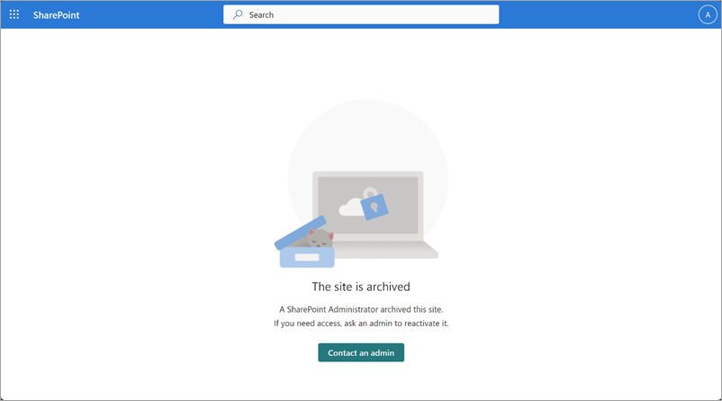

# End user experience in Microsoft 365 Archive

End users aren't able to access or search for any content that has been archived. Whenever users try to access archived content, they see a message stating that the site has been archived.



In Microsoft 365 Archive, admins have an option to set a custom URL where the user requests for reactivation can be directed to. This can take users to any URL you choose, such as a form, a ticketing system, or other location accessible via a URL. Once configured, users will see a **Request to reactivate** button when they encounter archived content.

This custom URL can be set via a flag (``-ArchiveRedirectUrl``) in the Set-SPOTenant PowerShell cmdlet starting in version 16.0.23408.12000.

```PowerShell
Set-SPOTenant -ArchiveRedirectUrl <url>
```

**Example:** Set-SPOTenant -ArchiveRedirectUrl <https://contoso.sharepoint.com/sites/ReactivateSite>

To remove the custom URL and the **Request to reactivate**  button:

```PowerShell
Set-SPOTenant -ArchiveRedirectUrl ""
```

> [!NOTE]
>For a multi-geo tenant, the URL needs to be set for each geo location.

The **Request to reactivate** button won't be visible if a redirect URL hasn't been set.
