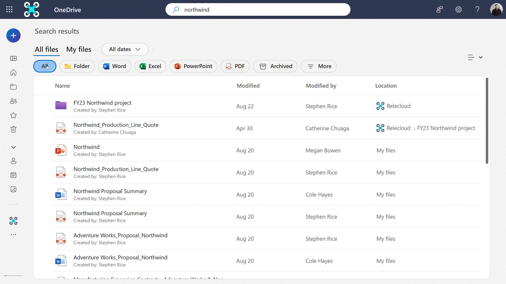
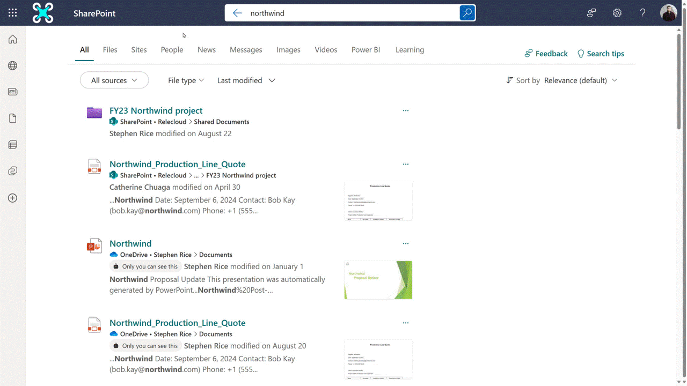

---
# Required metadata
# For more information, see https://learn.microsoft.com/en-us/help/platform/learn-editor-add-metadata
# For valid values of ms.service, ms.prod, and ms.topic, see https://learn.microsoft.com/en-us/help/platform/metadata-taxonomies

title:       Overview of searching for content in Microsoft 365 Archive
description: Learn about how end-users can search for archived content
author:      trent-green # GitHub alias
ms.author:   trgreen # Microsoft alias
manager: brgussin
ms.service:  microsoft-365-archive
ms.topic:    how-to
ms.date:     09/17/2025
---

# Overview of searching for content in Microsoft 365 Archive

Content that has been archived either via site archive or file archive can be found by end-users. End-users can utilize SharePoint or OneDrive search to find these archived results. The results follow permission trimming and will still search the contents of files, exactly as search works for active content. 

### Archived content in OneDrive web search

In OneDrive web search, users can select the "Archived" pill to return archived results. This returns relevant content that is part of an archived site or has been archived at the file level. Content that has been archived at the file level can be reactivated by the current user. Content that is part of an archived site requires a SharePoint administrator to reactivate before it can be accessed. 

### Archived content in SharePoint web search

In OneDrive web search, users can choose to include archived content by selecting the "Archived" option under the "file-type" dropdown. This returns relevant content that is part of an archived site or has been archived at the file level. Content that is part of an archived site requires a SharePoint administrator to reactivate before it can be accessed. 

