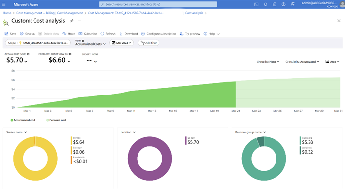
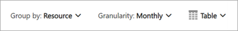

# Departmental Billing for Microsoft 365 Backup 

If you are a large organization with multiple departments and want to manage Microsoft 365 Backup within departments or groups, departmental billing may be the right fit for you. Departmental billing will help you achieve the following: 

1. Breakdown backup costs by different azure subscriptions
2. Limit Backup management (creation and update) to certain admins within departments with Role-based-access-control(RBAC)
3. Prevent admins from another department using your azure susbcritpion to cause unapproved backup charges

**Role-Based-Access-Control within departments**: To limit admins who can manage Backup within a department or group, every backup admin should also have an Owner or Contributor role on the subscription. This way only an approved admin who is given spending power on a subscription can create and edit backups and cause consumption to the department's azure subscription. If you are an owner for the department's subscription, we recommed giving the lower privileged 'Contributor' role to backup admins in your department if they do not need privileges to add additional admins to the subscription. 

### Set up departmental billing

To set up departmental billing for your tenant, follow these steps. 

1. Create billing policies and connect them to Microsoft 365 Backup following the instructions in <a href="/microsoft-365/commerce/services/pay-as-you-go-setup-billing-node" target="_blank">**Pay-as-you-go Setup**</a> for Microsoft 365 Backup.
2. In the **Services** tab of **Pay-as-you-go** page, select **Microsoft 365 Backup**.
3. To enable departmental billing, in the **Settings** tab of Microsoft 365 Backup page, select the checkbox for limiting management of Backup within departments
   
   

    Now that departmental billing with Backup is enabled for your tenant, Admins who have been assigned Owner / Contributor Azure roles to the billing policies connected to Backup can only create and edit backup policies.
   
5. You can create backup for your department by creating <a href="https://learn.microsoft.com/microsoft-365/backup/backup-setup?view=o365-worldwide#2-create-backup-policies-to-protect-your-data" target="_blank">**backup policies as outlined here**</a>.
   In Create / Edit policy wizard, admins will need to associate a Billing Policy with a Backup Policy. In the billing policy list, admins will only be able to see billing policies that they Owner/Contributor access.  
    

> [!NOTE]
> **Once you have enabled departmental billing, admins who have been assigned Owner / Contributor Azure roles to the billing policies connected to Backup can only create and edit backup policies.**

Admins who do not have RBAC rights to your backup policies will not be able to use your billing policy to create backup policies or edit backup polciies created by admins in your department. Billing policies will show as **Confidential** for admins who do not have access. 

### Change Billing policies associated with Backup policies 
Once a Billing Policy is associated with a Backup Policy, it can be updated from the Backup Dashboard  

  1. Select the Backup policy you want to update the Billing Policy, click on the 3-dots next to backup policy name and select **Update Billing policy**
        

### Disable departmental billing
If you wish to manage Backup without the RBAC control of restricting Backup management to Owner or Contributor of subscriptions, you can simply uncheck the box in Settings tab Microsoft 365 Backup page.  

# Manage consumption and invoices for Microsoft 365 Backup

You can view actual and accumulated cost breakdown by tenants and service type for OneDrive, SharePoint, and Exchange in Microsoft Cost Management in the Azure portal or access the information by using the [Cost Management public APIs](/rest/api/cost-management/operation-groups). Cost breakdown by application ID is coming soon.

 

> [!VIDEO https://learn-video.azurefd.net/vod/player?id=a87d77a7-2c88-43fc-ae8c-5ba42765f956]

 

1. Sign in to the [Azure portal](https://portal.azure.com/).

2. Search for *Cost Management + Billing*.

3. Select **Cost analysis** to see:

    - Accumulated cost and forecast cost.

    - Select **+Add Filter** to see breakdown of cost by meters and tags.

       

You can also export daily cost information using billing export feature in Azure portal. For more information, see [Tutorial: Create and manage exported data](/azure/cost-management-billing/costs/tutorial-export-acm-data?tabs=azure-portal).

### Billing attribution by tenants, service type, and applications

You can see actual cost breakdown by tags in Azure portal. There are currently two tags available for Microsoft 365 Backup: **tenants** and **servicetype**.

To view tags:

1. Select **+Add Filter** to see breakdown of cost by meters and tags.

2. Select the tag:

    - In the key-value pair, select **tenants** or **servicetype**, and then select the respective tenant ID or service type.

        - **tenants** shows a list of tenant IDs.

        - **servicetype** is OneDrive, SharePoint, or Exchange.

        - **applications** shows a list of app IDs.

        - Exchange mailbox - Not available.

        - OneDrive account - SiteId of the corresponding OneDrive site.

        - SharePoint site - SiteId of the corresponding SharePoint site.

    - Azure cost analysis - filter by tag.
    
    - The tag for OneDrive is its siteID. To convert this back to a userID, you can use the following API: `https://graph.microsoft.com/v1.0/sites/<siteid>/drive?select=owner`

4. In the left navigation, select **Billing** to see monthly invoices.

    We recommend using this view to see the costs by resources for Microsoft 365 Backup.

    

5. Set up budget alerts on cost by following the steps in the [Cost Management public APIs](/rest/api/cost-management/operation-groups).

> [!WARNING]  
>The **MailboxDbGuid** tag in the Azure consumption report is intended for Microsoft internal use only. We recommend that you do not rely on it because its value might change. Note that this is different from the MailboxId.
