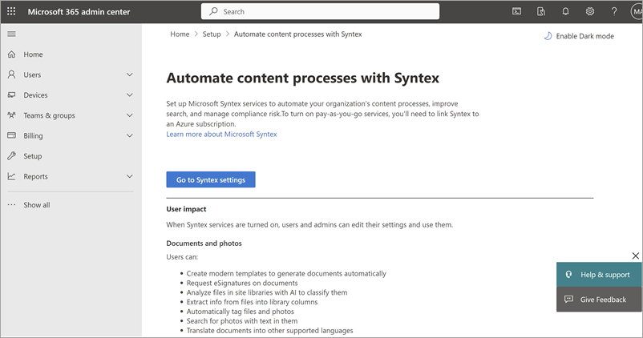

# Manage billing and invoices for Microsoft 365 Backup

As a first step to start using Microsoft 365 Backup, you should link an Azure subscription in Microsoft Syntex pay-as-you-go, if you haven't already done so. Although Microsoft 365 Backup isn't part of the Microsoft Syntex product suite, this offering is still using the Syntex billing setup for consistency with other Microsoft 365 pay-as-you-go offerings.

## Set up pay-as-you-go billing

Use these steps to set up pay-as-you-go billing for Microsoft 365 Backup.

1. In the [Microsoft 365 admin center](https://admin.microsoft.com/Adminportal/Home), select **Setup**.

2. Under **Files and content**, select **Automate content processes with Syntex**.

3. On the **Automate content processes with Syntex** page, select **Go to Syntex settings**.

    

    > [!NOTE]
    > To set up pay-as-you-go billing for Microsoft 365 Backup, you must provide an owner or contribution role on the Azure subscription to be used.

4. If you ***don't*** have an Azure subscription or resource group, follow these steps. If you have an Azure subscription and resource group, go directly to step 5.

    To create a new Azure subscription with the same organization and Microsoft Entra tenant as your Microsoft 365 subscription:

    1. Sign in to the [Azure portal](https://portal.azure.com) with your Microsoft 365 admin, Microsoft Entra DC admin, or [Global Administrator](/entra/identity/role-based-access-control/permissions-reference#global-administrator) account.

        [!INCLUDE [global-administrator-note](../includes/global-administrator-note.md)]

    1. In the left navigation, select **Subscriptions**, and then select **Add**.

    1. On the **Add subscription** page, select an offer and complete the payment information and agreement.

    To create a new Azure resource group:

    1. On the **Set up pay-as-you-go billing** panel, select **Learn more about Azure resource groups**.

    1. Or, you can follow steps in [Manage Azure resource groups by using the Azure portal](/azure/azure-resource-manager/management/manage-resource-groups-portal) to create a resource group.

    

    > [!NOTE]
    > The resource group should be mapped to the Azure subscription you provided when you set up pay-as-you-go.

5. If you ***have*** an Azure subscription, follow these steps:

    1. On the **Set up pay-as-you-go billing** panel, under **Azure subscription**, select the subscription from the dropdown list.

       > [!NOTE]
       > The subscription dropdown list will not populate if you don't have an owner or contributor on the subscription.

       

    1. Under **Resource group**, select the resource group from the dropdown list.

    1. Under **Region**, select the region from the dropdown list.

    1. Review and accept the terms of service, and then select **Save**.

You have successfully set up billing. You can proceed to [Step 2: Turn on Microsoft 365 Backup](backup-setup.md#step-2-turn-on-microsoft-365-backup).

> [!NOTE]
> Any subsequent changes made to the billing for Microsoft 365 Backup in the Microsoft 365 admin center or the Azure portal can take up to 24 hours to become effective.

## Manage consumption and invoices in the Azure portal

You can view actual and accumulated cost breakdown by tenants and service type for OneDrive, SharePoint, and Exchange in Microsoft Cost Management in the Azure portal or access the information by using the [Cost Management public APIs](/rest/api/cost-management/operation-groups). Cost breakdown by application ID is coming soon.

1. Sign in to the [Azure portal](https://portal.azure.com/).

2. Search for *Cost Management + Billing*.

3. Select **Cost analysis** to see:

    - Accumulated cost and forecast cost.

    - Select **+Add Filter** to see breakdown of cost by meters and tags.

       

You can also export daily cost information using billing export feature in Azure portal. For more information, see [Tutorial: Create and manage exported data](/azure/cost-management-billing/costs/tutorial-export-acm-data?tabs=azure-portal).

### Billing attribution by tenants, service type, and applications

You can see actual cost breakdown by tags in Azure portal. There are currently two tags available for Microsoft 365 Backup: **tenants** and **servicetype**.

To view tags:

1. Select **+Add Filter** to see breakdown of cost by meters and tags.

2. Select the tag:

    - In the key-value pair, select **tenants** or **servicetype**, and then select the respective tenant ID or service type.

        - **tenants** shows a list of tenant IDs.

        - **servicetype** is OneDrive, SharePoint, or Exchange.

        - **applications** shows a list of app IDs.

        - Exchange mailbox - Not available.

        - OneDrive account - SiteId of the corresponding OneDrive site.

        - SharePoint site - SiteId of the corresponding SharePoint site.

    - Azure cost analysis - filter by tag.

4. In the left navigation, select **Billing** to see monthly invoices.

    We recommend using this view to see the costs by resources for Microsoft 365 Backup.

    

5. Set up budget alerts on cost by following the steps in the [Cost Management public APIs](/rest/api/cost-management/operation-groups).

> [!WARNING]  
>The **MailboxDbGuid** tag in the Azure consumption report is intended for Microsoft internal use only. We recommend that you do not rely on it because its value might change. Note that this is different from the MailboxId.
