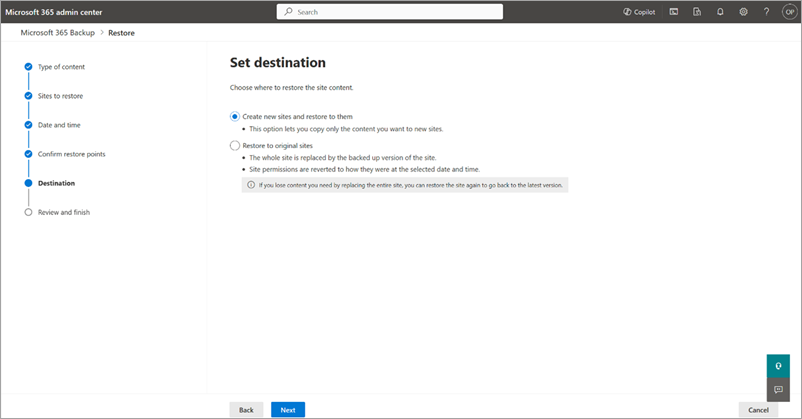

# Restore data in Microsoft 365 Backup

Once you back up your data, you might need to restore the data if there was an accidental deletion, ransomware attack, or other event. The restore feature in Microsoft 365 Backup is created to help you restore backed up data.

As part of restoring data from backup, admin needs to choose a *restore point* manually or from a tool-recommended OneDrive or SharePoint *express restore point*. A restore point is a prior point in time from which you can restore a healthy version of your content or metadata. For Exchange Online, if the data from a prior point in time is identical to the present state of your data, then there will be no items restored, including Restore to a new folder.

Currently, you can restore OneDrive accounts, SharePoint sites, and Exchange mailbox content from specific prior points in time from the backups.

## Restore point frequency

The restore point frequency, also known as the [recovery point objective](backup-faq.md#what-is-the-service-recovery-point-objective) (RPO), defines the maximum amount of time during which data is lost after an attack. Stated differently, it’s the time between the most recent backup of the healthy state of data and the time of the attack. The RPOs for each of the protected services are summarized in the following table.

|Type  |RPO for 0-14 days in the past  |RPO for 15-365 days in the past  |
|---------|---------|---------|
|Full OneDrive account and full SharePoint site restore    |10 minutes     |One week     |
|Exchange Online   |10 minutes         |10 minutes         |

## Restore data from backup for OneDrive, SharePoint, and Exchange

Select the **OneDrive**, **SharePoint**, or **Exchange** tab for steps to restore data from backup for that product.

# [OneDrive](#tab/onedrive)

> [!NOTE]
> We recommend choosing an express restore point for full account or site restores, as it will provide the fastest restore experience. Express restore is currently only relevant for SharePoint and OneDrive.

Follow these steps to restore data backed up for OneDrive.

1. In the Microsoft 365 admin center, on the **Microsoft 365 Backup** page, in the **OneDrive** section, select **Restore**.

2. On the **Select type of content** page, **OneDrive accounts** is preselected. Select **Next**.

    

3. From the list of backed up OneDrive accounts, select the accounts to restore, and then select **Next**.

4. On the **Select the date and time** page, select the date and time from which you want to restore the content.

    

    Choose a recommended restore point from **Select a faster restore point**, which offers a faster restore compared to standard restore points.

    

    Backup restores the closest backed up content *before* the specified date and time. Select **Next**.

    For example, assume backup is taken October 2, 2023 8:00 AM and October 2, 10:00 AM PST. If you select date and time as October 2, 2023 9:00 AM PST, Microsoft 365 Backup will restore the OneDrive and its content to its state on October 2, 2023 8:00 AM PST.

5. On the **Confirm restore points** page, you see a list of available express restore points that restore with better performance than nonexpress restore points. We highly recommend that you choose an express restore point all else equal.

    

6. Confirm the restore point in time to which the data will be restored from backup. If the restore point is correct, select **Next**.

    Restoring a OneDrive to a prior point in time, if restored to the same URL, overwrites the OneDrive-scoped metadata and the content of the OneDrive to match the exact state at the prior point in time. If restored to a new URL, the content and OneDrive-scoped metadata will be restored to that prior point in time in the new URL.

7. On the **Select another backup** panel, choose another backup for the account selected, if needed.

    

8. On the **Choose destination** page, selected OneDrive accounts can be restored by choosing  either the **Replace accounts with backups** or **Create new SharePoint sites and restore to them** option.

    

    a. **Replace accounts with backups**. The entire OneDrive is replaced by the backed-up version chosen based on the restore point. File and folder permissions are also reverted to the selected date and time.

    b. **Create new SharePoint sites and restore to them**. The entire OneDrive is restored to a new SharePoint site. You can then copy or move data into the original OneDrive to create a roll-forward type of restore and avoid overwriting currently healthy data.  When you restore using this option, the new site URL will have an "R" followed by a number concatenated to the end. For example, if the original URL was `https://contoso-my.sharepoint.com/personal/user1_contoso_com` the restored site could be `https://contoso-my.sharepoint.com/personal/user1_contoso_comR0`. The number at the end increments to avoid URL name conflicts up to 1,000 total restores. After that you should delete some of those new URLs to clear namespace for future new-URL restores.

9. On the **Review and Finish** page, review and finish all your choices. If everything looks as you want it, select **Restore OneDrive accounts**.

    

# [SharePoint](#tab/sharepoint)

> [!NOTE]
> We recommend choosing an express restore point for full account or site restores, as it will provide the fastest restore experience. Express restore is currently only relevant for SharePoint and OneDrive.

Follow these steps to restore data backed up for SharePoint.

1. In the Microsoft 365 admin center, on the **Microsoft 365 Backup** page, in the **SharePoint** section, select **Restore**.

2. On the **Select type of content** page, you see **SharePoint site content** preselected. Select **Next**.

    

3. From the list of backed up SharePoint sites, select the sites to restore, and then select **Next**.

4. On the **Select the date and time** page, select the date and time from which you want to restore the content.

    

    Choose a recommended restore point from **Select a faster restore point**, which provides a faster restore compared to standard restore points. We recommend choosing a fast restore point because it can restore faster for single site restores, especially smaller ones (on the order of 10 to 120 minutes on average).

    

    Backup restores the closest backed up content *before* the specified date and time. Select **Next**.

    For example, assume backup is taken October 2, 2023 8:00 AM and October 2, 2023 10:00 AM PST. If you select date and time as October 2, 2023, 9:00 AM PST, Microsoft 365 Backup will restore the site and its content to the state present on October 2, 2023 8:00 AM PST.

5. On the **Confirm restore points** page, you see a list of available express restore points that restore with better performance than nonexpress restore points. We highly recommend that you choose an express restore point all else equal.

    

6. Confirm the restore point in time to which the data will be restored from backup. If the restore point is correct, select **Next**.

    Restoring a SharePoint site to a prior point in time, if restored to the same URL, overwrites the SharePoint-scoped metadata and the content of the SharePoint site to match the exact state at the prior point in time. If restored to a new URL, the content and SharePoint-scoped metadata will be restored to that prior point in time in the new URL.

7. On the **Select another backup** panel, choose another backup for the site selected, if needed.

    

8. On the **Choose destination** page, selected SharePoint sites can be restored by choosing  either the **Replace sites with backups** or **Create new sites from backups** option.

    

    a. **Replace sites with backups**. The entire original site is replaced by the backed-up version chosen based on the restore point. File and folder permissions and all metadata states are also reverted to the selected date and time.

    b. **Create new sites from backups**. The entire site is restored to a new SharePoint site. You can then copy or move data into the original site or a different site to create a roll-forward type of restore and avoid overwriting currently healthy data.  When you restore using this option, the new site URL will have an "R" followed by a number concatenated to the end. For example, if the original URL was `https://contoso.sharepoint.com/sites/originalSite` the restored site could be `https://contoso.sharepoint.com/sites/originalSiteR0`. The number at the end increments to avoid URL name conflicts up to 1,000 total restores. After that you should delete some of those new URLs to clear namespace for future new-URL restores.

9. On the **Review and Finish** page, review and finish your choices. If everything looks as you want it, select **Restore sites**.

    
  
# [Exchange](#tab/exchange)

Microsoft 365 Backup restores deleted or modified mailbox items from the selected prior point in time. Items that remain unchanged in the primary mailbox are compared to that prior point in time, and new items since that prior point in time aren't restored, reverted, or overwritten. This is true whether an in-place or new-folder restore is conducted and is done to prevent excessive operations that might overload your mailbox and its associated storage allocation.

Follow these steps to restore data backed up for Exchange.

1. In the Microsoft 365 admin center, on the **Microsoft 365 Backup** page, in the **Exchange** section, select **Restore**.

2. On the **Select type of content** page, you see **Exchange mailbox content (emails, notes, contacts, calendars, and tasks)** preselected. Select **Next**.

3. From the list of backed up Exchange accounts, select the accounts to restore, and then select **Next**.

4. On the **Content scope** page, you see two options to choose from:

    - [Option 1: All emails, notes, contacts, calendars, and tasks](#option-1-all-emails-notes-contacts-calendars-and-tasks)
    - [Option 2: Selected content only](#option-2-selected-content-only)

### Option 1: All emails, notes, contacts, calendars, and tasks

1. Use this option to perform a full mailbox restore of all modified and deleted items. On the **Content scope** page, the **All emails, notes, contacts, calendars, and tasks** option will restore all modified or deleted emails, notes, contacts, and tasks, and calendar items for that user account to the specified time and date. Select **Next**.

    

    For example, the last time the end user remembers seeing their mailbox in a "good state" was October 2, 2023 8:00 AM. However, on October 2, 2023 9:00 AM they saw all of their emails were encrypted (possible ransomware attack), choose the last known good time as October 2, 2023 8:00 AM.

2. Confirm the restore point in time to which the data will be restored from backup. The page informs you whether there are any backups to restore from the Last known good (LKG) time chosen. If you see no errors, you can proceed. If there are errors, you can choose another LKG time. Select **Next**.

3. The destination of restored items can be chosen from two options, then select **Next**.

    a. **Create a new folder for the backups** where the content will be restored to a newly created folder named *Restored Items YYYY-DD-MM, HH:MM*.

    b. **Replace mailbox items with backups** where current version of the item will be overwritten by the restored content.

4. On the **Review and finish** page, review and finish all your choices. If everything looks as you want it, select **Restore user mailboxes**.

5. Track the progress of your newly created task on the **Restoration tasks** tab.

### Option 2: Selected content only

1. Use this option to perform a partial mailbox restore. On the **Content scope** page, the **Selected content only** option gives the admin the ability to do a granular restore (not full mailbox restore).

    

    The search for items is based on four options:

    - Sender
    - Recipient
    - Has attachment
    - Keywords

    Choose the time period, then filter and value that you want to do a granular search on to find matching items.
  
2. Confirm the restore point in time to which the data will be restored from backup. If the restore point is what you want, select **Next**.

3. The destination of restored items can be chosen from two options, then select **Next**.

    a. **Restore to a new folder** where the content will be restored to a newly created folder named *Recovered Items YYYY-MM-DD, HH:MM*.

    Example:

    

    b. **Restore in place** where the current version of the item will be overwritten by the restored content.

4. On the **Review and Finish** page, review and finish all your choices. If everything looks as you want it, select **Restore user mailboxes**.

5. Track the progress of your newly created task on the **Restoration tasks** tab.

---

### States of backup

|States  |Definition  |
|---------|---------|
|Active     | Protection scope selected under backup policy is being actively backed up. |
|Paused     | No further backups will be taken but already taken backups will be preserved. |
|Not set up | No backup policy is set up for this scope.  |
|Processing | A change to backup policy or a restore is in progress.  |

## Multi-geo environments

Microsoft 365 Backup supports restoring sites and user accounts from both central and satellite locations if the multi-geo feature is enabled on your tenant. This lets you:

- View sites or accounts from all the geos while selecting sites or accounts during the restore operation.

- Add or remove sites or accounts from all the geos during the restore operation.

Microsoft 365 Backup supports the backup and restoration of any site and user account even if that site or user account has moved from one geo to another geo. If the site or user account has moved to a new geo, and you’re restoring data from a prior point back in time when the site or user account was in older geo, then the restored site or user account will be available in the new geo.

> [!NOTE]
> After a multi-geo move, a OneDrive account and SharePoint site will only be able to restore to the weekly restore points until an enhancement is deployed (enhancement coming soon).

## Considerations when using restore

- Site search is case-sensitive and is a prefix-type search.

- SharePoint sites and OneDrive accounts being restored to a prior point in time aren't locked in a read-only state. Therefore, users might not realize their current edits will be imminently rolled back and lost.

- For restores to a new URL, it might take up to 15 minutes for the destination URL to be displayed in the tool once a SharePoint site or OneDrive account restore to a new URL session completes.

- For restores to a new URL, only the admin who executed the restore has ownership permissions for the restored SharePoint sites or OneDrive accounts in the new URLs. Restores to the same URL reverts permissions to their original state.

- A site or OneDrive account that is under the strict SEC 17a-4(f) hold policy will fail any in-place restores so as to honor that immutability promise. For sites under that type of hold, you have to restore to a new URL or remove the hold. Any other type of preservation hold that doesn't have a strict admin lockout will allow an in-place restore. Restoring these types of sites as the preservation hold library will be reverted to the prior point in time. A new URL restore is recommended for that type of site as the cleanest option.

- The restore point frequency dictates the points in time from which you can recover a prior state of your data. Restore points start being generated when you enable the backup policy for a given OneDrive account, SharePoint Site, or Exchange Online mailbox. For Exchange Online, restore points are available for 10 minutes for the entire year. For OneDrive and SharePoint, the available restore points drop to weekly from 10 minutes for the first two weeks. Based on the defined and currently invariable backup frequency setting previously described, the following example highlights what is possible.

    - Megan, the Backup admin, enables a policy for the SharePoint site “HR Hub” on February 1, 2025, at 8:00 AM PST. At 10:00 AM PST, she has the option of rolling back the state of the site to any 10-minute period between 8:00 AM and 10:00 AM PST.

    - On April 1, 2025, she has the option to roll back the site to any 10-minute period in the prior 14 days (that is, any 10-minute period between March 18 and the current date-time). If she wants to choose an earlier prior point in time, she would need to choose March 15, 8, or 1, and so on, back through February 1, or up to 52 weeks if the policy was created at least 52 weeks in the past.

    - Megan then adds a user’s mailbox to the policy on February 1, 2025, at 11:00 AM PST. She'll have the option of restoring modified or deleted items from that user's mailbox to any 10-minute period during the entire retention period.

- Users whose Microsoft Entra ID has been deleted will be displayed as blank lines in the restore picker experience for OneDrive and Exchange Online since those users no longer exist in the environment. Rest assured, their historical backups still exist in the Backup tool, but some [special handling is needed to restore them](backup-faq.md#what-is-the-service-recovery-point-objective).

- Mailbox draft items aren't backed up or restorable.

- For calendar item item restore, restoring organizer copy doesn't automatically make attendee copies catch up, it only allows future updates by organizer to work for all users added on the calendar item.

- To restore a OneDrive account and Exchange mailbox for a user who is deleted from Microsoft Entra ID, use this instruction:  

    > [!NOTE]
    > Deleted users will appear as "–" in the user interface because the user does not exist in the tenancy. However, the backups and associated restore points will be retained for the full 365-day retention period from when a given restore point was originally created.

    If the user has been deleted within the past 30 days, the best option is to restore the user based on instructions found at [Restore a user in the Microsoft 365 admin center](/microsoft-365/admin/add-users/restore-user). Once the user is reconstituted, the name will reappear in the Backup tool restore experience, and the rest of the experience will work as normal.

    For OneDrive, you can restore the OneDrive to the original URL or a new URL. At that time, the OneDrive is in an "orphaned" state. To connect the OneDrive to a user, see [Fix site user ID mismatch in SharePoint or OneDrive](/sharepoint/troubleshoot/sharing-and-permissions/fix-site-user-id-mismatch).

    For Exchange, if the user account is currently or permanently deleted, Microsoft 365 Backup retains the inactive mailbox for the duration of the backup policy. To recover and restore the inactive mailbox, see the following guidance:

    - [Recover an inactive mailbox](/purview/recover-an-inactive-mailbox)
    - [Restore an inactive mailbox](/purview/restore-an-inactive-mailbox)

    Once an inactive mailbox is recovered and restored to a new mailbox, the new mailbox must be added to the backup policy if desired.

- OneDrive accounts and SharePoint sites that undergo the following types of changes won't be undoable via restore: tenant rename, tenant move, and site URL change.  

- If there are no differences between the current state of a mailbox and the prior point in time from which you're attempting a restore, a restore isn't performed and no new folders are created when a "restore to a new location" request is made.

- SharePoint sites and OneDrive accounts being restored to a new URL have a read-only lock on that new URL. The [Global Administrator](/entra/identity/role-based-access-control/permissions-reference#global-administrator) can download documents or remove the read-only lock manually.

    [!INCLUDE [global-administrator-note](../includes/global-administrator-note.md)]

- Abusive restore actions aren't permitted. You should limit restores for testing purposes to no more than twice a month per protection unit. Restores for real recovery purposes aren't limited.