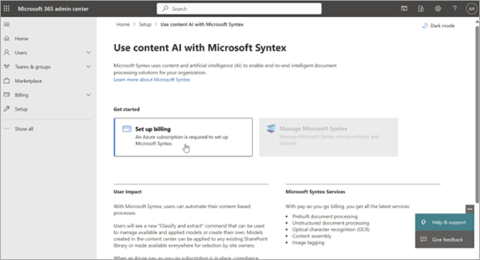
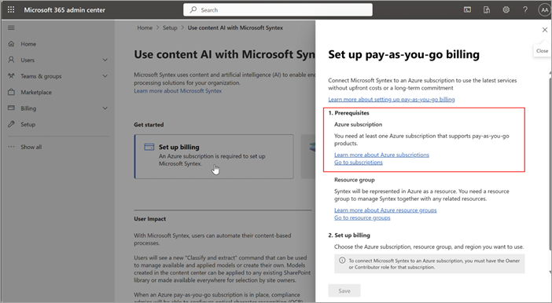
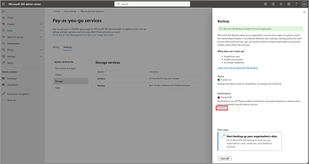
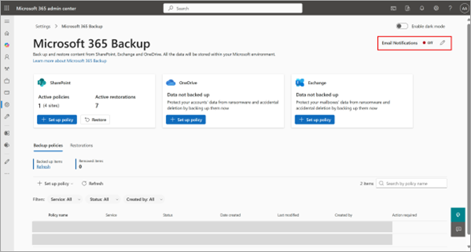
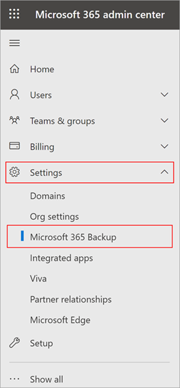
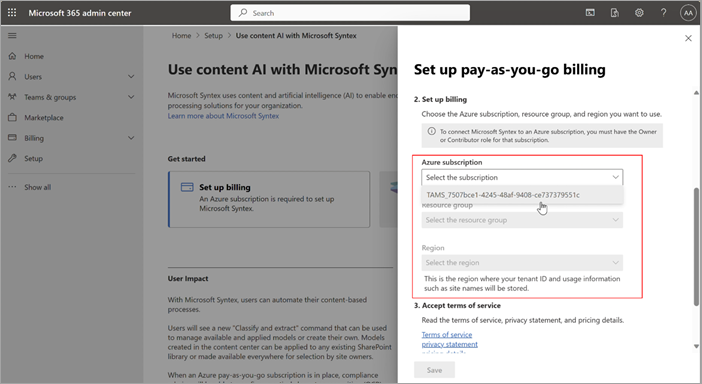

# Set up Microsoft 365 Backup

> [!TIP]
> **Already have an Azure subscription and are a SharePoint Administrator or Global Administrator?** Follow these three steps to quickly set up Microsoft 365 Backup in the admin center.  
> [Step 1. Set up pay-as-you-go billing](https://admin.microsoft.com/#/orgsettings/payasyougo) 
> [Step 2. Turn on Microsoft 365 Backup](https://admin.microsoft.com/#/orgsettings/payasyougo/storage) 
> [Step 3. Start backing up your data by creating backup policies](https://admin.microsoft.com/#/Settings/enhancedRestore) 

 

> [!VIDEO https://learn-video.azurefd.net/vod/player?id=d4f5a898-3d35-42aa-ae3f-6639b59943f9]

 

## Permissions

You must be a [SharePoint Administrator](/entra/identity/role-based-access-control/permissions-reference#sharepoint-administrator) or [Global Administrator](/entra/identity/role-based-access-control/permissions-reference#global-administrator) to be able to access the Microsoft 365 admin center and set up Microsoft 365 Backup.

[!INCLUDE [global-administrator-note](../includes/global-administrator-note.md)]

## Create an Azure subscription

If you already have an Azure subscription, you can skip to [Set up pay-as-you-go billing](#set-up-pay-as-you-go-billing). If you need to create an Azure subscription, follow the guidance in [Create your Azure subscriptions](/azure/cost-management-billing/manage/create-subscription) or [start creating a subscription on Azure](https://portal.azure.com/#view/Microsoft_Azure_Billing/CatalogBlade/appId/AddSubscriptionButton).

## Set up pay-as-you-go billing

To set up pay-as-you-go billing, you need to have this information:

> [!div class="checklist"]
> * **Valid Azure subscription**. An Azure subscription provides a logical container for your resources. Each Azure resource is associated with only one subscription. Creating a subscription is the first step in adopting Azure. To learn more about Azure, see [Azure fundamental concepts](/azure/cloud-adoption-framework/ready/considerations/fundamental-concepts).
> * **Resource group**. A resource group provides a logical grouping of resources within an Azure subscription.
> * **Region**. The region in which you want to register the service.
> * **Owner or contributor**. Name of an owner or contributor role on the Azure subscription.

Once you have the information on this list, you're ready to begin. As a first step, you should link an Azure subscription in pay-as-you-go, if you haven't already done so. The billing setup is consistent with other Microsoft 365 pay-as-you-go offerings.

To set up pay-as-you-go billing for Microsoft 365 Backup, follow these steps:

1. In the Microsoft 365 admin center, select <a href="https://go.microsoft.com/fwlink/p/?linkid=2171997" target="_blank">**Setup**</a>, and then view the **Billing and licenses** section.

2. In the **Billing and licenses** section, select **Activate pay-as-you-go services**.

3. On the **Activate pay-as-you-go services** page, select **Get started**.

    

    > [!NOTE]
    > To set up pay-as-you-go billing for Microsoft 365 Backup, you must provide an owner or contribution role on the Azure subscription to be used.

4. On the **Pay-as-you-go services** page, on the **Billing** tab, select **Syntex services**.

5. If you ***don't*** have an Azure subscription or resource group, follow these steps. If you have an Azure subscription and resource group, go directly to step 6.

    To create a new Azure subscription with the same organization and Microsoft Entra tenant as your Microsoft 365 subscription:

    1. Sign in to the [Azure portal](https://portal.azure.com) with your Microsoft 365 admin, Microsoft Entra DC admin, or [Global Administrator](/entra/identity/role-based-access-control/permissions-reference#global-administrator) account.

        [!INCLUDE [global-administrator-note](../includes/global-administrator-note.md)]

    1. In the left navigation, select **Subscriptions**, and then select **Add**.

    1. On the **Add subscription** page, select an offer and complete the payment information and agreement.

    To create a new Azure resource group:

    1. On the **Set up pay-as-you-go billing** panel, select **Learn more about Azure resource groups**.

    1. Or, you can follow steps in [Manage Azure resource groups by using the Azure portal](/azure/azure-resource-manager/management/manage-resource-groups-portal) to create a resource group.

    

    > [!NOTE]
    > The resource group should be mapped to the Azure subscription you provided when you set up pay-as-you-go.

6. If you ***have*** an Azure subscription, follow these steps:

    1. On the **Set up pay-as-you-go billing** panel, under **Azure subscription**, select the subscription from the dropdown list.

       > [!NOTE]
       > The subscription dropdown list won't populate if you don't have an owner or contributor on the subscription.

    1. Under **Resource group**, select the resource group from the dropdown list.

    1. Under **Region**, select the region from the dropdown list.

    1. Review and accept the terms of service, and then select **Save**.

You have successfully set up billing. You can proceed to [turn on Microsoft 365 Backup](#turn-on-microsoft-365-backup).

> [!NOTE]
> Any subsequent changes made to the billing for Microsoft 365 Backup in the Microsoft 365 admin center or the Azure portal can take up to 24 hours to become effective.

> [!NOTE]
> There will be only one billing profile created. Microsoft 365 Backup currently doesn't support multiple billing profiles.

## Turn on Microsoft 365 Backup

To turn on Microsoft 365 Backup, you need to go to the Microsoft 365 admin center.

1. In the Microsoft 365 admin center, select **<a href="https://go.microsoft.com/fwlink/p/?linkid=2171997" target="_blank">Setup</a>**.

1. Under **Billing and licenses**, select **Activate pay-as-you-go services**.

1. On the **Activate pay-as-you-go services** page, select **Get started**.

1. On the **Pay-as-you-go services** page, select the **Settings** tab, and then select **Syntex services**.

1. On the Syntex page, in the **Storage** section, select **Backup**.

1. On the **Backup** panel, select **Turn on**.

1. On **Turn on Backup** panel, review the applicable [terms of service for Microsoft 365](https://www.microsoft.com/licensing/terms/product/ForOnlineServices/all), and then select **Save**.

## Enable email notifications

Email notifications help ensure that potentially harmful or important changes in Microsoft 365 Backup solution are brought to the attention of multiple people in your organization. This reduces the risk of critical actions going unnoticed.

When enabled, Microsoft 365 Backup sends email alerts to a **Backup Notification List** whenever an important backup event occurs. Global admins and Microsoft 365 Backup admins can turn on this feature and update the notification list at any time.

You can add up to 20 individual recipients to the list or include distribution lists and security groups. By default, recipients are notified only about potentially harmful events, but you can also opt in to receive notifications for routine events. Notifications are sent as a **daily email digest** when at least one relevant event occurs. If both notification types are enabled, you receive two separate emails—one for potentially harmful events and another for routine events.

### Events that trigger notifications

#### Potentially harmful events

- Disabling Microsoft 365 Backup
- Pausing billing due to issues or admin action
- Removing protection units from backup policies
- Offboarding protection units (deletion of backups)
- Pausing a backup policy
- Transferring backup controllers between Microsoft and third-party providers
- Revoking the Controller app
- Changing membership in the Backup Notification List
- Enabling or disabling the notifications feature

#### Routine events

- Completing backup routine jobs
- Creating or modifying backup policies
- Initiating or completing restores

### Set up multi-admin notifications

1. Sign in to Microsoft 365 admin center as a Global admin, Microsoft 365 Backup admin, SharePoint admin, or Exchange admin.

2. Go to the **Manage** notifications option on the **Backup** panel, or the **Email notifications** option on the **Microsoft 365 Backup** home page.  

    

    

3. Turn on notifications.

4. Add users, distribution lists, or security groups (only email enabled) to the Backup Notification List.

5. (Optional) Select the checkbox to also receive routine event notifications.

6. Save your changes.

> [!NOTE]
> We highly recommend enabling multi-admin notifications, at a minimum, for potentially harmful events.

## Create backup policies to protect your data

Now that Microsoft 365 Backup is enabled for your organization, follow through to create policies and start protecting your content.

1. Go to the [Microsoft 365 admin center](https://admin.microsoft.com/Adminportal/Home).

2. Select **Settings**.

3. Select **Microsoft 365 Backup** from the list of products.

    

4. [Create backup policies for OneDrive, SharePoint, or Exchange](backup-view-edit-policies.md#create-backup-policies).

## Admin roles and backup management privileges

Only tenant-level admins can create and manage backups using Microsoft 365 Backup for their users. End users don't have the ability to enable backup or restores for their user account, distribution lists, mailboxes, or sites. It’s important to note that your admin role determines which products you can manage with Microsoft 365 Backup. We have also introduced a new dedicated role for this tool, the Microsoft 365 Backup Administrator, that can control the entire tool. For more information about this role, see [Microsoft 365 Backup Administrator](/entra/identity/role-based-access-control/permissions-reference#microsoft-365-backup-administrator).

|Admin role  |OneDrive  |SharePoint  |Exchange  |
|---------|---------|---------|---------|
|Global Administrator     | ✓        | ✓        | ✓       |
|SharePoint Administrator     | ✓        | ✓        |         |
|Exchange Administrator    |         |         | ✓        |
|Microsoft 365 Backup Administrator     | ✓        | ✓        | ✓       |

## Glossary

- **Protection units** – SharePoint sites, OneDrive accounts, or Exchange Online mailboxes backed up by the Microsoft 365 Backup tool.

- **Restore point** – A prior point in time from which you can restore a version of your content and metadata. If the protection unit from a prior point in time is identical to the present state of your data, then a restore from that point has no effect on your current data.

- **RPO** – Recovery point objective, or how close in time the most recent restore point is to an impacting event.

- **RTO** – Recovery time objective, or how fast a restore to a prior point in time might complete.

<!---
       
--->
