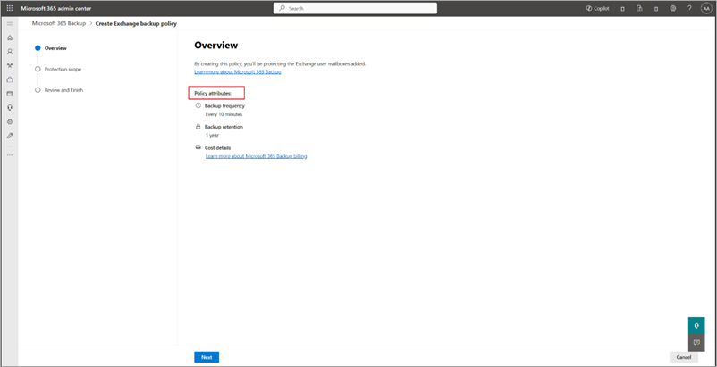

# Set up Microsoft 365 Backup

Get started with Microsoft 365 Backup by following these simple three steps in the Microsoft 365 admin center.

## Step 1: Set up pay-as-you-go billing

Microsoft 365 Backup is a pay-as-you-go offering that charges based on consumption, unlike traditional user-based licenses. To set up pay-as-you-go for Microsoft 365 Backup, you need to have this information:

> [!div class="checklist"]
> * **Valid Azure subscription**. An Azure subscription provides a logical container for your resources. Each Azure resource is associated with only one subscription. Creating a subscription is the first step in adopting Azure. To learn more about Azure, see [Azure fundamental concepts](/azure/cloud-adoption-framework/ready/considerations/fundamental-concepts).
> * **Resource group**. A resource group provides a logical grouping of resources within an Azure subscription.
> * **Region**. The region in which you want to register the service.
> * **Owner or contributor**. Name of an owner or contributor role on the Azure subscription.

Once you have the information on this list, you're ready to [set up pay-as-you-go billing for Microsoft 365 Backup](backup-billing.md).

 

> [!VIDEO https://www.microsoft.com/videoplayer/embed/RW1k4TO]

 

### Permissions

You must be a [SharePoint Administrator](/entra/identity/role-based-access-control/permissions-reference#sharepoint-administrator) or [Global Administrator](/entra/identity/role-based-access-control/permissions-reference#global-administrator) to be able to access the Microsoft 365 admin center and set up Microsoft 365 Backup.

[!INCLUDE [global-administrator-note](../includes/global-administrator-note.md)]

## Step 2: Turn on Microsoft 365 Backup

To turn on Microsoft 365 Backup, you need to go to the Microsoft 365 admin center.

1. In the [Microsoft 365 admin center](https://admin.microsoft.com/Adminportal/Home), select **Setup**.

2. Under **Files and content**, select **Automate content processes with Syntex**.

3. On the **Automate content processes with Syntex** page, select **Go to Syntex settings**.

4. On the Syntex page, in the **Syntex services for** section, select **Storage**. From the list of products, select **Backup**.

5. On the **Backup** panel, select **Turn on**.

6. On **Turn on Backup** panel, review the applicable [terms of service for Microsoft 365](https://www.microsoft.com/licensing/terms/product/ForOnlineServices/all), and then select **Save**.
<!---
    
--->
## Step 3: Create backup policies to protect your data

Now that Microsoft 365 Backup is enabled for your organization, follow through to create policies and start protecting your content.

1. Go to the [Microsoft 365 admin center](https://admin.microsoft.com/Adminportal/Home).

2. Select **Settings**.

3. Select **Microsoft 365 Backup** from the list of products.

    

4. [Create backup policies for OneDrive, SharePoint, or Exchange](backup-view-edit-policies.md#create-backup-policies).
<!---
### Set up backup policies for OneDrive, SharePoint, and Exchange

To use Microsoft 365 Backup for OneDrive, SharePoint, or Exchange, you need to create a backup policy for each product. A *policy* represents the backup plan defined by admins for protecting the Microsoft 365 data of an organization.

A policy contains details of what data (OneDrive accounts, SharePoint sites, and Exchange mailboxes) to protect. Although you see the retention period and backup frequency (which defines the restore point objective), those settings aren't currently variable or modifiable.

Select the **OneDrive**, **SharePoint**, or **Exchange** tab for steps to create a backup policy for that product.

# [OneDrive](#tab/onedrive)

Follow these steps to set up a backup policy for OneDrive accounts using Microsoft 365 Backup.

1. Go to the [Microsoft 365 admin center](https://admin.microsoft.com/Adminportal/Home).

2. Select **Settings**.

3. Select **Microsoft 365 Backup** from the list of products.

4. On the **Microsoft 365 Backup** page, in the **OneDrive** section, select **Set up policy**.

    

5. On the **Overview** page, review the backup features for OneDrive, and then select **Next**.

    

6. On the **Choose selection method** page, you can set up OneDrive user accounts using any or all three ways. A protection scope is the scope of user accounts within OneDrive that you want to protect with Microsoft 365 Backup.

    

    a. Under **Upload a list of accounts in a CSV file**, you can upload a list of accounts to backup via a CSV file.

    The CSV upload feature for bulk addition of sites or user accounts in the backup policy creation workflow can accommodate a maximum of 50,000 entries per CSV file.

    b. Under **Back up accounts that match specific filters**, you can select **Distribution lists** or **Security groups**, or both. The distribution list and security group are flattened when added, meaning the policy won't update dynamically if the groups or distribution list are updated later.

    The rule-based feature for bulk addition of user accounts via security groups or distribution lists can accommodate a maximum of three groups at a time. These rules are static and applied one time only. That is, the security groups or distribution lists are flattened at the time of adding to the backup configuration policy. For example. groups or list won't be dynamically updated in the system if users are added or removed from the original security group.

    > [!NOTE]
    > The site last modified feature is in preview.

    c. Under **Select accounts individually**, you can search and select accounts you want to add to a backup policy.

<!---
6. On the **Protection scope** page, you can set up OneDrive user accounts using any or all three ways. A protection scope is the scope of user accounts within OneDrive that you want to protect with Microsoft 365 Backup.

    

    a. Under **Add via search**, select **Choose accounts** to see user accounts that can be added via search. On the **Search and select accounts** panel, select the accounts you want to add to the policy.

    

    b. Under **Add via**, select **Distribution lists** or **Security groups**, or both. The distribution list and security group are flattened when added, meaning the policy won't update dynamically if the groups or distribution list are updated later.

    

    The rule-based feature for bulk addition of sites via site names or URL in the backup policy creation workflow can accommodate a maximum of 10 keywords at a time. Each keyword can have a minimum of three characters and maximum of 255 characters.

    The rule-based feature for bulk addition of user accounts via security groups or distribution lists can accommodate a maximum of three groups at a time. These rules are static and applied one time only. That is, the security groups or distribution lists are flattened at the time of adding to the backup configuration policy. For example. groups or list won't be dynamically updated in the system if users are added or removed from the original security group.

    > [!NOTE]
    > The site last modified feature is in preview.

    c. Under **Import from file**, select **Upload CSV** to import user account details via CSV upload.

    

    The CSV upload feature for bulk addition of sites or user accounts in the backup policy creation workflow can accommodate a maximum of 50,000 entries per CSV file.
--->
<!---
7. Once you've made the right selections, select **Next** to create the backup policy for OneDrive.

8. On the **Review OneDrive backup policy** page, review the information to make sure it's how you want it, and then select **Create policy** (or **Update policy** if it's an update).

9. The backup policy for OneDrive is created.

    

    Once the sites are added to a backup policy, it might take up to 15 minutes per 1,000 sites for restore points to become available for restore.

# [SharePoint](#tab/sharepoint)

Follow these steps to set up a backup policy for SharePoint sites using Microsoft 365 Backup.

1. Go to the [Microsoft 365 admin center](https://admin.microsoft.com/Adminportal/Home).

2. Select **Settings**.

3. Select **Microsoft 365 Backup** from the list of products.

4. On the **Microsoft 365 Backup** page, in the **SharePoint** section, select **Set up policy**.

    

5. On the **Overview** page, review the backup features for SharePoint, and then select **Next**.

    

6. On the **Choose selection method** page, you can set up SharePoint sites using any or all three ways. A protection scope is the scope of user accounts within OneDrive that you want to protect with Microsoft 365 Backup.

    

    a. Under **Upload a list of sites in a CSV file**, you can upload a list of accounts to backup via a CSV file.

    The CSV upload feature for bulk addition of sites or user accounts in the backup policy creation workflow can accommodate a maximum of 50,000 entries per CSV file.

    b. Under **Back up sites that match specific filters**, you can select **Site name or URL contains** or **Site last modified**, or both.

    The rule-based feature for bulk addition of sites via site names or URL in the backup policy creation workflow can accommodate a maximum of 10 keywords at a time. Each keyword can have a minimum of three characters and maximum of 255 characters.

    > [!NOTE]
    > The site last modified feature is in preview.

    c. Under **Select sites individually**, you can search and select sites you want to add to a backup policy.

<!---
6. On the **Protection scope** page, you can set up SharePoint sites by choosing to back up individual sites or collection of sites. A protection scope is the scope of sites within SharePoint that you want to protect with Microsoft 365 Backup.

    

    a. Under **Add via search**, select **Choose sites** to see the individual sites or site collections that can be added via search. On the **Search and select sites** panel, select the sites you want to add to the policy.

    

    b. Under **Add via**, select **Distribution lists** or **Security groups**, or both. The distribution list and security group are flattened when added, meaning the policy won't update dynamically if the groups or distribution list are updated later.

    The rule-based feature for bulk addition of sites via site names or URL in the backup policy creation workflow can accommodate a maximum of 10 keywords at a time. Each keyword can have a minimum of three characters and maximum of 255 characters.

    The rule-based feature for bulk addition of user accounts via security groups or distribution lists can accommodate a maximum of three groups at a time. These rules are static and applied one time only. That is, the security groups or distribution lists are flattened at the time of adding to the backup configuration policy. For example. groups or list won't be dynamically updated in the system if users are added or removed from the original security group.

    > [!NOTE]
    > The site last modified feature is in preview.

    c. Under **Import from file**, select **Upload CSV** to import user account details via CSV upload.

    

    The CSV upload feature for bulk addition of sites or user accounts in the backup policy creation workflow can accommodate a maximum of 50,000 entries per CSV file.
--->
<!---
7. Once you've made the right selections, select **Next** to create the backup policy for SharePoint.

8. On the **Review SharePoint backup policy** page, review the information to make sure it's how you want it, and then select **Create policy** (or **Update policy** if it's an update).

    

9. The backup policy for SharePoint is created.

    

    Once the sites are added to a backup policy, it might take up to 15 minutes per 1,000 sites for restore points to become available for restore.

# [Exchange](#tab/exchange)

Follow these steps to set up a backup policy for Exchange mailboxes sites using Microsoft 365 Backup. Ensure that Microsoft 365 Backup is [enabled for your tenant](#step-2-turn-on-microsoft-365-backup).

1. Go to the [Microsoft 365 admin center](https://admin.microsoft.com/Adminportal/Home).

2. Select **Settings**.

3. Select **Microsoft 365 Backup** from the list of products.

4. On the **Microsoft 365 Backup** page, in the **Exchange** section, select **Set up policy**.

    

5. On the **Overview** page, review and verify the backup policy attributes for Exchange, such as backup frequency, backup retention, cost details, and then select **Next**.

    

6. On the **Choose selection method** page, you can set up Exchange mailboxes using any or all three ways. A protection scope is the scope of mailboxes within Exchange that you want to protect with Microsoft 365 Backup.

    

    a. Under **Upload a list of mailboxes in a CSV file**, you can upload a list of accounts to backup via a CSV file.

    The CSV upload feature for bulk addition of mailboxes in the backup policy creation workflow can accommodate a maximum of 50,000 entries per CSV file.

    b. Under **Back up mailboxes that match specific filters**, you can select **Distribution lists** or **Security groups**, or both. The distribution list and security group are flattened when added, meaning the policy won't update dynamically if the groups or distribution list are updated later.

    The rule-based feature for bulk addition of mailboxes via security groups or distribution lists can accommodate a maximum of three groups at a time. These rules are static and applied one time only. That is, the security groups or distribution lists are flattened at the time of adding to the backup configuration policy. For example. groups or list won't be dynamically updated in the system if users are added or removed from the original security group.

    > [!NOTE]
    > The site last modified feature is in preview.

    c. Under **Select mailboxes individually**, you can search and select mailboxes you want to add to a backup policy.

<!---
6. On the **Protection scope** page, choose the scope of protection for the mailbox policy. Microsoft 365 Backup for Exchange allows the addition of mailboxes in three ways.

    

    a. Under **Add via search**, select **Choose user mailboxes** to see the mailboxes that can be added via search. On the **Search and select mailboxes** panel, select the mailboxes you want to add to the policy.

    

    b. Under **Add via**, select **Distribution lists** or **Security groups**, or both. The distribution list and security group are flattened when added, meaning the policy won't update dynamically if the groups or distribution list are updated later.

    

    The rule-based feature for bulk addition of sites via site names or URL in the backup policy creation workflow can accommodate a maximum of 10 keywords at a time. Each keyword can have a minimum of three characters and maximum of 255 characters.

    The rule-based feature for bulk addition of user accounts via security groups or distribution lists can accommodate a maximum of three groups at a time. These rules are static and applied one time only. That is, the security groups or distribution lists are flattened at the time of adding to the backup configuration policy. For example. groups or list won't be dynamically updated in the system if users are added or removed from the original security group.

    > [!NOTE]
    > The site last modified feature is in preview.

    c. Under **Import from file**, select **Upload CSV** to import user account details via CSV upload.

    

    The CSV upload feature for bulk addition of sites or user accounts in the backup policy creation workflow can accommodate a maximum of 50,000 entries per CSV file.
--->
<!---
7. Once you've made the right selections, select **Next** to create the backup policy for Exchange.

8. On the **Review Exchange backup policy** page, review the information to make sure it's how you want it, and then select **Create policy** (or **Update policy** if it's an update).

    

9. Wait for status of your policy to show as **Active** in the home screen. This might take between 15 and 60 minutes. The backup policy for Exchange is created. Select **View scope** at any time to verify the details.

    

    Once the mailboxes are added to a backup policy, it might take up to 15 minutes per 1,000 mailboxes for restore points to become available for restore.
---
--->

## Multi-geo environments

Microsoft 365 Backup supports the backup of sites and user accounts from both the central and satellite locations if the multi-geo feature is enabled on your tenant. This means that you can add the sites or user accounts from all geos while creating the backup configuration policy via the CSV file upload method. Adding sites via the site picker, search, or filter rules doesn't currently support multi-geo. Those user interface experiences today only support addition of sites in the tenant's central location.

## Admin roles and backup management privileges

Only tenant-level admins can create and manage backups using Microsoft 365 Backup for their users. End users don't have the ability to enable backup or restores for their user account, distribution lists, mailboxes, or sites. It’s important to note that your admin role determines which products you can manage with Microsoft 365 Backup. In the future, we might introduce a Backup admin role that can control the entire tool.

|Admin role  |OneDrive  |SharePoint  |Exchange  |
|---------|---------|---------|---------|
|Global Administrator     | ✓        | ✓        | ✓       |
|SharePoint Administrator     | ✓        | ✓        |         |
|Exchange Administrator    |         |         | ✓        |

## Glossary

- **Protection units** – SharePoint sites, OneDrive accounts, or Exchange Online mailboxes backed up by the Microsoft 365 Backup tool.

- **Restore point** – A prior point in time from which you can restore a version of your content and metadata. If the protection unit from a prior point in time is identical to the present state of your data, then a restore from that point has no effect on your current data.

- **RPO** – Recovery point objective, or how close in time the most recent restore point is to an impacting event.

- **RTO** – Recovery time objective, or how fast a restore to a prior point in time might complete.
