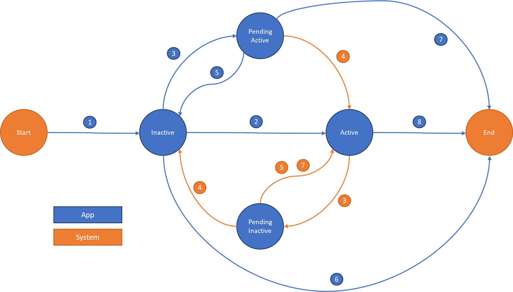

# Application lifecycle for Microsoft 365 Backup Storage

## Onboard a third-party Microsoft 365 Backup Storage application

Once your Microsoft 365 Backup Storage application is given consent to execute in the Consuming Tenant, to enable it to be the Microsoft 365 Backup Storage Controller in a Consuming Tenant, you need to perform the following programmatic tasks (via your application):

1. [Register your application as a Microsoft 365 Backup Storage Controller](#step-1-register-your-application-as-a-microsoft-365-backup-storage-controller).

2. [Check if the Microsoft 365 Backup Service is enabled in the Consuming Tenant](#step-2-check-if-the-microsoft-365-backup-service-is-enabled-in-the-consuming-tenant).

3. [Activate your application to be the Microsoft 365 Backup Storage Controller](#step-3-activate-your-application-to-be-the-microsoft-365-backup-storage-controller).
    - If there was an existing Controller, wait for the [Grace Period](#existing-microsoft-365-backup-storage-controller-grace-period) to complete.

4. [Enable your Billing Policy in the Consuming Tenant](#step-4-enable-your-billing-policy-in-the-consuming-tenant).

After your application is registered, you can always check the state of your application as the Microsoft 365 Backup Storage Controller by executing the [Get serviceApp](/graph/api/serviceapp-get) API:
```http
GET /solutions/backupRestore/serviceApps/{serviceAppId}
```

### Step 1: Register your application as a Microsoft 365 Backup Storage Controller

To register your application to be a Microsoft 365 Backup Storage Controller, you first need to register your application by executing the [Create service App](/graph/api/backuprestoreroot-post-serviceapps) API: 
```http
POST /solutions/backupRestore/serviceApps/
```

If your application was successfully registered, it has a state of **inactive**. The returned ID is the Service App ID of your application (which is your Application ID).

###	Step 2: Check if the Microsoft 365 Backup Service is enabled in the Consuming Tenant

To check if the Microsoft 365 Backup Service is enabled in the Consuming Tenant, your application needs to execute the [Get backupRestoreRoot](/graph/api/backuprestoreroot-get) API:
```http
GET /solutions/backupRestore/
```

If the returned state is **enabled**, then this state indicates that there's an active Microsoft 365 Backup Storage Controller and that changing the Controller enforces a grace period.
All other states indicate that there's no active Microsoft 365 Backup Storage Controller and that an application can immediately become the Controller when registering.

###	Step 3: Activate your application to be the Microsoft 365 Backup Storage Controller

To activate your application as the Microsoft 365 Backup Storage Controller depends on whether or not there's already an existing Microsoft 365 Backup Storage Controller (either first-party or third-party).

#### No existing Microsoft 365 Backup Storage Controller

If there's no existing Microsoft 365 Backup Storage Controller, then you can immediately activate your application as the Controller. To do this step, you execute the [serviceApp: activate](/graph/api/serviceapp-activate) API:
```http
POST /solutions/backupRestore/serviceApps/{serviceAppId}/activate
```

If your application was immediately activated successfully, it has a state of **active**.

#### Existing Microsoft 365 Backup Storage Controller

If there's an existing Microsoft 365 Backup Storage Controller, then when activating your application as the Controller you need to specify a date/time as to when the change is effective. The date/time needs to be at least 7-days in the future, but not greater than 30-days.

To activate your application, you need to execute the [serviceApp: activate](/graph/api/serviceapp-activate) API specifying the effective date/time in the Request JSON body:
```http
POST /solutions/backupRestore/serviceApps/{serviceAppId}/activate
```

> [!NOTE]
> If there is already a pending change to the Microsoft 365 Backup Storage Controller already in progress, then your request will fail with a HTTP 403 error code. You will not be able to activate your application until the pending change has completed.

If your application was successfully activated for a date/time in the future, it has a state of **pendingActive**.

###	Existing Microsoft 365 Backup Storage Controller Grace Period

If there was an existing Microsoft 365 Backup Storage Controller when you activated your application, this step enforces a Grace Period of between 7 to 30 days (as specified when you activated your application).

**During the Grace Period:**
- Your application has a state of **pendingActive**.
- Your application has read-only access to any existing Protection Policies. Your application won't be able to change or create Protection Policies or perform any Restores.
- The Consuming Tenant Backup Admin can cancel the pending change of the Microsoft 365 Backup Storage Controller and revert back to original state.
- Your application can cancel the pending change of the Microsoft 365 Backup Storage Controller and revert back to original state by executing the [serviceApp: deactivate](/graph/api/serviceapp-deactivate) API:
```http
POST /solutions/backupRestore/serviceApps/{serviceAppId}/deactivate
```
- Your application can check the state of your application as the Microsoft 365 Backup Storage Controller by executing the [Get serviceApp](/graph/api/serviceapp-get) API:
```http
GET /solutions/backupRestore/serviceApps/{serviceAppId}
```

**On completion of the Grace Period:**
-	Your application has a state of **active**.

###	Step 4: Enable your Billing Policy in the Consuming Tenant

Once your application has a status of active, you need to enable your Billing Policy in the Consuming Tenant. This step is performed by executing the [backupRestoreRoot: enable](/graph/api/backuprestoreroot-enable) API:
```http
POST /solutions/backupRestore/enable
```

After you enable the Billing Policy, your application will be the Microsoft 365 Backup Storage Controller in the Consuming Tenant and will now be able to maintain the Microsoft 365 Backup Service (as per your application’s oAuth permission scopes).

> [!NOTE]
> You can execute this API multiple times in that it is idempotent. It is recommended to enable the Billing Policy in the Consuming Tenant if, for whatever reason, your Billing Policy changes. For example, if you want to change the Azure Subscription Id or Resource Group.

## Offboarding a Microsoft 365 Backup application

###	Another application is Activated as the Microsoft 365 Backup Storage Controller

If your application is the active Microsoft 365 Backup Storage Controller, it's possible that another application (first-party or third-party) can also be activated as per the onboarding process defined in [Existing-Microsoft 365 Backup Storage Controller](#existing-microsoft-365-backup-storage-controller) and [Existing Microsoft 365 Backup Storage Controller Grace Period](#existing-microsoft-365-backup-storage-controller-grace-period). If this event occurs, your application won't be explicitly notified. However, the state of your application becomes **pendingInactive**.
T
o get the state of your application being the Microsoft 365 Backup Storage Controller your application can execute the [Get serviceApp](/graph/api/serviceapp-get) API:
```http
GET /solutions/backupRestore/serviceApps/{serviceAppId}
```

**During the Grace Period:**
- Your application has a state of **pendingInactive**.
- Your application continues to have access to the existing Protection Policies and is able to change or create Protection Policies or perform any Restores (as per your oAuth permission scopes).
- Your application continues to be responsible for the Microsoft 365 Backup billing and hence the consumption in the Consuming Tenant.
- The Consuming Tenant Backup Admin can cancel the pending change of the Microsoft 365 Backup Storage Controller and revert back to original state such that your application is restored as the active Microsoft 365 Backup Storage Controller.

**On completion of the Grace Period:**
- Your application has a state of **inactive**.
- Your application is no longer responsible for the Microsoft 365 Backup billing and hence the pay-as-you-go billing in the Consuming Tenant.

###	Deactivate your application as the Microsoft 365 Backup Storage Controller

To deactivate your application from being the Microsoft 365 Backup Service in the Consuming Tenant, your application needs to execute the [serviceApp: deactivate](/graph/api/serviceapp-deactivate) API:
```http
POST /solutions/backupRestore/serviceApps/{serviceAppId}/deactivate
```

The outcome of deactivating your application depends on the current state of your application.

#### Deactivating with current state of inactive
Deactivating your application that has a state of **inactive** does nothing.

#### Deactivating with current state of pendingActive
Deactivating your application that has a state of **pendingActive** cancels your pending change to become the Microsoft 365 Backup Storage Controller.
After successfully invoking the API:
-	Your application has a state of **inactive**.
-	The application that is currently the Microsoft 365 Backup Storage Controller has a state of **active**.
  
#### Deactivating with current state of pendingInactive

Deactivating your application that has a state of **pendingInactive** won't do anything to the pending change of the Microsoft 365 Backup Storage Controller. That is, the pending change continues until the Grace Period is complete.

#### Deactivating with current state of active

You can't deactivate your application that has a state of **active** and your request fails with an HTTP error 403 code.

To deactivate your application as the Microsoft 365 Backup Storage Controller, either another application needs to be activated, or you can [unregister your application](#unregister-your-application-as-the-microsoft-365-backup-storage-controller) to be a Microsoft 365 Backup Storage Controller.

###	Unregister your application as the Microsoft 365 Backup Storage Controller

To unregister your application from being the Microsoft 365 Backup Storage Controller in the Consuming Tenant, your application needs to execute the [Delete serviceApp](/graph/api/backuprestoreroot-delete-serviceapps) API:
```http
DELETE /solutions/backupRestore/serviceApps/{serviceAppId}
```

The outcome of unregistering your application depends on the current state of your application.

#### Unregistering with current state of inactive

Unregistering your application that has a state of **inactive** removes your application as being available to be the Microsoft 365 Backup Storage Controller.
After successfully invoking the API:
-	Your application is no longer available to become the Microsoft 365 Backup Storage Controller (unless it's reregistered).

#### Unregistering with current state of pendingActive

Unregistering your application that has a state of **pendingActive** cancels your pending change to become the Microsoft 365 Backup Storage Controller.
After successfully invoking the API:
- Your application is no longer available to become the Microsoft 365 Backup Storage Controller (unless it's reregistered).
- Your application no longer has read-only access to any existing Protection Policies. 
- The application that is currently the Microsoft 365 Backup Storage Controller has a state of **active**.

#### Unregistering with current state of pendingInactive

You can't unregister your application that has a state of **pendingInactive** and your request fails with an HTTP 403 error code.

To unregister your application as the Microsoft 365 Backup Storage Controller, you need to wait for the Grace Period to be complete (or if the pending change is canceled and your application is reinstated as the Microsoft 365 Backup Storage Controller).

#### Unregistering with current state of active

Unregistering your application that has a state of **active** automatically initiates a pending change of the Microsoft 365 Backup Storage Controller with a mandatory 7-day Grace Period.

**After successfully invoking the API and during the Grace Period:**
- Your application won't be able access, create, or change any Protection Policies or perform any Restores.
- Your application is no longer be available to become the Microsoft 365 Backup Storage Controller (unless it's reregistered).
- Your application continues to be responsible for the Microsoft 365 Backup billing and hence the consumption in the Consuming Tenant until another application is activated to become the Microsoft 365 Backup Storage Controller.

**On completion of the Grace Period:**
- Your application is still no longer available to become the Microsoft 365 Backup Storage Controller (unless it's reregistered).
- If another application isn't activated to be the Microsoft 365 Backup Storage Controller, then the offboarding of the Microsoft 365 Backup Service in the Consuming Tenant is initiated.
- Your application continues to be responsible for the Microsoft 365 Backup billing and hence the consumption in the Consuming Tenant until another application is activated to be the Microsoft 365 Backup Storage Controller or until the billing period expires (30-days) as per the offboarding of the Microsoft 365 Backup Service in the Consuming Tenant.

> [!WARNING]
> If your application is the active Microsoft 365 Backup Storage Controller when you unregister it, you are potentially responsible for an additional 37 days (7 days plus 30 days) for the Microsoft 365 Backup pay-as-you-go billing in the Consuming Tenant.

## Application Lifecycle States

Onboarding and offboarding a Microsoft 365 Backup application requires the application to go through a number of different states. The state changes are initiated by:
- An application invoking specific APIs;
- The consequence of another application invoking specific APIs; and/or
- The system waiting for a period of time to pass.

 

The above diagram outlines the states and the gestures that can cause a transition between them:
1. [Register your application as a Microsoft 365 Backup Storage Controller](#step-1-register-your-application-as-a-microsoft-365-backup-storage-controller)
2. [Activate your application to be the Microsoft 365 Backup Storage Controller with no existing Microsoft 365 Backup Storage Controller](#no-existing-microsoft-365-backup-storage-controller)
3. [Activate your application to be the Microsoft 365 Backup Storage Controller with an Existing Microsoft 365 Backup Storage Controller](#existing-microsoft-365-backup-storage-controller) and [Another application is Activated as the Microsoft 365 Backup Storage Controller when your application is the Active Microsoft 365 Backup Storage Controller](#another-application-is-activated-as-the-microsoft-365-backup-storage-controller)
4. [The Existing Microsoft 365 Backup Storage Controller Grace Period completes](#existing-microsoft-365-backup-storage-controller-grace-period)
5. [Deactivate your application to be the Microsoft 365 Backup Storage Controller with current state of pendingActive](#deactivating-with-current-state-of-pendingactive)
6. [Unregister your application to be the Microsoft 365 Backup Storage Controller with current state of inactive](#unregistering-with-current-state-of-inactive)
7. [Unregister your application to be the Microsoft 365 Backup Storage Controller with current state of pendingActive](#unregistering-with-current-state-of-pendingactive)
8. [Unregister your application to be the Microsoft 365 Backup Storage Controller with current state of active](#unregistering-with-current-state-of-active)
