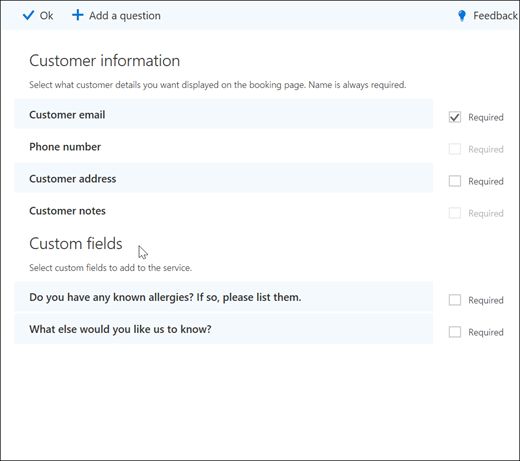
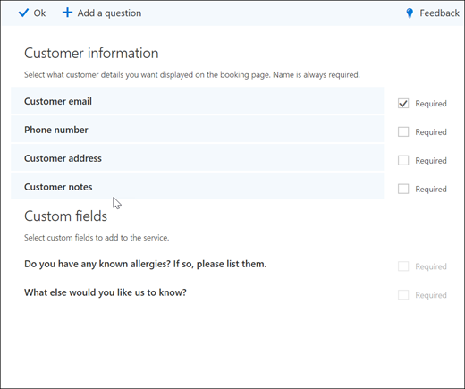
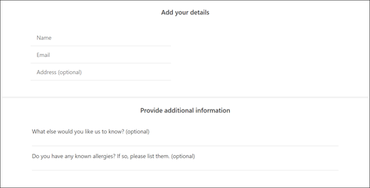
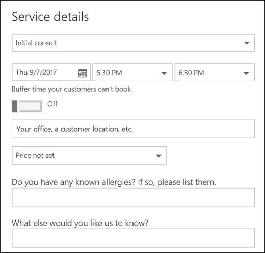

# Add custom and required questions to the booking page

Bookings lets you create questions to ask your customers when they're booking appointments. You can also choose which questions are required.

You associate the questions with a service, so each service can have a different set of questions. For example, a hair stylist may ask customers who are booking a hair coloring appointment if they have any known allergies to bleaches or tints.

Customers will see the custom questions when they create their appointment on the booking page. Staff see the custom questions when they create a new booking from the Bookings calendar or when viewing an existing appointment. Bookings saves all of your questions to a master list so that you don't have to re-create the same questions for every service. You can also choose whether questions are required or optional.

> [!NOTE]
> The customer's answers to the questions can be seen when you look at their appointment in the booking calendar.

For more information about how to personalize and customize your booking page, see [Customize your booking page](customize-booking-page.md).

## Add custom questions to your services

1. Sign in to Microsoft 365 and go to **Bookings**.

1. Choose your calendar.

1. Go to **Services** and either edit an existing service or **Add a service**.

1. Choose the **Custom fields** section.

   We've added some basic customer information questions: Customer email, phone number, customer address, and customer notes. The first time you do this, the customer information questions are highlighted in gray. That means that customers see this question. If you select the question, the highlight box around it will disappear and your customer won't be asked that question.

   In this example, phone number and customer notes have been turned off and we created two new custom questions to ask.

   

1. To make the question required, select the **Required** checkbox. Your customer won't be able to complete the booking until they've answered the required questions.

1. To create a custom question, select **Add a question** from the top of the panel. Write your question, and then select **Save**.

1. Click on the question to enable it. A highlighted box appears around it and the question is enabled.

1. Click **Ok** at the top of the page, and then **Save the service**.

Bookings saves all of your custom questions in a master list so that you can easily add questions to each service. For example, if you open a different service, the question you created for the first service shows up in the Custom fields section, but will be disabled. When you select the question, a highlighted rectangle displays and the question is enabled.

In this example, you can see that the questions that were added for the first service are available for this service. Any questions you create for this service will be available for all services.

   

If your booking page is already published, you don't need to do anything else. Customers will see the questions the next time they book with you. If your booking page isn't published yet, go to the **booking page** from Outlook on the web, and then select **Save and publish**.

> [!WARNING]
> You can also delete questions from the master list. However, if you delete a question it will be deleted from every service. We recommend that you disable the question by selecting it to ensure you do not impact any other services. You can see that a question is disabled if it is not surrounded by a highlighted rectangle.

## Customer experience

When your customers book an appointment with you, the basic customer information questions show in the **Add your details** section. Any customized questions you add show up in the **Provide additional information** section.

## Staff experience

When your customers book an appointment with you, your staff will see the questions and the customer's answers on the booking calendar. To see it, go to **Bookings** \> **Calendar** and then open an appointment.

