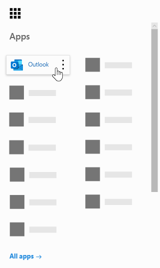
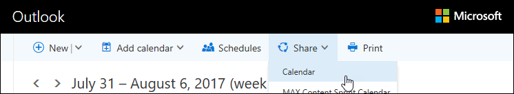
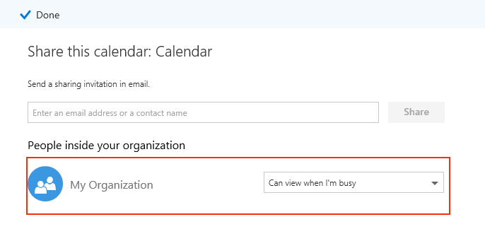
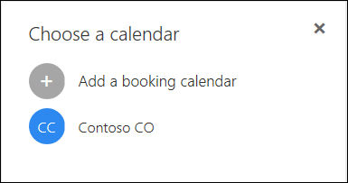

# Microsoft Bookings Frequently Asked Questions

## General

### What is Microsoft Bookings?

Microsoft Bookings is a Microsoft 365 app that makes scheduling and managing appointments easy. Bookings includes a Web-based booking calendar and integrates with Outlook to optimize your staff’s calendar, giving your customers flexibility to book a time that works best for them. Automated notification emails reduce no-shows, and organizations save time with a reduction in repetitive scheduling tasks. Bookings helps you easily conduct virtual appointments via Skype or Microsoft Teams, and helps you manage day-to-day scheduling via the Bookings app in Teams. With built-in ability to customize, Bookings is designed to meet the needs of multiple parts of any organization.

### How do I use Microsoft Bookings?

Bookings is an online service, so you don't need to download anything. Just go to the app chooser within the Microsoft 365 Web experience. Administrators can also use the Bookings companion app to stay current with the latest information about customers and their appointments.

### Who has access to Microsoft Bookings?

Bookings is available and active by default for Microsoft 365 Business Premium, Microsoft 365 Business Standard, A3, A5, E3, and E5 customers worldwide. Bookings is also available in Office 365 operated by 21Vianet.

### Will my customers see my personal or business calendar?

Your customers will only see the Bookings calendar that you publish online for the services, times, and staff that you choose to register.

### How do I change a bookable attribute under Manage staff?

When staff members were added, they would have received an email to accept or reject the request. They can open the same email and select "Reject" to make them so that they aren't bookable. We currently do not have a way to toggle this from inside the app.

### How do end users access the Bookings app?

Anyone who is licensed for Microsoft 365 Business Premium, Microsoft 365 Business Standard, A3, A5, E3, E5, or is added as a staff member in either the Administrator or Viewer roles can access Bookings in the app chooser within the Microsoft 365 Web experience. There is also a companion app available for iOS and Android.

### Can I use Bookings in my own Web site?

Yes. We provide a way for you to embed your Bookings calendar in your site via an iFrame. Link embedding code is located in the **Bookings page** tab within the Bookings app.

### Can I use Bookings even if I don’t have a Web page for my business?

Yes. We provide a link to your booking page within the **Booking page** tab in the Web app. You just need to provide that link to your customers or clients, and they will see the latest availability information for your business. Alternatively, you can share the booking page in social media or even use the embed feature to host it in an iFrame. You also have the ability to control who can access the page by disabling direct search engine indexing and restricting access to only those within your organization.

### Can our IT department control whether end users can access Bookings?

Bookings is available in Microsoft 365 Business Premium, Microsoft 365 Business Standard, M365 A3/A5 and E3/E5 tenants by default, but administrators can turn it off in the Microsoft 365 admin center if they choose. To do so, [follow these instructions](turn-bookings-on-or-off.md).

If a customer wants to disable access to Bookings for certain eligible licenses in their tenant, they can either use a group policy to restrict licenses or implement an OWA Mailbox policy that will restrict who is able to create new Bookings calendars.

If you use an OWA Mailbox policy to disable access to Bookings, all users will have a Bookings license, however when they attempt to access the app, they will only be successful if they are part of the policy or if they have been added to an existing Bookings calendar as staff. Details [here](turn-bookings-on-or-off.md) in the “Allow only selected users to create Bookings calendars” section.

### Is Bookings customizable?

Yes, Bookings is customizable and can be used for various scenarios. When setting up a Bookings calendar, many aspects of the Web-based scheduling page, your business information, staff details, service types, and scheduling policies can be customized.

### Is all the functionality of the original Bookings Web app available in Microsoft Teams?

A lightweight version of Bookings is now available as an app in Teams. The initial announcement is [here](https://www.microsoft.com/microsoft-365/blog/2020/03/06/empowering-care-teams-with-new-tools-in-microsoft-365/). There is deep link functionality to pop out in the Web app, and after setup, day-to-day use of Bookings can be done without ever leaving Teams. Information flows across platforms.

### Is Bookings a small business offering or an Enterprise offering or both?

Bookings is an ideal solution for both Enterprise and small business customers, across various industries. Use cases include:

- Financial services
    - consultations
    - banking and insurance services
    - tax filings

- Human resources (HR)
    - candidate interviews
    - onboarding
    - benefits assistance
    - training and seminars

- Healthcare
    - patient visits
    - provider-to-provider collaboration
    - insurance consults

- Government & Public Sector
    - court hearings and trials
    - public services
    - department appointments

- Education -- K-12
    - parent-teacher conferences
    - school town hall
    - student-counselor visits

- Education -- Higher Ed
    - office hours
    - tutoring
    - student services
    - exam sign-up

- Retail
    - assisted shopping
    - contractor scheduling
    - design services

- General Enterprise and small business needs
    - customer and client meetings
    - tech support
    - legal reviews
    - facilities

## Pricing and licensing

### How do I get Microsoft Bookings?

Bookings is available for customers with Office 365 A3, A5, E3, and E5, as well as Microsoft 365 Business Standard, Microsoft 365 Business Premium, A3, A5, E3, and E5. You can use Bookings with an iOS and Android companion app. Bookings isn't available as a standalone app. Outlook Web App or Outlook on the web must be enabled to use Bookings, as it stores data within Outlook.

A Bookings license provides full functionality to the product, including creating and managing calendars. It also enables the ability for users to view and edit existing calendars, when those users are added as staff in an Administrator or Viewer role.

### Do I need to migrate my email account from my current provider to Microsoft 365?

You can keep your current provider, but Bookings will send all notifications to the email used in your Microsoft 365 account.

### Can my employees use Bookings without a Microsoft 365 account?

Yes. You can add your staff with any email, and they will still get the email confirmation and the calendar invite when someone books an appointment with them.

### Can I create more than one Bookings calendar under the same Microsoft 365 account and switch between them?

Yes. You can create and manage more than one Bookings calendar with one account. You can switch between them using the caret next to the business name in the Bookings Web app.

### What if my organization has mixed licenses with F1/F3, E1, and E3/E5?

We recognize that many organizations have a mixture of Microsoft 365 licensing. For example, a customer may have M365 E3 licenses for employees in their headquarters, but M365 E1 (or F1 or F3) licenses for their store employees.

In this example, the headquarters employees with an M365 E3 license have full access to Bookings, which means they can create new calendars, edit settings, add staff, publish a booking page, create and manage appointments within the calendar, and pull reports.

Those store employees with E1/F1/F3 licenses, or with no licenses, can still be added as staff to calendars in a Guest role and then booked for appointments, and they will receive confirmation emails when they are booked. They can still be booked during their available/scheduled hours as listed in the staff tab. The Bookings calendar availability constrains bookable times by their set hours and service hours.

The store employees will also display as unavailable in Bookings if an appointment has already been scheduled at that time through the Bookings Web app. Appointments booked via Bookings will reflect as busy on a staff member's calendar within Bookings. Staff with a non-Bookings enabled license can still have their personal calendar impact their availability in Bookings, provided they are within the same tenant.

People in the Guests role can view any of the information the customer has provided within the initial appointment creation. For example, if the store representative who is booked for the appointment is required to call the customer prior to the appointment, they will have access to the information the customer provides during the scheduling process. The staff member who is booked will have access to all information that appears in the confirmation email, and the .ics calendar event (such as the customer phone number if it was entered).

People in the Guest role will not have the ability to access the Bookings Web app to change settings or to view and manage appointments (add, cancel, and reschedule). However, they can make appointments on behalf of customers using the Self-service page, in the same way that a customer would make an appointment.

We recommend licensing a business manager or administrator of each store with a Bookings-eligible license to set up and manage pages and appointments. The rest of the staff would then work with the employee licensed with Bookings to reschedule or cancel a booking.

## Product features

### Where do Bookings calendars show up in my Microsoft 365 tenant?**

Each new Bookings calendar creates a corresponding mailbox in Exchange, as well as a related entry in Azure Active Directory (AAD), where the entry is listed as an unlicensed user.

### Can I delete a previously created Bookings calendar?

To delete a Bookings calendar, you must delete the associated mailbox in Exchange.

### If I create a calendar and someone else has access to Bookings, would they be able to see my calendar?

The only people who have access to Bookings calendars that you create (through the Web app) is anyone who has been added as staff, in either an Administrator or Viewer role. Tenant admins will be able to see a list of all Bookings mailboxes in Exchange and AAD.

### Are video conferencing meetings integrated into the Bookings app?

Online meetings are available within Bookings when using the Skype or Microsoft Teams clients. Online meetings can be enabled at the service-level, and the meeting client you choose (Skype or Teams) will be the one set by default for a booked staff member. To join the online meetings, each new appointment will have a unique meeting link attached to the appointment, and in addition, easy join options are included in the event and in confirmation emails.

### How does scheduling policy work?

A setting called **Maximum lead time** determines the farthest in advance (measured in days) that a booking can be made. There must be at least 24 hours between **Minimum lead time** (the minimum lead time, in hours, for bookings and cancellations) and Maximum lead time. Maximum lead time can be set to one day if Minimum lead time is set to 0 hours, which in this case means a customer can cancel a booking up until the time that it starts, and customers can only schedule bookings if the appointment is within the next day.

:::image type="content" source="media/bookings-faq-scheduling.png" alt-text="Scheduling in Bookings":::

### How does Bookings work across time zones?

All times are in the business time zone (your local time zone) by default. Any setting that you configure for a Bookings calendar, such as working hours, will appear in this time zone. The Self-service page has the ability to display all the appointment times in the end-user's time zone, which can be turned off if desired. If **Always show time slots in business time zone** remains unchecked on the Bookings page tab, then people visiting the page will see time slots in their own local time zones.

:::image type="content" source="media/bookings-faq-region.png" alt-text="Bookings region and time zone settings":::

There is no provision to set time zone for staff in Bookings. Staff time zone, and thus business hours, will be in the business time zone.

### Can email notifications be sent as the tenant domain name?

The email addresses are controlled and managed at the Microsoft 365 settings level and depend on the domain configuration settings there. More information can be found [here](/powershell/module/exchange/get-accepteddomain).

### Is the ability to send SMS messages dependent on a different service or specific configuration?

SMS messages are currently available in North America, and a Skype or Twilio account will be used for SMS delivery.

### How can Bookings appointments show up on a person’s calendar?

The confirmation of the booking is sent to both the service provider’s and customer’s inboxes. The confirmation email contains an *.ics file attachment, which can then be added to the user’s calendar with all relevant appointment details.

### What triggers service provider or staff and customer emails?

Emails are triggered based on settings in the Services tab in the Bookings Web app. A booking made by the customer on the Self-service page, or on the Calendar tab in the Bookings Web app, will trigger a confirmation and/or a reminder email. The same thing will happen when someone makes a change to the booking via the **Manage booking** button in the confirmation email or within the Web app. Reminder emails are sent at a specified time period prior to an appointment, as detailed in the Services tab in the Bookings Web app.

### Can I book classroom-style appointments that are 1:many instead of 1:1?

Yes, we have a group bookings functionality that allows multiple people to book the same appointment at the same time (such as for a fitness class). This functionality is described in detail [here](https://techcommunity.microsoft.com/t5/microsoft-bookings-blog/microsoft-bookings-now-supports-online-meetings-and-group/ba-p/1214120).

### Can calendars remain unpublished (not public-facing) but still accessible to designated users?

Yes. There is a check box on the Booking page tab in the Web app: **Require a Microsoft 365 or Office 365 account from my organization to book**. Selecting this check box restricts Self-service page access to only those that are within your tenant. The Bookings calendar that sits within the Web app for creation and management can only be accessed by those individuals added as staff to the page with Administrator or Viewer roles.

:::image type="content" source="media/bookings-faq-access-ctrl.png" alt-text="Booking page access control in Bookings":::

### How frequently does the Home page update?

The latest data linked to your Home page is retrieved  whenever the Web app is loaded. For further details on the type of information tracked by Bookings, see this [support article](metrics-and-activity-tracking.md).

### Can I turn off the email notifications for Time Off?

Recording Time Off within the Bookings Web app will always trigger a notification email to staff members. If any staff members are confused about the notification, we recommend you add more detail in the notes or title of the Time Off notification, to better inform staff about what is occurring on the admin side.

### Can Bookings calendars be cloned or duplicated, and can they be templatized for easy scaling?

The process would be to use the Graph API to get mailbox details, and then use those details to create a new mailbox. API documentation is [here](/graph/api/resources/booking-api-overview?view=graph-rest-beta).

### What reporting is available in Bookings?

All Bookings staff assigned to the Administrator role can download a tab-separated values (.TSV) file with all bookings made in the past 120 days. Bookings reports can be downloaded in .TSV form from the Home tab of the Bookings page. The Bookings API can also be used to collect this data for more customized and specific purposes.

### Is it possible to share only one service on the Self-service page at a time?

Yes, you can either create separate Bookings calendars for each service, or you can go to the Services tab, edit a service, and at the top of the page you will see an option to share a URL only for that specific service.

### What options are available for embedding a consent form or disclosure for those booking an appointment?

We recommend enabling the **Customer data usage consent** check box in the Booking page and customizing the wording to properly convey your organization's disclosure or consent requirements. Another option is to add a custom field to the service that includes a link to the consent form, and require customers to confirm that they have completed the form before they can proceed with making an appointment. You can also add the consent form URL as additional notes in confirmation and reminder emails, but this will not prevent users from booking an appointment.

### What changes can be made to the staff selection capability on the Self-service booking page?

The ability for customers to select specific staff members when booking can be removed completely by de-selecting the **Allow customers to choose a specific person for the booking** option from the Booking page or the Services section. Bookings will automatically assign an available staff member at random to the booking, based on staff availability.

### Can Bookings support many concurrent booking requests and Self-service page visits?

Booking can support a large quantity of visitors and bookings at one time. If the page experiences a very large volume of traffic, users will receive a “server busy” error. Appointment availability is updated when the page is loaded, as well as when a booking is made. If multiple people are trying to book the same appointment at one time, Bookings will only let one person book that time and give a notification message to the other potential customers, and prompt them to find a different time.

## Privacy

### Where is Bookings data stored?

Bookings is a Microsoft 365 app, meaning all data is stored within the Microsoft 365 platform and in Exchange. Bookings follows all data storage policies that are set by Microsoft, which are the same policies that all Office apps follow. Bookings uses shared mailboxes in Exchange to store customer, staff, service, and appointment details. Compliance policies for shared mailboxes in Exchange also apply for Bookings mailboxes. All customer data (including information provided by customers when booking) is captured in Bookings and is stored within the app, thus it is stored within Exchange. Microsoft Bookings uses the same policies used by Microsoft 365, which you can find [here.](https://www.microsoft.com/online/legal/v2/?docid=22&langid=en-us)

### Is there a way to centrally manage Bookings calendars for all users?

Each Bookings calendar is maintained independently. There is no consolidated view, other than the search drop-down after clicking the caret on the home page.

### How are users authenticated?

Access to the Bookings Web app involves authentication through the regular Azure Active Directory (AAD) authentication. The Self-service booking page can be made available to everyone with the Web page link. However, when the **Require a Microsoft 365 or Office 365 account from my organization** to book setting is selected, the page is restricted for use only within the Microsoft 365 tenant (using AAD authentication).

:::image type="content" source="media/bookings-faq-access-ctrl.png" alt-text="Booking page access control in Bookings":::

### Does customer data leave the production system for any reason?

Yes, since Bookings is a part of Exchange, we allow Graph APIs and Exchange Web Services (EWS) APIs for the customers to download their own data to which they have access.

### Is there the ability to customize email addresses for customer replies?

There is the ability to define which email address customer send their replies to. This setting is on the **Business information** tab. The Bookings mailbox name itself can also be changed within Exchange, through usual Exchange mailbox renaming processes.

### We would like for the customer to accept our terms and conditions during the booking process. Is that possible?

This feature already exists for GDPR compliance. The Booking page has a field for custom consent, right under the publishing details section. Just check that box and write your own custom consent message and it will show up as a required field on the Self-service page. The date and time that the customer grants consent will be recorded.

This section does not support rich text, but think links can be added under the business information section and would show up just below the consent check box.

### How can Bookings-associated mailboxes in Exchange be identified?

The following command can be used to retrieve information of all Bookings mailboxes and users who have access to them.

`Get-Mailbox -RecipientTypeDetails SchedulingMailbox -ResultSize:Unlimited | Get-MailboxPermission |Select-Object Identity,User,AccessRights | Where-Object {($_.user -like '*@*')}`

## Technical Questions

### If a user schedules an appointment for a service consisting of an online meeting, how do they receive the Microsoft Teams link to the meeting if they leave the optional email address field empty?

If the system does not have the customer's email information, there is no way for the confirmation mail to be delivered to the customer, and thus they will not receive a Teams link. The solution is to set the email address as a required field, which you can do on the Services tab of Bookings. Note that whenever you create a new service in Bookings, the customer email field is set as a required field by default.

### How are staff assigned to appointments when “Anyone” is selected, or when customers do not have the ability to choose a staff member for the appointment?

Staff are assigned randomly in these scenarios, out of all staff members available at the time of the appointment being booked. Currently there is no way to ensure equal distribution of randomly assigned appointments across all members of the staff, or to cap the number of assigned appointments to each staff member. If there is load-balancing that needs to be done across your staff after a number of random assignments, it can be done manually in the Calendar tab within the Bookings page.

### How can users opt out of receiving SMS messages if they have already opted in previously?

When booking an appointment with SMS text messages enabled, customers will be prompted to check the opt in box each time they book. Customers can also reply directly to the SMS message (the SMS provider) indicating that they would like the messages to cease, and then no further texts will be sent to that phone number. If the customer opts out of receiving text messages from the provider, not from Bookings itself, they will no longer receive SMS messages in the future, even when opting in from the Bookings page.

## Troubleshooting

### This staff member's calendar can't be synced

If you receive the error, "This staff member's calendar can't be synced", this section contains several troubleshooting procedures to help you resolve the error.

> [!NOTE]
> Bookings is turned on by default for customers who have the Microsoft 365 Business Standard, Microsoft 365 A3, or Microsoft 365 A5 subscriptions. Bookings is also available to customers who have Office 365 Enterprise E3 and Office 365 Enterprise E5, but it is turned off by default. To get started, see [Get access to Microsoft Bookings](get-access.md). To turn Bookings on or off, see [Turn Bookings on or off for your organization](turn-bookings-on-or-off.md).

If you are looking for information on syncing your staff's calendar, see [Add staff to Bookings](add-staff.md). Make sure on the **Staff details** page, **Events on calendar affect availability** is checked.

### The staff member needs to change their calendar permissions

In order for Bookings to properly sync with your staff members' calendars, each staff member must share their calendar. Each staff member must follow these instructions to share their own calendar.

1. Sign in to Microsoft 365, and then select **Outlook** from the app launcher.

   > [!div class="mx-imgBorder"]
   > 

1. At the top of the page, select **Share** \> **Calendar**.

   

1. In the **People inside your organization** section, select the drop-down box next to **My Organization**, and then select **Can view when I'm busy**.

   > [!NOTE]
   > This setting shares your free/busy information with Bookings and with other users in your organization. It does not include any other information, such as what type of appointment you have scheduled, who you have scheduled the appointment with, or the location.

   > [!div class="mx-imgBorder"]
   > 

1. Select **Done**.

### We can't find a staff member in our organization

If an employee has left your company and you removed them from your Microsoft 365 or Office 365 organization, you still need to remove that user from Bookings so they won't show up in the calendar and to prevent customers from booking appointments with them.

1. Sign in to Microsoft 365, and then go to **Bookings** \> **Staff**.

1. Hover your mouse cursor over the staff member's name. **Edit** and **delete** icons appear to the right of the **Phone** column.

1. Select the **Delete** icon.

1. In the confirmation box, select **OK**.

> [!NOTE]
> If you have more than one booking calendar, you must remove the user from all of them.

To check if you have more than one calendar, in the left menu, select the drop-down arrow next to your company name, and then select **Open**. If you only have one calendar, then you will see only the option to add a booking calendar. This example shows that there is a second calendar named "Contoso CO".

### There's a syncing error we can't identify

This is a transient error and typically occurs because of an unstable internet connection. These problems usually resolve themselves after a few minutes.

If you still see this error after an extended period of time or you are seeing it often, please contact support.

## Additional resources

  - [Microsoft Bookings expands availability in the enterprises blog](https://techcommunity.microsoft.com/t5/microsoft-bookings-blog/microsoft-bookings-expands-availability-in-enterprises/ba-p/1214065)

  - [How Microsoft Bookings Works video](https://support.office.com/article/microsoft-bookings-69c45b78-6de4-4f28-9449-cdcc18b7ae45)

  - [Start using Microsoft Bookings](get-access.md)

  - [Turn Microsoft Bookings on or off](turn-bookings-on-or-off.md)

  - [Add users individually or in bulk](../admin/add-users/add-users.md?view=o365-worldwide.)

  - [Add staff to Bookings](add-staff.md)

  - [API components to automate after template has been defined](/graph/api/bookingbusiness-post-bookingbusinesses)

  - [URL to Bookings Calendar for Display](https://outlook.office.com/bookings/calendar)

  - [Bookings compliance policies](/compliance/regulatory/gdpr-dsr-Office365?view=o365-worldwide#bookings)

  - [Customize and publish your booking page](customize-booking-page.md)

  - [Tenant Mailbox configuration](/powershell/module/exchange/get-accepteddomain)

  - [Group Bookings](https://techcommunity.microsoft.com/t5/microsoft-bookings-blog/microsoft-bookings-now-supports-online-meetings-and-group/ba-p/1214120)

  - [Bookings metrics and activity tracking](metrics-and-activity-tracking.md)

  - [M365 Public Roadmap](https://www.microsoft.com/microsoft-365/roadmap?filters=&searchterms=bookings)

  - Submit feedback via [UserVoice](https://outlook.uservoice.com/forums/314907-microsoft-bookings/suggestions/39505261-365-admins-should-have-full-access-to-all-bookings)
