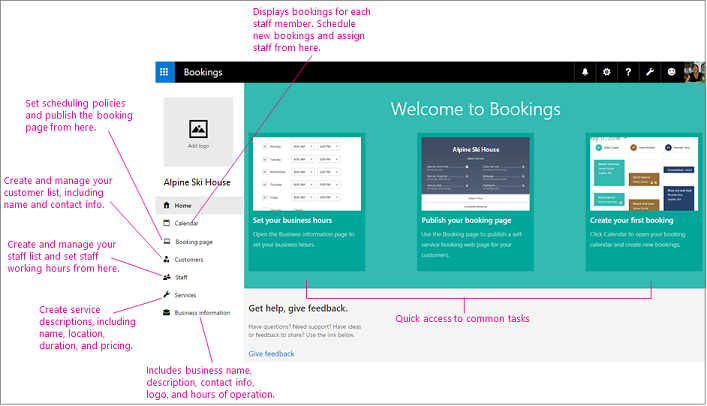

# Overview of Microsoft Bookings

Microsoft Bookings makes scheduling and managing appointments a breeze. Bookings includes a web-based booking calendar and integrates with Outlook to optimize your staff’s calendar and give your customers flexibility to book a time that works best for them. Automated notification emails reduce no-shows and enhance customer satisfaction, and organizations save time with a reduction in repetitive scheduling tasks. With built in flexibility and ability to customize, Bookings can be designed to fit the situation and needs of many different parts of an organization.

> [!NOTE]
> Bookings is on by default for customers who have the Microsoft 365 Business Standard, Microsoft 365 A3, and Microsoft 365 A5 subscriptions. Bookings is also available to customers who have Office 365 Enterprise E3 and Office 365 Enterprise E5, but it is turned off by default. To get started, see [Get access to Microsoft Bookings](get-access.md). To turn Bookings on or off, see [Turn Bookings on or off for your organization](turn-bookings-on-or-off.md).

Bookings has three primary components:

- A booking page where your customers and clients can schedule appointments with the staff member who should provide the service or run the appointment. This web-based scheduling page can be shared via a direct link, your Facebook page, and even through link embedding within your website.

- A web app that contains a set of web-based, business-facing pages where Bookings calendar owners and administrators within an organization can define appointment types and details, manage staff schedules and availability, set business hours, and customize how appointments are scheduled. These pages allow for versatility and the ability to customize a Bookings calendar to fit the diverse needs of the person or organization.

- A business-facing mobile app where Bookings calendar owners and administrators can see all of their appointments, access customer lists and contact information, and make manual bookings on the go.

## How Microsoft Bookings works

As with all of the Microsoft 365 apps, Bookings is a tile in the app launcher. Click the tile to launch the app or select the app launcher, and then select **Bookings**.

The first time you open the app, you'll see the home page, which includes tabs on the left to navigate between pages and several prominent tiles that guide you through setup and introduce new features.

Ready to get started?

Watch this video or follow the steps below to set up Bookings.

> [!VIDEO https://www.microsoft.com/videoplayer/embed/RE26B1q]

1. [Get access to Microsoft Bookings](get-access.md)

2. [Enter your business information](enter-business-information.md)

3. [Add staff to Bookings](add-staff.md)

4. [Define your service offerings](define-service-offerings.md)

5. [Set your scheduling policies](set-scheduling-policies.md)

6. [Set employee working hours](employee-hours.md)

7. [Schedule business closures, time off, and vacation time](schedule-closures-time-off-vacation.md)

8. [Publish or unpublish your booking page](publish-booking-page.md)

9. [Create a manual booking](create-a-manual-booking.md)

10. [Connect to Facebook](connect-to-facebook.md)
