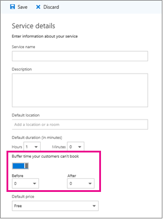

# Configure service availability in Microsoft Bookings

In Microsoft Bookings, managing service availability is essential for efficient appointment scheduling. Microsoft Bookings makes it easy and convenient for you to manage your service availability and match it with your staff availability. By configuring your service availability, you can ensure that your customers can book your services when you want them to, and that your staff can deliver them efficiently and effectively.

## Service availability categories

There are three categories of service availability.

1. **Bookable when staff are free:** This means that your service will only be available when your staff members who offer this service are also available. This option helps you avoid double-booking or conflicts in your staff's schedule.
2. **Not bookable:** This means that your service cannot be booked by your customers at all. You can use this option if you want to temporarily suspend a service or make it unavailable for online booking. You can still manually book this service from your calendar if you need to.
3. **Custom hours:** This means that you can set a specific weekly schedule for your service availability. This option gives you more flexibility and control over your service schedule.

These options apply to the general availability of your service. If you want to set different availability for a specific date range, you can select "Add a different date range" and enter the start and end dates for that period. Then choose one of the three options for that date range. You can add multiple date ranges with different availability settings, which will override the general availability of your service. This way, you can customize your service availability for holidays, special events, or any other occasions.

## Block availability during certain dates

There may be times when you don't want to accept bookings, such as holidays, vacations, or personal days.

To configure your services as "Not bookable" for the specified dates, follow these steps:

1. Open service settings of the service you want to change your availability for.
2. Select Availability Options.
3. Select **Set availability for a different date range**.
4. Enter the period for which you will not accept any bookings for this service.
5. Select **Not Bookable**.

:::image type="content" source="media/bookable-staff-free.png" alt-text="Screenshot showing the availability of a staff member for a service in Bookings." lightbox="media/bookable-staff-free.png":::

Configuring service availability in Microsoft Bookings offers a tailored approach to appointment scheduling, aligning staff availability with customer bookings seamlessly. Whether it's recurring sessions or custom date ranges, Bookings empowers businesses to optimize their resources and enhance customer experience.

## Set buffer time in Microsoft Bookings

Some of your appointments might require time before or after you meet with your customer to set up, clean up, or reset your room and equipment. Or if you’re on the road between customer appointments, you may need time to ensure you and your team can travel between appointments without making the customer wait.

You can set buffer time before appointments start, after appointments end, or both to give staff the extra time they need to prepare for their next appointment.

### Set buffer time defaults

Buffer time defaults are set on the **Service details** page in Bookings. Like all service defaults set on this page, these defaults can be edited by you for a specific booking to meet specific customer needs.

The buffer time setting can be found on the **Service details** page. Before it can be set for a given service, you must enable the buffer time setting by selecting the buffer time toggle. This causes the **Before** and **After** drop-downs to appear, which are used to pick the default amount of time to hold before and after each booking, as shown here:

   

### Buffer time and availability

Your customers don’t directly see and cannot change the buffer times you set. However, because buffer time is used to calculate overall service duration, customers will see you and your relevant staff as booked during both buffer and regular appointment times. Customers also only see availability for you and your staff if there is enough time for both the appointment and its buffer time.

As an example, a one-hour appointment with a 15-minute pre-appointment buffer time requires an available time block of at least 1 hour and 15 minutes. An appointment for this service would therefore fill a 75-minute block of time on your calendar and needs 75 minutes of availability to book without conflict.
