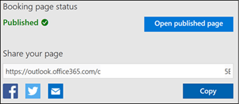
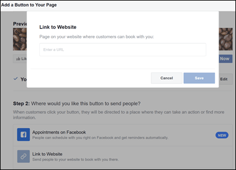

# Connect Microsoft Bookings to your Facebook page

Microsoft Bookings integrates with Facebook to make it easy for your customers to schedule appointments with you from your Facebook business page. This article explains how you can direct customers to your Microsoft Bookings page by adding a Book Now button to your Facebook business page.

> [!NOTE]
> Bookings is turned on by default for customers who have the Microsoft 365 Business Standard, Microsoft 365 A3, and Microsoft 365 A5 subscriptions. Bookings is also available to customers who have Office 365 Enterprise E3 and Office 365 Enterprise E5, but it is turned off by default. To turn it on, see [Get Access to Microsoft Bookings](get-access.md).

## Setup steps

Before you start, complete the following tasks:

- Set up your Facebook business page

- [Set up Microsoft Bookings](set-up.md)

- [Publish your booking Page](publish-booking-page.md)

Watch this video or follow the steps below to add the Book now button to your Facebook page.

**-**
**Remove XML below and insert video link**
**-**
<mediaLink>
	<image xlink:href="4873755a-8b1e-497e-bc54-101d1e75d3e7" />
	<video videoid="RWusUj" channel="ALTENUS_MS_OFFICE" videotype="single" player="ocvideo" />
</mediaLink>

1. From your booking page, copy the URL under **Share your page**.

   

1. On your Facebook business page, choose **Add a Button**.

1. Choose **Book Now** and select **Next**.

1. Choose **Link to Website** and paste in your booking page URL.

   

1. Select **Finish**. Now you’re all set to receive Bookings through your Facebook page!
