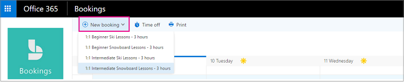
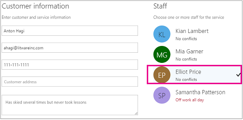

# Create a manual booking

Bookings can be scheduled and staffed in two different ways. The first way is by the customer using a standalone booking page or an embedded booking page that you add to your website. The other way is for you or one of your employees to enter the bookings manually, such as when a customer calls for an appointment. This article covers the manual scenario.

## Watch: Create a manual booking

> [!VIDEO https://www.microsoft.com/videoplayer/embed/RE4Zd77]

## Steps

1. In Microsoft 365, select the App launcher, and then select **Bookings**.

1. In the navigation pane, select **Calendar** \> **New booking**.

   

1. Select the service to be provided. See [Define your service offerings in Microsoft Bookings](define-service-offerings.md) for service setup instructions.

1. Enter the customer information, including name, email address, phone number, and other relevant details.

1. Select the staff member to provide the service. The list of staff members shown is based on what you set up on the services page.

   

1. Enter the service details, including date, time, location, and other relevant information. Once you enter a valid email address for the customer, you'll see a note telling you that a confirmation will be sent to the customer. The customer confirmation includes an attachment for them to add to their calendar. Selected staff members will also receive meeting invitations with the appointment information so they can add it to their personal calendars.

1. Select **Add an email reminder**.

1. Specify when the reminder should be sent, where it should be sent (**Customer**, **Staff**, **All attendees**), and what the reminder message should be.

1. Select **Create booking**.

   Here's an example email of the reminder your customer will receive:

   :::image type="content" source="media/bookings-remind-confirm-2.png" alt-text="Screenshot: Example confirmation email from a manual booking":::
