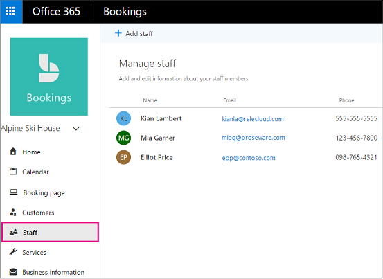
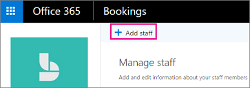
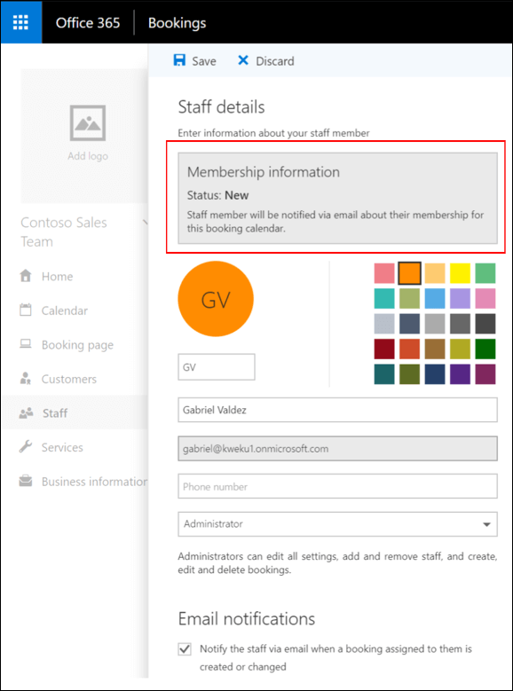

# Create your staff list

The Staff page in Bookings is where you create your staffing list and manage staff member details such as name, phone number, and email address. You can also set working hours for each staff member from here.

> [!NOTE]
> Bookings is turned on by default for customers who have the Microsoft 365 Business Standard, Microsoft 365 A3, or Microsoft 365 A5 subscriptions. Bookings is also available to customers who have Office 365 Enterprise E3 and Office 365 Enterprise E5, but it is turned off by default. To get started, see [Get access to Microsoft Bookings](get-access.md). To turn Bookings on or off, see [Turn Bookings on or off for your organization](turn-bookings-on-or-off.md).

## Add staff

Although Bookings is a feature of Microsoft 365, not all of your staff members are required to have a Microsoft 365 account. All staff members must have a valid email address so they can receive bookings and schedule changes.

Watch this video or follow the steps below to add your staff.

> [!VIDEO https://www.microsoft.com/videoplayer/embed/RWuVka]

1. In Microsoft 365, select the App launcher, and then select **Bookings**.

   

1. In the navigation pane, select **Staff**.

   

1. Select **Add staff**.

   

1. Select a color for the staff member, then provide their initials, name, email address, and phone number.

1. Set the access level for this employee:

| Role | Permissions in Bookings|
| --- | --- |
| Administrator (must have a Microsoft 365 account) | - Edit all settings - Add and remove staff - Create, edit, and delete bookings |
| Viewer (must have a Microsoft 365 account) | - See your own bookings on your personal calendar - Receive a meeting invitation when assigned to a booking so you can add it to your personal calendar (valid email address required) - Receive email reminders of upcoming bookings - Receive notifications of cancellations and changes |
| Guest (does not have a Microsoft 365 account) | - Can sign up to deliver booked services, but cannot access Bookings - Receive a meeting invitation when assigned to a booking and add it to personal calendar (valid email address required) - Receive email reminders of upcoming bookings - Receive notifications of cancellations and changes |

1. Select **Save**.

1. Repeat steps 1 through 6 for each staff member.

> [!NOTE]
> When you add an employee in your organization as a staff member (as a guest, admin, or viewer), your employee will get an email letting them know that their availability may be shared, and that they could be booked through a booking page.

   
