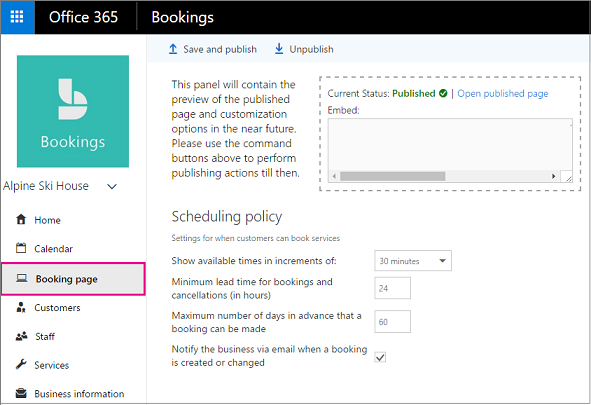

# Customize and publish your Booking Page

The booking page is your customer-facing, web-based appointment calendar. Your customers will use it to book appointments with you. It's an extension of your business' image and brand.

> [!NOTE]
> Bookings is turned on by default for customers who have the Microsoft 365 Business Standard, Microsoft 365 A3, or Microsoft 365 A5 subscriptions. Bookings is also available to customers who have Office 365 Enterprise E3 and Office 365 Enterprise E5, but it is turned off by default. To get started, see [Get access to Microsoft Bookings](get-access.md). To turn Bookings on or off, see [Turn Bookings on or off for your organization](turn-bookings-on-or-off.md).

To customize your booking page, sign in to [Office.com](https://office.com), and then go to **Bookings** \> **Booking page**. You can customize the booking page with the following options. Once you've setup up your Booking Page, you can publish it so customers can start booking appointments with you.

1. In Microsoft 365, select the app launcher, and then select **Bookings**.

   

1. In the navigation pane, select **Booking page**.

   

The section below gives you information about setting up your bookings page and how to publish your page.

|||
|---|---|
| **Scheduling policy** | - Time increments: You can set up the increments for appointment times in increments of 15 minutes to 4 hours.  - Minimum lead time: This is how many hours you want in advance to prepare for an appointment. The minimum lead time prevents customers from making an appointment outside of the lead time window. For example, are you able to respond to same day appointments? If not, you should give at least a 24-hour minimum lead time.  - Maximum lead time: How far in advance of the appointment day will you let customers make appointments? The default is 365 days.   See [Set your scheduling policies](set-scheduling-policies.md) for more information. |
| **Email notifications** | Notify the business via email when a booking is created or changed. When this setting is ticked, the staff member for the appointment and the Bookings calendar owner will receive an email letting them know about the appointment. |
| **Staff** | Allow customers to choose a specific person for the booking. This will let customers see your staff members and lets them select which staff member they'd like to have the appointment with. |
| **Customize your page** | Set your color theme and logo. |
| **Color theme** | Select the color combination that most closely matches your brand. If none of these options match your brand, we suggest using the neutral blues and grays or keep the default, which is a neutral blue/gray combination. |
| **Logo** | You can choose to display your business logo on your booking page. This is the logo that you've uploaded and is displayed above the menu on the left. |
| **Booking page access control** | Select whether users will need to authenticate with their Microsoft 365 work or school account before they are able to access and use a booking page. This is useful for intra-organization only bookings scenarios.  This setting also lets you control whether your booking page can be indexed by search engines. By default, your booking page will be indexed.  **Note:** Even with this setting enabled, your booking page might still be indexed in some situations, such as when other web pages provide links to your booking pages. |
| **Customer data usage consent** | Select whether users see a message and choose whether their data is collected. |

## Other ways to customize

You can also add questions to ask your customers at booking time. For more information, see [Add custom and required questions to the booking page](add-questions.md).

## Publish the booking page

Watch this video or follow the steps below to publish or unpublish your booking page.

> [!VIDEO https://www.microsoft.com/videoplayer/embed/RWuYil]

1. In Microsoft 365, select the app launcher, and then select **Bookings**.

   

1. In the navigation pane, select **Booking page**.

   

1. Verify your scheduling policies are correct. See [Set your scheduling policies](set-scheduling-policies.md) for more information.

1. Select **Save and publish**. You'll see a confirmation message.

1. Select **Open published page** to see your page in a web browser.

## Unpublish the booking page

To unpublish the booking page, go to the booking page and select **Unpublish**.
