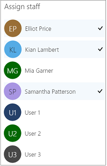
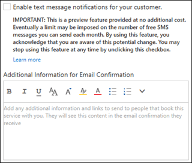

# Define your service offerings in Microsoft Bookings

When you define your service offerings in Microsoft Bookings, you set, among other things, a service name, description, location (choose whether you want to meet in person or have an online meeting), duration, default reminders to customers and staff, internal notes about the service, and pricing. You can also tag the employees who are qualified to provide the service. Then, when customers come to your business web site to book an appointment, they can see exactly what types of appointments are available, choose the person they want to provide the service, and how much their service will cost.

You can now add customized information and URLs to the email confirmation and reminders that you send when someone books a service through your booking page.

> [!NOTE]
> Bookings is turned on by default for customers who have the Microsoft 365 Business Standard, Microsoft 365 A3, or Microsoft 365 A5 subscriptions. Bookings is also available to customers who have Office 365 Enterprise E3 and Office 365 Enterprise E5, but it is turned off by default. To get started, see [Get access to Microsoft Bookings](get-access.md). To turn Bookings on or off, see [Turn Bookings on or off for your organization](turn-bookings-on-or-off.md).

## Create the service details

Watch this video or follow the steps below to define your service offerings.

**Insert video link here**

1. In Microsoft 365, select the App launcher, and then select **Bookings**.

   

1. In the navigation pane, select **Services** \> **Add a service**.

1. Enter the service details including name, description, and location. When you start typing an address in the **Default location** field, Bing will suggest locations for you.

1. Enter the duration required for the service. You can enter how long you want the duration to last in days, hours, and minutes, and you can set a buffer time when customers can't book.

1. Select the price model. For **Fixed price**, **Starting at**, and **Hourly**, you'll be asked to specify a price.

1. Under **Price and payments**, set the default price for the service.

1. Enter additional notes and reminder information.

1. Select **Save**.

## Assign a staff member to the service

When assigning staff, think about whether the service requires advanced training or special certifications. If so, only assign the staff members who hold those credentials. If the staff member you want to assign isn't in the list, you'll have to go to the Staff page to add them. See [Create your staff list](create-staff-list.md) for more information. If you want your staff to have online meetings using Microsoft Teams or Skype for Business, make sure you assign them a Teams or Skype for Business license in the admin center. See [Add users individually or in bulk](../admin/add-users/add-users.md) for more information.

1. On the Services page, select those employees who are qualified to provide this service. You can select one or more. Selected employees have a check mark next to their names.

   

1. Select Save.

## Set publishing and scheduling policy options

By default, your service details and staff assignments will be posted to the booking page on your web site as soon as you select **Save**. Also, the scheduling policies you set will be applied by default to the service you created. If you don't want to accept these defaults, follow these steps.

1. On the Services page, under Publishing options, clear any checkboxes you wish next to **Show this service on the booking page** and **Use the default scheduling policy**.

1. Set the scheduling policies for this service. For more information about scheduling policies, see [Set your scheduling policies](set-scheduling-policies.md).

1. Select **Save**.

## Add online meeting option to bookings

You can set up your services with an online meeting option. When you or a customer creates a new booking, or updates an existing booking, you have the option to make it an online appointment, using Microsoft Teams or Skype for Business.

1. On the Services page, select the toggle to turn on online meetings.

1. Select **Save**.

Once you select **Add online meeting**, all your staff members who have a Teams license or Skype for Business license will be enabled for this service. If your staff don't have a Teams license or Skype for Business license, they can't be assigned to this service when a customer tries to book. If you want your staff enabled for online meetings using Microsoft Teams or Skype for Business, assign them a Teams or Skype for Business license in the admin center. See [Add users individually or in bulk](../admin/add-users/add-users.md).

> [!IMPORTANT]
> Your customer doesn't need a Teams license or Skype for Business license. They also don't need to have Teams or Skype for Business installed. When they click on the link to join the online meeting, they'll be able to use Teams and Skype for Business through their browser.

## Group bookings

The Group bookings feature lets you to set up service appointments where multiple people can join a session with a single staff member. You can use group bookings to schedule conferences, lectures or training sessions with several people at the same time.

1. On the Services page, under **Maximum number of attendees**, enter the number of people who can attend this event. Once you set the maximum number, the attendee list can't exceed the number you set. By default, this field is blank.

1. Select **Save**.

Once you've set up the appointment on your calendar, you can add users to the service and send them an email invite.

## Text message notifications

This feature is only available in North America in preview. For more information, see [When do I get the newest features for Microsoft 365?](https://support.microsoft.com/office/when-do-i-get-the-newest-features-for-microsoft-365-da36192c-58b9-4bc9-8d51-bb6eed468516).

You can now set up your services with text notifications. When your customer creates a new booking or updates an existing booking on such service, they will have the option to receive reminder text messages.

Your customer will have to agree to getting text messages on the self service page before they can receive them.

   

1. On the Services page, under **Reminders and Confirmations**, select **Enable text message notifications for your customers**.

1. Select Save.
