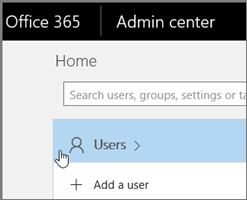

# Delete a Shared Booking page

This article explains how you can delete an unwanted shared booking page. You can delete the shared booking page in the Microsoft 365 admin center or you can use PowerShell. The shared booking page is a mailbox in Exchange Online so you delete the corresponding user account to delete the shared booking page.

> [!IMPORTANT]
> All shared booking pages that you created in 2017 or before must be deleted using the PowerShell instructions on this topic. All shared booking pages created in 2018 or after can be deleted in the Microsoft 365 admin center.

> [!IMPORTANT]
> Only Microsoft 365 Admins can delete shared booking pages created by end users. We do not support the capability of deleting shared booking pages at a user level. If a user wishes to do so, the request will have to be routed to the respective Microsoft 365 admin.

The shared booking page is where all relevant information is stored, including:

- Business information, logo, and working hours added when the shared booking page was created
- Relevant staff and services added when the shared booking page was created
- All bookings and time off appointments added to the shared booking page once it was created.

> [!WARNING]
> Once a shared booking page is deleted, this additional information is also permanently deleted and can't be recovered.

## Delete a shared booking page in the Microsoft 365 admin center

1. Go to the Microsoft 365 admin center.

1. In the Admin center, select **Users**.

   

1. On the **Active Users** page, choose the name of the shared booking page that you want to delete and then select **Delete user**.

   

## Delete a shared booking page using Exchange Online PowerShell

1. [Connect to Exchange Online PowerShell](/powershell/exchange/connect-to-exchange-online-powershell).

2. Run the following command to get a list of the booking mailboxes in your tenant:

   ```powershell
   Get-EXOMailbox -RecipientTypeDetails SchedulingMailbox
   ```

3. Replace \<BookingCalendarToDelete\> with the exact name of the booking mailbox alias that you want to permanently delete, and then run the following command:

   ```powershell
   Remove-Mailbox -Identity <BookingCalendarToDelete>
   ```

   > [!IMPORTANT]
   > Be careful to type the exact name of the booking mailbox alias that you want to permanently delete.

4. To verify that the shared booking page has been deleted, run the following command:

   ```powershell
    Get-EXOMailbox -RecipientTypeDetails SchedulingMailbox
   ```

   The deleted shared booking page will not appear in the output.
